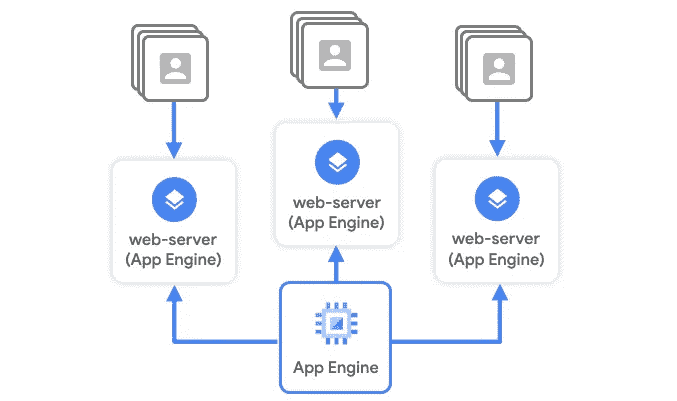
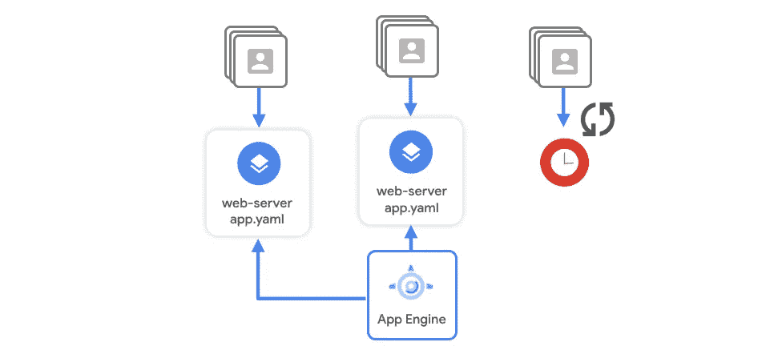
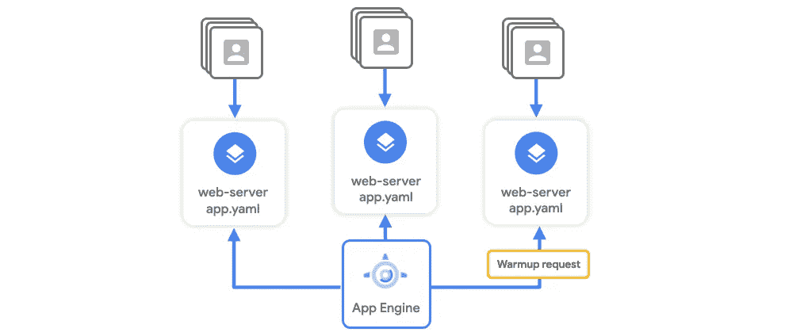

# 通过预热请求缩短应用引擎启动时间

> 原文：<https://medium.com/google-cloud/improve-app-engine-startup-times-through-warmup-requests-b424504bde14?source=collection_archive---------0----------------------->

## 规模季节


# 规模季节

“规模季节”是一个博客和视频系列，旨在帮助企业和开发人员在设计模式中构建规模和弹性。在这一系列文章中，我们计划向您介绍一些创建具有弹性和可伸缩性的应用程序的模式和实践，这是许多现代架构实践的两个基本目标。

在第二季中，我们将介绍如何优化您的应用程序以缩短实例启动时间！如果你还没看过第一季，在这里看看吧[。](/google-cloud/scale-and-resilience-arent-just-buzzwords-ce748360e80)

1.  [如何改善计算引擎启动时间](/google-cloud/investigate-and-solve-compute-engine-cold-starts-like-a-detective-️-66a03736cb03)
2.  如何缩短应用引擎启动时间(本文)
3.  如何缩短云运行启动时间

说到游戏，无论是动作游戏、角色扮演游戏还是模拟游戏，置身其中就意味着在线。但在现实世界中，你是 merch 的粉丝。Critter Junction 托管在 App Engine 上的电商店铺是否能够应付他们的炒作？请继续阅读。

# 看看这个视频

# 回顾

在[的上一篇文章](/google-cloud/investigate-and-solve-compute-engine-cold-starts-like-a-detective-️-66a03736cb03)中，我们帮助 Critter Junction 调查了他们的计算引擎实例，以确定延迟是否与请求、供应或引导时间有关。我们还帮助他们利用自定义映像来减少启动时间。现在他们的目光投向了他们的应用引擎实例。今年没有任何面对面的会议，来自世界各地的 Critter Junction 玩家已经开始涌入他们的网站，购买角色卡、服装和其他物品。



Critter Junction 一直在测试 App Engine Standard 来运行他们的新商品商店，因为 App Engine 会跨多个实例自动缩放他们的应用程序，以满足额外流量的需求。

# 待定等待时间

在负载测试期间，他们使用[云跟踪](https://cloud.google.com/trace)来测量响应延迟，并注意到当他们对其服务的 HTTP 端点使用较重的并发请求时，延迟比通常的要高。

[等待延迟](https://cloud.google.com/appengine/docs/standard/go/how-instances-are-managed#loading_requests)是指在 App Engine 决定启动另一个实例之前，请求可以在队列中等待多长时间。如果当请求到达时，您的所有应用程序实例都很忙，那么该请求将在队列中等待，由下一个可用的实例来处理。随着负载的增加，这意味着处理请求的速度会变慢。



待定等待时间

然后，App Engine 将启动一个新实例，根据您设置的限制(如 CPU 利用率、吞吐量和当前运行实例的最大并发请求数)提供帮助。

但他们不知道的是，在以下情况下，App Engine 还需要将他们的应用代码加载到一个新实例中:

*   他们重新部署了新版本的应用程序
*   以及底层基础设施或物理硬件的维护和修理。

虽然 App Engine 上的冷启动很少，但发送到*新*实例的第一个请求或[加载请求](https://cloud.google.com/appengine/docs/standard/go/how-instances-are-managed#loading_requests)可能需要更长的处理时间，因为该实例首先必须加载应用程序的代码，包括处理请求所需的任何库和资源。这意味着处理新流量的响应时间会逐渐增加。

# 预热请求

> 相反，您想要的是在新实例服务于实时流量之前更快地进行初始化。

您可以通过发出一个[预热请求](https://cloud.google.com/appengine/docs/standard/go/configuring-warmup-requests)来实现这一点，在任何活动请求到达实例之前，提前将应用程序代码加载到实例中。



预热请求

App Engine 会尝试检测您的应用程序何时需要新实例，并启动预热请求来初始化它。任何新实例在加载完应用程序代码后都会接受请求。新的请求可以得到更快的处理。

## 它是如何工作的

App Engine 调度程序使用预热请求，它根据您的配置控制实例的自动缩放。

应用引擎问题获取请求至:

```
/_ah/warmup
```

您可以在代码中实现此请求的处理程序，以执行特定于应用程序的任务，如预缓存应用程序数据。

1.  对于大多数支持的语言，只需在 app.yaml 文件的 inbound_services 指令下添加 warmup 元素。
2.  然后创建一个处理程序来处理发送到/_ah/warmup 的请求。您的处理程序应该执行您的应用程序所需的任何预热逻辑。

## 游戏攻略

让我们看一个围棋例子。

1.  我们的函数执行应用程序运行所需的设置步骤。
2.  它记录应用程序引擎预热请求用于创建新实例的时间。这些预热步骤发生在设置中，以便与冷启动实例保持一致。
3.  其他一切都保持不变。这个 setup 函数执行每个实例的一次性预热和初始化操作。
4.  最后，indexHandler 用我们的问候来响应请求。

```
// Sample warmup demonstrates usage of the /_ah/warmup handler.
package main

import (
        "context"
        "fmt"
        "log"
        "net/http"
        "os"
        "time"

        "cloud.google.com/go/storage"
)

var startupTime time.Time
var client *storage.Client

func main() {
        // Perform required setup steps for the application to function.
        // This assumes any returned error requires a new instance to be created.
        if err := setup(context.Background()); err != nil {
                log.Fatalf("setup: %v", err)
        }

        // Log when an appengine warmup request is used to create the new instance.
        // Warmup steps are taken in setup for consistency with "cold start" instances.
        http.HandleFunc("/_ah/warmup", func(w http.ResponseWriter, r *http.Request) {
                log.Println("warmup done")
        })
        http.HandleFunc("/", indexHandler)

        port := os.Getenv("PORT")
        if port == "" {
                port = "8080"
                log.Printf("Defaulting to port %s", port)
        }

        log.Printf("Listening on port %s", port)
        if err := http.ListenAndServe(":"+port, nil); err != nil {
                log.Fatal(err)
        }
}

// setup executes per-instance one-time warmup and initialization actions.
func setup(ctx context.Context) error {
        // Store the startup time of the server.
        startupTime = time.Now()

        // Initialize a Google Cloud Storage client.
        var err error
        if client, err = storage.NewClient(ctx); err != nil {
                return err
        }

        return nil
}

// indexHandler responds to requests with our greeting.
func indexHandler(w http.ResponseWriter, r *http.Request) {
        if r.URL.Path != "/" {
                http.NotFound(w, r)
                return
        }
        uptime := time.Since(startupTime).Seconds()
        fmt.Fprintf(w, "Hello, World! Uptime: %.2fs\n", uptime)
}
```

> 需要注意的一点是，预热请求并非在所有情况下都有效，尽管在启用时会尽最大努力将请求发送到已经预热的实例。因此，您可能仍然会面临加载请求，比如该实例是否是第一个启动的实例，或者流量是否急剧增加。在这些情况下，您应该使用常驻实例，您可以在下面了解这些实例。

# 贴给大家！

一旦实施了预热请求，Critter Junction 就能够在会议季节开始时，减少其在线商店流量增加期间的冷启动情况。

查看[文档](https://cloud.google.com/appengine/docs/standard/go/configuring-warmup-requests)了解预热请求的特定语言步骤。请继续关注《生物交汇处》的下一部。

记住，永远要做架构设计。

# 后续步骤和参考:

*   在[谷歌云平台媒体](https://medium.com/google-cloud)上关注这个博客系列。
*   参考:[配置预热请求以提高性能](https://cloud.google.com/appengine/docs/standard/go/configuring-warmup-requests)。
*   关注[季 Scale 视频系列](http://bit.ly/seasonofscale)，订阅谷歌云平台 YouTube 频道。
*   想要更多的故事？在[媒体](/@swongful)和[推特](http://twitter.com/swongful)上给我喊话。
*   与我们一起享受这个迷你系列的旅程，并了解更多关于谷歌云解决方案的信息。