# 使用云数据准备提高机器学习和分析的数据质量

> 原文：<https://medium.com/google-cloud/improving-data-quality-for-machine-learning-and-analytics-with-cloud-dataprep-c55a47580fd8?source=collection_archive---------1----------------------->

数据质量是任何分析和机器学习计划的关键组成部分，除非您使用原始的、高度控制的数据，否则您可能会面临数据质量问题。为了说明将未知的、不一致的数据转化为值得信赖的资产的过程，我们将利用零售(包装消费品)行业中预测分析师的例子。预测分析师必须非常准确地计划正确的订购数量。供应过多的产品会导致资源浪费，而供应过少则意味着他们有损失利润的风险。除此之外，空货架还会让消费者有选择竞争对手产品的风险，这可能会对品牌产生有害的长期影响。

为了在适当的产品库存水平和极薄的利润之间取得适当的平衡，预测分析师必须不断完善他们的分析和预测，利用他们自己的内部数据和他们无法控制的第三方数据。

每个业务伙伴，包括供应商、分销商、仓库和其他零售商店，都可能以各种形式和质量水平提供数据(例如库存、预测、促销或过去的交易)。一家公司可能使用调色板而不是盒子作为存储单位，磅与千克，可能有不同的类别命名和命名，可能使用不同的日期格式，或者很可能有内部和其他供应商 id 组合的产品 SKU。此外，一些数据可能丢失或输入不正确。

这些数据问题中的每一个都代表着对可靠预测的重大风险。预测分析师必须对数据进行彻底的清理、标准化，并获得信任，然后才能准确地对其进行报告和建模。这篇文章回顾了使用 [Cloud Dataprep](https://cloud.google.com/dataprep/) 清理数据的关键技术，并涵盖了可能有助于以最小的努力提高数据质量的新功能。

**基本概念**

使用云数据准备清理数据对应于三步迭代过程:

1.  评估您的数据质量
2.  解决或补救任何发现的问题
3.  大规模验证清理的数据

从您打开网格接口并开始准备数据的那一刻起，Cloud Dataprep 就不断地分析您正在处理的数据。通过 Dataprep 的实时活动分析，您可以看到每个数据清理步骤对您的数据的影响。

概要分析结果在列标题中以交互式可视化概要分析的形式进行总结，其中包含基本数据点，以指出数据中的关键特征。通过单击其中一个概要文件列标题栏，Cloud Dataprep 会建议一些转换来修复不匹配或缺失的值。您可以随时尝试变换，预览其影响，选择或调整它。在任何时候，如果您不喜欢结果，您都可以恢复到特定的上一步。

记住这些基本概念后，让我们来看看 Cloud Dataprep 数据质量功能。

# **1。评估您的数据质量**

一旦在网格界面中打开数据集，您就可以访问数据质量信号，这些信号有助于您评估数据问题并指导您清理数据。

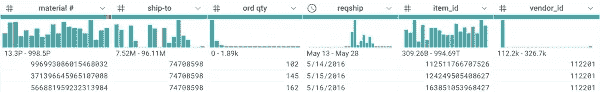

数据质量标题

**快速剖析**

您可能会浏览您的列标题，找出潜在的质量问题，以了解哪些列可能需要您的关注。基于推断的数据类型的不匹配值(红色条)、缺失值(黑色)和不均匀值分布(条)可以帮助您快速确定哪些列需要注意。

在这种特殊情况下，我们的预测分析师知道她必须深入到“材料”字段，其中包括一些不匹配和缺失的值。这些数据默认值会如何影响她的预测和补货模型？

**中介数据剖析**

如果您单击一个列标题，您将在 Dataprep 的右侧面板中看到一些额外的统计数据。如果您希望某个字段具有特定的格式标准，并希望识别不符合该标准的值，这将非常有用。在下面的例子中，您可以看到 Cloud Dataprep 为`order_date`发现了三种不同的格式模式。您可能会有后续问题:可以在预测中利用空订单日期吗？日期不匹配可以更正吗？如何更正？

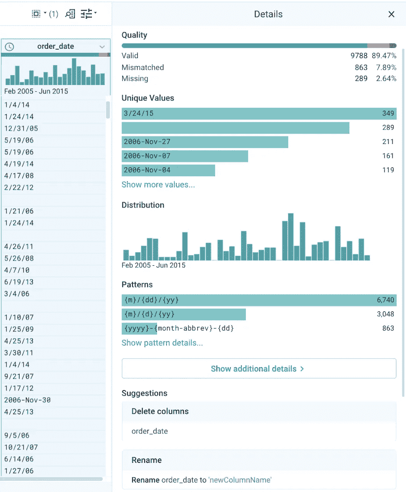

数据分析预览

**高级剖析**

如果您单击“Show more ”,或者单击主网格中的列标题菜单和“column details ”,您将进入一个全面的数据分析页面，其中包含一些关于不匹配值、值分布或异常值的详细信息。您还可以导航到 pattern 选项卡，浏览特定列中的数据结构。

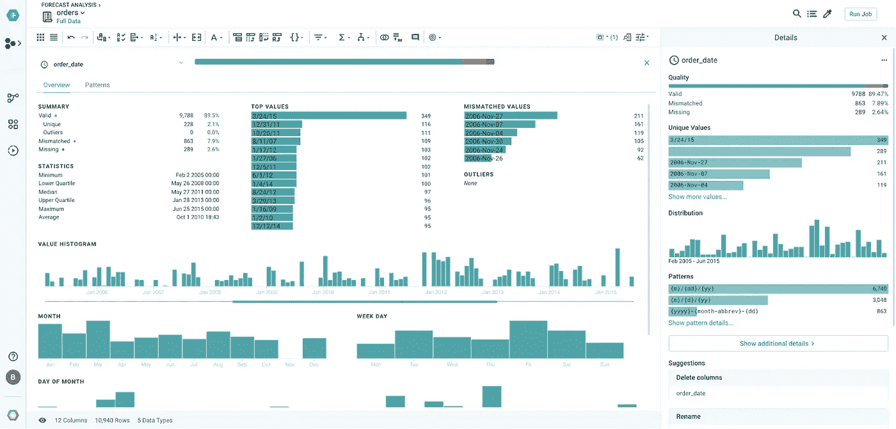

数据分析详细信息

这三个数据概要分析功能本质上是动态的，因为 Cloud Dataprep 在转换的每一步都实时地对数据进行概要分析，从而始终为您提供最新的信息。这有助于您更快、更有效地清理数据。

预测分析师的价值在于，她可以在清理和转换数据的过程中立即进行验证，以便数据符合她对下游建模和报告的预期格式。

# **2。解决数据质量问题**

动态概要分析帮助您评估手头的数据质量，它也是开始清理数据的切入点。图形配置文件是交互式的，当您与它们进行交互时，它会提供转换建议。例如，单击列标题中缺少的值空间会显示转换建议，如删除值或将值设置为默认值。

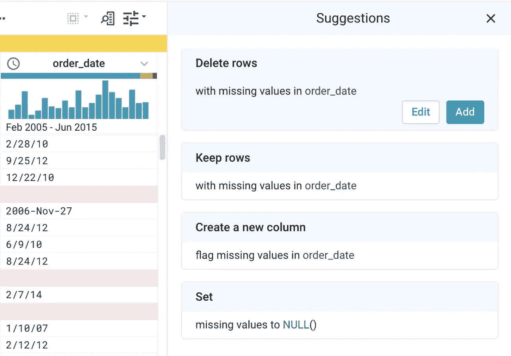

转型建议

**解决不正确的模式**

通过访问列详细信息屏幕中的*模式*选项卡，您可以有效地解决列中的不正确模式(如`order_data`列中重复出现的日期格式问题)。Cloud Dataprep 向您展示最常见的模式。一旦选择了目标转换格式，Cloud Dataprep 就会在右侧面板上显示一些转换建议，以转换所有数据来适应所选的模式。观看下面的动画，亲自尝试一下:

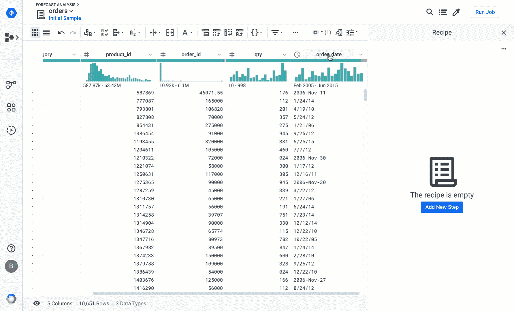

基于模式的转换

**高亮显示数据内容**

另一种清理数据的交互式方法是突出显示单元格中某个值的某个部分。Cloud Dataprep 将根据您的选择建议一组转换，您可以通过突出显示来自另一个单元格的一些附加内容来细化选择。下面是一个从订单日期中提取月份以计算每月销量的示例:

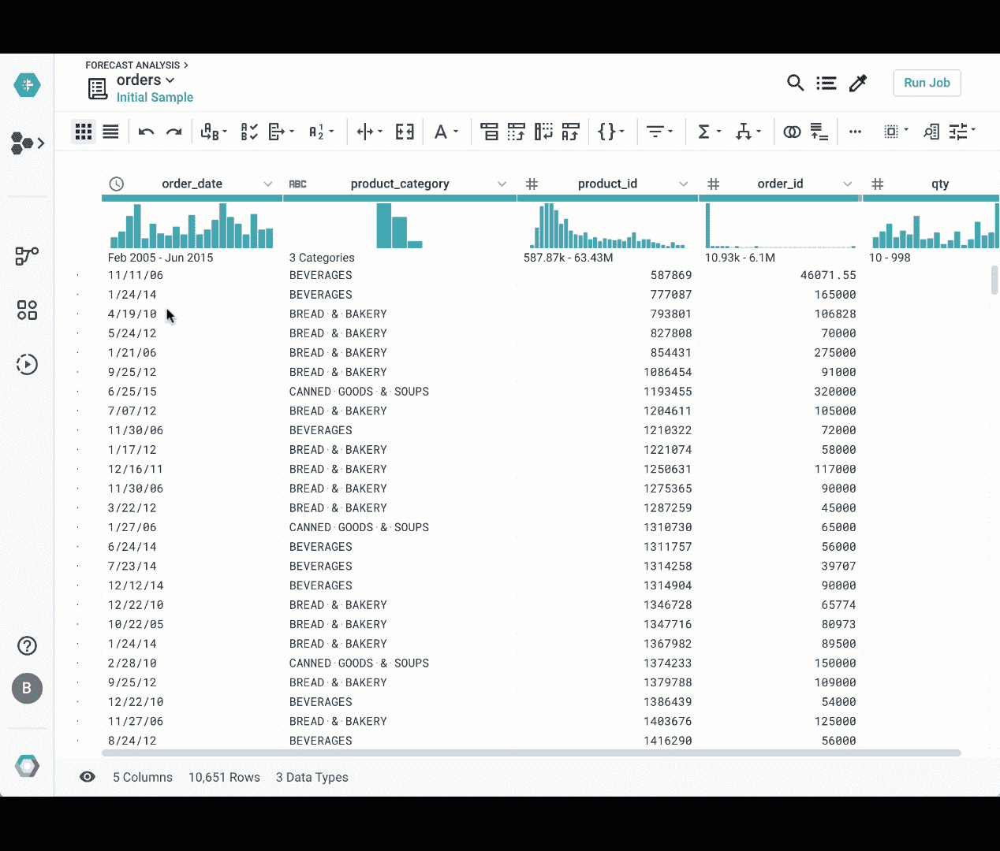

突出显示基于的转换

**格式化、替换、条件函数等**

您可以在*格式*或替换节的列菜单中，或者在如下所示的图标栏中的条件公式中找到您将用来清理数据的大多数函数。这对于将所有产品或类别名称转换为大写或在从 CSV 或 Excel 文件导入后修剪经常有引号的名称非常有用。

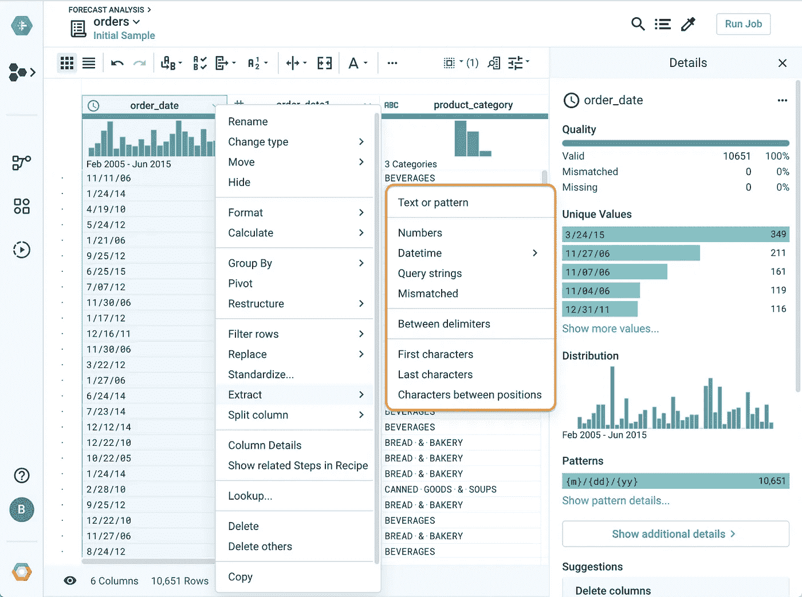

格式函数

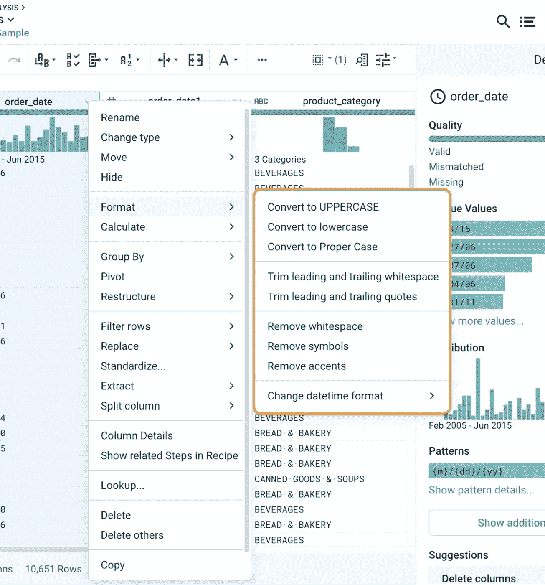

提取函数

提取函数对于提取列中值的子集特别有用。例如，你可能想从`product_id``Item: ACME_66979905111536979300 - PASTA RONI FETTUCINE ALFR`中提取每一个单独的组件，通过在“-”值上拆分它。

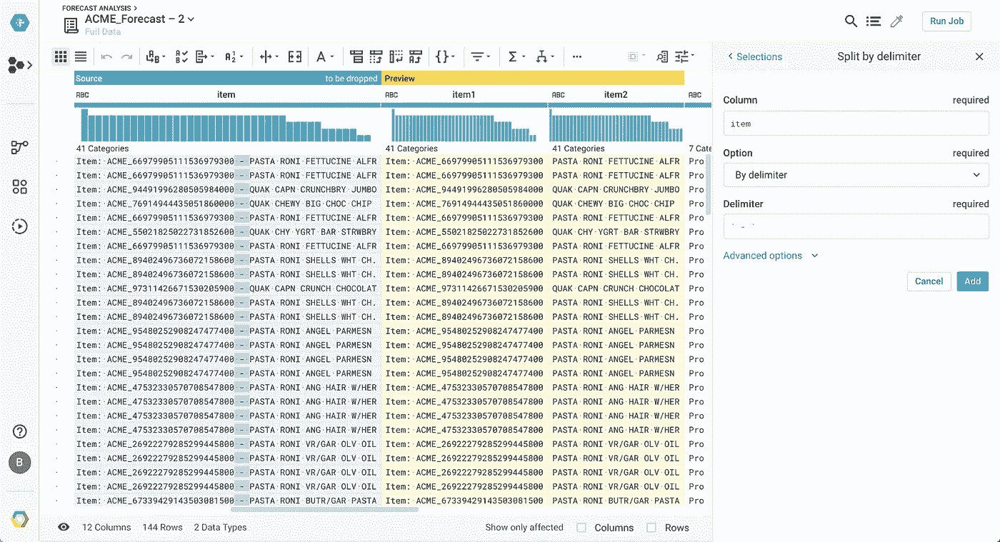

基于分隔符的拆分

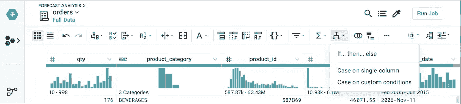

条件函数

条件函数对于标记超出范围的值很有用。例如，您可以编写一个公式，在数量超过 10，000 时标记记录，这对于您通常遇到的订单大小无效。

如果没有一个可视化的建议给你清理数据所需要的东西，你总是可以编辑一个建议或者在 Dataprep 方法中手工添加一个新的步骤。在搜索框中键入您想要做的事情，Cloud Dataprep 会建议一些转换，然后您可以编辑并应用到数据集。

功能搜索

**标准化**

标准化值是一种将相似的值组合成单一、一致的格式的方法。这个问题在自由格式的条目中尤其普遍，比如产品、产品类别、公司名称。您可以从列菜单中访问标准化功能。此外，Cloud Dataprep 可以通过字符串相似性或发音将相似的值分组在一起。

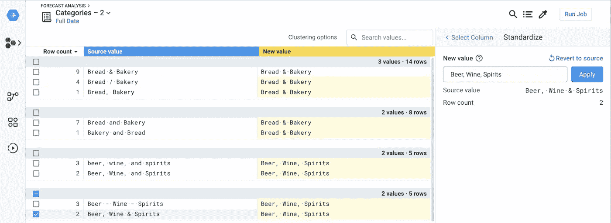

基于集群的标准化

提示:您可以混合使用标准化算法。一些值可以使用拼写进行标准化，而其他值则基于国际发音标准进行更合理的标准化。

# **3。规模验证**

Cloud Dataprep 中典型的数据质量工作流的最后一个关键步骤是验证数据集中没有单个数据质量问题。

**利用采样清理数据**

有时，数据集的全部容量无法通过浏览器选项卡放入 Cloud Dataprep 中(尤其是在利用包含数亿条记录或更多记录的 BigQuery 表时)。在这种情况下，Cloud Dataprep 会自动对 BigQuery 中的数据进行采样，以适应本地计算机的内存。这可能会让您产生疑问:您如何确保您已经标准化了一列中的所有数据(例如，产品名称、类别、地区等。)或者你已经清除了另一个的所有日期格式？

您可以通过单击右上角的采样图标并选择符合您要求的采样技术来调整您的采样设置。

*   选择**基于异常的**以保留多个列之一的所有不匹配或缺失的数据
*   选择**分层**检索特定列的每个不同值(对标准化特别有用)
*   选择**基于过滤器的**来检索基于特定公式的所有数据(即格式不匹配 dd/mm/yyyy)

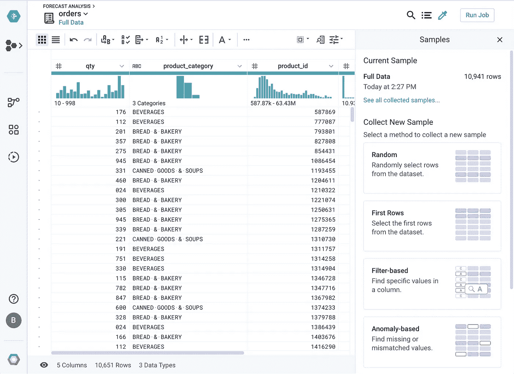

采样选项

**按比例分析数据**

在这一点上，你很高兴也很有信心你的食谱会产生一个干净的数据集，但是直到你在整个数据集上大规模地运行它，你不能确保你所有的数据都是有效的。为此，点击“运行作业”按钮并检查**轮廓结果**是否已启用。

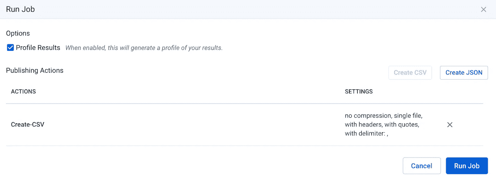

运行作业

如果在作业结果中您仍然看到一些红色，这很可能意味着您需要调整您的数据质量规则并重试。

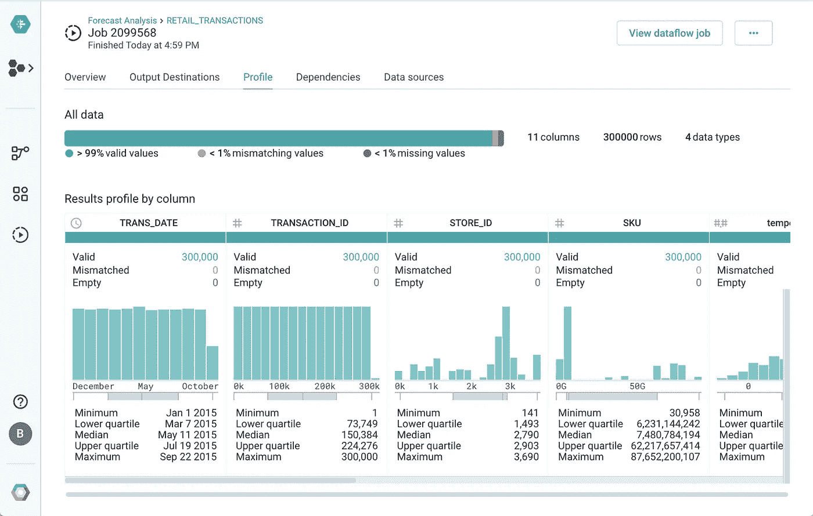

分析结果

**调度**

为了确保重复应用您创建的数据质量规则，请安排您的配方自动运行。在预测的情况下，数据可能会每周发生变化，因此用户必须每周运行该作业，以验证所有的配置文件结果会随着时间的推移而保持绿色。如果没有，您可以简单地重新打开并修改配方，以解决您发现的新的数据不一致。

在流程视图中，选择*计划流程*以定义参数，从而循环运行作业。

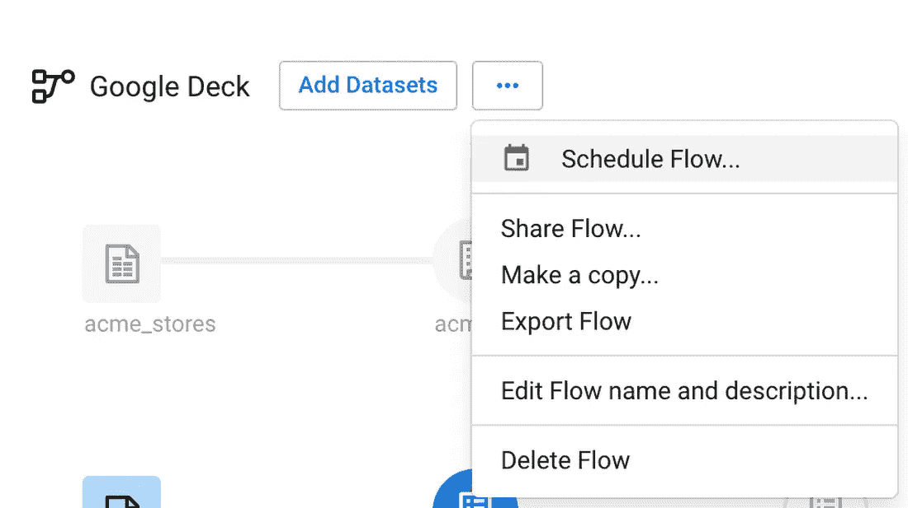

计划流程

# **结论**

我们这里的例子是特定于零售业的，但是无论您的专业领域或行业如何，您都可能会遇到类似的数据问题。遵循这个过程并利用 Cloud Dataprep，您可以更有效、更快速地清理用于分析或特性工程的数据。

我们希望通过使用 Cloud Dataprep，清理数据和提高数据质量的工作不会那么麻烦。如果你准备好开始，通过[谷歌云控制台](https://console.cloud.google.com/dataprep)登录 Dataprep，开始对你的数据使用这个三步数据质量工作流程。

*原载于*[*https://cloud.google.com*](https://cloud.google.com/blog/products/gcp/improving-data-quality-for-machine-learning-and-analytics-with-cloud-dataprep)*。*