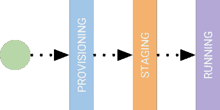
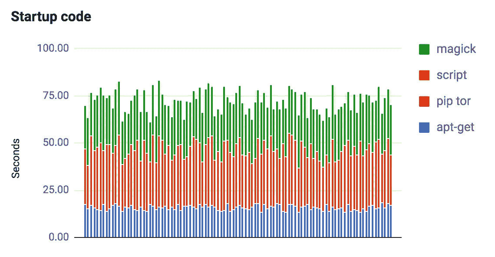
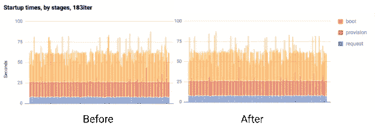
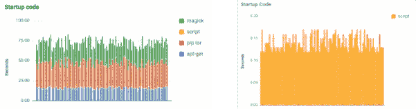

# 使用自定义映像缩短 GCE 启动时间

> 原文：<https://medium.com/google-cloud/improving-gce-boot-times-with-custom-images-f77921a2c115?source=collection_archive---------0----------------------->

使用 [FoodiePics 应用程序](/@duhroach/understanding-and-profiling-gce-cold-boot-time-32c209fe86ab)是一次有趣的经历。他们的应用是一个社交网络，只允许你分享食物的图片。没有文字。没有音频。没有表情符号。只有一张食物的照片，以及拍摄地点的地理位置标签。当我漫步在纽约街头时，它会利用我的地理位置向我展示附近食物的照片。整洁！

为了完成这一切， *FoodiePics* 使用 GCE 后端进行处理和存储。遗憾的是，在突发流量期间，由于负载均衡器会导致大量 GCE 实例加速旋转并自我初始化，因此会有很长的延迟。

在从多个角度描述了 GCE 冷启动时间之后，我们能够开始构建一个关于该过程如何工作的心理模型，看起来有点像这样:

我们已经考虑了请求和配置我的虚拟机所花费的时间(这是很重要的)，并且我们知道我们的映像选择会导致变化；剩下的就是我们为用户代码计时，因为这肯定是个问题。

哪个..就是我们现在要去的地方。

嘿！忙到没时间看书？看 TL；上面的 DR 视频！

# 食物、脚本和启动时间

一旦 *FoodiePics* GCE 实例被创建，他们的第一步就是执行一个安装了各种服务和代码库的启动脚本，这些服务和代码库允许实例运行并可从外部访问。他们的脚本要复杂得多，但通常看起来像这样:

这里没有太多的自定义代码。它主要是在本地下载包和预建脚本，以便运行。

此时，我们已经排除了所有其他性能问题，因此我们的启动时问题一定是由于这些脚本函数之一占用了大量时间。但是到底是哪一个呢？

# 如何分析 GCE 启动脚本

为了描述每个阶段，我需要两样东西:

1.  一种在启动脚本中为每个子部分执行计时的方法
2.  一种向外部系统报告这些阶段的方法，这样我就可以将它可视化。

对于第一个问题，我在 Linux 中工作，处理 bash 脚本，所以 [SECONDS 命令](http://stackoverflow.com/questions/8903239/how-to-calculate-time-difference-in-bash-script)应该可以正常工作；把它包裹在我剧本的每一部分。

对于第二个问题，有很多选择。很有可能你的代码已经使用了强大的工具系统，比如 [statsd](https://github.com/etsy/statsd) 或者 [brubeck](https://github.com/github/brubeck) 。但对我来说，这需要拆掉*另一个包*，更不用说在我使用这些服务之前启动它们所需的时间了..我现在就跳过。

另一方面， [Stackdriver 自定义指标 API](https://cloud.google.com/monitoring/custom-metrics/) 可能会起作用。所有 GCE 实例都预装了对该 API 的写入权限，这样就不再需要下载新的包或托管复杂的后端。遗憾的是，编写 API 需要一些复杂性；(即 auth)我现在不愿意提出，只是为了记录一些时间。

对于这种情况，我做了更有趣的事情:*将计时存储在一个文件中，并将它们作为一个新的端点。*

这使我能够从外部位置轮询端点，并在不太费力的情况下取回我的数据。下面的图表显示了每个部分的计时，即启动脚本计时的 100 次迭代。

从图中可以清楚地看到，启动脚本每个阶段的时间在测试之间没有太大的波动；大约在 60 到 75 秒之间。

在与 *FoodiePics* CTO 进行了一些问答后，很明显他们目前大约一个月只更新一两次这些脚本，所以内容大部分是静态的。

这是一个改进的机会: *FoodiePics* 基本上是支付一分钟的引导时间，每次冷启动，只是为了获取相同的包并将其安装到虚拟机。如果脚本没有改变太多，那么我们可以预期它们下载的内容也不会改变太多。

这意味着我们可以使用自定义图像！

# 自定义图像

到目前为止，我们只讨论了"[公共映像](https://cloud.google.com/compute/docs/images#os-compute-support)"，即预配置的操作系统组合，以及引导程序组合。当您希望快速启动并运行时，这些映像非常有用，但是当您开始构建生产级系统时，您将很快意识到大部分启动时间不再用于启动操作系统，而是用户执行的启动序列，该序列与获取包/二进制文件并初始化它们有关。(也就是 *FoodiePics* 所看到的)

因为你的大部分实例都是在与你的用户代码相同的状态下开始的(相同的二进制文件，相同的发行版，相同的网络实例等等)，你可以通过使用引导盘的[自定义镜像](https://cloud.google.com/compute/docs/images/create-delete-deprecate-private-images)来消除每次冷启动的开销

这些基本上会创建主机磁盘信息的快照，当目标虚拟机启动时，映像信息会直接复制到硬盘上。如果您已经创建了一个根持久性磁盘并将其修改为某个状态，并且希望保存该状态以便在新实例中重用，那么这是非常理想的。或者您的设置包括安装(和编译)许多大型库或软件。

由于我的大部分时间都花在了安装外部软件包上，所以对于 *FoodiePics* 来说，用已经安装的这些东西创建一个自定义映像是很有意义的。按照教程制作您自己的自定义图像是简单的，这使我们能够很快地实现和描述一个解决方案。

由于我们已经从公共映像转移到自定义映像，我们需要测试启动时间的“引导”阶段是否受到影响。我们讨厌迁移到自定义映像，突然看到这个阶段变得更糟。因此，我们重新运行了之前的测试，并比较了图表:

您可以看到，总体而言，安装他们映像的“引导”阶段没有太大波动，考虑到我们不仅要安装我们的核心操作系统，还要安装一系列其他软件，这些软件以前是通过网络命令下载的，这真是太棒了。

然而，启动脚本代码有了显著的改进；我们从“分钟”降到了秒以下，这是一个很大的进步。

# 分秒必争！

对于大多数开发人员来说, *FoodiePics* 团队遇到了一个非常普遍的问题。一旦启动脚本达到一定的复杂程度，应用程序的冷启动时间就开始受到影响。在这种情况下，考虑使用自定义映像将引导时间恢复到正常水平是一个好主意。

现在，如果你在云领域，你会知道定制图像的老大哥是一个叫做*容器*的概念。我很快发现，它有自己的一套性能问题。但是这是另一篇文章的主题。

## 嘿！

想了解更多关于如何[分析计算引擎启动时间](/@duhroach/understanding-and-profiling-gce-cold-boot-time-32c209fe86ab)的信息吗？
想成为[数据压缩专家](http://shop.oreilly.com/product/0636920052036.do)？