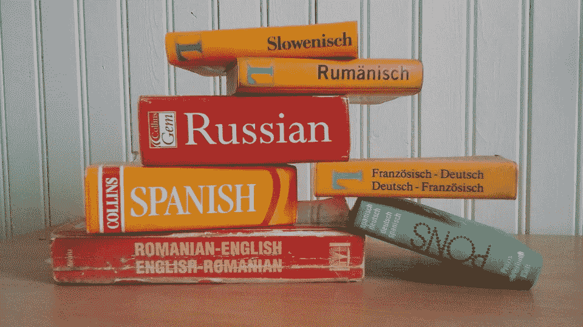
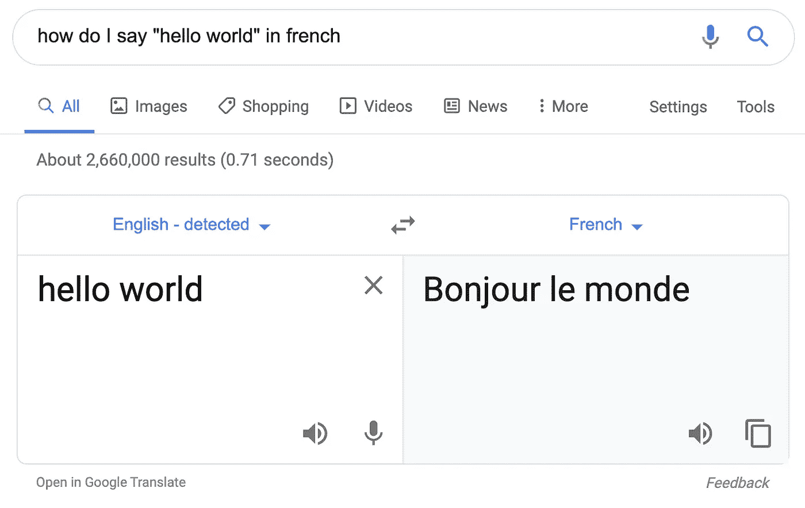
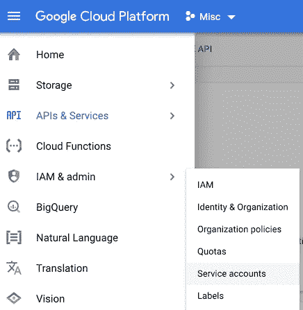
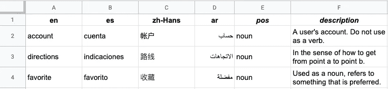
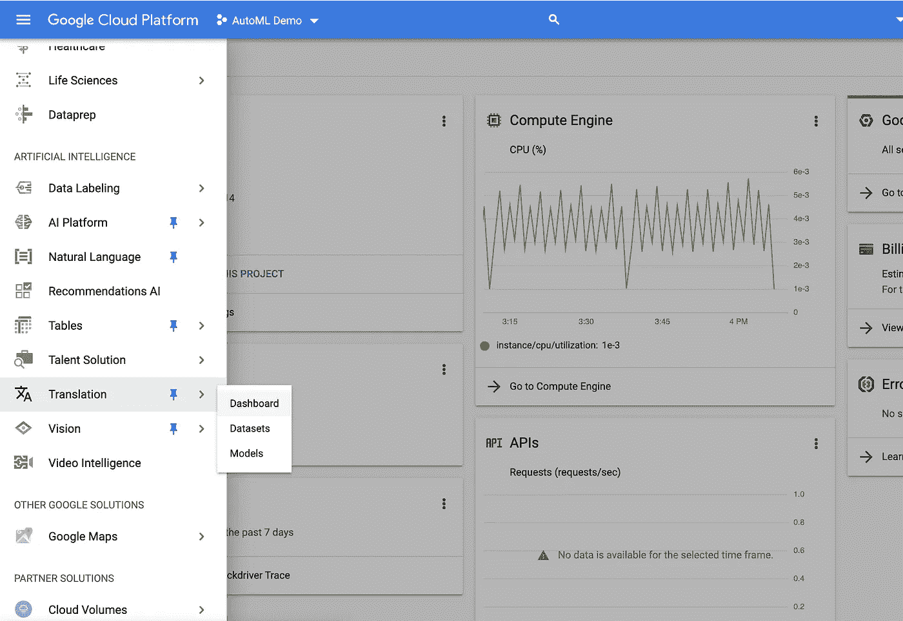
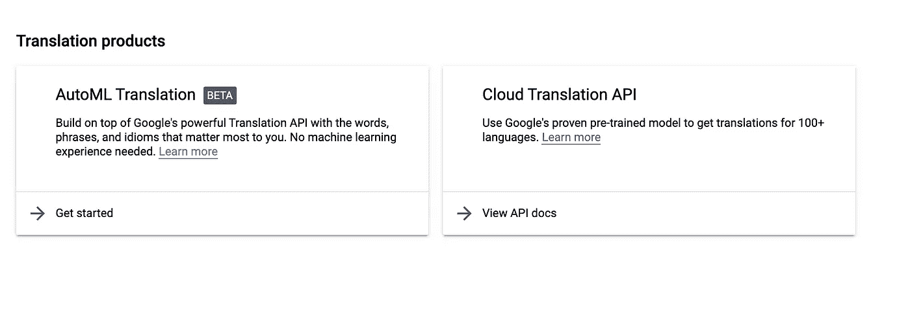
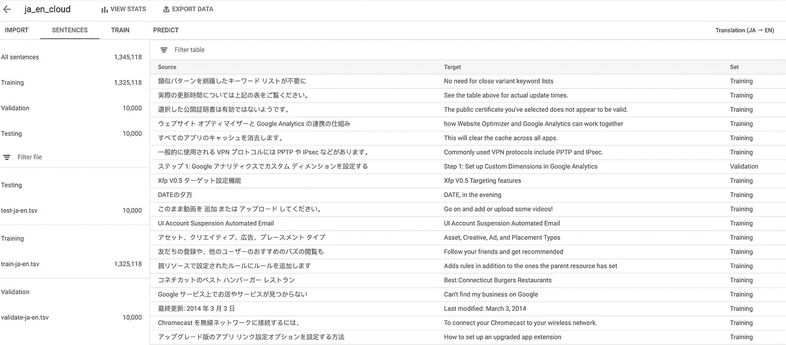
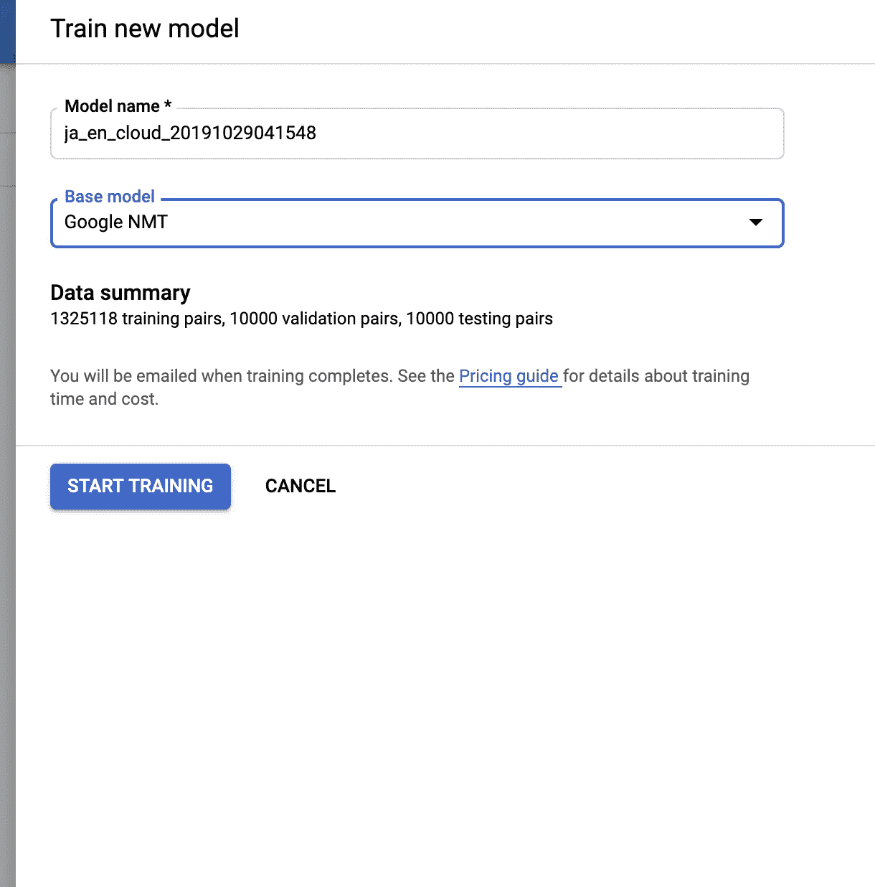
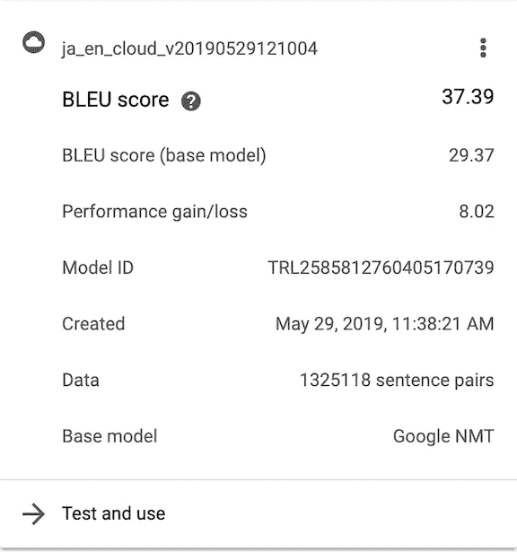
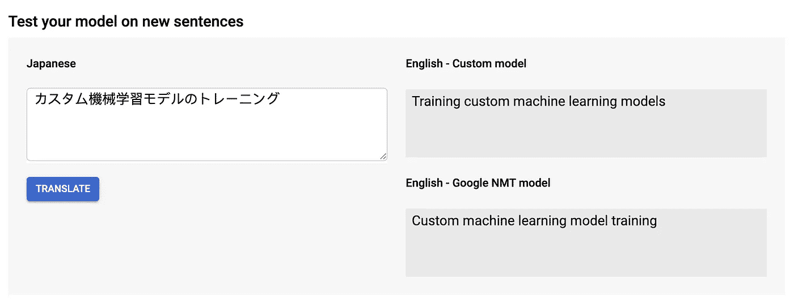

# 使用 Google 翻译 API Advanced 改进机器翻译

> 原文：<https://medium.com/google-cloud/improving-machine-translation-with-the-google-translation-v3-api-9dc2676e7fb9?source=collection_archive---------0----------------------->



Google 的新翻译 API Advanced (v3)是什么，你如何使用它来改进机器翻译？

如果你曾经在谷歌搜索中键入“你如何用 Y 语言说 X ”,你可能会遇到[谷歌翻译](https://translate.google.com/)——这是一个让你翻译文本、PDF 文档或语言之间的语音的功能:



你可以通过搜索使用谷歌的翻译模型(如上)，在翻译应用程序中，或者在你的*自己的*应用程序中使用谷歌云翻译 API。

[云翻译 API](https://cloud.google.com/translate/) 是谷歌的 API 等价物，可以让你在应用程序中构建翻译。如果你想，比如说，让你的应用程序在世界范围内以多种语言自动使用，这是非常有用的。您可以通过 REST 端点调用 Translate API，或者通过 Python、Javascript、Java、Go 等语言的库连接到它。

对于许多应用程序来说，API 是一种快速获得本地化的好方法，尤其是对于一般用户生成的内容(想想博客帖子、推文和评论的自动翻译)。但通用机器学习模型更难做好翻译非常特定领域的语言——技术文档、法律合同、医学期刊等。

本周，谷歌推出了新版本的云翻译 API，其中包含新工具，可以帮助开发者更好地调整他们的翻译，特别是针对特定领域的应用程序。这次更新将 API 分成了两个“版本”第一个是翻译 API Basic (v2)，本质上做了旧 API 做的事情。它将文本翻译成 100 多种语言，并支持翻译 HTML 和自动语言检测。与此同时，新版翻译 API Advanced (v3)引入了一些新功能，包括批量翻译(用于处理存储在云中的大型文档集)、带词汇表的翻译，甚至使用 AutoML 翻译用您自己定制的机器学习模型进行预测。

在这篇文章中，我将向您展示如何使用 Python 中的高级翻译 API(v3)来微调翻译和大规模翻译文档。

# 设置您的环境

## 启用身份验证

首先，您需要[创建一个新的 GCP 项目](https://cloud.google.com/resource-manager/docs/creating-managing-projects)或[启用现有项目中的高级翻译 API](https://console.cloud.google.com/apis/library/translate.googleapis.com?q=translate) 。

接下来，您需要设置身份验证。高级版要求您使用[服务帐户](https://cloud.google.com/iam/docs/understanding-service-accounts)进行身份验证，这是使您的应用程序能够进行身份验证的配置文件或身份。



创建新的服务帐户。

您可以随意命名该帐户。在“权限”页面上，分配“云翻译 API 编辑器”角色。最后，在服务帐户创建流程的最后一页，点击“+ Create Key”并下载一个`json`密钥文件。这个`json`文件包含了你的应用需要认证的所有信息，所以保持它的私密性(即不要把它包含在前端/面向客户端的代码中)。

## 环境变量

在这篇文章中，我们将从 Python 调用 API。作为使用 Python 库的标准最佳实践，首先创建一个虚拟环境:

```
python3 -m venv venv
source venv/bin/activate
```

接下来，安装翻译库:

```
pip install google-cloud-translate
```

如前所述，翻译客户端库使用服务帐户密钥进行身份验证。它期望在环境变量`GOOGLE_APPLICATION_CREDENTIALS.`中找到该键的路径，如下设置该变量:

```
export GOOGLE_APPLICATION_CREDENTIALS="path/to/your_creds_file.json"
```

# 翻译文本

在我们开始学习新功能之前，让我们看看如何简单地将文本从一种语言翻译成另一种语言。

首先，创建一个新的 Python 文件，即`translation.py`。在顶部，导入库:

```
from google.cloud import translate_v3
```

接下来，您需要创建一个新的 TranslationServiceClient，并用您的 [GCP 项目 id](https://cloud.google.com/resource-manager/docs/creating-managing-projects) 对其进行配置。下面是翻译文本的代码:

从英语到西班牙语的基本翻译。注意，字段“source_language_code”是可选的，因为 API 可以检测输入文本的语言。

它打印:

```
Translated text: Probemos la API de traducción en Google Cloud Platform.
```

注意字段`source_language_code`是可选的，因为 API 可以自动检测源语言。这意味着您也可以通过检查字段`response.translations[0].detected_language_code`使用这个库来识别一段文本的语言。源语言和目标语言由它们的 [BCP 47 语言代码](https://cloud.google.com/translate/docs/languages)指定，这些代码是语言和地区代码的组合(即`en-US`、`fr-CA`、`es-MX`)。

# 用词汇表翻译

上面，我们把“让我们试试谷歌云平台上的翻译 API”这句话翻译成了西班牙语。结果(“翻译文本:probes la API de traducción en Google Cloud Platform。”)正确地捕捉到了“谷歌云平台是一个专有名词，不应该翻译。但是它把“翻译 API”翻译成了“API de traducción”，去掉了大写字母(翻译应该是“API de Traducción”)。或者，由于这是一个特定的 GCP 产品的名称，我们可能根本不想将“翻译 API”翻译成西班牙语。

在这些情况下，我们希望对特定单词(公司名称、产品名称、专有名词等)的翻译有更多的控制。这就是 Translation API Advanced 的新术语表特性的用武之地。它允许你上传一个单词对的`csv`,精确指定单词应该如何翻译。这对于指定单词*何时不应该翻译*或者在可选翻译之间进行选择非常有用。



我们指定的词对词典示例，用于指示我们希望如何翻译术语。“位置”和“描述”列是可选的。

## 用词汇表编写翻译函数

要在翻译 V3 API 中使用术语表，您需要:

1.  创建服务帐户。
2.  创建一个词汇表文件。
3.  将其上传到一个[谷歌云存储(gcs)桶](https://cloud.google.com/storage/docs/creating-buckets)。
4.  使用翻译 API 创建术语表资源。
5.  像以前一样进行一个`translateText`调用，指定一个术语表。

让我们看看如何使用术语表文件来防止产品名称“翻译 API”被翻译成西班牙语。

**更新权限**

为了使用术语表，除了`Cloud Translation API User`角色之外，您需要为您的服务帐户赋予一个新的角色— `Storage Object Admin`。这将允许您的应用程序访问云存储，查看文件，创建文件以及删除文件。

**创建术语表文件**

你可以用许多不同的格式创建一个术语表，但是最简单的方法是用一个简单的 T4 创建一个“单向术语表”。创建一个名为`glossary.csv`的文件，并用翻译对填充它，就像这样:

```
Translation API,Translation API
account,cuenta
directions,indicaciones
```

这个词汇表文件指定了单词“account”和“directions”应该如何翻译，并指出单词“Translation API”根本不应该翻译。

**将您的术语表上传到 GCS 存储桶**

接下来，您需要将术语表文件上传到一个 [GCS 桶](https://cloud.google.com/storage/docs/creating-buckets)。我将把我的存储桶的名称存储在一个环境变量中，如下所示:

```
export GLOSSARY_BUCKET="gs://your_bucket_name"
```

接下来，[在 Python](https://cloud.google.com/storage/docs/reference/libraries) 中或者从命令行使用`gsutil`创建一个新的 bucket (或者使用一个现有的 bucket ):

```
gsutil makebucket $GLOSSARY_BUCKET  # create bucket
gsutil cp ./glossary.csv $GLOSSARY_BUCKET # uploads file
```

**创建术语表**

将`csv`文件上传到云端后，您需要注册一个新的术语表，如下所示:

上面，我们创建了一个新的术语表，id 为“my_first_glossary”这个惟一标识符可以是您喜欢的任何名称，稍后您将使用它来访问这个术语表。

调用`translate.types.Glossary.LanguageCodePair`表明我们正在使用一个单向词汇表，该词汇表被设计用于从`source_language_code`到`target_language_code`的翻译(在我们的例子中，是从英语到西班牙语)。

注意，我们还指定了一个用于创建术语表资源的`location`，在本例中是`us-central1`。目前，`location`必须始终设置为`us-central1`。

现在，您已经创建了第一个术语表。恭喜你。🎊让我们看看如何用它来做更好的翻译。

**用词汇表翻译**

现在您已经创建了一个术语表资源，您可以像我们之前做的那样调用`translate_text`方法，但是包括对您的术语表 id 的引用:

用词汇表翻译

这个调用与我们之前调用的没有术语表的`translate_text`相同，有三点不同:

1.  您必须指定一个`glossary_config`
2.  您必须指定`source_langauge_code`(对于术语表，该字段不是可选的)
3.  您必须将位置设置为`us-central1`

## 使用 AutoML Translate 构建自定义模型

使用包含单词对的词汇表是快速提高翻译质量的简单方法。但是有时候，你可能没有词汇表，或者不知道你想要控制哪些单词的翻译。或者，你可能会发现你的译文的一般措辞——不是任何特定的单词或短语——听起来很别扭。

为此，你可以使用名为 [AutoML Translation](https://cloud.google.com/translate/automl/docs/) 的工具训练自己的*定制*机器学习翻译模型。如果您已经有了一组高质量的翻译文档，可以用来训练新模型，那么这个工具就很有意义。

例如，在 Google Cloud 中，我们想看看是否可以训练一个模型来翻译我们的开发人员文档。这是一项艰巨的任务，即使对人来说也是如此，因为软件开发人员的语言相当行话，除非你自己就是开发人员。幸运的是，我们的大部分文档已经被人类翻译了。我们使用这些数据来训练我们自己的 AutoML 模型。让我们看看怎么做。

**训练定制汽车模型**

首先，在 GCP 控制台页面，点击进入“人工智能”下的“翻译”工具:



在 GCP 控制台页面，向下滚动到“人工智能”并选择“翻译”。

在这里，您可以选择使用翻译 API 或 AutoML 翻译。在“自动翻译”下，单击“开始”



使用自动翻译来训练自定义模型。

接下来，单击“创建新数据集”上传您的培训数据，指定您的源语言和目标语言。您可以导入存储在云桶中的数据或从您的电脑上传`csv`。

下面是我的 GCP 文档数据，从日语翻译成英语，看起来像:



训练数据由现有的人工翻译对组成。

幸运的是，因为我们已经使用人工翻译文档有一段时间了，我们有超过一百万对句子用于训练。

要训练模型，请单击“训练”选项卡，然后单击“开始训练”你将被要求选择一个基本模型，默认是谷歌的通用模型，“谷歌 NMT”开始训练模型后，它们将出现在此下拉列表中，因此您可以通过添加新数据来提高已训练模型的性能。点按“开始训练”，然后休息一下。这可能需要一段时间。



训练一个新模型。这可能需要一段时间！

当你的模型完成训练后，你会收到一封电子邮件。然后，您将能够在“Train”选项卡中看到您的模型的性能:



模型性能

**评估您的定制模型**

我们如何判断我们的定制模型表现如何？一种方法是将 AutoML 模型的性能与谷歌的基本 NMT 模型进行比较。我们用一个叫做 BLEU(双语评估替角)的指标来做这件事。这里有一篇很棒的文章解释了这个指标，这里有一篇更深入的文章。简而言之，BLEU score 采用地面真实翻译，并将其与机器翻译进行比较。人类和机器输出之间的重叠越多，BLEU 分数越高。上面，你可以看到谷歌的基本模型和你的定制模型的 BLEU 分数以及它们之间的差异，两者都是根据你的数据进行评估的。在我们的例子中，我们通过自己训练一个模型获得了 8.02 分的提升。

**使用 AutoML 模型进行翻译**

作为健全性检查，您可以跳到“预测”选项卡，直接从 AutoML UI 翻译句子:



在这里，您可以将您的定制模型的翻译(上图)与基础模型的翻译(下图)进行比较

现在让我们看看如何在 Python 中调用新的定制模型。

首先，您需要找到刚刚创建的模型的路径。方便的是，如果您向下滚动到代码示例，您可以在 UI 中的“predict”选项卡(如上图)下找到这个值。你要找的领域是:

```
projects/your_project_id/locations/us-central1/models/your_translation_model_path
```

把那条路放在手边。

现在，我们可以使用我们的*定制*模型进行预测，几乎与我们使用基本模型的方式相同。我们只需要将可选参数“model”添加到我们之前进行的`translate_text`调用中，并将路径传递给我们的模型:

瞧啊。您已经使用定制的 AutoML 翻译模型翻译了 Python 中的文本。

## 批量翻译

高级翻译 API(V3)的最后一个新特性是能够翻译批量文件。不是用单个字符串调用`translate_text`，而是指定一组存储在 [Google 云存储](https://cloud.google.com/storage/)中的文档。您还可以指定希望翻译出现的目标路径:

注意，虽然我们在这里等待结果，但是您也可以异步调用`batch_translate_text`。如果您正在翻译大量文本，并且不想等待呼叫结束，这是有意义的！

简而言之，这就是高级翻译 API 的新特性。同时，如果您已经在使用翻译 API，并且不需要这些功能，Translation Basic 可以满足您的需求。

祝你好运，菲利斯·特拉杜西恩多！