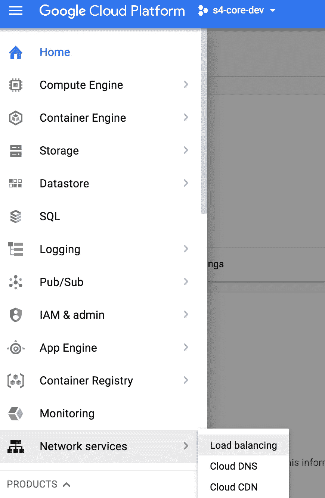
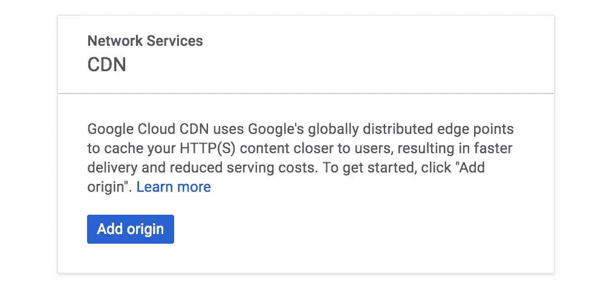
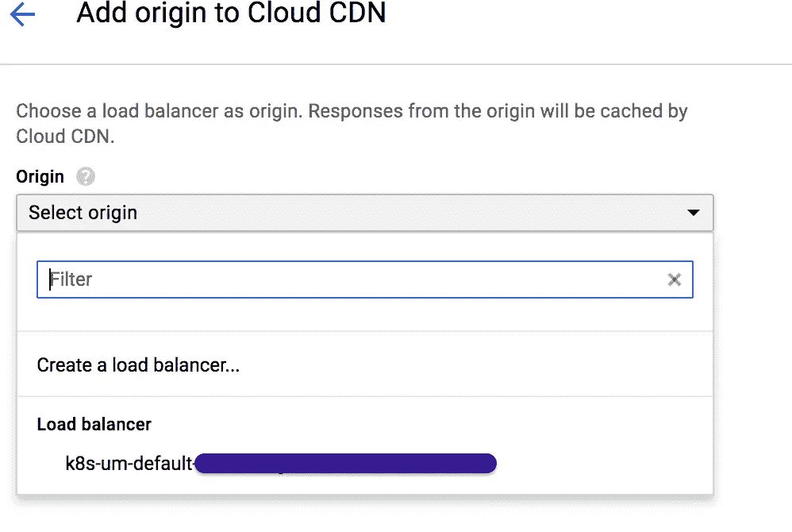
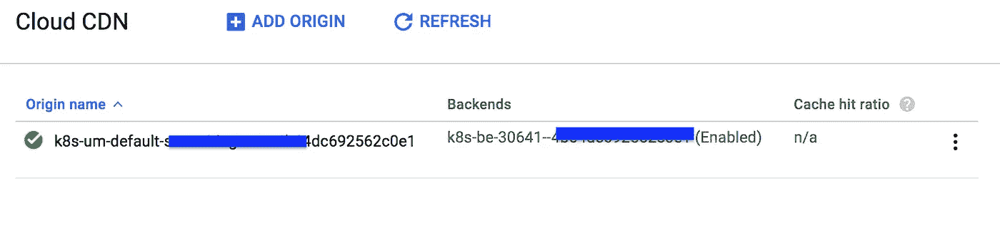
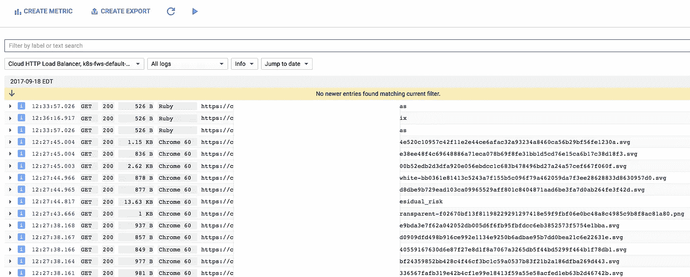
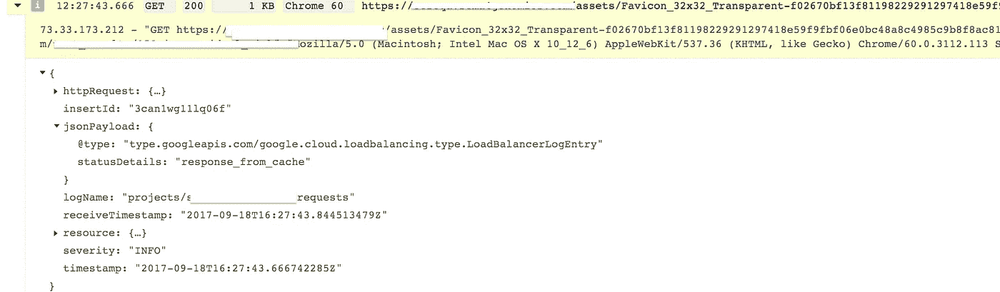
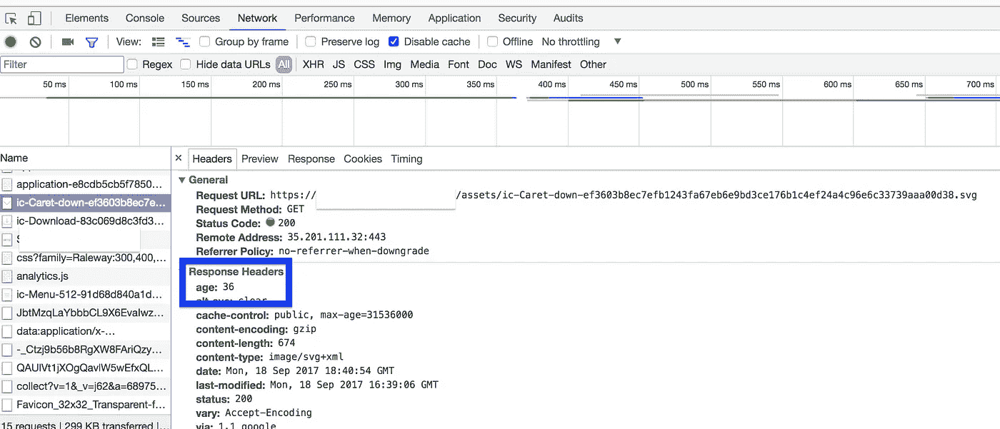

# 使用 CloudCDN 改善 Google Container 引擎上 Rails 应用页面的加载时间

> 原文：<https://medium.com/google-cloud/improving-rails-application-page-load-times-on-google-container-engine-using-cloudcdn-290d2364468e?source=collection_archive---------1----------------------->

**Tl；dr** 对于部署在 GCP 的 web 应用程序，我们如何从大约 4.5 秒的页面加载时间缩短到大约 1.8 秒。

在之前的[文章](/@nithinmallya4/deploying-a-rails-application-to-google-container-engine-with-kubernetes-b08b2de353fc)中，我们为谷歌容器引擎(GKE)部署了一个 Rails 应用。这篇文章讲述了我们如何通过使用久经考验的方法来减少页面加载时间，例如使用[资产管道](http://guides.rubyonrails.org/asset_pipeline.html)和[内容交付网络](https://www.google.com/url?sa=t&rct=j&q=&esrc=s&source=web&cd=13&cad=rja&uact=8&ved=0ahUKEwjthrW2lK_WAhXFYCYKHaNTB-8QFgh8MAw&url=https%3A%2F%2Fen.wikipedia.org%2Fwiki%2FContent_delivery_network&usg=AFQjCNGV5YDfGmqtA7qo2GOdUSpAZs-wBQ) (CDNs)。

> 在高层次上，**资产管道**允许我们压缩我们的资产(css 和 javascript 文件)并向我们的客户端应用程序(桌面和移动浏览器)交付更小的有效负载。当涉及到手机的数据费用时，这一点尤其重要，因为如果页面加载时间较长，大多数用户都会离开。
> 
> 一个**内容交付网络**是一个由代理服务器和数据中心组成的地理分布式网络，它托管图像、视频(想想网飞的内容)、我们的代码(javascript、css 等)等数据。)还有很多很多。使用 CDN 的优势在于，可以从离客户端最近的服务器获取数据，从而节省了获取数据所需的大量时间。
> 
> 我们使用 Google 提供的 CDN([Google Cloud CDN](https://cloud.google.com/cdn/docs/))获得了非常积极的体验，并决定记录这些步骤，这样也可以帮助其他用户。
> 
> **注意:**互联网上有很多资源，包括处理资产管道的官方 [Rails 资产管道文档](http://guides.rubyonrails.org/asset_pipeline.html)，所以我将坚持我们对代码库所做的更改，并解释 CloudCDN 如何帮助我们完成最后一英里。本文给出了一个相当复杂的过程的简化视图。

**假设**:

1.  你有一个谷歌云平台账户
2.  您有一个将被部署到 GKE 的 Rails 应用程序
3.  您已经熟悉了使用 gcloud 和 kubectl 命令部署应用程序。

> 这篇文章有两个部分:代码变更和将编译好的资产部署到 CDN。

# **代码变更**:

1.  宝石档案:你需要下面提到的宝石。sass-rails 用于压缩 css 文件，uglifier 对 javascript 文件也是如此。

```
gem 'sass-rails'          , '~> 5.0'
gem 'uglifier'            , '>= 1.3.0'
```

2.**application . Rb:**“public _ file _ server . headers”配置将指示浏览器缓存所有静态资产一年。由于哈希在预编译过程中会自动添加到每个资产名称中，因此浏览器会将它们视为唯一的资产。

```
config.public_file_server.headers = { 'Cache-Control' => 'public, max-age=31536000' }
```

3. **assets.rb** :在 Rails 5 中，可以在 config/initializer/assets . Rb 文件中设置资产版本。更改此版本将强制浏览器重新加载资产的最新版本。如果步骤 2 中基于散列的方法有效，通常不需要这样做。

```
Rails.application.config.assets.version = '1.0'
```

4. **production.rb** :下面的配置更改将需要为我们的 css 和 javascript 文件配置正确的处理程序(压缩器)。我们将使用 **sass** (来自步骤 1 的 sass-rails)来压缩 css 文件，使用 **uglify** 来压缩 javascript 文件。

```
config.serve_static_assets = true# Compress JavaScripts and CSS
config.assets.compress = true# Don't fallback to assets pipeline if a precompiled asset is missed
config.assets.compile = false# Generate digests for assets URLs
config.assets.digest = true

config.assets.css_compressor = :sass
config.assets.js_compressor = :uglifier
```

5. **config.ru** :您可以在您的 config.ru 中添加以下行，以确保资产在发送之前被压缩。

```
use Rack::Deflater
```

**构建代码:**

```
1\. install the gems:  **bundle install**
2\. precompile the assets: **RAILS_ENV=production bundle exec rake assets:precompile**
```

**assets:precompile** 任务在 **/public/assets** 文件夹中创建资产的编译和压缩版本。此过程会减小资产文件的大小，并加快下载速度。

> **注意**:对于 css 和 javascript 文件压缩，你也可以使用 [yui-compressor](http://yui.github.io/yuicompressor/) 。

上述步骤应该有助于我们进入下一部分，在这一部分，我们将利用 CDN 获得惊人的速度优势。

# **将预编译资产部署到 CDN**

这是有趣的部分。有了 Google CloudCDN，让我们的资产得到 CDN 的服务几乎没有什么可做的。

**步骤 1:** 转到云控制台，选择网络服务下的云 CDN



第二步:你应该会看到一个页面，要求你添加原点



**步骤 3:** 原点是您的应用程序正在使用的**负载平衡器**。在我们的例子中，我们使用 Kubernetes 入口正在使用的负载平衡器



**第四步:**大功告成！



此时，您的应用程序应该与 CloudCDN 集成在一起，通过该负载平衡器发出的任何请求都将开始在 CDN 上缓存。您可以使用默认的缓存键(如果您没有选择任何内容)，或者为需要缓存的 URL 创建一个自定义键。默认设置缓存所有请求。

> **那么，你怎么知道 CDN 是为你的资产服务的呢？**

有几种方法可以找到答案:

1.  可以查看 gcloud 日志*通过负载均衡器过滤和转发规则*。在下图中，你可以看到我们的应用程序使用的 svg 文件有很长的名字。这些名称是我们预编译资产时进行的资产预编译的结果，散列被附加到文件名上。



2.如果您深入到任何特定的日志条目，您应该会看到 jsonPayload 的 statusDetails 为“ **response_from_cache** ”。相反，如果您看到“ **response_sent_by_backend** ”，那么资产是从源服务器(您的服务器)而不是从 CloudCDN 缓存提供的。



3.在 Chrome Dev tools 中，你可以检查某个资产，你应该在 Response Headers 部分看到一个“age”标题。在本例中，ic-Caret-down.svg 文件是在 36 秒前创建的



4.前/后时间:最后，您应该能够使用标准的页面性能测量工具检查页面加载时间，例如 w [**ebpagetest**](https://www.webpagetest.org/) 或 g [**tmetrix。**](https://gtmetrix.com/)

> **总之**:以上改动将有助于压缩您的 javascript 和 css 文件，将它们存储在/public/assets/中..文件夹，并让 CloudCDN 将这些文件与图像一起缓存。这是一个不断发展的过程，我们可能会对本文进行其他优化，以使其保持最新。
> 
> **这种方法让我们的页面加载时间缩短了 65%。**