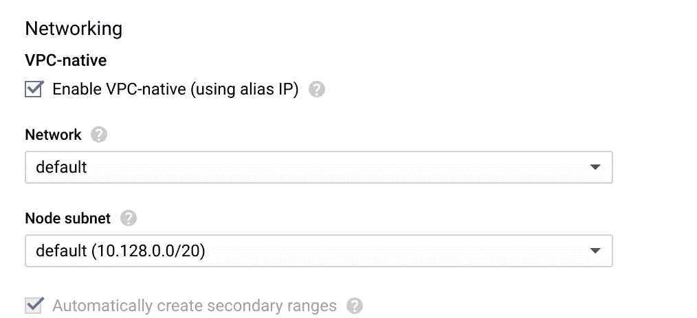
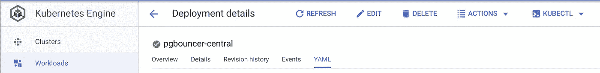

# 使用 PgBouncer 和 Kubernetes 引擎增加 PostgreSQL 云 SQL 连接

> 原文：<https://medium.com/google-cloud/increasing-cloud-sql-postgresql-max-connections-w-pgbouncer-kubernetes-engine-49b0b2894820?source=collection_archive---------0----------------------->


Denys Nevozhai 在 [Unsplash](https://unsplash.com?utm_source=medium&utm_medium=referral) 上拍摄的照片

我最近读了一篇来自 [FutureTech Industries](https://medium.com/futuretech-industries) 的精彩的 3 部分文章，内容是关于使用 Helm、Kubernetes、PgBouncer 和 CloudSQL 来大幅增加 Postgresql DB 可以处理的连接。虽然它提供了很多信息，但作为一个对 Helm 和 Kubernetes 不是很精通的人，我需要一个更全面的教程来安装 Helm、Tiller 和设置 env。我认为基于我所学的一步一步的教程将有助于下一个“我”蹒跚而行。

PostgreSQL 是一个非常棒的数据库，为初创公司和大公司提供了巨大的价值。可惜；它不能很好地处理大量连接，这在部署支持多线程的大型 REST API 时经常发生。Google Cloud SQL 现在提供了高可用性的 Postgresql 数据库，性能非常好，但它们的[连接限制](https://cloud.google.com/sql/docs/quotas)有时太低，无法让您充分利用实例。如果没有连接池，廉价的 CloudSQL 实例很快就会因连接而达到极限，并停止扩展，除非您在更大的实例上花了一大笔钱。

这就是 PgBouncer 的用武之地，它是一个简单的 PostgreSQL 连接池，一次允许几千个连接。基于来自 [futuretech-industries](/futuretech-industries/gracefully-scaling-to-10k-postgresql-connections-for-35-mo-part-three-3a780eed72cf) 的精彩文章，使用 Kubernetes 引擎运行 Helm Chart w/ PgBouncer，我们能够建立一个易于部署的系统，以便在不倾家荡产的情况下充分利用我们的 CloudSQL 数据库。

# 设置云 SQL

您需要一个启用了 private-ip 的云 SQL 实例。这是有据可查的，可以完全通过云控制台完成，无需 CLI。请点击下面的链接获取详细说明！

1.  [**创建云 SQL 实例**](https://cloud.google.com/sql/docs/postgres/create-instance) **(** *确保将它放在与您的 Kubernetes 集群相同的区域中！)*
2.  [**启用私有 IP**](https://cloud.google.com/sql/docs/postgres/configure-private-ip)
3.  [**为 PgBouncer**](https://cloud.google.com/sql/docs/postgres/create-manage-users) 创建一个 DB 用户

# 创建 Kubernetes 集群

这一步也很简单，不需要 CLI 也可以完成。在节点池下，关闭**如果启用了**自动扩展，添加标签`role: pgbouncer`并创建您的集群

1.  [**创建集群**](https://cloud.google.com/kubernetes-engine/docs/how-to/creating-a-cluster)
2.  **为私有 IP 启用 VPC-native**:
    *这将允许您的集群使用私有 IP 与您的云 SQL 数据库进行通信，而无需通过公共互联网进行通信(更安全！).*



# 设置和验证 GCloud SDK 命令行

您将需要它来检索凭证以部署到您的 kubernetes 集群。

1.  [**安装并认证云 SDK**](https://cloud.google.com/sdk/docs/quickstarts)

# 本地安装舵

Helm 是 Kubernetes 的一个包管理器，它拥有名为“图表”的包，其中包含将工作负载部署到 Kubernetes 平台上的模板。Helm 使用通常安装在集群上的名为“Tiller”的服务。如果你做任何研究，你一定会读到 Tiller 的安全问题，如果没有在生产中安全安装的话。我将向你展示如何在你的本地计算机上安装 Tiller 来完全避免这个安全问题。以下是基于[里马斯·莫克维丘斯](https://rimusz.net/author/rimusz/)关于如何安装[“无舵舵舵”](https://rimusz.net/tillerless-helm/)的这篇很棒的教程。这样你就可以从 tiller 获得所有的好处，而不会有安全问题。

Helm 的安装非常简单，有很多安装方式。我更喜欢安装如下脚本的头盔:

```
$ curl https://raw.githubusercontent.com/helm/helm/master/scripts/get > get_helm.sh
$ chmod 700 get_helm.sh
$ ./get_helm.sh
```

其他操作系统请看这里

## 舵柄插件本地安装

安装后，您需要在本地初始化 helm。`--client-only`标志确保 Tiller 没有安装在您集群上

```
helm init --client-only
```

然后你需要从谷歌云平台获取你的 Kubernetes 集群证书。这告诉 Tiller 要连接到哪个集群并对其进行身份验证:

```
gcloud beta container clusters get-credentials <cluster-name> --region <cluster-region> --project <project-id>
```

…并安装 Tiller 插件以在本地运行 Tiller:

```
$ helm plugin install https://github.com/rimusz/helm-tiller
Installed plugin: tiller
```

## 本地启动 Tiller 服务器:

您可以包含任何您想要的名称空间，或者留空，它将默认为`kube-system`

```
$ helm tiller start <namespace>
```

如果它不起作用，尝试这个命令告诉 helm Tiller 正在哪个端口上运行:

```
export HELM_HOST=localhost:44134
```

完成后停止耕作:

```
helm tiller stop
```

## 为安装设置图表

您现在可以在集群上安装图表了，但是首先您需要一个图表！我修改了一张来自 [futuretech-industries](/futuretech-industries/gracefully-scaling-to-10k-postgresql-connections-for-35-mo-part-three-3a780eed72cf) 的图表，它将允许您使用内部负载平衡器在本地公开您的集群。谷歌的内部负载均衡器将允许你使用私有 ip 与 VPC 中的其他资源共享你的集群，而不用公开它。除了修改之外，它与原始图表[相同。](https://github.com/futuretechindustriesllc/charts/)

```
$ helm repo add pgb '[https://raw.githubusercontent.com/fopark/charts/master/'](https://raw.githubusercontent.com/fopark/charts/master/')
$ helm repo update
```

## 图表配置

接下来，您需要配置图表的值，以连接并验证数据库。在本地机器上创建一个新目录

`mkdir helm_chart_values`

创建一个名为`pgbouncer-values.yaml`的文件，并将其保存在上面的目录中，以启动您的图表配置，这样您可以在以后进行调整和重新部署。将以下内容粘贴并编辑到 yaml 文件中:

```
# The database credentialsusername: ""password: ""host: x.x.x.x# The number of instances to run.replicasCount: 2# The maximum number of incoming client requests per instance.maxClientConnections: 5000# The maximum number of upstream requests per instance.poolSize: 20# Resources for the pods. For PgBouncer it's critical that these match to provide guaranteed QoS.# The chart therefore doesn't allow setting requests and limits separately.cpu: 150mmemory: 200Mi# The custom node selector. Allows you to pick a specific Node Pools to deploy your workload onto. # By default this is off; see below.nodeSelector:role: pgbouncer# Set this to LoadBalancer to make PgBouncer available outside the cluster or CluserIP for only local access.serviceType: LoadBalancer# If you want access to your cluster but only in your internal VPC network leave the below setting.  Otherwise just delete it.loadBalancerType: "Internal"# If you use RazorSQL or another tool for DB inspection you might have to place this config into pgbouncer.ini with the below parameter. injectConfig: { ignore_startup_parameters: extra_float_digits }
```

未来科技产业的伟大人物们树立了更多的价值观，我也树立了一些。要查看所有可用选项，请输入以下命令:

```
helm inspect values pgb/pgbouncer
```

保存文件并部署集群:

```
$ helm install --name my-pgbouncer --namespace my-pgbouncer-namespace pgb/pgbouncer -f /path/to/pgbouncer-values.yaml
```

f 标志将用 pgbouncer-values.yaml 文件中的值覆盖默认值

查看您在云控制台上的值是否已更新:



如果您更新了 pgbouncer-values.yaml 并希望重新部署，请使用以下命令:

```
helm upgrade <workload-name> pgb/pgbouncer -f helm_chart_values/pgbouncer-values.yaml
```

你有它！您应该有一个运行 w/ CloudSQL 的 pgbouncer 集群！请继续关注我的下一篇文章，我将使用 pgbouncer 和 Cloud SQL 在 Google App Engine 灵活环境上部署 Python Flask API。

> 我想指出的是，我只是主要从几个来源把这些放在一起，并没有声称自己是我上面讨论的大多数主题的内容创建者。我刚刚度过了一个非常漫长的夜晚，按照我想要的方式设置了它，我想我会像那些把我列出的文章放在下面的了不起的人一样做出贡献。请看看这些文章，因为它们对各自的主题进行了更详细的介绍！
> 
> 来源:

[](/futuretech-industries/gracefully-scaling-to-10k-postgresql-connections-for-35-mo-part-three-3a780eed72cf) [## 以每月 35 美元的价格轻松扩展到 10k PostgreSQL 连接，第三部分

### 除了更明显的优势，它还提供了轻松的节点和流程扩展、健康检查、可配置…

medium.com](/futuretech-industries/gracefully-scaling-to-10k-postgresql-connections-for-35-mo-part-three-3a780eed72cf)  [## 无舵舵舵 v2

### Helm 真的成为了事实上的 Kubernetes 包经理。Helm 是查找、共享和使用软件的最佳方式…

rimusz.net](https://rimusz.net/tillerless-helm/)