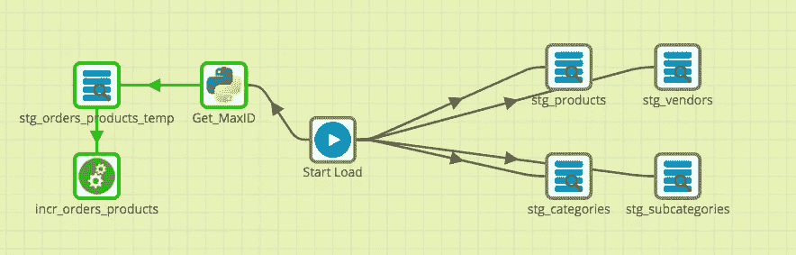

# 使用 Matillion 将 MySQL 增量加载到 BigQuery

> 原文：<https://medium.com/google-cloud/incremental-mysql-loads-to-bigquery-using-matillion-d3b182773b00?source=collection_archive---------2----------------------->

作为为我们的一个客户构建企业数据仓库的一部分，我们必须以 30 分钟的间隔将一堆表从 MySQL 复制从属服务器同步到 BigQuery。考虑到其他非关系数据源的范围也是这个负载的一部分，我们选择了 Matillion 作为 ETL 工具。Matillion 易于设置(只需供应虚拟机并开始创作作业)，集成列表很长，因此很有意义。

这篇文章解释了如何构建一个具有以下功能的物料作业:

1.  满载
2.  对具有较大行数的表进行增量加载，并且自上次加载以来可以查找新行的`ID`。

如果你在 Google 上搜索 Matillion——我假设你已经完成了实例的设置，默认项目的设置等等，所以我跳过这些。虽然 Matillion 附带了 PostgreSQL 驱动程序，但出于某种原因，它没有 MYSQL 驱动程序——你必须首先设置它们。

*   从这里下载驱动。解压缩到 jar 文件
*   在 Matillion 中，进入**项目- >管理数据库驱动程序，**上传 jar 文件和**测试。你现在可以走了。**

我们有一堆有几千条记录的表。即使我们每次都加载整个表，每个表也只需要不到两秒钟时间——所以我们采用了这种方法。在 Matillion 上这样做很简单。

选择`Database Query`组件，并用源和目标配置它。


Matillion 负责在 BQ 上创建目标表，即使它们不存在——这很酷。但是请记住，这个组件总是重新创建目标表，您不应该对增量表这样做。

我们还有一些行数超过 5000 万的表，而且它们还在不断增长。在这种情况下，满载需要很多时间。幸运的是，我们有一个`id`列，所有这些表上的主键，允许对`MAX(ID)`执行查找，并且只导入自上次加载以来添加的新行。Matillion 的文档中有针对多个表的 Amazon RDS 实现这一点的[步骤](https://redshiftsupport.matillion.com/customer/en/portal/articles/2506598-incremental-or-high-watermark-data-loading)，但与我们的用例不太一样。

因此，涉及的步骤如下:

1.  首先执行目标表的完全装载。您可以使用`Database Query`组件来完成这项工作。假设 mysql 上的源表名是`orders`，在这一步中，您将在 BigQuery 中对`stg_orders` 执行完全加载。这是一次性的，您可以在加载后删除组件。
2.  使用 Python 脚本组件在 BigQuery 上从`stg_orders`表中查找 MAX(ID ),将其存储在一个变量中。Python 组件中需要以下代码片段。这将当前 maxid 值存储在`maxid`变量中，可用于下一步。

```
cursor = context.cursor()
cursor.execute(‘select max(id) from stg_orders’)
result = cursor.fetchone()
context.updateVariable(“maxid”, str(result[0]))
```

3.在 BQ 上创建一个临时表，在每次装载时存放新行。您可以再次使用`Database Query`组件。让我们称我们的临时表为`stg_orders_tmp`。在组件配置中，只需编辑 SQL 查询以返回大于 maxid 的行。


4.接下来，创建一个转换作业，从上面创建的临时表中读取数据并进行更新。我们将使用的组件是，`Table Input`和`Table Update`。表输入从上一步读取数据，并用组件的`Update/Insert` 更新策略更新 BQ 上的目标表。


5.现在，回到编排作业，并在下一步添加转换作业。所以这个工作看起来像这样。流量的右侧是满负荷，而左侧是增量负荷。



希望这对你有用。快乐装货！:)

*原载于 2018 年 2 月 15 日* [*Searce 工程博客*](/searce/incremental-mysql-loads-to-bigquery-using-matillion-d496b021e903) *。*