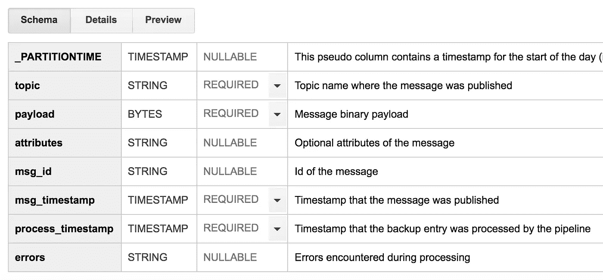
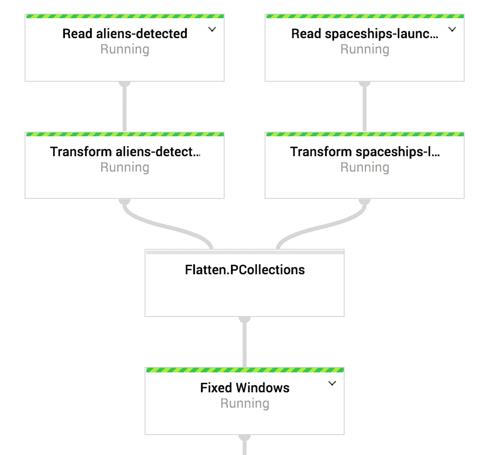

# 云发布/订阅的无限备份

> 原文：<https://medium.com/google-cloud/infinite-backup-for-cloud-pub-sub-62021b679c51?source=collection_archive---------1----------------------->

我喜欢使用[云发布/订阅](https://cloud.google.com/pubsub/)，尤其是它的无忧操作。每次和运行 Kafka 集群的人谈完话，听他们抱怨维持集群运行的运营成本太高，我就更加喜欢它了。但是 Kafka 确实有一个 Cloud Pub/Sub 没有的功能:能够永久存储你的流媒体数据。嗯……让我们做点什么，让我们以尽可能低的运营成本实现一个无限备份系统。

https://unsplash.com/photos/waAAaeC9hns

## 大查询存储

我们首先需要的是无限的存储空间。显而易见的选择是云存储，因为它是最便宜的。但是它有一个限制，那就是它对于向其中输入数据不是很理想。另一个有无限存储空间的服务是 BigQuery。令人惊讶的是，它的价格与云存储完全相同，并且它有一个流插入 API。如果你在那个分区 90 天没有接收数据，它甚至会自动降低每个分区的[价格 50%](https://cloud.google.com/bigquery/pricing#long-term-storage) 。

如果你看看所有的特征，我想我们已经找到了理想的存储引擎。它甚至还有一个附加价值，那就是你有一个很好的网络界面，给你调试的能力和对你的流数据的一些洞察力。

设计一个模式似乎很简单。只需将所有内容存储在发布/订阅消息中。幸运的是，BigQuery 有一个**二进制数据类型**，所以我们可以存储任何类型的消息。我还喜欢存储消息和处理时间戳，这样至少可以知道消息是何时备份的。理想情况下，它们应该非常接近消息**时间戳**。我将不同的主题放入一个表中，所以我也将主题添加到模式中(您的需求可能会有所不同，可能需要为每个主题准备一个表)。另外，不要忘记备份潜在的**属性**，这些属性可能会附加到您的邮件中。

## 云数据流备份管道

现在我们有了存储系统，我们需要一些东西来进行实际的备份。云数据流看起来是理想的候选，它使用了 [Apache Beam](https://beam.apache.org/) 模型，对于流和批处理具有相同的语义。这意味着当您希望以批处理模式从备份中读回数据时，可以重用相同的代码。

[云数据流](https://cloud.google.com/dataflow/)也是一种托管服务，这有助于降低运营成本。因此，抛开所有的因素(云发布/订阅、大查询和云数据流)，我们现在必须考虑代码。

这出奇的容易。阅读你想要备份的主题的**发布/订阅**是一个显而易见的事情。请注意，每个订阅*都有 7 天的保留期*，让您有足够的时间更新您的管道。接下来，**将消息**转换成一个 TableRow，以便接收到 BigQuery 中，然后**将**所有订阅展平，这样就只有**一个输出表**。唯一棘手的是，您希望每天都有一个分区，但是我在以前的文章中已经提到了 Apache Beam 管道中的[自动 BigQuery 分区，所以这也解决了。](/google-cloud/bigquery-partitioning-with-beam-streams-97ec232a1fcc)

## 结论

这就是全部了。这是你可以构建的最简单的束管道之一，它能够同时处理几十个发布/订阅主题，并将备份流式传输到 BigQuery。运行您的管道，您将获得以下优势:

*   最便宜的邮件备份存储
*   储存 90 天后自动享受 50%的折扣
*   7 天发布/订阅缓冲
*   只有一个云数据流在运行

也许它没有 Kafka 存储 API 那么强大，但它非常接近，而且不用担心运行 Kafka 集群。

你可以在我的 GitHub 页面查看一个完整的工作示例，确保创建备份订阅并修改配置文件，如上例所示:

 [## alexvanboxel/pubsub-backup

### 通过在 GitHub 上创建一个帐户来为 pubsub-backup 开发做贡献。

github.com](https://github.com/alexvanboxel/pubsub-backup) 

现在您可以放心地睡觉了，因为您知道您发布的所有消息都有备份。

我很惊讶很少有人使用这个简单的技巧。一年多来，我一直在生产中成功地使用这种技术(尽管使用的是旧的 BigQuery 分区)。当 Spotify 在其文章“[可靠地将云发布/订阅流导出到云存储](https://labs.spotify.com/2017/04/26/reliable-export-of-cloud-pubsub-streams-to-cloud-storage/)”中公布其备份技术时，我非常高兴，但我对该解决方案的复杂性感到非常惊讶。我认为我的技术是可靠的，但是更容易编写和操作。也许当你在 Spotify 的规模上工作时，它会分崩离析，但当我达到那个点时，我会看到的。