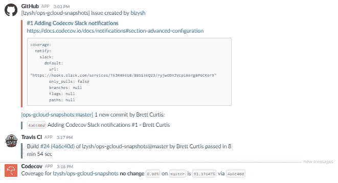
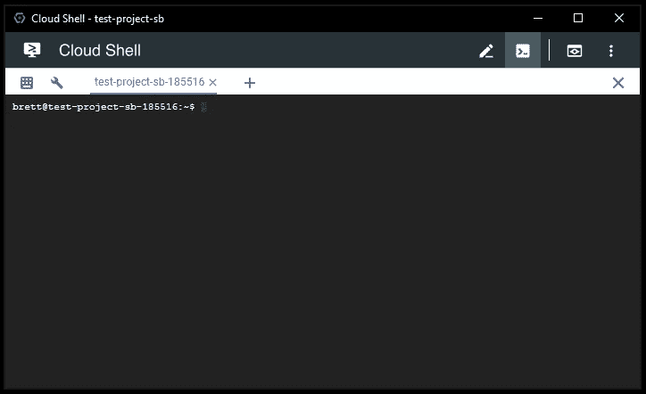

# 使用 Travis CI & Codecov 在 Google Kubernetes 引擎(GKE)上运行开发工具的基础设施代码(IaC)

> 原文：<https://medium.com/google-cloud/infrastructure-as-code-iac-for-running-development-tools-on-google-container-engine-gke-using-353f3287d49e?source=collection_archive---------0----------------------->


在过去的一两个月里，我一直在摆弄谷歌云平台，并想出了一个有趣的方法来实现基础设施代码(IaC ),以便在谷歌 Kubernetes 引擎(GKE)上运行以下应用程序:

https://github.com/lzysh/ops-gke-jenkins

来源:【https://github.com/lzysh/ops-gke-upsource】T2

https://github.com/lzysh/ops-gke-sonarqube

GoCD:[https://github.com/lzysh/ops-gke-gocd](https://github.com/lzysh/ops-gke-gocd)

它可以扩展到任何东西，这是我们的目标之一。

**快速声明:** *我以前从未接触过这些产品，我的 bash 技能充其量也就是黑客水平。* *也就是说，我需要能够提供一个解决方案，让开发人员以一种可支持的方式快速启动并运行 Google 云平台&。这是一个 MVP，如果值在那里，我将迭代并向前移动。* ***这是一个 IaC 开发管道，我用来为开发者提供各种开发工具，供他们在开发管道中使用。*** *“彼得·派珀拣了许多腌辣椒……”*

首先，如果你只对管道的结果和如何让最终产品启动并运行感兴趣，那就在我的 GitHub 上的 README.md 中，它是被积极维护的。为了完整起见，我也在这篇文章的底部做了记录，但不会更新。如果你想分支这些项目，并好奇如何设置 Travis CI，我在这里记录了。

我知道有第三方工具将基础设施作为代码来管理，例如像 [Terraform](https://www.terraform.io) 这样的工具。然而，就像我之前说的，我从未使用过谷歌云平台，所以我想先试着更好地了解产品集。在研究第三方工具集能做什么或者*不能做什么之前，我想知道我自己能做什么。我对这些工具很感兴趣，随着时间的推移，我会更好地判断它们到底能提供什么。*

## *项目结构:*

*我用的一个东西是 [git 子模块](https://git-scm.com/book/en/v2/Git-Tools-Submodules)。我有一个 [ops-IaC](https://github.com/lzysh/ops-IaC) 项目，我用它来包装我所有的单个项目。如果你看看它，你会发现它大部分都是子模块。一些[文档](https://github.com/lzysh/ops-IaC/blob/master/README.md)以及一个[测试脚本](https://github.com/lzysh/ops-IaC/blob/master/test.sh)和一个[构建脚本](https://github.com/lzysh/ops-IaC/blob/master/build.sh)，我稍后会谈到。*

*我想保持项目小，简单和可重复使用。我开始的第一个项目是 [ops-common](https://github.com/lzysh/ops-common) 。这是为了包括我可以在我的项目中共享的核心功能，以及我可以在其他任务中重用的公共功能。到目前为止，这种方式运行良好。在某些地方，我正在重新创建类似于 [start.sh](https://github.com/lzysh/ops-common/blob/master/kubectl/start.sh) 的代码，因为我不想添加任何应用程序专用的公共代码。随着我对交付方式的标准化和对 Kubernetes 等产品集的进一步了解，我预计这种情况会越来越少。*

*我做的下一件事是基于一个特定的用例创建项目。例如，我正在使用一个名为[外部 dns](https://github.com/kubernetes-incubator/external-dns) 的项目。"*外部 dns* 将公开的 Kubernetes 服务和入口与 dns 提供商同步。"超级光滑的项目，因为我不想在 DNS 管理的业务。我已经创建了我的项目,其中只有启动和运行这个项目所需要的部分。这真的很简单。*

*再比如 [kube-lego](https://github.com/jetstack/kube-lego) 。" *kube-lego* 自动向[请求 Kubernetes 入口资源的证书，让我们加密](https://letsencrypt.org)"我不能在没有前端安全的情况下向我的开发团队交付最终产品，所以这个项目完全符合要求。我也不想参与处理 SSL 证书的业务。我可能会很快为 kube-cert-manager 创建一个项目，因为它可能会更活跃一些。*

*我不会单独讨论每个项目，所以我要讨论的最后一个项目是一个实际应用。我们使用 [SonarQube](https://www.sonarqube.org) 来保证代码质量。我再次为库本内特或 GKE 的 SonarQube 创建了一个[项目。如果你看着它，你会看到和其他东西非常相似的结构。对于](https://github.com/lzysh/ops-gke-sonarqube)[詹金斯](https://github.com/lzysh/ops-gke-jenkins) & [Upsource](https://github.com/lzysh/ops-gke-upsource) 也是如此。*

## *持续集成、测试和代码覆盖:*

*现在我已经把所有的项目和代码都准备好了，我需要测试它们，而且我想真正了解测试的是什么，而不是什么。这里我介绍一下[特拉维斯 CI](https://travis-ci.org) & [Codecov](https://codecov.io) 。我的每个项目的要求是成为各种自含式服务。我想验证这一点，并在每次推送时进行测试。让我们看看这一切是如何进行的，并向我展示出来。*

*我们将把重点放在 [ops-common](https://github.com/lzysh/ops-common) 的东西上，因为就我的测试来看，它真的很简单，也是最完整的。首先是 git 推送，一旦发生这种情况 [Travis CI 就拿起它](https://travis-ci.org/lzysh/ops-common/builds/300348185)并做一些工作:*

*设置构建系统:*

**

*如果需要，安装一些 apt 包。就像我对 Codecov 所做的那样，正如我在我的另一篇文章中所讨论的，Bash 代码覆盖使用 Codecov 和 kcov。*

**

*克隆存储库和任何需要的子模块。*

*Travis CI 有一个非常巧妙的缓存系统。我对谷歌云 SDK 和我使用的覆盖工具 [kcov](https://github.com/SimonKagstrom/kcov) 都使用这个。*

**

*接下来，它用 kcov 运行 [test.sh](https://github.com/lzysh/ops-common/blob/master/test.sh) 脚本。我对代码的输出做了一点改动，以便在 Travis CI 中显示像样的测试结果。关于 kcov 和我的输出，我还有一些工作要做，我最近介绍了代码覆盖部分。目前在 Travis CI 上，它将我的测试脚本作为一个庞大的命令运行，并超时构建。在本地，它像预期的那样工作。在我的 test.sh 中，我尽我所能地进行测试，失败场景以及我期望的东西当然应该可以工作。你可以进入这个世界，想怎么完整就怎么完整。就像以前一样，我过去常常看到我的 Gentoo build****能以多快的速度运行**** 所以在这里你可以看到一些失败的测试:*

**

*以及标准测试:*

**

*最后一些清理工作:*

**

*这就是我的单元测试。如果我在测试我的 [Jenkins 项目](https://github.com/lzysh/ops-gke-jenkins),我实际上是在谷歌云平台上构建了整个项目，然后在测试脚本中全部拆除。*

*在那之后，因为我在使用 kcov 和 Codecov，我可以看到[漂亮的小报告](https://codecov.io/gh/lzysh/ops-common)关于我正在测试什么和我没有测试什么，并努力改进它。*

*在 Travis CI 上运行的 Codecov:*

**

*Codecov.io 上的报告示例:*

**

*我也将所有通知发送给 [slack](https://slack.com) 。在 GitHub 中创建问题的流程、提交、构建以及随后的代码覆盖都非常好，并且代表了对正在完成的事情的快速查看:*

**

*就像之前讨论过的，我拥有的最后一个部分是 ops-IaC 项目，它也是所有其他项目的包装器。例如，要运行一个适合我的开发团队使用的 Jenkins 环境，它应该有一个 DNS 名称和一个 SSL 证书。为此，我需要构建我的 [ops-external-dns 项目](https://github.com/lzysh/ops-gke-external-dns)和 [ops-kube-lego 项目](https://github.com/lzysh/ops-gke-kube-lego)。这就是这个项目中 [test.sh](https://github.com/lzysh/ops-IaC/blob/master/test.sh) 发挥作用的地方。如果你愿意的话，这是我的综合测试。SonarQube 需要一个数据库，所以我使用谷歌云 SQL。它还需要 DNS 名称和 SSL，所以这也是我一起测试所有组件的地方。我有一个选项可以禁用清理，这样我就可以构建所有的依赖项并实际验证最终产品。为此，我登录到我新创建的 Jenkins、SonarQube 和 Upsource 实例，以确保一切顺利。我可以快速查看我的 [Travis CI 输出](https://travis-ci.org/lzysh/ops-IaC/builds/300638138)，也可以从构建的角度验证一切工作正常。最后是 build.sh。如果你愿意的话，这是“工件”,我用它来做我在开始这个项目时打算做的事情。让我的开发人员快速启动并运行，回答“嘿，我们想在谷歌上编码，我们如何开始？”的问题他们可以签出这些代码，编辑 build.sh，并将其视为自己的 GitHub 项目中的构建工件。*

*我现在可以非常快速地让我的开发团队在 Google 云平台上运行。我认为这是一种很容易被接受的方式。我们将看到它如何结束，以及我是否会去第三方管理基础架构代码。这是一个例子，一个团队已经使用我刚才提到的开发工具建立了一个管道。*

**

*在单个区域中运行 [Google Kubernetes 引擎](https://cloud.google.com/container-engine) (GKE)以及使用[云 SQL for PostgreSQL](https://cloud.google.com/sql/docs/postgres) 一直很稳定，到目前为止没有出现任何问题。简单的夜间持久磁盘快照和云 SQL 的夜间备份。这满足了我们对面向开发工具的可用性需求。我希望及时扩展这一点，并尝试为更重要的面向业务的应用程序构建一个完整的多区域甚至多地区 Kubernetes 集群。*

*下面可以试试。它将完全运行在[谷歌云平台免费层](https://cloud.google.com/free)上。*

# *运行代码:*

*1: [打造谷歌云平台项目](https://cloud.google.com/resource-manager/docs/creating-managing-projects):*

**

*2: [激活谷歌云外壳](https://cloud.google.com/shell/docs/quickstart):*

*你应该试试谷歌云平台的 chrome 扩展[SSH](https://chrome.google.com/webstore/detail/ssh-for-google-cloud-plat/ojilllmhjhibplnppnamldakhpmdnibd)。*

**

*3:创建托管 dns 区域:*(注意，代码运行时不需要执行此步骤，但是如果您想要从* [*使用 DNS 和 SSL 证书生成可用的应用程序，则需要执行此步骤。让我们加密*](https://letsencrypt.org) *。)**

```
*gcloud dns managed-zones create test-lzy-sh --description="My test zone" --dns-name="test.lzy.sh"*
```

*4:向您的域名注册机构注册该区域:*

```
*gcloud dns record-sets list --zone test-lzy-sh
NAME          TYPE  TTL    DATA
test.lzy.sh.  NS    21600  ns-cloud-b1.googledomains.com.,ns-cloud-b2.googledomains.com.,ns-cloud-b3.googledomains.com.,ns-cloud-b4.googledomains.com.
test.lzy.sh.  SOA   21600  **ns-cloud-b1.googledomains.com**. cloud-dns-hostmaster.google.com. 1 21600 3600 259200 300*
```

*这将显示您的 NS 记录，获取数据并在您的注册服务商上创建 NS 记录。我是这么做的。我有一个顶级域名 lzy.sh，我告诉那个注册商使用谷歌云 DNS。我在自己的项目中管理这个区域。对于每个其他项目，我会创建另一个子域区域，例如 test.lzy.sh，并将该 NS 添加到我的顶级域 lzy.sh 中。显然，您可以按照自己的意愿进行操作，但这对于我的用例来说很好。*

**

*现在，当[外部 dns](https://github.com/kubernetes-incubator/external-dns) 变得不可思议时，你就完成了交易。要骄傲。我将自动化项目创建，类似于[Lakshmanan V](https://medium.com/u/247b0630b5d6?source=post_page-----353f3287d49e--------------------------------)post 以及云 DNS 工作，以加快速度。*

*5:启用一些 API:*

*我很快会将它添加到代码中，但是现在:*

```
*gcloud services enable container.googleapis.com  \
sql-component.googleapis.com sqladmin.googleapis.com*
```

*6:回到你的 Google Cloud Shell，抓取[代码](https://github.com/lzysh/ops-IaC)并构建:*

```
*git clone --recursive --branch v1.0 \
https://github.com/lzysh/ops-IaC.git
cd ops-IaC
vi build.sh*
```

*编辑# build 脚本设置以适应您的环境*

```
*# build script setup
production=false
upgrade=false
backup=false
secret=`openssl rand -base64 12`
project=test-project-sb
zone=us-east1-b
region=us-east1
cluster=dev-tools-cluster
dnsZone=test.lzy.sh
jenkinsDomain=ci.${dnsZone}
upsourceDomain=cr.${dnsZone}
sonarDomain=cq.${dnsZone}
instance=dev-tools-instance
legoEmail=kube-ssl@lzy.sh
serviceAccount=dev-tools-cloud-sql*
```

*运行它:*

```
*$ ./build.sh*
```

*进入 GCP 需要一些时间，在构建脚本完成后可能需要 10/15 分钟。你也有 DNS 记录更新和 kube-lego 生成 ssl 证书一旦完成。去喝点咖啡，回来，建个管道，写点代码。*

*如果你有任何问题，我注意到后端服务的配额在一些项目上是不同的。你将需要 7 个后端服务，我认为谷歌将默认值改为了 5，这实在是太小了。无论如何，请求更多的后端服务和入口资源将正确填充。*

*要清理，删除您创建的项目或者查看 [test.sh](https://github.com/lzysh/ops-IaC/blob/master/test.sh) 中的清理命令。玩得开心。*