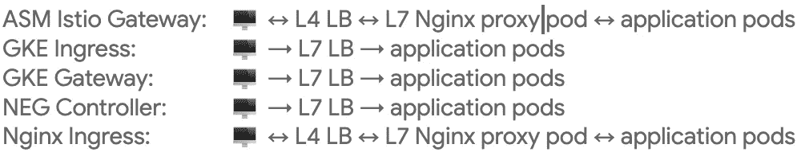

# Google Kubernetes 产品的入口

> 原文：<https://medium.com/google-cloud/ingress-in-google-kubernetes-products-f22ded21f4ed?source=collection_archive---------0----------------------->


以下是我试图总结和消除技术讨论中经常使用的术语，这些技术讨论围绕着将网络入口流量安排到运行在谷歌云([【GKE】](https://cloud.google.com/kubernetes-engine/docs/concepts/kubernetes-engine-overview))或内部部署( [Anthos on Bare Metal](https://cloud.google.com/anthos/clusters/docs/bare-metal/latest/concepts/about-bare-metal) ， [Anthos on VMware](https://cloud.google.com/anthos/clusters/docs/on-prem/latest/overview) )的[单个] Kubernetes 集群。

下面的小目录应该会引导您直接找到感兴趣的部分。

*   [选项细分](#bb7b)
*   [服务](#48d0)[GKE](#73aa)|[Anthos](#e92f)|[TLS](#40c3)|[举例](#5020)
*   [入口](#ac05)[GKE](#d3f7)|[Anthos](#08eb)|[TLS](#9fdb)|[举例](#e81c)
*   [网关](#cf3b)[GKE](#134a)| |[TLS](#f3f4)|[举例](#bc1f)
*   [Istio Gateway](#e263)[GKE](#c3e2)|[安托斯](#9fe0) | [TLS](#2d5e) | [举例](#63a5)
*   [负控制器](#5a14)[GKE](#4177)| |[TLS](#e70b)|[示例](#137d)

您需要多少次将 Kubernetes 集群连接到外部世界，使其可以从公共互联网或您的组织内部访问，同时保持其安全性并保持对设置的控制？

当这种讨论开始时，往往并不清楚有哪些选择。部件名称的*和 ***过载术语*** 在很大程度上造成了混乱。*

**“我们将建立一个入口”* —等等，你是指一个特定的实现吗？这将在哪个系统中发生？这就是所有需要的吗？*

**“TLS 将在网关处终止”* —您指的是哪种网关？你确定这符合你们共同的 TLS 要求吗？*

**“谁将拥有团队中的网络入口？”—* 我在这里指的是什么？*

**“我们需要关注前面的负载均衡器吗？”—* 关于这一点还有更多选择！*

*我经常参与这样的讨论。*

*浏览相当模糊的术语和景观的一种方法是列出所有可能的变体并将其结构化。一旦所有可能的选项都被列出并组织好，就有可能在同一页上着陆并减少混乱。*

*我将尝试提供一个简明的参考，包括这些术语的多重含义、简短的基础设施设计模式图和示例配置片段。*

# *选项细分*

*通过按产品口味对网络流量入口选项列表进行分类，可以方便地启动它们。*

*可用选项和短期含义取决于我们是在谷歌云(GKE 服务)的环境中还是在谷歌云之外的 Anthos 集群中。 [Anthos 服务网格](https://cloud.google.com/service-mesh/docs/overview) (ASM)是否可用和/或是否需要。*

*请注意，并非所有选项都提供了设置完全成熟的相互 TLS 身份验证的机会。此类选项下面标有黄色问号。*

**

*这是表中选项的网络流量摘要(双箭头表示可能的相互 TLS 设置，单箭头表示单向 TLS 连接):*

**

*我们现在将更详细地研究每一个问题。*

# *服务*

*[Kubernetes 服务](https://kubernetes.io/docs/concepts/services-networking/service/)资源提供了定义负载平衡器类型的 Kubernetes 服务的选项。Kubernetes 集群外部的系统负责通过查看 Kubernetes 服务定义来配置 Kubernetes 集群外部的基础设施资源。*

*通常，在这种情况下，应用服务端点直接暴露给传入(L4)流量。因此，TLS 由应用程序本身终止。*

*如果应用程序已经有了自己的特殊组件，可以接受 TLS 连接并将它们路由到其他应用程序组件，那么这个选项就很有用。*

**

# *服务— GKE*

*在 GKE，负载平衡器服务类型自动管理 Google Cloud L4 TCP 负载平衡器资源。它们将由谷歌云自动创建。*

# *服务— Anthos*

*在裸机上的 Anthos 中，LoadBalancer 服务可以自动管理捆绑的 MetalLB 负载平衡器，它是 Anthos 安装的一部分，由运行在集群主节点上的软件组件表示。*

# *服务— TLS*

*TLS 证书需要在应用服务本身中配置，例如使用 [cert-manager](https://cert-manager.io/docs/) 和 [Google CAS Issuer](https://github.com/jetstack/google-cas-issuer) 发布的证书。这些最终存储在 Kubernetes Secrets 中，通常安装在应用程序盒中。*

# *服务—示例*

```
*apiVersion: v1
kind: Service
metadata:
  name: my-service
spec:
  selector:
    app.kubernetes.io/name: MyApp
  ports:
    - protocol: TCP
      port: 443
      targetPort: 9376
  clusterIP: 10.0.171.239
  type: LoadBalancer
status:
  loadBalancer:
    ingress:
    - ip: 192.0.2.127*
```

# *进入*

*[Kubernetes Ingress](https://kubernetes.io/docs/concepts/services-networking/ingress/) 是一个 API 对象，管理对集群中服务的外部访问，通常是 HTTP。Ingress 可以提供负载平衡、SSL 终止和基于名称的虚拟主机。*

*一个[入口控制器](https://kubernetes.io/docs/concepts/services-networking/ingress-controllers/)负责完成入口。*

*Kubernetes 入口资源的局限性包括:*

*   *无法配置入口代理和应用程序后端服务之间的相互 TLS 连接(Kubernetes 资源定义中缺少相应的设置)*
*   *包含负载平衡器和路由配置的单一入口资源不支持多租户环境中的问题分离和灵活访问配置(所有问题由一个团队负责)*
*   *在 Istio 入口控制器(默认情况下存在于 ABM 安装中)的情况下，也不可能使用 TLS 和加密反向代理和应用服务之间的网络流量*

*由于其局限性，Kubernetes Ingresses 的使用正逐步被劝阻，而倾向于下一章描述的 Kubernetes 网关资源。*

# *入口— GKE*

*在 GKE， [GKE 入口控制器](https://cloud.google.com/kubernetes-engine/docs/concepts/ingress)自动管理谷歌云 L7 外部和 L7 内部负载平衡器资源。*

*传入的 L7 TLS 连接在 GCE L7 外部负载平衡器或 L7 区域内部负载平衡器处终止。GCE 负载平衡器将传入流量转发到 Kubernetes 集群节点。*

*[可以在目标 Kubernetes 服务对象上配置容器本地负载均衡](https://cloud.google.com/kubernetes-engine/docs/concepts/ingress#container-native_load_balancing)，使 GCE 负载均衡器将流量直接转发到 pods，而不是节点端口。*

**

# *入口— Anthos*

*在 ABM 中， [Istio Ingress 控制器](https://istio.io/latest/docs/tasks/traffic-management/ingress/kubernetes-ingress/)的默认开箱即用安装提供了一个将 Istio Ingress 代理进程作为 Kubernetes 工作负载进行自动管理的选项。不幸的是，这种开箱即用的选项具有上面列出的所有 Kubernetes 入口限制。*

*为了配置入口代理进程和具有相互 TLS 的应用后端服务之间的下游连接，可以可选地使用支持这种实现的 Istio 入口实现。其中一个实现是 [Nginx 入口控制器](https://docs.nginx.com/nginx-ingress-controller/)，它可以通过自定义 Kubernetes 资源注释配置 TLS 下游连接加密和 TLS 客户端证书。*

**

# *入口— TLS*

*TLS 配置(如入口代理服务器和客户端证书)是在 Kubernetes 入口资源定义中直接配置的，也可以通过附加的自定义 Kubernetes 资源注释进行配置。*

*Kubernetes 入口既可以使用 TLS 证书，也可以使用来自类型为`tls`的被引用的 Kubernetes 秘密资源的私钥。在这种情况下，带有 TLS 证书和密钥的 Kubernetes 秘密可以由[证书管理器](https://cert-manager.io/docs/)和 [Google CAS 发行者](https://github.com/jetstack/google-cas-issuer)管理。*

*或者，[可以](https://cloud.google.com/kubernetes-engine/docs/how-to/ingress-multi-ssl#pre-shared-certs)在`ingress.gcp.kubernetes.io/pre-shared-cert` Kubernetes 入口注释中指定 GCE SSL 证书资源名称。然后，将使用引用的预配置 SSL 证书来配置负载平衡器。*

# *入口—示例*

```
*apiVersion: networking.k8s.io/v1
kind: Ingress
metadata:
  name: ingress-myservicea
  annotations:
    cert-manager.io/issuer: "letsencrypt-staging"
spec:
  tls:
    - hosts:
        - ingress-demo.example.com
      secretName: ingress-demo-tls
  rules:
  - host: myservicea.foo.org
    http:
      paths:
      - path: /
        pathType: Prefix
        backend:
          service:
            name: myservicea
            port:
              number: 80
  ingressClassName: nginx*
```

# *门*

*[Kubernetes Gateway](https://gateway-api.sigs.k8s.io/) 是在 Kubernetes 中建模服务网络的资源集合(GatewayClass、Gateway、HTTPRoute、TCPRoute、service 等。).*

*Kubernetes Gateway 是 Kubernetes Ingress 的最新替代产品，解决了其缺点和局限性，并鼓励在未来取代 Kubernetes Ingress。*

**

# *门户— GKE*

*在 GKE，Kubernetes 网关是由 GKE 网关控制器实现的。通过其 Kubernetes 资源配置，可以自动管理:*

*   *`gke-l7-rilb` 建立在[内部 HTTP(S)负载均衡](https://cloud.google.com/load-balancing/docs/l7-internal)之上的区域性内部 HTTP(S)负载均衡器*
*   *`gke-l7-gxlb` 基于[全局外部 HTTP(S)负载平衡器(经典)的全局外部 HTTP(S)负载平衡器](https://cloud.google.com/load-balancing/docs/https)*
*   *`gke-l7-rilb-mc` 建立在[内部 HTTP(S)负载均衡](https://cloud.google.com/load-balancing/docs/l7-internal)上的多集群区域负载均衡器*
*   *`gke-l7-gxlb-mc` 基于[全局外部 HTTP(S)负载平衡器(经典)](https://cloud.google.com/load-balancing/docs/https)的多集群全局负载平衡器*
*   *`gke-td` 多集群[交通主管服务网](https://cloud.google.com/traffic-director/docs/gke-gateway-overview)*

*Anthos 服务网格提供了 [ASM 云网关控制器](https://cloud.google.com/service-mesh/docs/managed/service-mesh-cloud-gateway)的预览。除了前面列出的 Kubernetes 网关类型之外，它还引入了*

*   *`asm-l7-xlb` 用于构建在[全局外部 HTTP(S)负载平衡器(经典)](https://cloud.google.com/load-balancing/docs/https)之上的全局外部 HTTP(S)负载平衡器*

*ASM 云网关通过 [Kubernetes 网关 API](https://gateway-api.sigs.k8s.io/) 提供统一的方式来配置 Anthos 服务网格入口网关和[云负载平衡](https://cloud.google.com/load-balancing)。部署此 ASM 网关 API 对象时，将发生以下情况:*

*   *部署并配置了外部 HTTP(S)负载平衡器。它可能需要几分钟才能启动，但当它启动时，网关会指示 IP 地址，并会用所创建的计算引擎负载平衡器资源的名称进行注释。*
*   *在 istio-ingress 命名空间中创建一个 Anthos 服务网格入口网关部署。这将创建从云负载平衡器接收流量的特使代理实例。*
*   *云负载平衡器将加密所有流量并将其路由到 Anthos 服务网格入口网关。*

# *网关— TLS*

*Kubernetes 网关管理的负载平衡器的 TLS 证书和密钥可以通过以下方法提供*

*   *[Kubernetes Secrets](https://cloud.google.com/kubernetes-engine/docs/concepts/gateway-security#kubernetes-secrets) —可由证书管理器和谷歌 CAS 发行者提供和管理*
*   *[SSL 证书](https://cloud.google.com/kubernetes-engine/docs/concepts/gateway-security#ssl-certificates) —可以独立于 GKE 集群进行预配置(例如使用 Terraform)*
*   *[证书管理器](https://cloud.google.com/kubernetes-engine/docs/concepts/gateway-security#certificate-manager)*

# *网关—示例*

```
*kind: Gateway
apiVersion: gateway.networking.k8s.io/v1beta1
metadata:
  name: my-gateway
spec:
  gatewayClassName: gke-l7-rilb
  listeners:
  - name: https
    protocol: https
    port: 443
    tls:
      mode: Terminate
      options:
        networking.gke.io/pre-shared-certs: store-example-com
---
apiVersion: gateway.networking.k8s.io/v1beta1
kind: HTTPRoute
metadata:
  name: httproute-example
spec:
  parentRefs:
  - name: my-gateway
  hostnames:
  - my.example.com
  rules:
  - matches:
    - path:
        type: PathPrefix
        value: /bar
    backendRefs:
    - name: my-service1
      port: 8080*
```

*请注意单独的 Kubernetes 资源“Gateway”和“HTTPRoute ”,它们定义了 Kubernetes 网关的不同方面。这种分离允许关注点的分离和职责的分离。具有不同访问权限的不同团队现在可以负责管理入口网络流量的外部和内部方面。*

# *Istio 网关*

*当 [Anthos 服务网格](https://cloud.google.com/service-mesh/docs/overview) (ASM)在 Kubernetes 集群中安装并可用时，它提供自己的方式来管理和组织进入服务网格的网络流量。*

*ASM 引入了 Istio Gateway Kubernetes 资源和组件。它不同于上一节中描述的 Kubernetes 网关资源对象。*

*Anthos 服务网格为您提供了部署和管理 [Istio 网关](https://cloud.google.com/service-mesh/docs/gateways)的选项，作为您服务网格的一部分。网关描述了在网格边缘运行的负载平衡器，接收传入或传出的 HTTP/TCP 连接。网关是特使代理，为您提供对进出网格的流量的细粒度控制。网关主要用于管理入站流量，但是您也可以配置网关来管理其他类型的流量。*

*向外部客户端公开 Istio 网关有多种方式。在这篇[公开文章](https://cloud.google.com/architecture/exposing-service-mesh-apps-through-gke-ingress)中很好地描述了在 GKE 集群中运行的 ASM 网格的所有选项。*

# *Istio Gateway — GKE*

*向外部客户机公开运行在 GKE 集群中的 ASM 网格的基本方法是使用 Kubernetes 服务对象，如下图所示。在 GKE 上创建一个负载平衡器类型的 Kubernetes 服务资源对象会自动创建相应的 Google Cloud L4 负载平衡器。*

**

*请注意，Anthos 服务网格可以与[认证中心服务](https://cloud.google.com/certificate-authority-service)集成，作为网格工作负载证书的来源。*

# *Istio 网关— Anthos*

*还需要一个 Kubernetes 服务资源对象来公开运行在 Anthos on Bare Metal (ABM)集群中的 ASM 网格。由 ABM 组件自动控制的负载平衡器的类型取决于[集群安装配置](https://cloud.google.com/anthos/clusters/docs/bare-metal/latest/installing/load-balance):*

*   *捆绑 L2 负载平衡*
*   *与 BGP 捆绑的 L3 负载平衡*
*   *手动负载平衡*

*下图说明了公开在 ABM 集群中运行的 ASM 网格所需的 Kubernetes 组件。*

**

# *Istio 网关— TLS*

*GKE 和 ABM 上的 ASM 安装可以配置由 Google[Certificate Authority Service](https://cloud.google.com/certificate-authority-service/docs)(CAS)提供的 TLS 证书。*

*ASM 可以在安装过程中配置 CAS 资源名称，并在运行时自动管理工作负载 TLS 证书生命周期，从提供的 CAS 服务池或实例中获取它们。*

# *例子*

```
*apiVersion: networking.istio.io/v1beta1
kind: Gateway
metadata:
  name: frontend-gateway
  namespace: frontend
spec:
  selector:
    istio: ingressgateway
  servers:
  - port:
      number: 443
      name: https
      protocol: HTTPS
    hosts:
    - ext-host.example.com
    tls:
      mode: SIMPLE
      credentialName: ext-host-cert  # Kubernetes Secret name
---
apiVersion: networking.istio.io/v1beta1
kind: VirtualService
metadata:
  name: frontend-ingress
  namespace: frontend
spec:
  hosts:
  - "*"
  gateways:
  - frontend-gateway
  http:
  - route:
    - destination:
        host: frontend
        port:
          number: 80*
```

*请注意我们在 [Kubernetes Gateway](#bc1f) 部分看到的类似的 cons 分离级别。*

# *GKE NEG 和 AutoNEG 控制器*

# *负控制器— GKE*

*GKE 提供了一个 [NEG 控制器](https://cloud.google.com/kubernetes-engine/docs/how-to/standalone-neg)来管理`GCE_VM_IP_PORT`网络端点组(NEG)的成员资格。您可以将它创建的 neg 作为后端添加到您在 GKE API 之外配置的负载平衡器的后端服务中。*

*带有[独立 NEGs](https://cloud.google.com/kubernetes-engine/docs/how-to/standalone-neg#use_cases_of_standalone_negs) 的 NEG 控制器涵盖了由 Kubernetes Ingress 自动创建的负载平衡器组件不服务于您的用例的情况。*

*额外的 [Autoneg 控制器](https://github.com/GoogleCloudPlatform/gke-autoneg-controller)在 GKE 和谷歌云负载平衡(外部和内部)之间提供简单的定制集成。这是一个 GKE 特有的 Kubernetes 控制器，它与 GKE 网络端点组(NEG)控制器协同工作，管理您的 Kubernetes 服务端点和 GCLB 后端服务之间的集成。*

*GKE 用户可能希望将来自多个集群的 NEG 后端注册到同一个后端服务中，或者可能希望以定制或集中的方式编排高级部署策略，或者通过受保护的公共端点和更宽松的内部端点提供相同的服务。Autoneg 控制器可以支持这些用例。*

**

****使用 NEG 控制器和 Kubernetes 服务资源的好处*** 是能够进一步分离负责网络流量进入云的团队的职责，包括负载平衡器和有权访问并负责 Kubernetes 内部资源和工作负载的团队。*

**

*基于 NEG 控制器的网络入口组件*

*通过使用选择的基础设施即代码(IaC)系统(例如 Terraform)和 Kubernetes 资源经由声明性的 Kubernetes API 来提供云资源，可以建立网络入口。*

# *负控制器— TLS*

*在这个场景中，TLS 连接由 Google Cloud 负载平衡器处理和终止。使用 NEG Controller，可以重用负载平衡器组件，并将它们连接到 Kubernetes 集群资源中定义的 Kubernetes 服务。*

*在这种情况下，TLS 证书和私钥可以在 Kubernetes 集群之外进行管理，遵循现有的 Terraform IaC 方式或基于 Google Cloud API 的自动化。在这种情况下，Kubernetes 资源不会导致负载平衡器组件以可能破坏地形状态的方式进行修改。*

# *负控制器—示例*

```
*apiVersion: v1
kind: Service
metadata:
  name: my-service
  annotations:
    cloud.google.com/neg: '{"exposed_ports": {"80":{},"443":{}}}'
    controller.autoneg.dev/neg: '{"backend_services":{"80":[{"name":"http-be","max_rate_per_endpoint":100}],"443":[{"name":"https-be","max_connections_per_endpoint":1000}]}}
    # For L7 ILB (regional) backends 
    # controller.autoneg.dev/neg: '{"backend_services":{"80":[{"name":"http-be","region":"europe-west4","max_rate_per_endpoint":100}],"443":[{"name":"https-be","region":"europe-west4","max_connections_per_endpoint":1000}]}}
spec:
  selector:
    app.kubernetes.io/name: MyApp
  ports:
    - protocol: TCP
      port: 443
      targetPort: 9376
  clusterIP: 10.0.171.239
  type: LoadBalancer
status:
  loadBalancer:
    ingress:
    - ip: 192.0.2.127*
```

# *结论*

*你注意到一个错误吗？有一个有趣的或新的解决方案来安排网络进入 Kubernetes 集群吗？将很高兴学习和修改列表。请评论并 PM 我！*