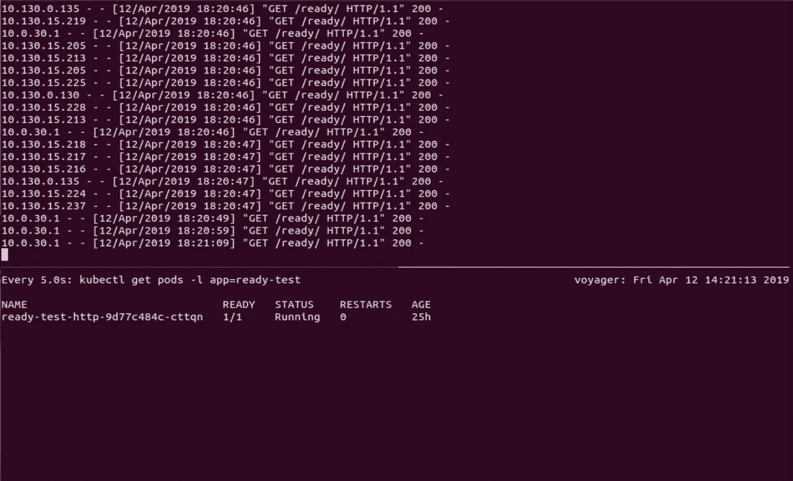
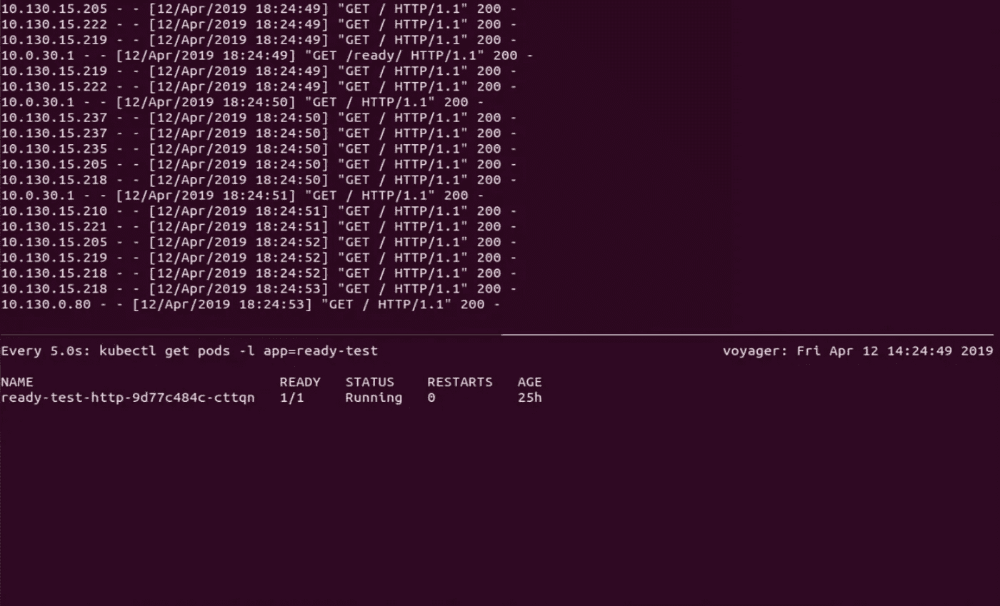
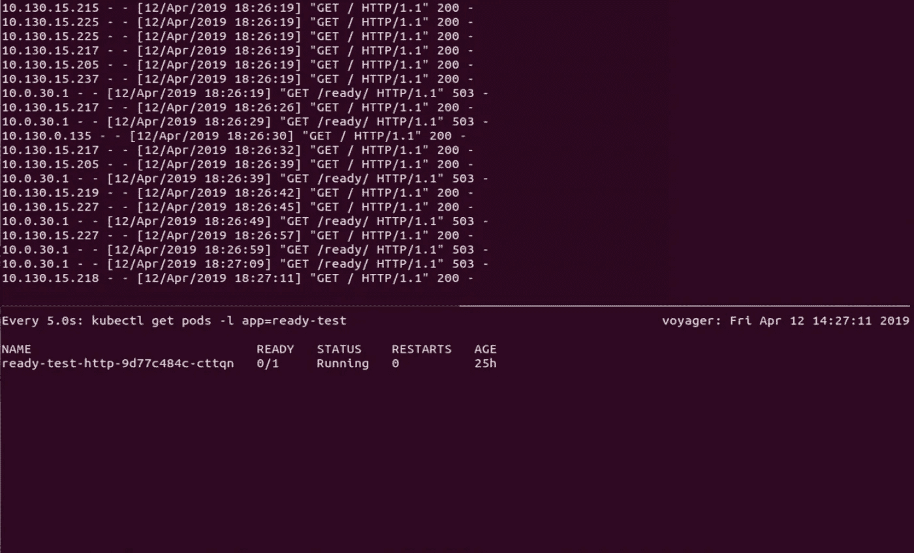
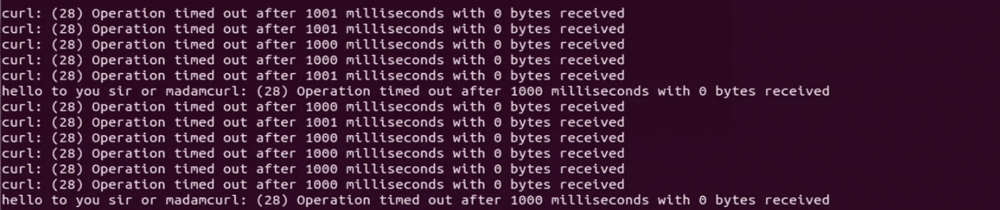

# 谷歌 GKE 的入口负载平衡问题

> 原文：<https://medium.com/google-cloud/ingress-load-balancing-issues-on-googles-gke-f54c7e194dd5?source=collection_archive---------0----------------------->

通常我在这里的帖子都是关于一些我认为我可能已经想通了并想分享的事情。今天的帖子是关于一件事，我很确定我还没有弄明白，想分享一下。我想谈谈我们在过去几周一直在努力解决的一个问题；我们可以提出潜在的解决方法，但还不知道其根本原因。简而言之，如果你在 GKE[的 GCE 入口后运行某些类型的服务，即使你的 pod 没有准备好，比如在部署期间，你也可能会获得流量。在我进入细节之前，这里有一个发现的故事。如果你只是想要 TL；博士和建议跳到最后。](https://cloud.google.com/kubernetes-engine/)


【2019 年 4 月 17 日更新——谷歌内部测试证实，这是前端保持开放连接到 kube-proxy 并重用它们的问题。由于 netfilter NAT 表规则仅适用于新连接，这有效地缩短了 kubernetes 的内部服务负载平衡，并将所有流量定向到同一 pod 的给定节点/节点端口。谷歌还证实，从服务器响应中删除 keep-alive 头是一个变通办法，我们已经在内部证实了这一点。如果您需要 keep-alive 报头，那么下一个最佳选择是使用一个 [VPC 本地集群](/google-cloud/vpc-native-clusters-on-google-kubernetes-engine-b7c022c07510)进行容器本地负载平衡，因为这将节点端口跳从等式中去掉。不幸的是，如果你的集群不是 VPC 本地的，那就意味着要建立一个新的集群。这就是解决办法…如果你对这个故事仍然感兴趣，请继续读下去！]

在过去的几个月里，我们一直在为迁移到 GKE 做准备，这是我们最重要的服务之一。该服务部分由一个 http 守护进程组成，该守护进程处理来自我们的 javascript 客户端的[长轮询](https://en.wikipedia.org/wiki/Push_technology#Long_polling)请求，并在 90 个 GCE 实例上运行。这些实例在峰值负载时每秒处理大约 15k 个请求。因为这些请求中有许多是超时 30 秒的长轮询，所以我们需要能够优雅地关闭该服务的实例。为了实现这一点，我们可以发送一个命令，使服务退出循环，等待 60 秒，等待所有现有的长轮询完成，然后退出。

为了在 kubernetes 中复制这一点，我们利用了三个重要而有用的特性:[就绪探测器](https://kubernetes.io/docs/tasks/configure-pod-container/configure-liveness-readiness-probes/)、[生命周期挂钩](https://kubernetes.io/docs/concepts/containers/container-lifecycle-hooks/)，以及用于 pod 的[终止宽限期](https://kubernetes.io/docs/concepts/workloads/pods/pod/#termination-of-pods)。就绪探测器允许您定义一个命令，kubelet 调用这个命令来确定 pod 是否应该接收流量，在我们的例子中是一个 http 端点。生命周期钩子指定了一个在 kubelet 向它发送 SIGTERM on delete 之前要在容器中执行的命令。这是我们发送关闭命令的方式。终止宽限期设置了 kubelet 在发送 SIGTERM 之前等待生命周期挂钩完成的最长时间。

所有这一切似乎在舞台上表现得相当好，但唉，我们都知道那里的交易。在我们在 GCE 类入口后面启动一些生产 pod 并开始向它们迁移流量后，这项服务的首席工程师 Nick MacInnis 开始发现一些奇怪的事情:在部署期间，未准备好的 pod 仍在接收流量。这是一件坏事，因为这意味着当 pod 最终被删除时，我们将有未完成的连接，我们的客户将会看到一连串断开的连接错误。测试证实了他的观察。这些豆荚不仅获得了流量，还获得了新的连接。事实上，我们可以简单地将负载平衡器端点卷成一个循环，并将流量发送到未准备好的 pods。

我们问自己的第一个问题是:豆荚真的没有准备好吗？当一个 pod 的就绪性探测失败时(通过向 http 探测返回 200 以外的值，从命令探测返回 1，或者如果没有定义探测则退出),它应该被主节点标记为未就绪，它的端点应该被[端点控制器](https://kubernetes.io/docs/concepts/overview/components/#kube-controller-manager)标记为未就绪，端点应该从服务的端点列表中删除，每个节点上的 kube-proxy 应该从向 pod 分发流量的 NAT 表链中删除该端点。

我们的测试证实，所有这些事情正如所描述的那样发生了:pod 被标记为未准备好，端点控制器将端点标记为未准备好，服务将其删除。因为从入口(即通过[节点端口](https://kubernetes.io/docs/concepts/services-networking/service/#nodeport))到服务的流量被[SNAT](https://www.juniper.net/documentation/en_US/contrail4.0/topics/task/configuration/snat-vnc.html)到接收节点上的 pod 网络，所以很容易看到流量来自哪个节点。当我们识别并连接到一个源节点时，我们可以看到 kube-proxy 一获得更新就从 NAT 表中删除了 pod 的端点，这通常是在 pod 本身被标记为未准备就绪后的 5-10 秒。

然而，它获得了流量。我们在谷歌云支持下打开了一个案例，并继续测试。我应该在这里指出，我们一直有良好的体验与谷歌的支持。他们关心服务，即使是复杂的问题，他们也能迅速解决。在过去的几年里，他们帮助我们解决了很多问题，但他们和我们一样对此感到困惑。在内部，我们致力于在更加可控的环境中重现问题。在我们看来，这个 http 服务器或入口没有什么特别的，所以如果这是一件事，它应该是任何类似配置的 GKE 服务的事情。

我们首先使用 python3 和 flask 创建了一个简单的服务器，有三个端点:

```
from flask import Flask
from flask import Responseapp = Flask("ready-test")READY = True[@app](http://twitter.com/app).route('/', methods=['GET'])
def handle_root():
  resp = Response("hello to you sir or madam")
  return resp[@app](http://twitter.com/app).route('/ready/', methods=['GET'])
def handle_ready():
  global READY
  if READY:
    return "ready"
  else:
    return Response("unready", status=503)[@app](http://twitter.com/app).route('/unready/', methods=['GET'])
def handle_unready():
  global READY
  if READY:
    READY = False
    return "server is unready"
  else:
    READY = True
    return "server is ready"
```

根路径由测试客户端调用，只返回一些垃圾和 http 200。/ready/ path 旨在从就绪探测器中调用，并根据全局变量的状态返回 200 或 503。/unready/ path 只是切换该变量的状态，是我们控制 pod 就绪状态的手段。

然后，我们添加了部署、服务和入口:

```
kind: Deployment
apiVersion: apps/v1
metadata:
  name: ready-test-http
  labels:
    app: ready-test
spec:
  selector:
    matchLabels:
      deployment: ready-test-http
  template:
    metadata:
      labels:
        app: ready-test
        deployment: ready-test-http
    spec:
      containers:
      - name: ready-test
        image: ready-test
        ports:
        - containerPort: 8080
          name: http
        readinessProbe:
          httpGet:
            path: /ready/
            port: 8080
          periodSeconds: 10
          timeoutSeconds: 5
          successThreshold: 1
          failureThreshold: 2
---kind: Service
apiVersion: v1
metadata:
  name: ready-test
  labels:
    app: ready-test
spec:
  type: NodePort
  selector:
    deployment: ready-test-http
  ports:
    - name: http
      port: 80
      targetPort: http
---
apiVersion: extensions/v1beta1
kind: Ingress
metadata:
  name: ready-test
  labels:
    app: ready-test
  annotations:
    kubernetes.io/ingress.class: "gce"
spec:
  rules:
  - http:
      paths:
      - path: /
        backend:
          serviceName: ready-test
          servicePort: 80
      - path: /ready/
        backend:
          serviceName: ready-test
          servicePort: 80
      - path: /unready/
        backend:
          serviceName: ready-test
          servicePort: 80
```

准备就绪探测的具体时间被选择来复制我们在产品服务中所做的事情，其余的几乎是简单的样板文件。我们进行了部署，确认我们可以切换就绪状态，启动一个循环来弯曲根路径，并遵循 pod 日志。然后，我们切换就绪状态，看到 pod 被标记为未就绪，大约 5 秒钟后，看到节点上的 NAT 表得到更新…然后负载平衡器的流量停止。我们唯一能看到的是来自库伯莱和 GCLB 前端的战备探测。

我们回去仔细查看了生产服务。有些事情明显不同了。在四处探索之后，我们意识到我们正在使用的 [twisted http server](https://twistedmatrix.com/trac/) 默认设置了“Connection: keep-alive”头，而我们的测试应用程序没有。为此，我们添加了代码，将根路径处理程序的实现改为:

```
[@app](http://twitter.com/app).route('/', methods=['GET'])
def handle_root():
  resp = Response("hello to you sir or madam")
  resp.headers['Connection'] = 'Keep-Alive'
  resp.headers['Keep-Alive'] = 'timeout=30'
  return resp
```

“Keep-alive: timeout=30”头是我在测试中添加的。我不确定它是否相关，但我会把它留在那里，因为它在我们进行的下一次测试中出现过。我们重新部署了测试服务，重复了上面的步骤……并且在 pod 没有准备好之后继续看到请求。让我们仔细看看这个测试。



在此屏幕中，您可以看到测试箱已准备就绪，我们只接收来自 kube let(10 . 0 . 30 . 1 上)和 GCLB(来自 10.130.0.0/20 网络上的节点 IP 的请求)的请求。然后，我们使用以下命令启动 curl:

```
$ while true; do curl -m 1 [http://xxx.xxx.xxx.xxx/](http://35.244.243.109/); done
```

“-m 1”参数的目的是让 curl 不会等待 30 秒的 GCLB 超时，而是继续尝试每秒至少发送一次请求。



在这个屏幕中，pod 仍然处于就绪状态，您可以看到 curl 客户端的请求。请注意，由于前面提到的陷阱，这些似乎也来自节点。然后，我们将 pod 状态切换为未准备好。



在这里，您可以看到 pod 未准备好，我们将 503 返回到准备就绪探测器，但是我们仍然从 curl 客户端收到对/ endpoint 的请求。请注意，尽管我们这里只有一个 pod，而且这个 pod 还没有准备好，但是当这些请求通过时，客户端不会看到错误。



在 curl 命令的这个输出中，您可以看到，在大多数情况下，它在请求的 1000 毫秒内超时，但有时它会得到响应。我们让这个测试运行了几分钟，继续看到零星的请求。测试客户端在最坏的情况下运行大约 1 rps，因此您可以很容易地想象如果您扩展到 15k rps 会有什么影响。

我们又做了几轮测试，并满意地确认，当我们在服务器响应中返回 keep-alive 报头时，一些请求将会通过，当我们删除该报头时，事情会按预期工作，并且只要所有节点的 NAT 表都更新，流量就会停止。

那么 tl 是什么；博士在吗？有时未准备好的 pod 会收到请求。我们仍在支持下解决此问题，GKE 团队正在调查。当我们了解到根本原因时，我会在这里跟进。我们有自己的关于连接在链中的某个地方被打开和重用的理论(主要是因为 NAT 表规则只适用于新连接)，但实际上这只是推测，我们不知道。通过入口的负载平衡是复杂的，有两个独立级别的健康检查和循环连接平衡。如果这是 kube-proxy 的问题，我们应该可以看到。到目前为止，情况似乎不是这样的，我们在 GCLBs 上没有相同水平的可见性。我们将不得不把这留给谷歌团队。

与此同时，如果您在 GCE 类入口*和*后面的 GKE 上运行 http 服务，您的服务可能会在保持活动的同时变得未准备就绪(即可以通过活性探测，但未通过准备就绪探测)*和*您的服务器正在返回 keep-alive 标头，您可能需要仔细看看部署期间发生了什么。我们看不到任何迹象表明这与我们的应用程序或环境的细节有关，如果在其他地方也没有发生这种情况，那将是令人惊讶的。我们也肯定*不*知道移除 keep-alive 头是一个完整的修复。

感谢 Olark 的 Nick MacInnis 和 Kyle Owens 对这个问题的深入研究，感谢 Google Cloud Support 的 Yahir 迄今为止的所有帮助。