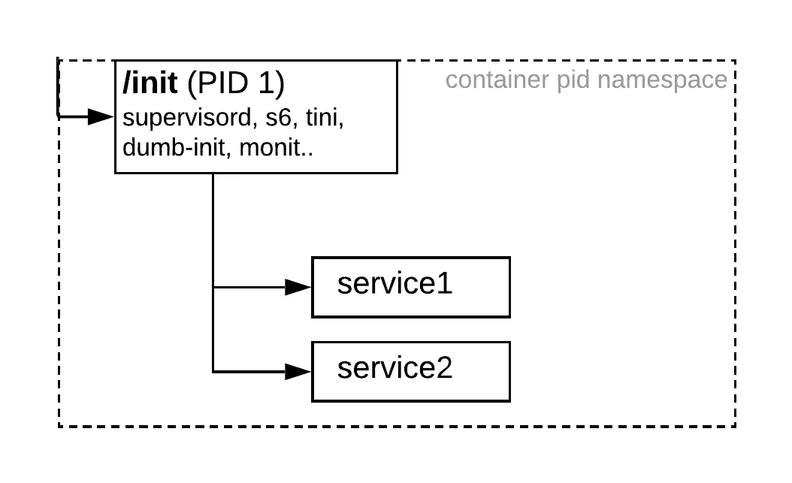

# 为在容器中运行多个进程选择一个 init 进程

> 原文：<https://medium.com/google-cloud/init-process-for-containers-d03a471fa0cc?source=collection_archive---------1----------------------->

如果您正在开发容器，您一定听说过“每个容器一个进程”这句话。从本质上来说，[在一个容器](https://github.com/just-containers/s6-overlay/tree/fca73dc6d74708554702759ac168e5e3fd68662f#the-docker-way)中运行多个进程并没有什么不对，只要你的`ENTRYPOINT`是一个合适的[初始化进程](https://en.wikipedia.org/wiki/Init)。一些用例是让进程互相帮助(例如 sidecar 代理进程)或移植遗留应用程序。



最近，我不得不在一个容器中生成一个 sidecar 进程。Docker 自己的关于在一个容器中运行多个进程的教程[是一个很好的起点，但是还不能投入生产。](https://docs.docker.com/config/containers/multi-service_container/)

所以我[将我的任务](https://twitter.com/ahmetb/status/1149314533040594950)(交给 Twitterverse)外包出去，寻找一个针对容器优化的`init`替代品，它可以:

1.  运行多个子进程，但不要重新启动它们
2.  一旦子进程终止就退出(没有必要重启子进程，让容器崩溃，由 docker 或 Kubernetes 重启)
3.  履行 PID 1 ( `init`进程)职责，如[僵尸小孩收割](https://blog.phusion.nl/2015/01/20/docker-and-the-pid-1-zombie-reaping-problem/)和信号转发
4.  愉快地安装在 docker 文件中并在容器中运行

在本文中，我探讨了一些选项的利弊，例如:

*   超级管理者，
*   [runit](http://smarden.org/runit/) ，
*   [莫尼特](https://mmonit.com/monit/)
*   [蒂尼](https://github.com/krallin/tini) / [哑-初始](https://engineeringblog.yelp.com/2016/01/dumb-init-an-init-for-docker.html)，
*   [s6](https://skarnet.org/software/s6/) ( *观众喜爱的*)，以及
*   [TiNi](https://github.com/krallin/tini)+bash 4 . x combo(*我个人最喜欢的*)。

让我们开始吧:

# 超级监管者

Supervisord 来自我们人类积极管理 Linux 服务器和我们在其上运行的守护进程的时代。与编写 upstart/systemd 脚本来监控服务相比，它给出了一个更高层次的[抽象。](https://www.digitalocean.com/community/tutorials/how-to-install-and-manage-supervisor-on-ubuntu-and-debian-vps)

优点:

*   易于学习和使用的服务配置语言

缺点:

*   在容器映像中需要 Python 运行时(通常不可行)
*   要求您编写一个配置文件(supervisord.conf)
*   当一个被监督的进程终止时，不允许你退出，因为 supervisord 本身是无限期运行的。

# [monit](https://mmonit.com/monit/)

Monit 相当不错，但是它需要一个用相当复杂的 DSL 编写的配置文件，并且它的子进程监督是面向 pidfile 的，这对于我正在尝试做的事情来说是一个大材小用。

优点:

*   小(用 C 编写)，适合捆绑在一个容器图像中

缺点:

*   需要你写一个配置文件
*   通过*用 pidfiles 间隔轮询*来检查儿童健康(而不是通过 SIGCHLD 信号)
*   当进程终止时不允许退出(倾向于重启进程)

runit 是 sysvinit、upstart 或 systemd 等操作系统级进程的合法替代品——对于容器来说，这是一个大材小用。

# [s6](https://skarnet.org/software/s6/) (观众最爱)

随着 s6-overlay 项目及其令人敬畏的文档，我从安德烈·巴兰、乔·米勒、保罗·汀斯利、瓦迪姆·克鲁斯和 T21 那里得到了很多 twitter 回复。以后如何使用这个我会单独写一篇文章。

优点:

*   小(用 C 编写)，适合捆绑在一个容器图像中
*   感谢 [s6-overlay](https://github.com/just-containers/s6-overlay) ，针对 docker 容器图像进行了优化
*   通过创建包含`run`和`finish`脚本的`/etc/services/{name}/`目录来声明服务模型。
*   可以在子进程退出时自行终止

# [tini](https://github.com/krallin/tini) 或[哑初始化](https://engineeringblog.yelp.com/2016/01/dumb-init-an-init-for-docker.html)

[tini](https://github.com/krallin/tini) 和 [dumb-init](https://engineeringblog.yelp.com/2016/01/dumb-init-an-init-for-docker.html) 都是专门为 Docker 容器编写的，因为大多数容器入口点进程(比如 python、java)都不能很好地履行`PID 1`职责。

现在，当您使用`--init`选项执行`docker run`命令时，您的容器的原始入口点将被替换为`tini`，并作为其子进程执行。

优点:

*   小型(用 C 编写)和容器优化
*   经过生产强化，适合在容器中工作

缺点:

*   无法运行多个直接子进程，因为它被设计为只有一个子进程(这是 docker 容器的原始入口点)

# [tini](https://github.com/krallin/tini) + bash 4.x

这不是一个完整的解决方案，但如果您不关心优雅的终止(通过信号转发到孩子)，它可以完成工作。

由于 tini(1)无法单独运行多个子进程，`bash`为我们提供了一个退路:拥有一个 bash 脚本入口点，您可以在后台启动进程，当其中一个后台进程使用 bash 内置`wait -n`(在 bash-4.3 中引入)终止时**立即退出**:

```
#!/usr/bin/env bash
set -e

program1 &
program2 &
wait -n
```

然后在 docker 文件中，修改入口点:

```
ENTRYPOINT ["/bin/tini", "--", "entrypoint.sh"]
```

优点:

*   tini(1)是容器优化和小，处理僵尸收割等。
*   当子进程退出时容易终止(同时保留退出代码)

缺点:

*   没有信号转发:你的容器仍然会退出，但是你失去了优雅终止的机会。
*   您必须编写一个小的定制 bash 脚本 entrypoint 并发布 bash 4.x
*   类似地，当一个子进程终止时，另一个进程不会得到正常的终止通知，因为 bash 会直接退出。

# 结论

我从我发起的 Twitter 帖子中学到了很多关于 init 进程的知识。非常感谢那些参与讨论的人([蒂博尔·瓦斯](https://twitter.com/tiborvass)、[安德烈·巴兰](https://twitter.com/andrej_baran)、[里卡多·卡茨](https://twitter.com/rpkatz)、[乔·米勒](https://twitter.com/miller_joe)、[保罗·汀斯利](https://twitter.com/ptinsley)、[伯克·索尔斯](https://twitter.com/berkulsoy/)和[瓦迪姆·克鲁斯](https://twitter.com/wadimkr)和[文森特·德梅斯特](https://twitter.com/vdemeest))

我希望在一篇新的博客文章中跟进一个使用 [s6-overlay](https://github.com/just-containers/s6-overlay) 在一个容器映像中运行多个流程的例子。

与此同时，请阅读我的新文章:[云运行:在一个容器中运行多个流程(懒惰的方式)](https://ahmet.im/blog/cloud-run-multiple-processes-easy-way/)，它采用了 tini+bash4.x 解决方案。

> [1]理想情况下，您应该真正避免在每个容器中运行多个进程，这是有很多理由的。尤其是在 Kubernetes 上，您应该使用带有多个容器的 pod，这些容器共享同一个 PID 名称空间，并且它们会自动获得一个 init 进程。(又名`pause`容器)。

*原载于 2019 年 7 月 15 日*[*Ahmet . im*](https://ahmet.im/blog/minimal-init-process-for-containers/)*。*