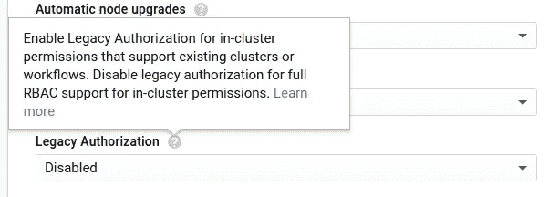

# 谷歌 Kubernetes 引擎(GKE)的首次特权突破—包括头盔

> 原文：<https://medium.com/google-cloud/initial-breakthrough-in-google-kubernetes-engine-gke-bd84d72870e4?source=collection_archive---------1----------------------->

让我们创造一个新的可抢占的 GKE([省点钱吧！！](/google-cloud/using-preemptible-vms-to-cut-kubernetes-engine-bills-in-half-de2481b8e814)美国中部地区**上名为`mytest`的集群:**

```
$ gcloud container clusters create **mytest** --preemptible --cluster-version **1.10.2-gke.3** --zone **us-central1-b**Creating cluster mytest...done.
```

群集将在几分钟后创建。获取有关集群的详细信息:

```
$ gcloud container clusters describe **mytest** --zone **us-central1-b**
```

如果您从 Kubernetes 引擎 UI 创建集群，请获取凭证:

```
$ gcloud container clusters get-credentials **mytest** --zone **us-central1-b**
```

获取`admin`密码:

```
$ gcloud container clusters describe **mytest** | grep password# OPTIONALLY$ gcloud container clusters describe **mytest** --format json | jq -r '.masterAuth.password'
```

为方便起见，导出密码变量

```
$ export GKEPASS=$(gcloud container clusters describe mytest --format json | jq -r '.masterAuth.password')
```

障碍:

## 1.默认命名空间中的签出窗格:

```
kubectl get pods
```

错误:

```
Error from server (Forbidden): pods is forbidden: User "client" cannot list pods in the namespace "default": Unknown user "client"
```

这是因为，对于 GKE 集群，默认情况下会禁用传统授权。因此，我们需要创建基于角色的访问来授予用户权限。因此，我们授予当前用户创建授权角色的能力。



解决方案:

```
$ kubectl create rolebinding **client-user-rolebinding** --clusterrole=admin --user=client --username admin --password *****# OR$ kubectl create rolebinding **client-user-rolebinding** --clusterrole=admin --user=client --username admin --password $GKEPASS
```

现在，我们可以在默认名称空间中获得 pod 和其他组件，但除此之外就没有了。因为`rolebinding`在特定的名称空间内授予角色或集群角色，这里我们没有指定名称空间，所以使用了`default`。

无密码可选方式:

```
kubectl create rolebinding client-user-rolebinding --clusterrole=admin --user=$(gcloud config get-value account)
```

## 2.所有命名空间中的签出窗格:

```
$ kubectl get pods --all-namespaces
```

错误:

```
Error from server (Forbidden): pods is forbidden: User "client" cannot list pods at the cluster scope: Unknown user "client"
```

这是因为用户`client`没有权限访问默认名称空间之外的资源。只有默认名称空间`rolebinding`的用户甚至不能创建名称空间。因此，解决方案是`clusterrolebinding`，它将角色授予整个名称空间。

解决方案:创建`clusterrolebinding`

```
$ kubectl create clusterrolebinding client-admin-crb --clusterrole=admin --user=client --username admin --password ****# OR$ kubectl create clusterrolebinding client-admin-crb --clusterrole=admin --user=client --username admin --password $GKEPASS
```

在 yml 中:

用`kubectl apply -f client-crb.yaml --username admin --password $GKEPASS`涂抹 yml

无需密码:

```
kubectl create clusterrolebinding client-admin-crb --clusterrole=cluster-admin --user=$(gcloud config get-value account)
```

## 舵的授权

初始舵

```
$ helm init$HELM_HOME has been configured at /Users/user/.helm.Tiller (the Helm server-side component) has been installed into your Kubernetes Cluster.
```

`init`命令在 K8s 集群中安装名为 Tiller 的 Helm 服务器端组件，并在$HELM_HOME(默认~/)中设置本地配置。helm/)。可以用`$ kubectl get pods -l name=tiller --namespace=kube-system`检查舵杆舱

让我们创建一个舵图

```
$ helm create mychartCreating mychart
```

安装图表:

```
$ helm install --name myapp mychart/
```

错误:

```
Error: release app failed: namespaces "default" is forbidden: User "system:serviceaccount:kube-system:default" cannot get namespaces in the namespace "default": Unknown user "system:serviceaccount:kube-system:default"
```

解决方案:

```
kubectl create clusterrolebinding default-sa-crb — clusterrole=cluster-admin — serviceaccount=kube-system:default — username admin — password ****
```

现在，你可以走了。但是，更安全的方法是分解角色。为蒂勒提供单独的服务账户:

**升级舵柄**

```
helm init --service-account tiller --upgrade
```

## 清理集群和舵

```
$ helm delete --purge myapp$ gcloud container clusters delete mytest --zone us-central1-b
```