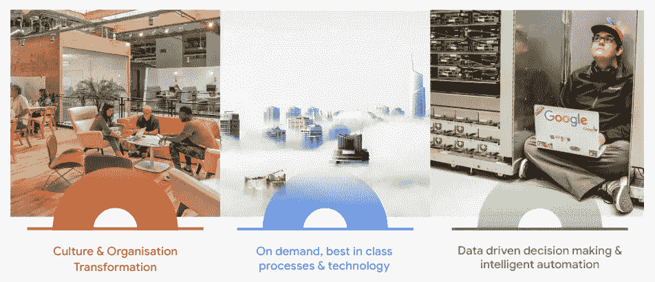
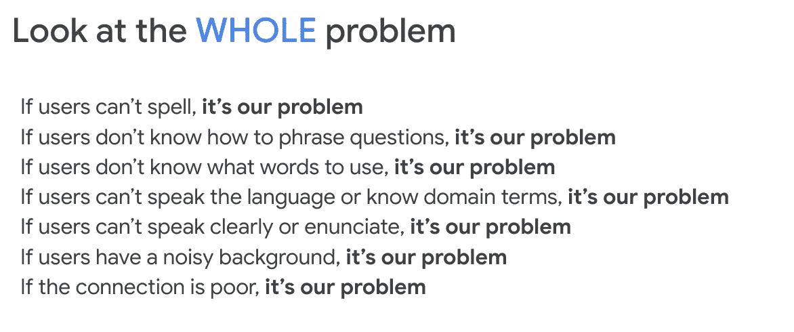
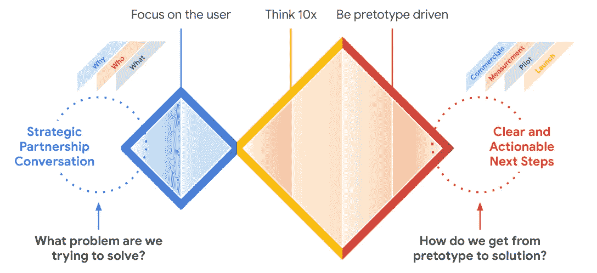

# 利用谷歌云进行创新

> 原文：<https://medium.com/google-cloud/innovating-with-google-cloud-ce4401ec8ab9?source=collection_archive---------2----------------------->

在这篇文章中，我们将看看谷歌的组织代码，并与你分享我们对创新如何工作的了解。我们将指出，每个企业都可以在掌控其公司环境的以下三个方面时挖掘其创新潜力:

*   **文化&组织转型**
*   **技术&工程**重点
*   **数据**驱动决策&智能自动化

我们将解决所有这三个方面，尽管重点将主要放在文化和组织代码上。

*免责声明:我在 Google 的云团队工作。观点是我自己的，而不是我现在雇主的观点。*

我们中的很多人已经开始了解并热爱谷歌搜索。在文本框中输入任何问题，几毫秒后，整个世界的知识都会以你的名义被搜索到，你会得到一个答案。不仅仅是搜索体验的易用性和搜索结果的质量，还有它如何成为如此多人生活中如此重要的一部分，这就是谷歌搜索的非凡之处。

谷歌搜索是谷歌使命宣言的产物:

> “组织全世界的信息，并使其普遍可用”

我们的使命就是创新。大多数公司都有使命宣言，但这一份尤为突出。它设定了一个相当大的目标。

从一开始，谷歌就不是一家传统公司，也从未打算成为一家传统公司。为此，公司采取了不同的管理方式，营造了一种创新、挑战和容忍失败的氛围。但是，**不是谷歌拥有创新，我们都拥有自己的公司环境**。我们的观点是，掌控公司环境，尤其是这三个因素，将使公司经得起未来考验:

*   **组织和文化转型**。在这个充满经济动荡、人才争夺战和黑天鹅事件的世界里，一个重要的现实是，如果没有培养自己的文化和员工在这种环境中以最佳方式运营，任何人都不可能成功。谷歌已经花了数年时间来思考这个问题，并有大量的资源可以分享，以帮助企业。
*   你需要考虑的第二个领域是按需和**同类最佳技术**，评估**工程人才**并培养一个以工程为中心的组织。
*   最后但同样重要的是，让您的组织能够以 twitter 的速度**做出数据驱动的决策**，并在您的人类专家团队中开发使用 AI/ML 执行**智能自动化的方法。**

## 文化和组织转型

“关注用户”和“思考 10 倍，而不是 10%”一直是谷歌文化和组织代码的定义原则。*关注用户，其他一切都会水到渠成自从[出版《我们知道是真的十件事》](https://about.google/philosophy/)以来，这一直是一个主要的指导原则。*

*关注用户本质上意味着关注问题。爱上问题，而不是解决方案。这让你能够采取世界上很少有人能做到的行动。当然，带上你的专业知识，但是要建立伙伴关系，合作以更好地理解问题。
了解解决问题所需的核心能力，为你所缺少的东西招聘员工。突破性的想法不仅仅是技术。是人，是文化。它是工程和组织。
然而，在这个数字世界做出决策的最佳指南针也适用于“旧世界”。**随时问问自己，你的消费者到底想要什么**。我们知道调查和公开的研究可以有所帮助，但它们并不总是显示真相。好消息是，数字和数据可以对此有所帮助。他们可以用实际的用户行为来补充宣称的研究。在数字时代，我们可以看到人们真正在做什么，这是对典型的焦点小组和调查的必要补充。*

*很好。我们现在知道消费者想要什么。但是我们还没有到那一步。我们现在必须采取相应的行动。以下是谷歌产品管理团队的一些实际指南。主要信息是**看待整个问题，整个经历，并拥有它**。所以不要指向其他部门，试着去解决那些看起来不在你控制范围内的事情。*

**

*10X 是我们谷歌创新的核心。这背后的想法是:*

*   *10 倍几乎不会比 10%难 100 倍，回报是 100 倍以上。所以我们已经知道投资回报会更高。*
*   *10 倍实际上更容易，因为它创造了一种视角转换，相对于比你周围的任何人都聪明，这种转换的成本更低。*
*   *10 倍迫使你完全重新思考一个问题。*
*   *10X 意味着没有人能给你解决方案。你必须建造它。*
*   *10X 通过拥有专有技术，让你实质上拥有了一个市场。*
*   *10X 推动重大技术进步。*

*为了培养分享、持续学习和协作的文化，谷歌设计了“ **70/20/10 系统**”。为了促进内部流动性和创造力，每个人都应该把 70%的时间花在自己的核心工作上，20%的时间作为另一个团队的一部分，10%的时间花在他们个人充满激情并认为对谷歌最有利的事情上。*

*我想留给你们的最后一个定义性概念，是我们从广泛的研究中学到的。[早在 2016 年就已经发表的关于谷歌](https://rework.withgoogle.com/print/guides/5721312655835136/)表现最好的团队的定义特征的研究(无论是销售团队、产品开发团队……)我们了解到，表现最好的团队是人们感到安全、敢于冒险的团队。心理安全的**概念**是团队成员持有的共同信念，即团队中的其他人不会因为他们说了出来而为难、拒绝或惩罚他们。*

***借助谷歌云进行创新***

*这种 10 倍思考、关注用户、痴迷于数据和构建突破性技术的组织文化产生了 9 种产品，目前每种产品都有超过 10 亿用户使用，并形成了一个技术堆栈，我们的 Google Cloud 客户也可以用它来推动他们的创新议程。从根本上说，我们认为**云**不应该只是做你一直在做的事情，更便宜更快，而是**推动转型和创新的机会**。*

**

*就像我们的[Google Ventures design sprints](http://www.gv.com/sprint/)一样，我们相信每一种创新方法都受益于**用例或用户驱动**、雄心勃勃，但同时又是**实用的**和目标**具体的成果**，这些成果**会尽快得到实际最终用户的验证**。*

*我们通常与客户一起创新的方式是，通过设计冲刺或研讨会从一个特定的问题开始，将解决方案外推 10 倍。与技术和业务领导者交流，获得更全面的发现视图，并为更广泛的价值工程和业务案例讨论奠定坚实的基础。但是要以预原型为导向，尽快在真实环境中测试你的解决方案，并捕捉用户的反馈和行为。*