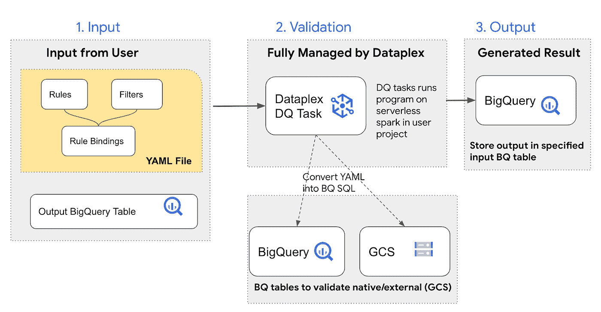
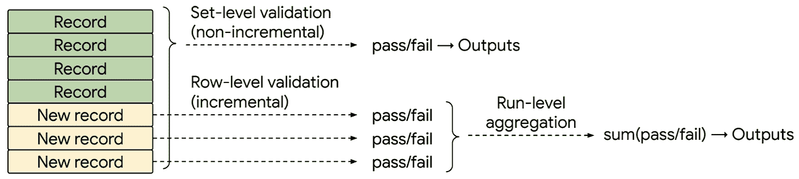

# 在 Google Dataplex 的数据质量任务中

> 原文：<https://medium.com/google-cloud/inside-the-data-quality-task-in-google-dataplex-3fcb960ed247?source=collection_archive---------1----------------------->

# 介绍

*声明:本文中表达的所有观点都是我个人的，仅代表我个人，不代表我现在或以前的雇主。*

对于任何组织来说，数据都是最重要、最有价值的资产之一。数据推动做出明智决策的能力。然而，另一方面，如果数据资产在完整性、准确性和一致性方面不符合预期质量，则可能会对组织产生重大影响，因为这可能会导致不准确的业务决策。当数据资产达到预期的质量并推动整个组织的业务价值时，它就变成了真正的资产。因此，数据质量仍然是数据治理流程最重要的支柱之一，也是任何现代数据平台解决方案的关键方面。

Dataplex 有两个选项来验证和测量数据质量:

*   **数据质量任务**(正式提供)提供可定制的体验，可扩展并完全管理 BigQuery 和 GCS 中的 DQ 验证。它采用了[CloudDQ 开源引擎 。任务在由 Dataplex 管理的无服务器基础设施上按计划运行。](https://github.com/GoogleCloudPlatform/cloud-data-quality)
*   **自动数据质量**(公共预览)使用用户界面驱动的工作流程自动化并简化数据质量定义。它有内置的报告，还通过警报和故障排除来推动行动。

在这篇文章中，我打算介绍**数据质量任务**的架构、构建块和功能，该任务对驻留在不同存储服务(如 BigQuery 表和 GC)上的分布式数据资产进行验证并提供数据质量洞察。

**数据质量任务架构组件:**



上图说明了 DQ 任务的执行，并总结了支持 DQ 验证的输入和输出。

用户定义 DQ 规则和过滤器，并通过规则绑定将它们绑定到数据资产。所有这些都在 DQ 配置(YAML 文件)中捕获。用户还提供了一个大查询表，其中将存储 DQ 结果。DQ 任务规则引擎使用 YAML 定义的 DQ 配置，并使用完全由 Dataplex 管理的无服务器 spark 引擎将其转换为 BigQuery SQL 方言。验证流程利用 BQ compute 来执行 SQL，根据定义的 DQ 规则测量数据资产内容，并将测量的 DQ 输出存储到指定的 BQ 表中。

**Dataplex DQ 任务的显著特点:**

1.  声明性 DQ 规则配置:

*   规则配置以 yaml 文件的形式编写，可以作为任何其他代码库进行管理，并且可以拥有代码版本控制和 CI/CD 流程。
*   对于自定义规则，规则参数化是可能的，可以在规则应用(即规则绑定)时为其声明值。
*   BigQuery SQL 方言可用于定义自定义规则

2.BQ 和 GCS 内部的适当验证:

*   Dataplex DQ 任务通过将规则指令下推到底层服务(比如 BQ)来执行验证处理
*   执行验证过程时，数据不会离开其原始位置。因此没有数据复制过程。

3.异步和无干扰验证

*   Dataplex DQ 任务在异步模式下执行
*   它不会干扰数据处理管道，也不会对经过验证的数据执行任何操作。

4.由 Dataplex 完全管理执行

*   100%无服务器，用户无需调配任何基础架构(计算、存储甚至调度程序)

5.为编程消费设计的终端(持久 BQ 存储和云日志记录接收器)

*   用户可以构建 BI 仪表板，或者以编程方式将结果用于各种数据管理用例

**让我们看一些声明性 DQ 规则配置的例子**

1.  Dataplex DQ 任务规则配置的简单示例:

```
# rules_config.yaml

# define a rule
rules:
 REGEX_VALID_EMAIL:
   rule_type: REGEX
   dimension: conformance
   params:
     pattern: |-
       ^[^@]+[@]{1}[^@]+$

# apply a rule to data
rule_bindings:
 T2_DQ_1_EMAIL:
   entity_id: DQ_TABLE
   column_id: VALUE
   incremental_time_filter_column_id: TS
   rule_ids:
     - REGEX_VALID_EMAIL
```

2.规则参数化示例。

```
# rules_config.yaml

rules:
 SQL_LENGTH_LE:
   rule_type: CUSTOM_SQL_EXPR
   dimension: correctness
   params:
     custom_sql_arguments:
       - N                       # declaring an parameter
     custom_sql_expr: |-
       LENGTH( $column ) <= $N 

# apply a rule to data
rule_bindings:
 CHECK_COLUMN_LENGTH1:
   entity_id: DQ_TABLE1
   column_id: STRING_COLUMN1
   rule_ids:
     - SQL_LENGTH_LE
         N: 50                  # declaring the parameter value

 CHECK_COLUMN_LENGTH2:
   entity_id: DQ_TABLE1
   column_id: STRING_COLUMN2
   rule_ids:
     - SQL_LENGTH_LE
         N: 15                  # declaring the parameter value
```

3.通过 SQL 定制规则的示例

```
FOREIGN_KEY_VALID:
 rule_type: CUSTOM_SQL_EXPR
 dimension: consistency
 params:
   custom_sql_expr: |-
     $column in (select distinct foreign_key from `<dataset-id>.customer_id`)
```

## **让我们深入了解用于构建 DQ 任务验证的重要概念**

# 规则

规则捕获衡量数据资产的标准。它们没有指定应用于哪些特定的数据资产，并且可以在多个数据资产之间重用。基本上规则可以在**行级**或**集合级**应用。

**行级:**

行级规则分别评估数据实体的每一行，并分别报告每一行的验证结果(即，每一行在验证时被分配一个通过/失败结果，然后以汇总格式报告)。

**设置级别:**

集合级规则将一组记录作为一个整体进行评估，并为这组记录返回一个“通过/失败”结果。当前设置级别的规则只能通过自定义 SQL 模板来定义。“记录集”可以定义为:

1.  自上次验证运行以来识别的数据实体中的增量记录(修改的或新的)
2.  在非增量验证的情况下，数据实体中的所有记录(未过滤)

下图说明了不同类型的规则如何应用于经过验证的数据:



规则类型分为

1.  **内置规则类型**(如 NOT_BLANK 或 NOT_NULL 或 REGEX)

*   内置规则类型是在 DQ 引擎中定义的，因此特定于平台的实现对用户是隐藏的。
*   此阶段的所有内置规则类型都在行级别应用

2.**自定义 SQL 模板**(如自定义 _SQL_EXPR 或自定义 _ SQL _ 语句)

*   它允许用户在 BQ SQL 方言中定义任意的 DQ 规则逻辑
*   CUSTOM_SQL_EXPR 应用于行级别，而 CUSTOM_SQL_STATEMENT 应用于集级别

基于定制 sql 模板的行级和集合级规则都提供了一个隐式参数 **$column** ，该参数指示正在验证的列。该参数在规则绑定中被实例化。

以下脚本提供了行级和集合级各种类型规则的示例定义

```
rules:

# Row-level rule based on a built-in rule type
 VALID_ITEM_ID:
   rule_type: REGEX
   params:
     pattern: |-
       [A-Z]{5}[0-9]{15}

# Row-level rule based on a custom sql template
 VALUE_ZERO_OR_POSITIVE:
   rule_type: CUSTOM_SQL_EXPR
   dimension: correctness
   params:
     custom_sql_expr: |-
       $column >= 0

# Set-level rule based on a custom sql template with a single parameter.
 GAP:
   rule_type: CUSTOM_SQL_STATEMENT
   custom_sql_arguments:
     max_gap
   params:
     custom_sql_statement: |-
       with lagged_data as (
         select $column, lag($column) over (order by $column ASC) as prev
         from data
       )
       select $column from lagged_data
       where prev is not null and datetime_diff($column, prev, HOUR) > $max_gap
```

# 过滤

筛选器是可重用的逻辑，它指定验证中应该包括或不包括哪个记录子集。过滤器是单独定义的，并附加到规则绑定中的规则和数据实体。

以下是过滤器定义的示例:

```
row_filters:
 DATA_TYPE_EMAIL:
   filter_sql_expr: |-
     contact_type = 'email'
```

# 数据实体

数据实体是可以查询和验证的 BigQuery 资产，比如表、外部表(数据物理上驻留在 GCS bucket 中)和视图。

DQ 规则适用于单个数据实体。DQ 配置不允许定义适用于多个数据实体的 DQ 规则(如调节规则)。但是，在自定义 SQL 模板中，仍然可以从 DQ 规则中引用多个数据实体。

数据实体对于行级规则是隐式的。对于自定义 SQL 模板，数据实体是通过“数据”源提供的。验证列通过隐式参数$column 提供给自定义 SQL 模板。

Dataplex DQ 任务在将数据实体暴露给 DQ 规则之前，将几个服务功能应用于数据实体:

1.  特定于环境的细节(如项目或数据集)被参数化，这允许跨各种环境轻松部署规则
2.  Dataplex DQ 任务在将数据传递给 DQ 规则进行验证之前，执行一些常见的数据管理操作，如识别增量验证的数据更改或通过将多个验证过程捆绑在一起应用优化。这是对用户透明地执行的。
3.  只有那些通过了用户定义的过滤器的记录才成为数据验证的对象。

# 元数据注册表

Dataplex DQ 任务依赖于描述数据实体的结构元数据来执行验证和各种优化。这种结构化元数据由元数据注册中心提供。下面的脚本中给出了支持的元数据注册

```
#entities yaml metadata registry
entity_id: CUSTOMER_TABLE

#Dataplex metadata registry
entity_uri: dataplex://projects/<project-id>/locations/<region-id>/lakes/<lake-id>/zones/<zone-id>/entities/customer_table

#BigQuery metadata registry
entity_uri: bigquery://projects/<project_id>/datasets/<dataset_name>/tables/customer_table
```

上面提到的开放参数(如 project-id)可以省略，并通过元数据注册默认配置指定，从而允许物理环境抽象。

# 规则绑定

规则绑定定义数据质量规则验证的验证范围。规则绑定捕获以下内容:

1.  规则绑定指定哪些 DQ 规则适用于哪些数据实体。这是一种多对多的关系，单个 DQ 规则可以应用于多个数据实体，而多个 DQ 规则可以应用于单个数据实体。
2.  规则绑定为自定义 SQL 模板规则下指定的所有参数声明值
3.  规则绑定捕获确定增量验证(通过使用增量时间戳列名)或使用用户定义的过滤器的参数。
4.  规则绑定定义了捕获 DQ 验证输出的粒度级别-在每次验证运行下，会为每个规则绑定生成聚合级别的结果。

```
VALIDATE_CUSTOMER:
 # data entity referenced via Dataplex metadata registry URI
 entity_uri: dataplex://projects/<project-id>/locations/<region-id>/lakes/<lake-id>/zones/<zone-id>/entities/customer_table # replace variables in <angle brackets> with your own configs
 column_id: email # validation column
 row_filter_id: DATA_TYPE_EMAIL # user-defined filter
 # set of DQ rules connected to the data entity and validation column specified in current rule binding
 rule_ids:
   - NO_DUPLICATES_IN_COLUMN_GROUPS:
       column_names: "value" # instantiating a parameter defined in the rule
   - NOT_NULL_SIMPLE
```

# 确认

一旦用户指定 DQ 规则配置(规则、过滤器和规则绑定)，Dataplex DQ 任务将根据用户为 Dataplex DQ 任务创建的时间表保持 DQ 输出最新。

对于每个规则绑定，Dataplex DQ 任务生成用于数据验证的 SQL 指令，然后通过**下推**执行将它们提交给底层数据平台(BigQuery)。

下推执行允许在不从底层存储平台提取数据的情况下进行数据验证，从而提高了验证过程的性能和安全性。

# 输出

DQ 输出捕捉 DQ 验证的原始结果。Dataplex DQ 任务将结果存储在指定的 BQ 表中，但不解释这些结果来执行任何操作——这些步骤由用户执行，不在 Dataplex DQ 任务的范围内。

对于每个规则绑定和验证运行，DQ 输出存储在汇总层。

*   对于**行级**规则，DQ 输出捕获每个规则绑定和验证运行中通过或未通过验证的记录总数
*   对于**集合级**规则，DQ 输出为每个规则绑定和验证运行捕获一个二进制的“通过/失败”结果

DQ 输出通过以下通道捕获:

1.  **BigQuery** —发布到用户定义的 DQ 输出表。通常通过对输出内容的程序性轮询(拉取)来推动数据管道和消耗决策制定，或者通过在输出表上建立的 BI 仪表板来消耗。
2.  **云日志** —作为云日志的专用事件类型发布，允许接近实时地交付给消费者。通常由编程订阅(推送)使用，以推动数据管道或 DQ 事件管理工作流。

通过使用这些渠道，用户可以构建 BI 仪表板来可视化 DQ 输出，或以编程方式使用 DQ 输出来推动数据管道步骤、数据使用或 DQ 事件管理。

# 费用

Dataplex 数据质量任务会因使用 BigQuery 和 Dataproc 无服务器(批处理)而产生费用。

*   Dataplex DQ 任务将 YAML 配置文件转换为 BigQuery SQLs，并在用户项目中运行它们，用户项目根据 [BigQuery 定价](https://cloud.google.com/bigquery/pricing)生成成本。
*   Dataplex 使用 Spark 运行预先构建的、由 Google 维护的[开源 CloudDQ](https://github.com/GoogleCloudPlatform/cloud-data-quality) 驱动程序，将 YAML 配置转换为 BigQuery 查询，后者根据 [Dataproc 无服务器定价](https://cloud.google.com/dataproc-serverless/pricing)生成成本
*   在 Dataplex 中安排数据质量任务是免费的。

# Dataplex DQ 任务的主要考虑因素和限制

使用 Dataplex DQ 任务有一些考虑和当前的限制，可能会限制它在高级用例中的适用性。

*   Dataplex 依靠开源的 DQ 引擎— [CloudDQ](https://github.com/GoogleCloudPlatform/cloud-data-quality) —来运行这些检查。用户需要了解 CloudDQ 功能和 CloudDQ YAML 规范。
*   规则说明是一个完全手动的过程。没有自动的规则推理。
*   虽然有 UI 来调度和监控数据质量运行，但是没有 UI 来定义规则(它是通过 yaml 指定的)。
*   目前不支持聚合函数的增量计算，该计算可能支持数据的统计/分析属性的验证(例如标准偏差)
*   目前，DQ 结果以聚合级别报告，要么是根据验证运行时间确定的最后一个数据增量(对于增量验证)，要么是整个数据实体(对于非增量验证)。目前还不能定义自定义边界，以便将经过验证的数据拆分为多个批次进行汇总报告。

# 结论:

Dataplex 数据质量任务可用于为 Google Cloud 上的现代数据平台构建可靠且可扩展的数据质量解决方案。它与其他 GCP 数据服务很好地集成，并使用 100%无服务器机制来执行和调度。它利用了 DQ 规则配置的 YAML 规范语法，这使得代码管理非常容易，并且可以与 CI/CD 管道集成。它建立在一个开源项目([云 DQ](https://github.com/GoogleCloudPlatform/cloud-data-quality) )的基础上，该项目接收社区对改进的反馈。

希望你觉得这篇文章有趣并且有用。快乐学习！！

参考资料:

[https://github . com/Google cloud platform/cloud-data-quality/blob/main/readme . MD](https://github.com/GoogleCloudPlatform/cloud-data-quality/blob/main/README.md)

[https://cloud . Google . com/data plex/docs/data-quality-tasks-overview](https://cloud.google.com/dataplex/docs/data-quality-tasks-overview)