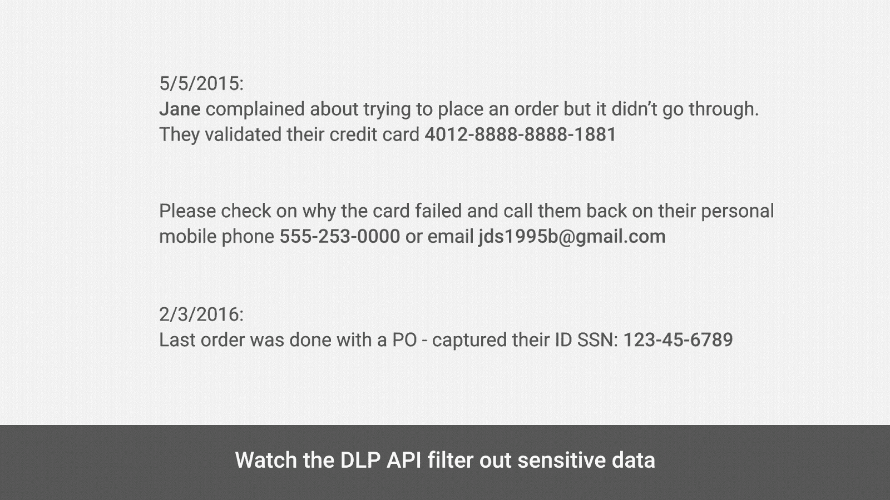
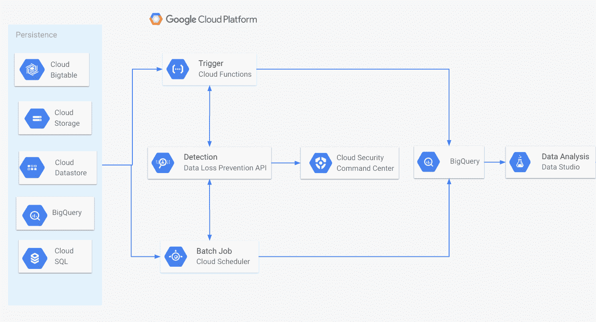
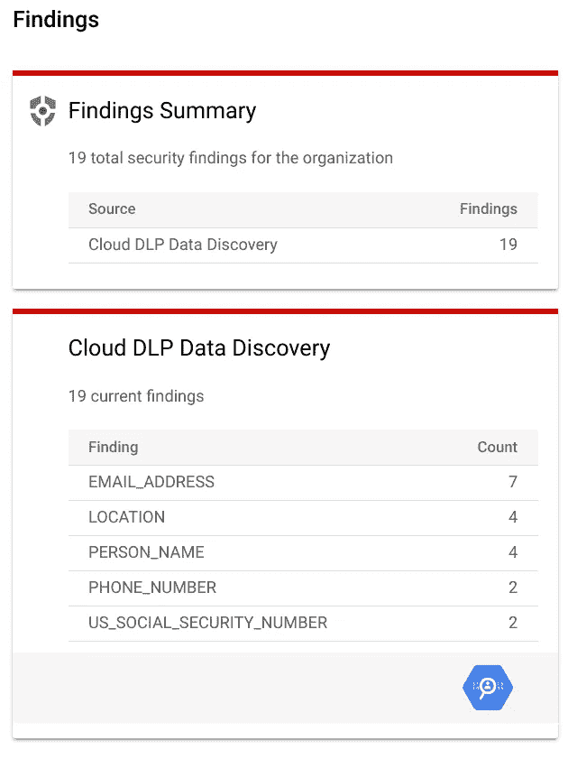
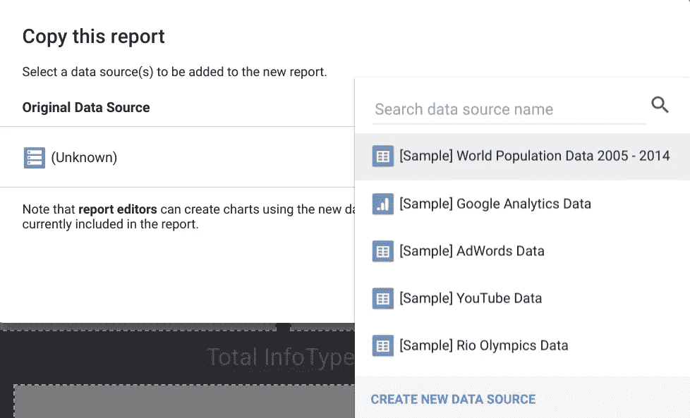
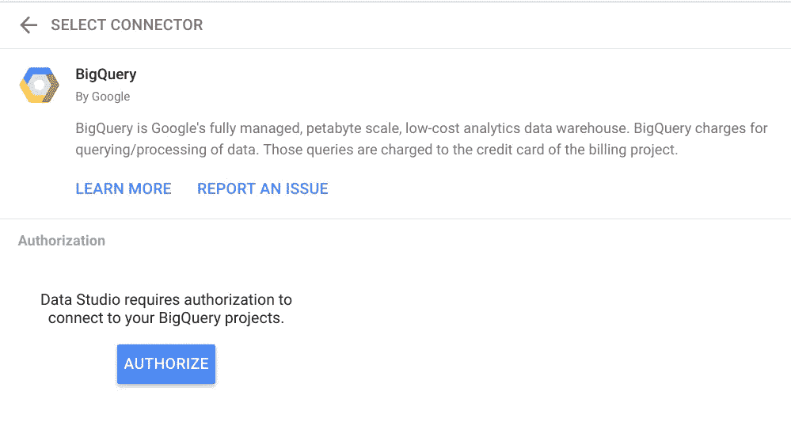
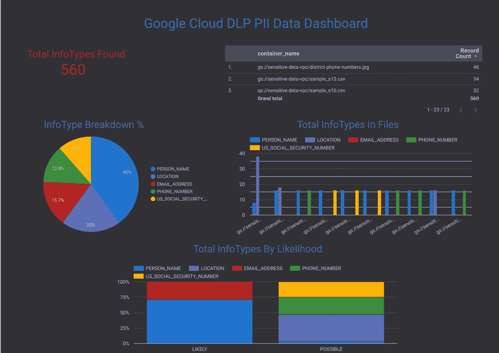

# 使用谷歌云的 DLP API 检查和报告敏感数据

> 原文：<https://medium.com/google-cloud/inspecting-and-reporting-sensitive-data-with-google-cloud-dlp-api-5ec27520c234?source=collection_archive---------0----------------------->

TL；大卫:我是扎克。我是博客新手。让我们使用谷歌云数据丢失防护 API 在您的 GCP 环境中发现并报告 PII。

亲爱的朋友们，欢迎来到我的第一篇博文！在我进入谷歌云的短暂时间里，我每天至少学到一百件新东西。从新的开源技术到以有趣的方式连接谷歌云服务，有时就像从消防水管喝水一样。这有助于我帮助客户创新他们的业务，但仍有许多人好奇云服务能为他们做什么。我希望挖掘我以前作为微积分导师的生活，并传播一些我一路上学到的知识。感谢您成为旅程的一部分！

每个组织都有他们必须保护的敏感数据:从地址和信用卡号到病历和知识产权，不胜枚举。这些类型的信息通常被称为个人身份信息(PII)或受保护健康信息(PHI)。对于拥有这些数据的企业来说，保护网络只是乐趣的一半。如果一个坏演员已经在你的网络中，并开始窥探数据，会发生什么？你需要某种伪装或混淆数据的方法，使未经授权的人无法识别。

**进入防数据丢失 API**

Google Cloud DLP API 是一项帮助用户识别和管理其敏感数据的服务。该 API 拥有超过 90 个预训练的数据分类器，并原生集成到其他 Google 云服务中，如 BigQuery 和云存储。使用混淆技术，我们可以实现以下目标:



我的同事已经有了一个很好的解决方案，那就是[使用云函数](https://cloud.google.com/solutions/automating-classification-of-data-uploaded-to-cloud-storage)建立一个分类管道。在这篇文章中，我想把这个解决方案向前推进一步，展示一旦我们发现敏感数据，我们如何在云安全指挥中心(CSCC)和 Data Studio 中报告我们环境中的敏感数据。

**目标**

*   配置云安全指挥中心以查看调查结果和资产
*   创建 BigQuery 数据集来存储所有 DLP 结果
*   更新您在[分类解决方案](https://cloud.google.com/solutions/automating-classification-of-data-uploaded-to-cloud-storage)中创建的云函数，以推送至 CSCC 和 BigQuery
*   创建 Data Studio dashboard 以显示来自 BigQuery 的 DLP 结果

**什么是云安全指挥中心？**

CSCC 是谷歌云上的一体化安全和风险平台，帮助安全团队收集整个 GCP 组织的数据，以识别威胁并采取行动，以免它们出现在《纽约时报》的头版。CSCC 为您的组织中存在的一切提供资产清单，向您显示 PII 在您的 GCP 环境中的位置，并与第三方工具(如 Redlock、凡赛堤和 Chef)集成，以检测实例漏洞和合规性政策违规。

**什么是 Data Studio？**

Data Studio 提供了利用来自许多不同来源的数据轻松构建交互式仪表板的能力。尽管 DLP API 会向云安全指挥中心报告调查结果，但您很可能不会让每个副总裁或主管都可以访问 GCP 控制台。Data Studio 允许您构建信息仪表板，您可以向更广泛的受众展示这些仪表板，让他们了解云环境中 PII 的当前状态。

**检查和报告管道**



检查/报告管道示例

1.  您将数据上传到云存储、BigQuery 或云数据存储等解决方案。现在，我们将关注云存储
2.  我们调用数据丢失防护 API，通过云调度器作业或每当新数据通过云功能被推送到 GCP 时，按计划检查数据
3.  DLP API 将其发现发送给云安全指挥中心和 BigQuery
4.  我们在 Data Studio 中构建了一个仪表板来展示我们在 BigQuery 中的发现

**配置云安全指挥中心以查看调查结果和资产**

*   按照以下说明 [**此处**](https://cloud.google.com/security-command-center/docs/quickstart-scc#cloud-scc-org-setup) 为您的组织启用云安全指挥中心

*注意:为了调配 CSCC，您需要加入 GCP 组织。您可以在此处* *找到创建组织资源* [*的更多信息，但是如果您对设置组织资源不感兴趣，请随意跳到下一节。*](https://cloud.google.com/resource-manager/docs/quickstart-organizations)



CSCC DLP 概述示例

**创建 BigQuery 数据集以存储所有 DLP 结果**

*   打开 [**BigQuery UI**](https://console.cloud.google.com/bigquery)
*   在*资源*下，选择您的项目 ID，然后选择*创建数据集*
*   将数据集 ID 设置为 **dlp_findings** ，保留其他默认设置，并点击*创建数据集*

*注意:默认情况下，BigQuery 将在美国创建数据集*。

DLP API 会将所有结果发送到该数据集中的表中。对于这个例子，我们将为每个 GCP 项目使用一个 BigQuery 表，但是为每个文件夹使用一个表也是有意义的。

**更新您在** [**中创建的云函数分类解决方案**](https://cloud.google.com/solutions/automating-classification-of-data-uploaded-to-cloud-storage) **推送到 CSCC 和 BigQuery**

一旦您完成了分类解决方案，请重新访问您创建的云函数，并用这个更新的[版本](https://github.com/zsais/gcp-dlp/blob/master/classify_dlp.py)替换代码。让我们浏览一下我的更新:

```
PROJECT_ID = ‘[PROJECT_ID_FOR_DLP_FINDINGS]’DATASET_ID = ‘[DATASET_ID_FOR_DLP_FINDINGS]’TABLE_ID = ‘[TABLE_ID_FOR_DLP_FINDINGS]’
```

我们将在这里设置在上一节中创建的 BigQuery 数据集和表的位置。我们所有的发现都会放在这里。

```
{ 
  ‘save_findings’: { 
    ‘output_config’: { 
      ‘table’: { 
        ‘project_id’: PROJECT_ID,
        ‘dataset_id’: DATASET_ID, 
        ‘table_id’: TABLE_ID 
      }
    }
  }
}, { 
  ‘publish_summary_to_cscc’: {} 
}
```

这是我们添加新操作的地方，以将我们的 DLP 发现推送到 CSCC 和 BigQuery。

您可以选择自己进行的其他更新可能是扩大我们的搜索半径，并在 *INFO_TYPES 中添加类型*'****ALL _ BASIC '****。**

*保存更新后，让我们将相同的文件发送到隔离区，以启动云功能触发器。*

***创建 Data Studio 仪表盘，展示 BigQuery 的 DLP 调查结果***

*既然我们已经扫描了我们的数据并将我们的发现存储在 BigQuery 中，那么最好能够可视化我们环境中存在的东西。我们可以在 Data Studio 中创建一个仪表板来实现这一点。*

*   *导航到 [***此链接***](https://datastudio.google.com/open/1apyxLx38mMtYqfed68QOA95g-ZFrG6CQ) 以查看我的示例仪表板。从工具栏中选择复制图标，如下所示。*

**

**注意:如果这是你第一次使用 Data Studio，你会被要求在继续之前点击一个协议。**

*接下来，我们将选择新的数据源，即新创建的包含 DLP 结果的 BigQuery 表。*

*点击下拉菜单并选择*创建新的数据源*。*

**

*搜索 *BigQuery* 并授权连接器。*

**

*选择存储 DLP 结果的 BigQuery *项目、数据集、*和*表*。点击*连接，添加到报告，*和*复制报告*完成仪表板的创建。*

*我们现在应该有一个 DLP 结果的漂亮图形表示，我们可以随意编辑。*

**

*谁知道寻找 PII 会如此有趣？*

*概括地说，我们讨论了发现环境中的 PII/PHI 为何如此重要，比较了 CSCC 和 Data Studio 仪表盘之间的差异，并修改了用于自动分类数据的[解决方案指南](https://cloud.google.com/solutions/automating-classification-of-data-uploaded-to-cloud-storage)代码，以将 DLP 发现发送给 BigQuery 和云安全指挥中心。请记住，这只是企业在云中保护数据所必须做的一点尝试。为了扩展这一功能，我们不得不加入管道自动化(通过 Terraform、Ansible 等)、IAM/资源策略管理(通过凡赛堤、Redlock 等)等，以确保整个组织有一个安全且可重复的流程，并使用混淆技术来掩饰我们可能存储在云中的 PII。视察愉快！*