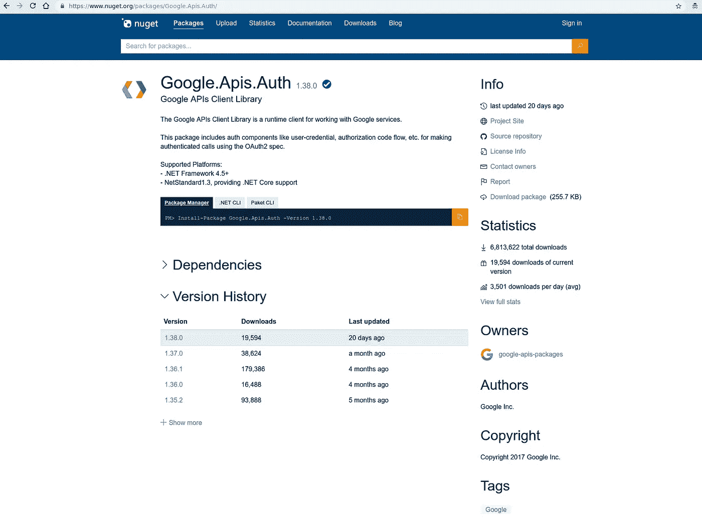

# 免费安装。使用谷歌云的网络

> 原文：<https://medium.com/google-cloud/install-free-net-w-google-cloud-74aacba8bcd0?source=collection_archive---------3----------------------->

**爱上容器**

有些语言，你可以开始写代码，构建|运行代码，然后你马上就可以开始比赛了，比如 Golang，Python，JavaScript。

还有一些语言，你需要花很多时间记住所有需要的基础设施，然后才能开始构建|运行代码，例如 Java 和. NET。

我想用 Google API 客户端库来帮助一个被一些 C#代码难住的开发者。我不愿意尝试重新提出这个问题，因为获得. NET 运行时的感觉(比实际情况更糟)。

拯救集装箱:

```
docker run \
--rm \
--interactive \
--tty \
--volume=$PWD/dotnet:/dotnet \
--volume=$PWD/images:/images \
--volume=$PWD/secret:/secret \
--workdir=/dotnet \
microsoft/dotnet:2.2-sdk \
dotnet watch run
```

这个超级有用！我能够非常快速地重建一个. NET 项目(我认为可能有一种更简单的方法来完成这个项目)，然后敲入`Program.cs`并开始运行。

## 设置

让我们可爱一点，用 F#写“你好弗雷迪”(。NET==。网)。创建一个名为`fsharp`的目录，并在其中创建`Program.fs`:

```
open System[<EntryPoint>]
let main argv =
    printfn "Hello Freddie!"
    0 // return an integer exit code
```

在同一个目录中，创建一个名为`fsharp.fsproj`的解决方案:

```
<Project Sdk="Microsoft.NET.Sdk"><PropertyGroup>
    <OutputType>Exe</OutputType>
    <TargetFramework>netcoreapp2.2</TargetFramework>
  </PropertyGroup><ItemGroup>
    <Compile Include="Program.fs" />
  </ItemGroup></Project>
```

> **注意**太聪明了…对于 F#你将需要`<ItemGroup>`和`<Compile Include...>`的值。这些对于 C#来说都不是必须的。

## 观察-运行它

```
docker run \
--rm --interactive \
--tty \
--volume=**$PWD/fsharp**:/dotnet \
--workdir=/dotnet \
microsoft/dotnet:2.2-sdk \
dotnet watch runwatch : Polling file watcher is enabled
watch : Started
**Hello Freddie!**
watch : Exited
watch : Waiting for a file to change before restarting dotnet...
```

`watch`允许您更改`Program.cs`，保存它，并动态地重新构建和运行项目。不错！

## 退后一步

我随后意识到`dotnet`图像也将为我们创建项目结构。对于我们的根目录:

```
docker run \
--rm \
--interactive \
--tty \
--volume=**$PWD**:/dotnet \
--workdir=/dotnet \
microsoft/dotnet:2.2-sdk \
dotnet new console -lang **F#** -o fsharp
```

或者:

```
docker run \
--rm \
--interactive \
--tty \
--volume=**$PWD**:/dotnet \
--workdir=/dotnet \
microsoft/dotnet:2.2-sdk \
dotnet new console -lang **C#** -o csharp
```

## Google API 客户端库

要编写利用 Google API 客户端库(和任何其他 Nuget 包)的代码，我们需要将相关的包添加到我们的项目中。`dotnet`图像也支持这一点:

```
... dotnet add package Google.Apis.Auth --version 1.38.0
... dotnet add package Google.Apis.Drive.v3 --version 1.38.0.1491
```

> **注意**为了简洁，我省略了这些命令的`docker run ...`前导。您只需要确保指定了正确的卷映射；对于您希望添加库的项目。

或者，您可以手动引用项目文件中的库。例如，要将 Google 的 Auth API 添加到 F#项目中:

```
<Project Sdk="Microsoft.NET.Sdk"><PropertyGroup>
    <OutputType>Exe</OutputType>
    <TargetFramework>netcoreapp2.2</TargetFramework>
  </PropertyGroup><ItemGroup>
    <Compile Include="Program.fs" />
  </ItemGroup>**<ItemGroup>
    <PackageReference Include="Google.Apis.Auth" Version="1.38.0" />
</ItemGroup>**</Project>
```

如果你看了我以前的帖子"[入门。NET 上的 GCP 库](/@DazWilkin/getting-started-w-net-on-gcp-b56c4e00fa69)，您会记得我们可以在 Nuget repo 中搜索所有这些库，包括`[Google.Apis.Auth](https://www.nuget.org/packages/Google.Apis.Auth/)`:



Nuget:谷歌。Apis . Auth

图像支持`restore`、`build`、`run`和我在上面一直使用的`watch run`命令。

## OAuth

一个小小的，默默无闻的(！？)所记录的技巧是，默认的 OAuth 流启动浏览器，以便捕获认证码。跑步的时候。净在一个容器中，这种流动可能会中断。

另一个流程是提示用户访问一个 URL，将代码复制并粘贴回代码中。这是可行的，我推荐这种方法。

常见的流程是:

```
credential = await GoogleWebAuthorizationBroker.AuthorizeAsync(
    GoogleClientSecrets.Load(stream).Secrets,
    Scopes,
    "user",
    CancellationToken.None,
    new FileDataStore("DriveUploader.ListMyLibrary")
);
```

提示用户访问 URL 并复制代码的流程是一个非常小的变化:

```
credential = await GoogleWebAuthorizationBroker.AuthorizeAsync(
    GoogleClientSecrets.Load(stream).Secrets,
    Scopes,
    "user",
    CancellationToken.None,
    new FileDataStore("DriveUploader.ListMyLibrary"),
    **new PromptCodeReceiver()**
);
```

**结论**

如果你像我一样懒，并在安装的前景呻吟。NET 开发代码，别担心！容器有助于软件安装，微软在这方面做得很好，提供了一个映像，节省了大量工作。

## 整理

当你完成了。NET 运行时:

```
docker image rm microsoft/dotnet:**2.2-sdk**
```

> **NB** 标签会随着 SDK 版本变化。