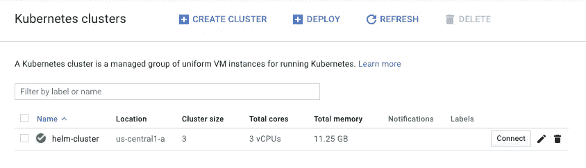
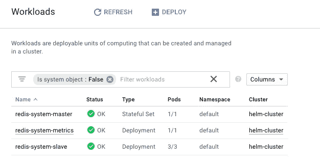

# 在 Google Kubernetes 引擎中安装 Helm(GKE)

> 原文：<https://medium.com/google-cloud/installing-helm-in-google-kubernetes-engine-7f07f43c536e?source=collection_archive---------0----------------------->

当我第一次真正开始进入 Kubernetes 时，我会去寻找各种必要程序的 docker 映像，并围绕它们的代码创建一个模板文件。这很简单，看起来是个不错的选择。根据你的需要，这是一个很好的方向。

然而，随着时间的推移，我会继续阅读关于[掌舵](https://helm.sh/)的内容，并看到我为其创建模板的一些应用程序已经以[掌舵图](https://docs.helm.sh/developing_charts)的形式创建了非常好的模板。意识到这一点——我是一个懒惰的开发人员，想要提高我的开发速度——是时候学习 Helm 了！


Helm 对您的 Kubernetes 开发做了这些

# 什么是头盔？这对我有什么好处？

首先，如果你还没有阅读大量关于赫尔姆的文章，这里是你需要知道的关于赫尔姆的所有内容。Helm 是 Kubernetes 的软件包经理。如果你来自任何语言国家(并且喜欢字谜游戏),这里有一些你能与之相关的东西。

> **NodeJS** 之于 **Kubernetes** 如同 **NPM** 之于**掌舵人！**
> 
> **红宝石**之于 **Kubernetes** 如同**宝石**之于**掌舵人！**
> 
> **雨燕**之于**库伯内特**如同**椰子**之于**舵手！**
> 
> **Java** 之于 **Kubernetes** 如同 **Maven** 之于**掌舵人！**

我可以继续下去，这种比较并不完美，但你应该明白。基本上，Helm 不需要制作可共享的打包模板文件，这些文件可以很容易地放到其他 Kubernetes 集群中，而不需要太多的工作。这是你和你的时间的一个大胜利。你将会听到一些你需要知道的术语:

> **舵轮图**是一个舵轮包。这是如何把你的可发布包放在一起的图表或“说明”。
> 
> **Tiller** 是一个服务器，只要你安装了 Helm，它就会在你的 Kubernetes 集群中运行。蒂勒管理你的舵图表的安装。当 Tiller 代表您将容器安装到 Kubernetes 集群中时，这个过程的安全性应该是您的重中之重。

一旦在 Kubernetes 集群中安装了 Helm 并且一切正常，您就可以用一行代码添加大的功能。

## 想要在您的 Kubernetes 集群中使用 Redis(或其他任何东西)吗？

```
**helm install stable/redis**
```

嘣！Redis 安装带有一个主/从配置，用于可伸缩性和持久性卷，甚至还有一个 [Prometheus](https://prometheus.io/) 度量导出器。

你想要[更多的选择](https://github.com/helm/charts/tree/master/stable)？ [Wordpress](https://github.com/helm/charts/tree/master/stable/wordpress) [大三角帆](https://github.com/helm/charts/tree/master/stable/spinnaker)？ [Sonarqube](https://github.com/helm/charts/tree/master/stable/sonarqube) ？ [PhpBB](https://github.com/helm/charts/tree/master/stable/phpbb) ？ [Mysql](https://github.com/helm/charts/tree/master/stable/mysql) ？[詹金斯](https://github.com/helm/charts/tree/master/stable/jenkins)？ [Drupal](https://github.com/helm/charts/tree/master/stable/drupal) ？是的，那里有很多供你欣赏。

# 我被卖了！如何将 Helm 安装到我的 Kubernetes 集群中？！

太好了！是时候开始讨论代码和安装脚本了。将 Helm 安装到 Kubernetes 集群时，有两个方向可以选择。第一种是相当普通的安装，它为您提供了所有的基本功能，但可能不如您对生产集群所期望的那样安全。使用 TLS 锁定你的舵杆与舵杆的连接，第二种方法会更安全。在本文的剩余部分，我们将看看如何进行基本安装。如果您已经有一个非常锁定的 Kubernetes 集群，或者如果您在 [MiniKube](https://github.com/kubernetes/minikube) (又名，非生产)中运行您的 Kubernetes 集群，这种安装是最好的。

在我的下一篇文章中，我将特别关注用 TLS 安装 Helm，因为这有点复杂。说实话，Helm 确实有非常好的安装过程文档，但是事情并不总是像文档承诺的那样。因此，我将添加一些让我慢下来的经验教训，这样你就不会遇到同样的问题。

*更新:我发表了第二篇文章！*

[](/@jonbcampos/install-secure-helm-in-gke-254d520061f7) [## 在 GKE 安装安全头盔

### 在我的上一篇文章中，我谈了很多关于 Helm 的乐趣，以及为什么你应该花时间把它安装到你的…

medium.com](/@jonbcampos/install-secure-helm-in-gke-254d520061f7) 

*如果你还没有通读或者甚至没有读过本系列* *的第一部分* [*，你可能会迷路，对代码在哪里或者之前做了什么有疑问。记住这里假设你正在使用*](/@jonbcampos/kubernetes-day-one-30a80b5dcb29) [*GCP*](https://cloud.google.com/) *和*[*GKE*](https://cloud.google.com/kubernetes-engine/)*。我将始终提供代码和如何测试代码是按预期工作。*

[](/google-cloud/kubernetes-day-one-30a80b5dcb29) [## Kubernetes:第一天

### 这是 Kubernetes 帖子的必选步骤之一。如果你对 Kubernetes 感兴趣，你可能已经读过 100 本了…

medium.com](/google-cloud/kubernetes-day-one-30a80b5dcb29) 

# 首先，创建您的 Kubernetes 集群

要将 Helm 安装到您的 Kubernetes 集群中，您首先需要一个 Kubernetes 集群。我创建了一些脚本来简化这个过程，因为创建集群不是本文的目的。如果您转到 Google Cloud Shell 脚本，您可以输入以下命令为 Helm 创建一个 Google Kubernetes 集群。

```
$ git clone [https://github.com/jonbcampos/kubernetes-series.git](https://github.com/jonbcampos/kubernetes-series.git)
$ cd [~/kubernetes-series/helm/scripts](https://github.com/jonbcampos/kubernetes-series/tree/master/helm/scripts)
$ sh [startup.sh](https://github.com/jonbcampos/kubernetes-series/blob/master/helm/scripts/startup.sh)
```

这将需要一段时间来完成，但当您完成后，您将有一个 Kubernetes 集群准备就绪并等待。



你闪亮的新 Kubernetes 集群

# 第二，安装头盔

随着您的 Kubernetes 集群的启动和运行，您可以开始添加头盔。下面你会看到添加一个非常基本的头盔安装到 GKE 的实际脚本(带注释)。

```
#!/usr/bin/env bash

echo "install helm"
# installs helm with bash commands for easier command line integration
**curl https://raw.githubusercontent.com/kubernetes/helm/master/scripts/get | bash**
# add a service account within a namespace to segregate tiller
**kubectl --namespace kube-system create sa tiller**
# create a cluster role binding for tiller
**kubectl create clusterrolebinding tiller \
    --clusterrole cluster-admin \
    --serviceaccount=kube-system:tiller** 
echo "initialize helm"
# initialized helm within the tiller service account
**helm init --service-account tiller**
# updates the repos for Helm repo integration
**helm repo update**

echo "verify helm"
# verify that helm is installed in the cluster
**kubectl get deploy,svc tiller-deploy -n kube-system**
```

既然您已经看到了必要的代码，您可以偷懒，只运行一个脚本来为您完成安装。

```
$ cd [~/kubernetes-series/helm/scripts](https://github.com/jonbcampos/kubernetes-series/tree/master/helm/scripts)
$ sh [add_helm.sh](https://github.com/jonbcampos/kubernetes-series/blob/master/helm/scripts/add_helm.sh#L1-L21)
```

你会看到所有的东西都在你的 Shell 控制台上快速运行，但是最后你会看到下面几行，显示 Helm 已经安装完毕。

```
NAME                   DESIRED   CURRENT   UP-TO-DATE   AVAILABLE   AGE
deploy/tiller-deploy   1         1         1            0           1s

NAME                TYPE        CLUSTER-IP      EXTERNAL-IP   PORT(S)     AGE
svc/tiller-deploy   ClusterIP   10.11.244.223   <none>        44134/TCP   1s
```

你甚至可以通过运行一个基本的 Helm 命令来进行双重检查，并查看输出。

```
$ [**h**](https://github.com/jonbcampos/kubernetes-series/blob/master/helm/scripts/add_helm.sh#L1-L21)**elm ls** # empty result as we haven't installed anything
```

# 第三，安装图表

现在装上头盔，让我们使用它！在接下来的脚本中，我们将把 Redis 安装到我们的 Kubernetes 集群中，使用 Redis 图表维护者推荐的一些生产值。

```
$ **helm install stable/redis \
    --values values/values-production.yaml \
    --name redis-system**
```

这只需要一点时间，但是我们可以看到通过运行以下命令成功部署了 Redis 图表。

```
$ [**h**](https://github.com/jonbcampos/kubernetes-series/blob/master/helm/scripts/add_helm.sh#L1-L21)**elm ls**
NAME            REVISION        UPDATED                         STATUS          CHART           NAMESPACE
redis-system    1               Thu Aug  9 11:02:23 2018        DEPLOYED        redis-3.7.5     default
```

如果我们给 pod 一点时间来完全启动，您可以返回到您的`Kubernetes > Workloads`视图，看到 pod 已经准备好与它们进行交互。



您在 GKE 安装的 Redis 工作负载

就是这样！一个生产质量的 Redis 实例已经安装完毕，可以立即进行开发。这是巨大的！多亏了库伯内特和舵图。

# 利润！

Helm 可以通过命令行界面做的事情更多。这篇文章并不打算成为掌舵知识的概要，而是一个让你开始掌舵之旅的起点。我将给出一些快速命令，尽管我发现这些命令比`install`命令更有用。

```
**helm search**
```

允许您通过名称在 Helm Repo 的图表中搜索图表。只是一个快速找到你的方法。

```
**helm list**
```

正如我们所见，这将列出 Helm 管理的 Kubernetes 集群中的部署。

```
**helm delete**
```

将从您的 Kubernetes 集群中删除一个舵图。

```
**helm rollback**
```

将回退升级到你的舵图表到以前的图表。如果升级有意想不到的后果，这非常有用。

完整的命令列表可以在找到。

# 结论

就这样，你有了使用 Helm 和 Google Kubernetes 引擎的基本知识。我已经准备好了本系列的下一部分，来探讨如何用 TLS 来保护你的头盔安装。从这些文件、我自己的努力以及网上围绕这个主题的大量问题来看，我可以假设这里的更多帮助将有益于每个人。

现在继续前进，并确保分享您的反馈！

# 拆卸

在您离开之前，请确保清理您的项目，这样您就不会为您用来运行群集的虚拟机付费。返回到云 Shell 并运行 teardown 脚本来清理您的项目。这将删除您的集群和我们构建的容器。

```
$ cd [~/kubernetes-series/helm/scripts](https://github.com/jonbcampos/kubernetes-series/tree/master/helm/scripts)
$ sh [teardown.sh](https://github.com/jonbcampos/kubernetes-series/blob/master/helm/scripts/teardown.sh)
```

# 本系列的其他文章

[](/@jonbcampos/install-secure-helm-in-gke-254d520061f7) [## 在 GKE 安装安全头盔

### 在我的上一篇文章中，我谈了很多关于 Helm 的乐趣，以及为什么你应该花时间把它安装到你的…

medium.com](/@jonbcampos/install-secure-helm-in-gke-254d520061f7) [](/@jonbcampos/kubernetes-running-background-tasks-with-batch-jobs-56482fbc853) [## Kubernetes:使用批处理作业运行后台任务

### 当构建令人惊叹的应用程序时，有时您可能想要处理用户之外的动作…

medium.com](/@jonbcampos/kubernetes-running-background-tasks-with-batch-jobs-56482fbc853) [](/google-cloud/kubernetes-run-a-pod-per-node-with-daemon-sets-f77ce3f36bf1) [## Kubernetes:用守护进程集在每个节点上运行一个 Pod

### 我最初给这篇文章起的标题只是“守护进程集”,并假设它足以抓住要点…

medium.com](/google-cloud/kubernetes-run-a-pod-per-node-with-daemon-sets-f77ce3f36bf1) [](/google-cloud/kubernetes-cron-jobs-455fdc32e81a) [## 库伯内特:克朗·乔布斯

### 有时候你的工作不是事务性的。我们不再等待用户点击按钮让系统亮起来…

medium.com](/google-cloud/kubernetes-cron-jobs-455fdc32e81a) [](/google-cloud/kubernetes-dns-proxy-with-services-d7d9e800c329) [## Kubernetes:带服务的 DNS 代理

### 构建应用程序时，通常需要与外部服务进行交互来完成业务…

medium.com](/google-cloud/kubernetes-dns-proxy-with-services-d7d9e800c329) [](/google-cloud/kubernetes-routing-internal-services-through-fqdn-d98db92b79d3) [## Kubernetes:通过 FQDN 路由内部服务

### 我记得当我第一次进入 Kubernetes 时。一切都是崭新的、闪亮的、有规模的。当我继续的时候…

medium.com](/google-cloud/kubernetes-routing-internal-services-through-fqdn-d98db92b79d3) [](/google-cloud/kubernetes-liveness-checks-4e73c631661f) [## Kubernetes:活性检查

### 最近，我整理了一篇关于 Kubernetes 就绪性调查以及它对您的集群有多重要的文章…

medium.com](/google-cloud/kubernetes-liveness-checks-4e73c631661f) [](https://itnext.io/kubernetes-readiness-probe-83f8a06d33d3) [## Kubernetes:就绪探测

### 如果对这个特性有任何疑问，我写这篇文章是为了说明这不是一个…

itnext.io](https://itnext.io/kubernetes-readiness-probe-83f8a06d33d3) [](/google-cloud/kubernetes-horizontal-pod-scaling-190e95c258f5) [## Kubernetes:水平 Pod 缩放

### 通过 Pod 自动扩展，您的 Kubernetes 集群可以监控现有 Pod 的负载，并确定我们是否需要更多…

medium.com](/google-cloud/kubernetes-horizontal-pod-scaling-190e95c258f5) [](/google-cloud/kubernetes-cluster-autoscaler-f1948a0f686d) [## Kubernetes:集群自动缩放

### 自动缩放是 Kubernetes 的一个巨大的(并且已经上市的)特性。当你的网站/应用程序/应用程序接口/项目变得越来越大时，洪水…

medium.com](/google-cloud/kubernetes-cluster-autoscaler-f1948a0f686d) [](/google-cloud/kubernetes-day-one-30a80b5dcb29) [## Kubernetes:第一天

### 这是 Kubernetes 帖子的必选步骤之一。如果你对 Kubernetes 感兴趣，你可能已经读过 100 本了…

medium.com](/google-cloud/kubernetes-day-one-30a80b5dcb29) 

问问题？反馈？我很想听听你可能会遇到什么问题，或者这是否有助于你更好地理解。如果我错过了什么，也可以随意分享。我们都在一起！

[Jonathan Campos](http://jonbcampos.com/) 是一个狂热的开发者，喜欢学习新事物。我相信我们应该不断学习、成长和失败。我总是开发社区的支持者，并且总是愿意提供帮助。因此，如果你对这个故事有任何问题或意见，请在下面提出。在 [LinkedIn](https://www.linkedin.com/in/jonbcampos/) 或 [Twitter](https://twitter.com/jonbcampos) 上与我联系，并提及这个故事。