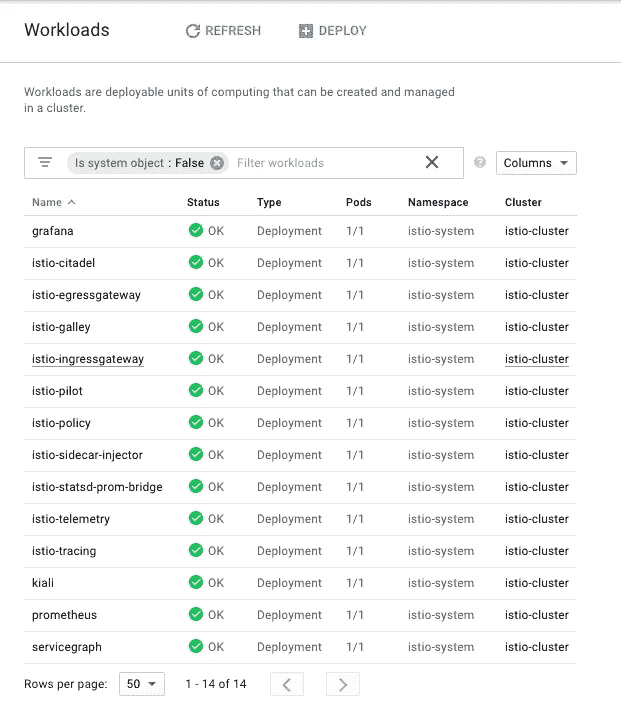

# 在 Google Kubernetes 引擎上安装 Istio(GKE)

> 原文：<https://medium.com/google-cloud/installing-istio-on-google-kubernetes-engine-gke-bd18e3781b88?source=collection_archive---------1----------------------->


Istio + Kubernetes + Google 云平台

Istio 是这个街区新的酷小子。嗯，这是新的酷小子在街上的街区，所有的房子刚刚开始建造。很新，真的很新。更好的是，它刚刚达到 1.0！

## Istio 是什么？我为什么要在乎？

您应该关心，因为 Istio 为您的 Kubernetes 集群添加了许多您想要的功能。然而，如果你不知道 Istio 是什么或者为什么你应该关心它，我建议你去看看 Istio 的官方文档。他们做了一项了不起的工作，用你能理解的真实术语把一切都拼写出来。

 [## Istio 是什么？

### 云平台为使用它们的组织提供了大量的好处。然而，不可否认的是…

istio.io](https://istio.io/docs/concepts/what-is-istio/) 

假设你读过 Istio 或者已经知道它的重要性，让我们来关注这篇文章的目的，如何在 Google Kubernetes 引擎上安装 Istio。我说现在，是因为谷歌云的人正在努力创建 Istio 的托管实例。当它出现时，很可能只需要一两个命令，您就可以将 Istio 添加到已经运行的 Kubernetes 集群中，并获得一些好处。

现在，让我们看看将 Istio 集成到 Google Kubernetes 引擎(GKE)的最简单的方法。

*如果你不确定 Kubernetes 是什么，为什么它很重要，或者刚刚开始使用 Kubernetes，这篇文章不适合你。我建议去看看我在谷歌云平台(GCP)和 GKE 上的其他帖子。*

[](/google-cloud/kubernetes-day-one-30a80b5dcb29) [## Kubernetes:第一天

### 这是 Kubernetes 帖子的必选步骤之一。如果你对 Kubernetes 感兴趣，你可能已经读过 100 本了…

medium.com](/google-cloud/kubernetes-day-one-30a80b5dcb29) 

# 设置您的 Kubernetes 环境

我们需要做的第一件事是在你的谷歌云项目中设置一个 Kubernetes 集群。正如我写的其他文章一样，我创建了一些脚本，您可以在您的 Google Shell 环境中运行这些脚本，使这个过程变得超级轻松。下面的命令将[创建一个新的 Kubernetes 集群](/google-cloud/kubernetes-day-one-30a80b5dcb29)，然后[使用 TLS](/google-cloud/installing-helm-in-google-kubernetes-engine-7f07f43c536e) 将 Helm/Tiller 安装到您的 Kubernetes 集群中。

```
$ git clone [https://github.com/jonbcampos/istio-series.git](https://github.com/jonbcampos/istio-series)
$ cd [~/istio-series/getting-started/scripts](https://github.com/jonbcampos/istio-series/tree/master/getting-started/scripts)
$ sh [startup.sh](https://github.com/jonbcampos/istio-series/blob/master/getting-started/scripts/startup.sh)
$ sh [add-helm.sh](https://github.com/jonbcampos/istio-series/blob/master/getting-started/scripts/add-helm.sh)
```

如果您对我们如何设置这些文件有疑问，我已经包含了解释这些步骤的其他文章的链接以及这些文件中代码的链接。同样，这不是这篇文章的主要目的，所以我试图快速进入新的内容。

现在，对于新的东西…

# 下载 Istio

我们需要做的第一件事是将 Istio 代码下载到我们的环境中，并将 Istio 添加到我们的命令行环境中。我在网上的各种帖子中看到，有很多方法可以做到这一点。一如既往，我将向你展示最快、最直接的方法来实现这一点。您可以在 Google Shell 中输入以下命令来下载 Istio。

```
**$ export ISTIO_VERSION=1.0.0** # set the version we want
**$ curl -L https://git.io/getLatestIstio | ISTIO_VERSION=${ISTIO_VERSION} sh -** # download Istio
**$ cd istio-${ISTIO_VERSION}/** # change directory into Istio folder
**$ export PATH=${PWD}/bin:$PATH** # add Istio to the path
```

下载 Istio 并安装在您的路径上后，我们可以进入下一步，将 Istio 安装到我们的 Kubernetes 集群中。

# 安装 Istio

Istio 文档中介绍了多种安装 Istio 的方法。我把重点放在使用 Helm 进行安装上，因为我觉得它为你提供了最简单的安装方式，同时也为你提供了最多的功能。最重要的是，随着 Istio 现在达到 1.0，Helm 是 Istio 维护者在 Kubernetes 集群中安装 Istio 的*推荐方式*。

我们将能够用一行代码完成所有这些，但是我将对头盔安装做一些调整，包括 [Grafana](https://grafana.com/) 、 [ServiceGraph](https://github.com/istio/istio/tree/release-1.0/addons/servicegraph) 、[跟踪](https://istio.io/docs/tasks/telemetry/distributed-tracing/)和 [Kiali](https://github.com/kiali/kiali) ，以及[相互 TLS 认证](https://istio.io/docs/tasks/security/mutual-tls/)。默认情况下不会启用这些值，但是您遇到的大多数项目都需要这些值。下面一行将完成安装。

```
**$ helm install install/kubernetes/helm/istio \** # use Helm Chart
    **--name istio \** # name install 'istio'
    **--tls \** # install using TLS
    **--namespace istio-system \** # set the namespace
    **--set global.mtls.enabled=true \** # enable MTLS
    **--set grafana.enabled=true \** # enable Grafana
    **--set servicegraph.enabled=true \** # enable ServiceGraph
    **--set tracing.enabled=true \** # enable Tracing
    **--set kiali.enabled=true** # enable Kiali
```

一旦你运行这个，安装过程将开始。没有发生的日志记录，因此您可能会认为什么也没有发生。大约一两分钟后，您将看到该过程完成，然后我们可以开始验证一切安装正确。

作为舵安装的一部分，你可以进行更多的设置。这些只是我发现拥有它们很重要的一部分。我建议查看文档，看看您拥有的所有选项。

[](https://github.com/istio/istio/tree/master/install/kubernetes/helm/istio) [## istio/istio

### 连接、保护、控制和观察服务。在 GitHub 上创建一个帐户，为 istio/istio 开发做出贡献。

github.com](https://github.com/istio/istio/tree/master/install/kubernetes/helm/istio) 

# 单线安装

如果你很懒，不喜欢打字，那么我已经为你创建了一个 bash 脚本来处理下载和安装。

```
$ cd [~/istio-series/getting-started/scripts](https://github.com/jonbcampos/istio-series/tree/master/getting-started/scripts)
$ sh [add-istio.sh](https://github.com/jonbcampos/istio-series/blob/master/getting-started/scripts/add-istio.sh)
```

随着下载和安装的完成，是时候集中精力来验证一切都按预期工作了。

# 确认 Istio 安装完成

如果你在你的 Google Cloud 项目中查看你的`Kubernetes Engine> Workloads`视图，应该很明显已经安装了 Istio。



GKE 集群中的所有 Istio 部件

然而，为了确认一切都是完整的，我们将安装一个由 Istio 团队创建的示例项目，以确保一切都设置正确。为此，我们可以运行一个快速脚本来设置和安装示例项目。

```
$ sh [~/istio-series/getting-started/samples/launch-bookinfo.sh](https://github.com/jonbcampos/istio-series/blob/master/getting-started/samples/launch-bookinfo.sh)
$ sh [~/istio-series/getting-started/samples/check-bookinfo-gateway.sh](https://github.com/jonbcampos/istio-series/blob/master/getting-started/samples/check-bookinfo-gateway.sh)
```

运行第二个脚本后，您应该会看到类似如下的输出。

```
determine ingress host and port
Gateway URL
**http://[some IP Address]:80/productpage**
confirm app is running
200
```

如果您点击提供的 url，您将看到正在运行的应用程序，从而证明一切安装正确。


图书信息示例应用程序正在运行

# 结论

就是这样！几分钟后，您将拥有一个运行 Istio 的 Kubernetes 集群，并为开发做好准备。还有太多太多的路要走，还有许多其他功能要添加，但现在我们应该对此感到高兴。

不久，我将继续发布帖子，介绍 Istio 内置的各种功能。幸运的是没有那么多，但是那里的都很强大。敬请期待！

# 拆卸

在您离开之前，请确保清理您的项目，这样您就不会为您用来运行群集的虚拟机付费。返回到云 Shell 并运行 teardown 脚本来清理您的项目。这将删除您的集群和我们构建的容器。

```
$ cd [~/istio-series/getting-started/scripts](https://github.com/jonbcampos/istio-series/tree/master/getting-started/scripts)
$ sh [teardown.sh](https://github.com/jonbcampos/istio-series/blob/master/getting-started/scripts/teardown.sh)
```

# 本文中对其他帖子的引用

[](/google-cloud/installing-helm-in-google-kubernetes-engine-7f07f43c536e) [## 在 Google Kubernetes 引擎中安装 Helm(GKE)

### 当我第一次真正开始进入 Kubernetes 时，我会去寻找各种必要程序的 docker 图像…

medium.com](/google-cloud/installing-helm-in-google-kubernetes-engine-7f07f43c536e) [](/google-cloud/kubernetes-day-one-30a80b5dcb29) [## Kubernetes:第一天

### 这是 Kubernetes 帖子的必选步骤之一。如果你对 Kubernetes 感兴趣，你可能已经读过 100 本了…

medium.com](/google-cloud/kubernetes-day-one-30a80b5dcb29) 

问问题？反馈？我很想听听你可能会遇到什么问题，或者这是否有助于你更好地理解。如果我错过了什么，也可以随意分享。我们都在一起！

[乔纳森·坎波斯](http://jonbcampos.com/)是一个狂热的开发者，也是学习新事物的爱好者。我相信我们应该不断学习、成长和失败。我总是开发社区的支持者，并且总是愿意提供帮助。因此，如果你对这个故事有任何问题或意见，请在下面提出。在 [LinkedIn](https://www.linkedin.com/in/jonbcampos/) 或 [Twitter](https://twitter.com/jonbcampos) 上与我联系，并提及这个故事。