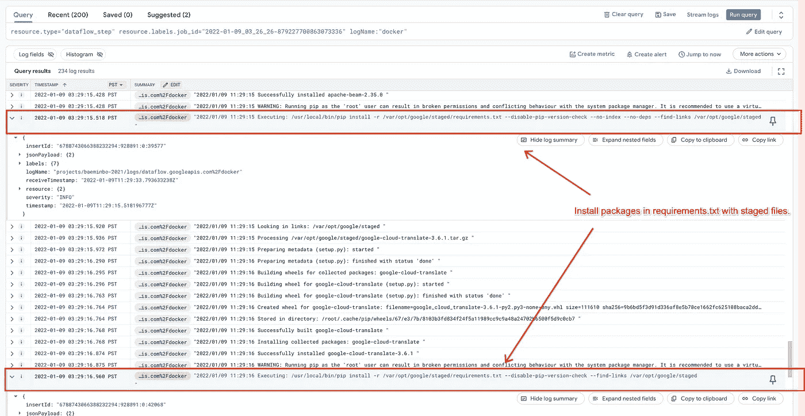

# 在数据流中安装 Python 依赖项

> 原文：<https://medium.com/google-cloud/installing-python-dependencies-in-dataflow-fe1c6cf57784?source=collection_archive---------0----------------------->

在本文中，我们将研究 PipelineOptions 和客户容器中的 3 个依赖选项。然后，我们将看到数据流作业中 python 依赖性的一些已知问题。

*免责声明:本文中的观点、信息和意见属于我个人，不一定代表 Google 和 Apache Beam。*


当您运行数据流管道时，您的管道可能需要 python 包而不是 apache-beam。依赖项可能是来自 PyPI 的公共包，也可能是您的团队中构建的内部包。在创建数据流作业的本地环境中安装依赖项是不够的。您应该在数据流作业创建中指定依赖关系，以便数据流工作虚拟机在 SDK 容器中正确安装依赖关系。

注意，本文假设您的管道使用的是 [**Python Runner v2**](https://cloud.google.com/dataflow/docs/guides/deploying-a-pipeline#dataflow-runner-v2) 。可以通过显式指定`--experiments=use_runner_v2`来使用 Runner v2。如果您的管道使用 python legacy runner 运行，您可能会从本文中看到不同的行为。

# 三个依赖管道选项

Apache Beam 在[管理 python 管道依赖](https://beam.apache.org/documentation/sdks/python-pipeline-dependencies/)中引入了 3 个 Python 依赖选项:`--requirements_file`、`--extra_packages`和`--setup_file`。它们也适用于数据流作业。在接下来的部分中，我们将看到在本地环境和数据流工作虚拟机的 SDK 容器中做了什么。

*本地环境*是您创建数据流作业的地方:例如，您的桌面、GKE、GCE、GAE 等。

*SDK 容器*是执行管道代码和 Beam SDK 的地方。数据流工作虚拟机可以运行多个 SDK 容器。基本上，虚拟机中 SDK 容器的数量与数据流 Python Runner v2 作业的 CPU 数量相同。Python 依赖项安装发生在每个 SDK 容器中。

**管道选项#1:** `**--requirements_file**`

指定依赖关系的最简单方法是使用`--requirements_file=requirements.txt`选项。每个 SDK 容器都将运行`pip install -r requirements.txt`(通常， *requirements.txt* 是依赖列表的文件名，但是您可以更改它)。为了避免从 SDK 容器中的 PyPI 仓库下载包，包被下载到本地环境中，并上传到 GCS 中的`staging_location`。

如果指定了`--requirements_file`，它会使用`pip download --no-binary :all: requirements.txt`下载**源包**，如下图所示。包和可传递依赖项作为源文件下载并构建。下载的源码包文件在 stage 阶段上传到`staging_location`。

比如`google-cloud-translate`依赖`protobuf`、`requests`等。如果 requirements.txt 包含`google-cloud-translate`，它将下载`google-cloud-translate`的源码包及其依赖关系，如`protobuf`和`requests`。并且，它会上传所有下载的包文件。


在 Dataflow worker 虚拟机的 SDK 容器中，它用分段源文件安装 *requirements.txt* 中的包。所有可传递的依赖项都已经暂存。不能从 PyPI 库下载额外的包。因为它们是从源包安装的，所以它们被构建到二进制包中，然后被安装。



上面的[例子](https://github.com/baeminbo/dataflow-python-dependency-pipelines/tree/main/example1)在 requirements.txt 中有`google-cloud-translate==3.6.1`，可以看到源码内置在*Google _ cloud _ translate-3 . 6 . 1-py2 . py3-none-any . whl*中，然后安装。

**管道选项#2:** `**--extra_packages**`

python 依赖的第二个选项是`--extra_packages`。如果本地有包文件，可以指定为`--extra_packages=my_package.zip`。这个选项对于在 PyPI 中不公开的内部包很有用。

数据流运行器上传指定的 python 包和包列表 *extra_packages.txt* 到`staging_location`。与`--requirement_file`不同，该选项仅上传指定的包文件。额外软件包所依赖的软件包不会被上传。

例如，如果您指定一个本地下载的*google-cloud-translate-2.6.1.tar.gz*为`--extra_packages`，它只上传`google-cloud-translate` packge 文件，而不上传其依赖关系如`protobuf`和`requests`。


在数据流工作虚拟机的 SDK 容器中，**强制重新安装 *extra_packages.txt* 中的**个包。额外包的依赖项是从 PyPI 存储库中安装的，如下图所示。


上面的[示例](https://github.com/baeminbo/dataflow-python-dependency-pipelines/tree/main/example2)指定*google-cloud-translate-3.6.1.tar.gz*为额外包装。要安装`google-cloud-translate`的包文件，SDK 容器应该从 PyPI 库下载并安装`google-cloud-translate`的依赖项(例如`protobuf`和`requests`)。但是，在本例中，跳过了依赖项的下载和安装过程，因为默认的 SDK 容器映像预安装了库。

如果一个额外的包依赖于一个没有预先安装在 SDK 容器映像中的包，您可以看到每个 SDK 容器从 PyPI 存储库中下载并安装依赖包。这可能需要您的管道[访问互联网](https://cloud.google.com/dataflow/docs/guides/routes-firewall#internet_access_for)。

**管道选项#3:** `**--setup_file**`

python 包依赖的第三个选项是`--supte_file`。如[Apache Beam doc](https://beam.apache.org/documentation/sdks/python-pipeline-dependencies/#multiple-file-dependencies)中所述，该选项用于打包多个管道源文件。此外，使用 [*setup.py*](https://github.com/baeminbo/dataflow-python-dependency-pipelines/blob/main/example5/setup.py) 中的`install_requires`，可以指定管道的依赖关系。

当指定了`--setup_file=./setup.py`时，它通过运行`python setup.py sdist`构建一个源包(通常使用 *setup.py* ，但是您可以更改文件名)。构建好的包作为*workflow.tar.gz*上传。上传的文件名是固定的，与 *setup.py* 中的包名无关。


在数据流工作者虚拟机的 SDK 容器中，它安装了*workflow.tar.gz*。由`install_requires`指定的依赖项将作为二进制包下载并安装。


上面的例子在`install_requires`中有`lxml==4.7.1`。该包需要非 pypi 库(`libxml2`和`libxslt`)来构建二进制文件，默认 SDK 容器映像中没有预安装这些库。因此，如果您在`--requirements_file`中包含`lxml`，SDK 容器会因为安装`lxml`包的错误而失败，并且您的数据流作业无法启动数据进程。

*setup.py* 是打包源文件和定义依赖关系的最灵活的管道选项。它还可以指定自定义命令，如 *apt* 包。参见 [Juliaset](https://github.com/apache/beam/blob/master/sdks/python/apache_beam/examples/complete/juliaset/setup.py) 示例。

# 自定义容器

虽然管道选项解决了 python 依赖的大多数问题，但是为了构建复杂的管道包或轻松安装非 pypi 包，您可以使用[自定义容器](https://cloud.google.com/dataflow/docs/guides/using-custom-containers)。客户容器目前在 Dataflow 中面向 python 正式发布。您需要使用 Runner v2 来为您的工作使用客户容器。

如果需要，建议使用客户容器

*   非 pypi 包安装:例如`apt-get install ...`
*   预安装软件包以减少 SDK 容器中的初始化时间
*   防止在 SDK 容器中安装软件包时出现任何问题

[在数据流中使用定制容器](https://cloud.google.com/dataflow/docs/guides/using-custom-containers)解释了如何在数据流中使用定制容器。在接下来的部分中，我们将看到 Dockerfile 和 Dataflow 作业运行脚本，它们在 SDK 容器中预安装了最小的包，并且在 SDK 容器中初始化时不安装任何 python 依赖项。

你可以在 Github 库中找到完整的示例代码。

**集装箱建造**

以下示例是创建数据流 python 客户容器的最小 Dockerfile 文件。它将`python:3.7-slim`作为基础映像，并将`apache-beam`和`lxml`一起作为依赖包安装。应用启动器`/opt/apache/beam/boot`是从`apache/beam_python3.7_sdk:2.35.0`复制过来的。可以更改 python 版本(3.6、3.7、3.8)和 Beam 版本(2.35.0、2.34.0 等。).

这个 *Dockerfile* 在容器中安装最小的包和应用程序来运行 SDK harness 应用程序。

```
# Dockerfile for minimal Custom Container 
FROM apache/beam_python3.7_sdk:2.35.0 AS beam_pythonFROM python:3.7-slim
RUN pip install --no-cache-dir apache-beam[gcp]==2.35.0 lxml==4.7.1
COPY --from=beam_python /opt/apache/beam /opt/apache/beam
ENTRYPOINT [ "/opt/apache/beam/boot" ]
```

请注意，Apache Beam baes 容器映像(如`apache/beam_python3.7_sdk:2.35.0`)包括[非必要的附加包](https://github.com/apache/beam/blob/v2.35.0/sdks/python/container/base_image_requirements_manual.txt)(例如`tensorflow`)。额外的包不会影响管道过程，但是如果您的自定义容器来自基本映像，则可能会增加容器映像的大小，如下所示。

```
# Another Dockerfile for Customer Container.
# apache-beam is included in the base image.
FROM apache/beam_python3.7_sdk:2.35.0
RUN pip install --no-cache-dir lxml==4.7.1
```

有了上面的 Dockerfile，您可以通过使用`docker build`和`docker push`来构建和推送容器。否则，您可以通过运行以下命令来使用云构建。

```
# Build and push container image with Cloud Build
IMAGE_URI=gcr.io/$PROJECT/custom_beam_python
gcloud builds submit . -t $IMAGE_URI
```

现在，您已经准备好使用自定义容器运行数据流作业。很简单！

**使用自定义容器运行作业**

要使用客户容器运行作业，您只需像下面的命令一样指定`--sdk_container_image`。

```
python -m $PIPELINE \
  --runner=DataflowRunner \
  --project=$PROJECT \
  --region=$REGION \
  --experiments=use_runner_v2 \
  --sdk_container_image=$IMAGE_URI \
  --sdk_location=container
```

由于您在自定义容器中预装了`apache-beam`，所以您的管道不需要从本地环境将`apache-beam`包上传到 GCS 中的`staging_locaion`。为此，您可以指定`--sdk_location=container`。如果您的管道不使用定制容器或定制容器不包含`apache-beam`包，您必须跳过`--sdk_location`或使用`default`。

运行脚本使用没有 python 依赖选项的`--sdk_container_image`和`--sdk_location=container`。它不在本地环境中下载或构建任何包，也不在数据流工作虚拟机中的 SDK 容器中下载或构建。在数据流作业中安装 python 依赖项可以避免任何问题或延迟。客户容器通常被推荐为避免数据流 python 作业中 python 依赖性问题的最佳方式。

# 常见问题

我们研究了在 SDK 容器中指定 python 依赖关系的方法:使用 python 依赖选项或自定义容器。在这一节中，我们将看到一些常见的问题，这些问题的根本原因是 python 依赖安装。

**包构建错误与** `**--requirements_file**`

如上所述，`--requirements_file`选项下载源包并编译成 SDK 容器中的二进制文件。有些包需要非 pypi 二进制文件。比如`lxml`需要`libxml2`和`libxlst`库，可以通过`apt-get install`安装。但是，这些库没有安装在 SDK 容器映像中。如果您在 requirements.txt 中为`--requirements_file`包含`lxml`，SDK 容器可能会因构建错误而无限期失败，如下图所示。您的数据流作业可能会因为没有工作线程活动而失败。


你可以试试`--setup_file`来避免这个问题。 *setup.py* 中`install_requires`的包是用二进制包安装的。上面`--setup_file`部分的例子可以通过在 setup.py 中添加`lxml`来成功运行数据流作业。

如果您的数据流作业仍然存在`--setup_file`问题，请考虑使用客户容器。

除了构建错误之外，一些 python 包的构建需要几分钟或更长时间。这可能会延迟数据流作业的启动或虚拟机的扩展。您也可以尝试使用`--setup_file`或客户容器来缓解这个问题。

**不包括**`**--requirements_file**`**`**--setup_file**`中的 `**apache-beam**`**

****一个常见的错误是将`apache-beam`作为依赖项添加到`--requirement_file`或`--setup_file`中。默认情况下，`apache-beam`包在本地环境中上传，不管 python 依赖选项如何(除非您使用`--sdk_location=container`)，所以您不应该将`apache-beam`与`--requirements_file`或`--setup_file`包含在一起。****

****如果`apache-beam`包含在依赖项中，它会导致不必要的包下载和上传到本地环境中的 GCS，以及 SDK 容器中的冗余安装。这可能会降低数据流作业开始和自动缩放时 SDK 容器中的初始化速度。特别是如果您指定了不同于数据流作业创建版本的`apache-beam`版本(数据流控制台中显示的 SDK 版本)作为依赖项，在最坏的情况下会导致版本冲突和数据流作业失败。****

******Flex 模板启动器中的 PyPI 包下载错误******

****很少情况下，PyPI 存储库暂时不可用，下载包可能会失败。如果在 SDK 容器中发生这种情况，将通过重新运行 SDK 容器来重试。但是，如果在创建数据流作业的本地环境中发生下载错误，作业创建将会失败。您应该重试作业创建。同样，如果此问题发生在 Flex 模板启动器中，数据流作业将在启动前失败。您可以通过在系统中为失败的 Flex 模板作业实现重试逻辑来缓解这一问题。自定义容器也可以缓解这个问题，因为它可以最大限度地减少从 PyPI 存储库下载的包，如前一节所述。****

****Flex 模板创建作业有 10 分钟的超时时间。有多种因素会影响 Flex template launcher 中创建作业的处理时间。一个常见的根本原因是指定 python 依赖项需要很长时间来下载或构建。比如下载`pandas`为非二进制包需要很长时间(实际上，`pandas`是预装在默认 SDK 容器镜像中的。您不应该在—需求文件的文件中包含熊猫。在[这个测试](https://gist.githubusercontent.com/baeminbo/8db2ce0f167be813987644a8fc094e34/raw/327411b5b53d3c5c9d0ed7f59928428149fe7228/gistfile1.txt)，下载`pandas`为非二进制包花了 8 分多钟。如果`pandas`包含在`--requirements_file`中，您的 Flex 模板作业可能会因超时而失败。还有许多其他软件包也有这个问题。您可以通过使用客户容器或使用`--setup_file`来减轻这种情况。****

****上述问题可能发生在 GAE、作曲家、GKE 或任何你创造工作的环境中。如果您的作业失败是由于 python 依赖性问题，请应用这些建议。****

# ****包裹****

****在本文中，我们介绍了为数据流 python 作业指定 python 依赖关系的方法以及一些已知问题。如果你有进一步的兴趣，请阅读 [Apache Beam GitHub 库](https://github.com/apache/beam)。 [boot.go](https://github.com/apache/beam/blob/v2.35.0/sdks/python/container/boot.go#L246) 是在 SDK 容器中安装包和启动 SDK harness python 应用的 Golang 代码， [stager.py](https://github.com/apache/beam/blob/v2.35.0/sdks/python/apache_beam/runners/portability/stager.py#L160) 是在位置环境中下载和上传 python 包的 Python 代码。****