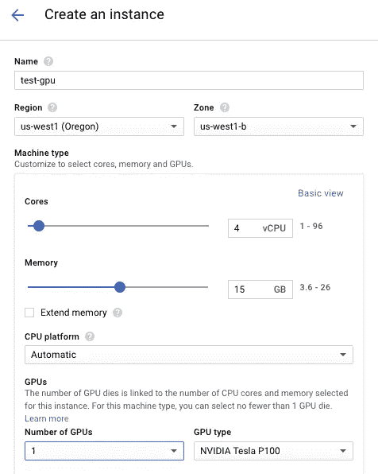
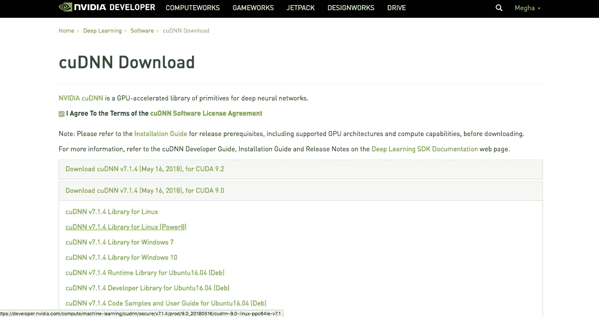
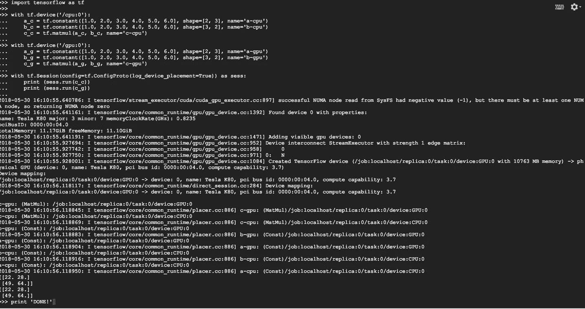

# 在 Google 云平台虚拟机实例上安装 Tensorflow-GPU 和 NVIDIA CUDA

> 原文：<https://medium.com/google-cloud/installing-tensorflow-gpu-with-nvidia-cuda-on-a-google-cloud-platform-vm-instance-95521db9a957?source=collection_archive---------2----------------------->

> *作者:*[*Megha Desai*](https://medium.com/u/f9f20c8d4212?source=post_page-----95521db9a957--------------------------------)*，Searce 软件工程师— ML/AI。最初发表于* [*Searce 工程博客*](/searce/installing-tensorflow-gpu-with-nvidia-cuda-on-a-google-cloud-platform-vm-instance-b059ea47e55c)

作为一名软件工程师和 Searce 分析和机器学习团队的一部分，我试图在谷歌云平台上用 Tensorflow-GPU 和 NVIDIA CUDA 配置的 VM 实例构建一个项目。在设置过程中，我面临着许多挑战，我找不到一个合适的资源来整合每个步骤以实现目标。所以，我在这里写这篇文章，将详细描述每个步骤。我希望这将有助于那些试图在 GCP 做类似事情的人。

*详细步骤:*

***1。设置一个 Google Cloud 实例:*** 用自己选择的名称和地区创建一个实例(虽然不是所有地区都提供 GPU)。我选择了 ***美国-西方 1*** 作为地区。在机器类型中，选择 ***4 个 vCPUs。*** 通过选择图形处理器的数量定制您的机器类型。



实例配置

在引导磁盘选项中，将操作系统映像更改为 ***Ubuntu16.04 LTS。*** 你也可以增加引导盘大小。默认情况下是 10 GB。我已经增加到 50 GB 了。允许实例的 HTTP 和 HTTPS 流量。之后点击 [***【管理】【磁盘】【联网】【SSH】按键***](https://console.cloud.google.com/) 选项 ***。*** 您需要添加启动脚本，该脚本会自动下载显卡所需的 NVIDIA GPU 驱动程序。最新版本的脚本可以在这里找到[](https://cloud.google.com/compute/docs/gpus/add-gpus)**或者你可以在 GCP 控制台本身的帮助选项中键入“gpu 脚本”。为 ubuntu-16.04 LTS 和 CUDA-9 选择脚本。将以下脚本粘贴到*启动脚本*选项中。你可以在*启动脚本*选项中添加这个脚本，或者从 [***站点***](https://developer.nvidia.com/rdp/cudnn-download)*安装 CUDA 驱动程序，但是我推荐使用下面的脚本。***

******2。连接到 SSH 服务器:*** 一旦实例设置完成，点击 SSH 按钮连接 SSH 服务器。要保持 SSH 服务器的最新状态，请点击命令。***

```
**sudo apt-get update**
```

**完成后就可以去官方 [***Tensorflow 网站***](https://www.tensorflow.org/install/install_linux#nvidia_requirements_to_run_tensorflow_with_gpu_support) 进行 GPU 安装了。在我们的情况下，已经满足了第一和第二指令。要获得 CUDA 的 cuDNN 库副本，我们需要获得 NVIDIA 会员资格。使用他们的官方 [***网站***](https://developer.nvidia.com/rdp/form/cudnn-download-survey) ***可以免费成为 NVIDIA 开发者。完成后，您需要为您的实例下载一个合适的 cuDNN 版本。不同的操作系统有不同的选择。在我们的例子中，我们将使用 [*cuDNN v7.1.4 库用于 Linux*](https://developer.nvidia.com/compute/machine-learning/cudnn/secure/v7.1.4/prod/9.0_20180516/cudnn-9.0-linux-x64-v7.1) *。*这是最重要的一步，因为对这个 cuDNN 版本有很多依赖。这个 cuDNN 版本是针对 CUDA 9.0 版本的。*****

**

*NVIDIA cuDNN 下载*

****3。上传并解包 cuDNN tar 文件:*** 要将 cuDNN tar 文件夹上传到您的实例，运行以下 google cloud 命令，*

```
*gcloud compute scp /Users/meghadesai/Desktop/cudnn-9.0-linux-x64-v7.1.tgz <username>@test-gpu:~/*
```

*要检查文件是否上传到正确的目的地，使用 ***ls*** 命令。你应该能找到。tar 文件。要解包这个文件，使用下面的命令。*

```
*tar -xzvf cudnn-9.0-linux-x64-v7.1.tgz*
```

*解压文件后，使用下面的命令将其复制到 cuda 目录。*

```
*sudo cp cuda/include/cudnn.h /usr/local/cuda/include
sudo cp cuda/lib64/libcudnn* /usr/local/cuda/lib64
sudo chmod a+r /usr/local/cuda/include/cudnn.h /usr/local/cuda/lib64/libcudnn**
```

****4。安装所有必要的 python 包:*** 在下载 cuDNN 库的同时，我们可以安装所有必要的 python 包，将来可能会用到。使用以下命令安装 ***ipython*** 和 ***pip*** 。对于每个是/否问题，按***【y】***安装。确保您正在为 ***python3*** *获取 ***pip*** 。**

```
*sudo apt-get install ipythonsudo apt-get install python3-pip*
```

*我将来会用到的更多 python 包有 ***numpy，pandas，scipy*** 。您可以根据需要安装这些包，但是我建议安装基本的 python 包。使用以下命令安装。*

```
*sudo pip3 install numpy scipy matplotlib ipython jupyter pandas sympy nose*
```

*安装所有这些软件包可能需要一些时间。同时，你可以在这里 ***了解更多关于 NVIDIA cuDNN 库及其特性 [***。***](https://developer.nvidia.com/cudnn)****

*安装完以上所有软件包后，运行以下命令。这个命令是必需的，因为我们将从源使用 Tensorflow。*

```
*sudo apt-get install openjdk-8-jdk git python-dev python3-dev python-numpy python3-numpy python-six python3-six build-essential python-pip python3-pip python-virtualenv swig python-wheel python3-wheel libcurl3-dev libcupti-dev*
```

*现在，运行下面的命令。*

```
*nano ~/.bashrc*
```

*添加下面两行代码，以确保我们的 VM 实例知道我们在上一步中上传和解包的 CUDA 文件在哪里。*

```
*export LD_LIBRARY_PATH=”$LD_LIBRARY_PATH:/usr/local/cuda/lib64:/usr/local/cuda/extras/CUPTI/lib64" 
export CUDA_HOME=/usr/local/cuda*
```

*然后，使用 source 命令重新加载该文件。*

```
*source ~/.bashrc*
```

*现在，我们正在为 google cloud apis 添加 ***bazel*** 库。*

```
*echo “deb [arch=amd64] [http://storage.googleapis.com/bazel-apt](https://www.youtube.com/redirect?redir_token=Y03xwRj9jpR5xoyUmQ7BbZtTfs98MTUyNzc2MDU3MkAxNTI3Njc0MTcy&event=video_description&v=abEf3wQJBmE&q=http%3A%2F%2Fstorage.googleapis.com%2Fbazel-apt) stable jdk1.8” | sudo tee /etc/apt/sources.list.d/bazel.listcurl [https://bazel.build/bazel-release.pub...](https://www.youtube.com/redirect?redir_token=Y03xwRj9jpR5xoyUmQ7BbZtTfs98MTUyNzc2MDU3MkAxNTI3Njc0MTcy&event=video_description&v=abEf3wQJBmE&q=https%3A%2F%2Fbazel.build%2Fbazel-release.pub.gpg) | sudo apt-key add -sudo apt-get install bazel
sudo apt-get upgrade bazel*
```

****5。在实例上安装 Tensorflow:***现在，使用以下命令将 tensor flow 的 git 目录克隆到您的实例。它将安装最新版本的 tensorflow。*

```
*git clone [https://github.com/tensorflow/tensorflow](https://www.youtube.com/redirect?redir_token=Y03xwRj9jpR5xoyUmQ7BbZtTfs98MTUyNzc2MDU3MkAxNTI3Njc0MTcy&event=video_description&v=abEf3wQJBmE&q=https%3A%2F%2Fgithub.com%2Ftensorflow%2Ftensorflow)cd ~/tensorflow./configure*
```

*现在，按照这个特定的顺序运行以下命令。*

```
*/usr/bin/python3.5*
```

*运行该命令后，按*回车*直到出现*请输入想要使用的 Python 库路径*。点击下面的命令。*

```
*/usr/local/lib/python3.5/dist-packages*
```

*按下*键，输入*键，直到到达*是否希望使用 CUDA 支持构建 TensorFlow？*"按下' ***y*** '作为回复，并回车。然后，运行以下命令将文件复制到 tensorflow temp 文件夹。*

```
*bazel build — config=opt — config=cuda //tensorflow/tools/pip_package:build_pip_packagebazel-bin/tensorflow/tools/pip_package/build_pip_package /tmp/tensorflow_pkg*
```

*这可能需要一些时间来运行，但请记住 ***耐心是关键！:))****

*一旦成功实现了用于 ***bazel*** 文件的命令，运行以下命令并退出 SSH 窗口。*

```
*sudo pip3 install /tmp/tensorflow_pkg/tensorflow [PRESS TAB TO COMPLETE FILENAME]*
```

*现在，再次连接到 SSH 服务器窗口，尝试以下代码来检查 GPU 是否已设置并被使用。键入****python 3***。它将打开 python 解释器并实现以下代码。**

****

**代码的输出**

**如果您得到类似的输出，那么您已经成功地设置了 GPU，您就大功告成了！！！**

**感谢您阅读本文，我希望您在下一个超级下一代项目的 VM 实例上成功安装了 CUDA。**

**谢谢大家！**