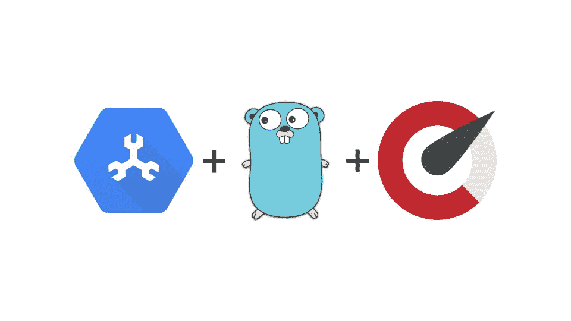
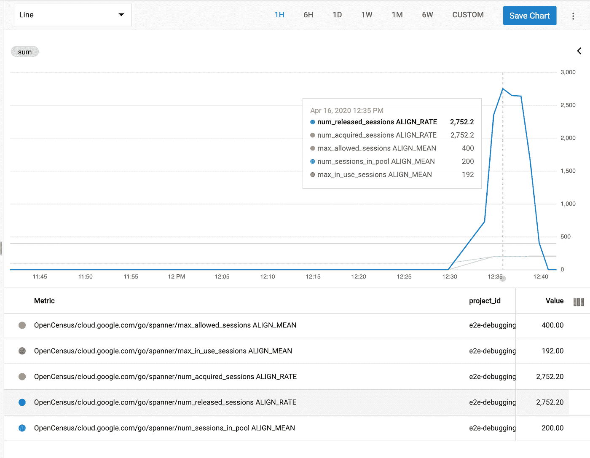
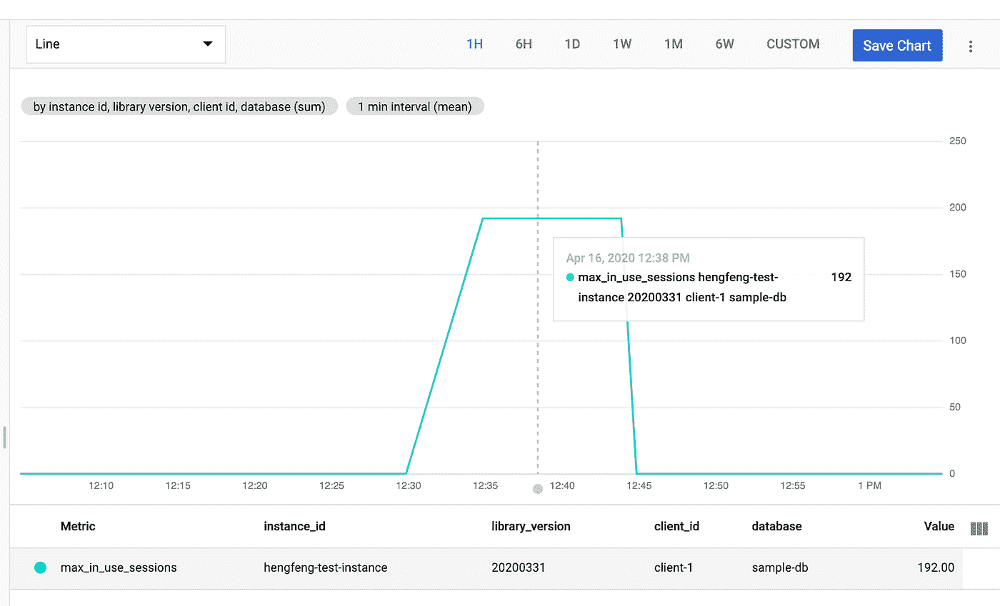
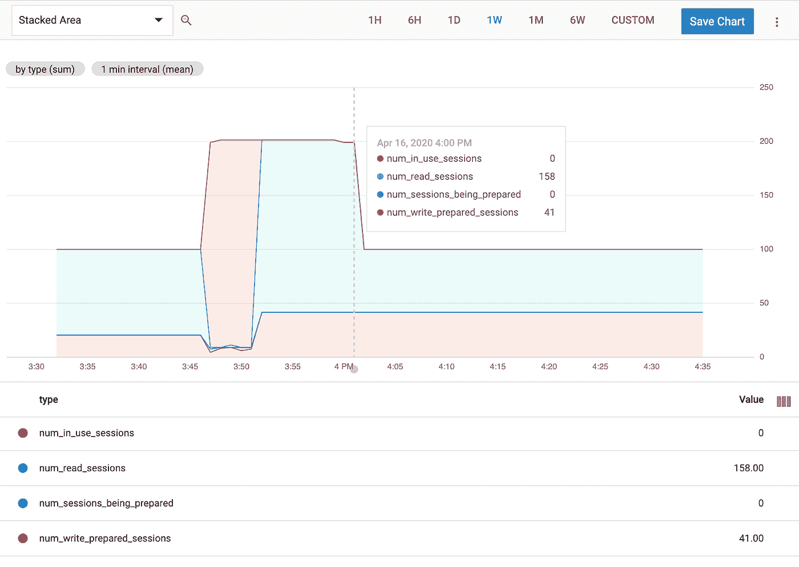

# 使用 OpenCensus 检测云扳手 Go 应用程序

> 原文：<https://medium.com/google-cloud/instrumenting-cloud-spanner-go-applications-with-opencensus-6e734eb4d8c8?source=collection_archive---------1----------------------->



本教程将向您展示如何使用 Go 中的 Cloud Spanner 客户端库在演示应用程序中启用与会话相关的指标。这些指标允许更好地监控会话池，并帮助我们快速识别会话问题:

*   ***max _ allowed _ sessions***:允许的最大会话数。可由用户配置。
*   ***num _ sessions _ in _ pool***:当前在会话池中的会话数，包括正在使用的和未使用的。
*   ***max _ in _ use _ sessions***:最近 10 分钟间隔内使用的最大会话数。
*   ***get _ session _ time outs***:由于池耗尽导致的 get 会话超时次数。
*   ***num _ acquired _ sessions***:从会话池中获取的会话数。
*   ***num _ released _ sessions***:用户释放的会话数。

内容将包括:

*   创建一个扳手表&一个演示 web 应用程序
*   启用指标视图并导出到云监控
*   云监控中的可视化指标

如果你用的是 Java 的 Cloud Spanner 客户端库，你可能会对[这篇文章](/@mayurkale22/troubleshooting-cloud-spanner-applications-with-opencensus-2cf424c4c590)感兴趣。

**重要提示:** OpenCensus 正在被 OpenTelemetry 所取代(目前正在进入测试阶段)，但是移植应该不需要太多的改变就可以使用 API。在这里阅读更多。

# 先决条件

## 创建扳手台

使用以下 DDL 模式在 spanner 数据库中创建一个表“ **users** ”:

```
CREATE TABLE users (
  id STRING(MAX) NOT NULL,
  email STRING(MAX) NOT NULL,
  first_name STRING(MAX) NOT NULL,
  last_name STRING(MAX) NOT NULL,
) PRIMARY KEY (id)
```

## 创建简单的 web 应用程序

这个 web 应用程序支持两个 API:

*   GET localhost/users:在表中列出所有用户，返回的数据是 json 格式的。
*   POST localhost/users:用提交的表单字段创建一个新用户。

代码如 [webapp_enable_oc.go](https://github.com/hengfengli/spanner-opencensus-example/blob/master/webapp_enable_oc.go) 所示。

# 启用指标导出

为了查看度量视图，您需要决定两件事:

1.  我们希望在后端看到哪些视图？
2.  我们应该将视图导出到哪个后端？

您可以使用 [register api](https://pkg.go.dev/go.opencensus.io/stats/view?tab=doc#Register) 注册 Spanner 客户端库中定义的全部或部分视图。在本教程中，我们将使用 Spanner 客户端库中注册所有视图的便利 API。

```
// Enable all default views.
spanner.EnableStatViews()
```

因此，所有指标视图将在后端显示。

接下来，我们需要选择将指标发送到哪个后端。Opencensus 支持将指标导出到许多不同的后端，您可以在这里找到受支持的导出器。在本教程中，我们使用云监控(以前称为 Stackdriver)作为示例:

```
// Set up the stackdriver exporter.
sd, err := stackdriver.NewExporter(stackdriver.Options{
        ProjectID: projectID,
        ReportingInterval: 60 * time.Second,
})
if err != nil {
        log.Fatalf(“Failed to create the StackDriver exporter: %v”, err)
}
defer sd.Flush()sd.StartMetricsExporter()
defer sd.StopMetricsExporter()
```

我们创建一个 stackdriver 导出器，并将其配置为每 60 秒报告一次。

# 可视化云监控中的指标

首先，我们需要运行 web 应用程序:

```
$ go run webapp_enable_oc.go // The default port is 8080.
// Or, specify a port.
$ go run webapp_enable_oc.go -port=8080
```

为了创造一些流量，我们可以使用 [wrk](https://github.com/wg/wrk) (一个 HTTP 基准测试工具):

```
$ wrk -t12 -c200 -d5m [http://127.0.0.1:8080/users](http://127.0.0.1:8080/users)Running 5m test @ [http://127.0.0.1:8080/users](http://127.0.0.1:8080/users)
  12 threads and 200 connections
  Thread Stats Avg Stdev Max +/- Stdev
    Latency 100.74ms 114.93ms 1.50s 87.70%
    Req/Sec 222.75 64.84 430.00 70.69%
  791833 requests in 5.00m, 379.09MB read
  Socket errors: connect 0, read 53, write 0, timeout 0
Requests/sec: 2638.51
Transfer/sec: 1.26MB
```

这将运行基准测试 5 分钟，使用 12 个线程，并保持 200 个 HTTP 连接打开。

然后，您可以导航到 GCP 云监控中的 Metric explorer。您应该能够找到带有这个前缀的指标:“custom . Google APIs . com/open census/cloud . Google . com/go/spanner/”。所有相关指标都应在此前缀下。如果您将所有指标相加，并使用“ **sum** ”聚合器，您将看到一个类似于下图的图表:



所有与会话相关的指标

注意图中没有显示 *get_session_timeouts* ,因为我们还没有得到任何超时错误。

每个指标都有一些共同的属性:

*   client_id:区分单个进程中的 spanner 客户端。对于同一个数据库，它以“客户机-1”、“客户机-2”等开始。
*   数据库:数据库的名称。
*   instance_id:实例的名称。
*   library _ version:YYYYMMDD 格式的 [google-cloud-go](https://github.com/googleapis/google-cloud-go) 的日期版本(spanner 是子模块)。

我们可以使用这些属性对指标进行分组，例如在 *max_in_use_sessions* 中，



最大使用会话数的标签

特别是， *num_sessions_in_pool* 有一个 type 属性，表示会话的类型。type 属性有四个值:

*   ***【使用中会话数】*** :用户当前正在使用的会话。
*   ***num _ sessions _ being _ prepared***:正在准备写入的会话。
*   ***num _ read _ sessions***:读取会话池中的会话。
*   ***num _ write _ prepared _ sessions***:在会话池中写入会话。

它们的总和就是会话池中的会话总数，包括正在使用的和未使用的。 *num_sessions_in_pool* 的堆叠面积图如下所示:



池中会话数的堆积面积图

# 结论

本教程介绍了使用 Cloud Spanner Go 客户端库时，如何启用会话相关指标。客户端库中添加了六个 OpenCensus 指标，可用于调试会话问题。这些指标可以导出到不同的后端，以便于存储和可视化。这些指标使我们能够更好地监控会话池，并快速定位会话问题。