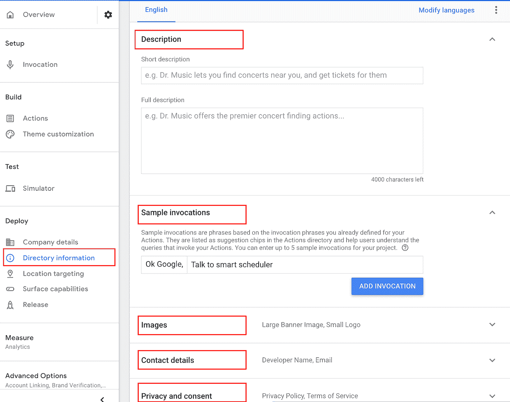

# 解构聊天机器人:将 Dialogflow 与 Google 上的操作整合起来

> 原文：<https://medium.com/google-cloud/integrate-dialgflow-with-actions-on-google-3c22089ad001?source=collection_archive---------0----------------------->

# 介绍

一旦您在 Dialogflow 上构建了代理，您就可以使用一键式集成连接到各种平台，如 google assistant、web、电话、slack、facebook messenger、twitter 等。在本实验中，您将把 Dialogflow 与 Google 上的操作集成在一起，使聊天机器人成为 Google Home 或 Assistant 上的 Google 操作。

Actions on Google 是一个平台，在这里你可以创建软件来扩展 Google Assistant 的功能。通过将 Dialogflow 与 Google 上的 Actions 集成，您可以访问超过 5 亿台支持 Google Assistant 的设备，如智能音箱、电话、汽车、电视、手表等

# 你会学到什么

*   如何从 Dialogflow 启用对 Google 集成的操作
*   如何测试谷歌行动
*   如何在 google 控制台上管理动作助手

# 先决条件

对话流的基本概念和结构。关于介绍基本对话设计的 Dialogflow 教程视频，请查看[解构聊天机器人系列](https://www.youtube.com/watch?v=O00K10xP5MU&list=PLIivdWyY5sqK5SM34zbkitWLOV-b3V40B&index=1)。

# 从 Dialogflow 启用对 Google 集成的操作

我们将使用我们在之前的 codelab 中构建的相同的约会调度聊天机器人，并通过集成来工作。

*   导航至[对话流控制台](https://console.dialogflow.com/api-client/)。
*   选择我们在前面的 codelab 中创建的 AppointmentScheduler 代理。

*   点击集成

*   点击“谷歌助手”整合设置

*   在弹出的窗口中，将定义显式和隐式调用:
*   **显式调用**发生在用户通过名字告诉谷歌助手使用你的动作的时候。可选地，用户可以在他们的调用的末尾包含一个调用短语，这将直接把他们带到他们所请求的功能。
*   当一个用户说“好的谷歌，跟智能调度”智能调度是我们的触发名称，我们将看到在哪里设置它。在我们的例子中，欢迎意图是用户登陆的最佳点。所以我们会坚持这一点。
*   **隐式调用**是一个交互流，当用户请求执行某个任务而不通过名称调用某个动作时，就会出现这个交互流。Google Assistant 试图将用户的请求匹配到一个合适的实现，比如一个操作、搜索结果或移动应用程序，然后向用户提供建议。如果您已经部署了可以帮助用户完成任务的操作，隐式调用为用户提供了一种通过助手发现您的操作的方式。
*   假设一个用户说，“好的，google，让 smart scheduler 为明天下午 5 点设置一个约会”——这是一个隐式调用，需要触发深层链接，所以在这种情况下，我们应该直接调用我们的“计划约会”意图，因为我们确切地知道用户打算做什么。

*   点击“测试”，因为我们刚刚开发了我们的应用程序，测试是一个很好的方式来看看它是否正常工作。

# 在模拟器中测试代理

*   点击“测试”,这将在谷歌控制台的操作中打开**模拟器**。

*   尝试几个短语:
*   “与我的测试应用程序对话”。机器人回答:“好吧。让我们获得我的测试应用程序的测试版本。日安！今天有什么事吗？”
*   “帮我预约”或“预约明天下午 4 点”并按照提示查看预约设置。

*   您将在右侧看到测试和调试显示、请求、响应、错误和日志的选项。

# 管理助手应用程序

*   导航到对话流控制台，然后单击集成
*   然后再次点击谷歌集成上的操作。
*   在这次弹出的窗口中，我们来探索一下“管理助手 APP”

*   这为我们提供了为聊天机器人设置调用名称的能力，在示例中我们称之为“智能调度程序”，但是您将需要使用另一个名称(字段中不接受数字或特殊字符)，因为这些是全局的。
*   在这里为助手选择男/女声，点击**保存。**
*   回到概述——我们已经构建了我们的应用程序，可以开始测试了。

*   当您准备好进行部署时，单击左侧的 Deploy 选项卡，并提供公司详细信息和适当的联系人。

*   接下来，在左侧菜单中的**部署**下，单击**目录信息**，确保您已经为您的应用程序和示例调用提供了描述——例如，我们在这里添加了“与智能调度程序对话”它还需要一个小的和一个大的标志图像(至少 192 像素宽和高)，联系方式，隐私信息和类别。点击**保存。**

*   接下来，在 Deploy -> Location targeting 下，选择要部署的国家和要运行操作的表面。

[可选]一旦您在模拟器测试后感到舒适，您可以选择为 Alpha 和 Beta 测试人员推送应用程序以进行进一步测试。要启用 Alpha 和 Beta 测试，请导航到“部署”并单击“发布”。

*   随着测试版的推出，你可以测试 200 个用户的行动。
*   使用 Alpha 版本，您可以为多达 20 个用户启用该操作，而无需提交进行审查。

[可选]当您感到满意并准备将应用程序推向生产时，用户可以使用“部署”->“发布”下的“提交生产”按钮来提交生产。

[可选]您将看到一个对话框，确认您已经在部署到生产环境并提交审批之前测试了该应用程序。适当选择。如果您不希望在生产中提交动作以供审查，这很好，到目前为止您所做的所有设置对于在模拟器、Alpha 和 Beta 中进行适当的测试仍然是有用的。

# 测试你的聊天机器人！

在这一点上，登录到您的谷歌家庭设备或谷歌助理应用程序与您用来建立这个应用程序的相同的电子邮件地址。

用下面的对话来测试一下:

1.  与<example name="" given="">(在我们的例子中是智能调度器)对话</example>
2.  当然可以。让我们获得智能调度程序演示的测试版本。嗨！你过得怎么样？
3.  用户:“嗨”
4.  用户:“设置约会”
5.  聊天机器人回应:“什么日期？”
6.  用户:“5 月 23 日”
7.  聊天机器人回应:“你想什么时候进来？”
8.  用户:“上午 10 点”
9.  另外，试试另一个例子:“约定明天下午 4 点”。Google Home 或 Assistant 应该会回复确认预约。

# 恭喜你！

你创建了一个聊天机器人，并用它创建了一个谷歌动作。您现在是聊天机器人开发者了！

# 后续步骤

*   点击查看 Dialogflow 网站[获取文档、API 和更多内容。](https://cloud.google.com/dialogflow-enterprise/)
*   跟随[解构聊天机器人](https://www.youtube.com/watch?v=O00K10xP5MU&list=PLIivdWyY5sqK5SM34zbkitWLOV-b3V40B&index=1)视频系列，订阅谷歌云平台 youtube 频道
*   想要更多的故事？查看我的[中](/@pvergadia/)，[在 twitter 上关注我](https://twitter.com/pvergadia)。
*   试试 [Dialogflow](https://dialogflow.com/) ，它是**免费**打造的一个 bot！看看这个。