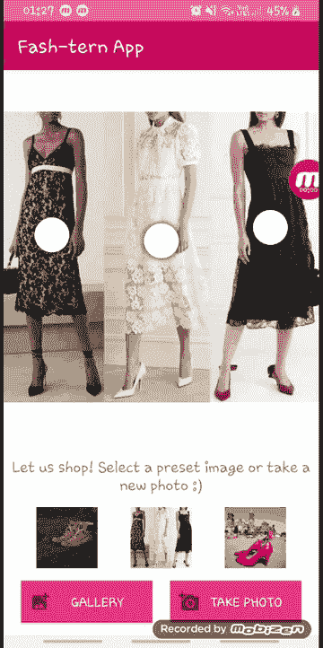

# 将 ML Kit ODT 和 Vision 产品搜索 API 与 Android 应用程序集成

> 原文：<https://medium.com/google-cloud/integrating-ml-kit-odt-and-vision-product-search-apis-with-an-android-application-594df9ca73f4?source=collection_archive---------0----------------------->

> 我们不是都在最喜欢的网上购物网站上使用过图片搜索功能吗？在那里，我们上传一张带有我们正在寻找的商品的图片，瞧，几秒钟内就能得到匹配的结果！那么，为什么不将这一特性集成到我们自己的移动应用程序中呢？

这可以通过使用预定义的 API 来完成，这些 API 是 Google 提供的预打包人工智能解决方案。

在谷歌实习期间，我使用谷歌的 Vision 产品搜索 API 构建了一个产品搜索后端，并将其与一个 android 应用程序集成在一起。该应用程序还有一个设备上的对象检测器，我使用 ML Kit 对象检测和跟踪 API 实现了它。

在这篇博客中，我将解释在 android 应用程序中集成 API 的步骤，就像我在我的项目中所做的一样。

所以，让我们开始吧！


**注意:**我假设你有一些 android 应用程序的样板代码，包括通过设备摄像头捕捉图像或从设备存储器上传图像。使用预设图像也可以。如果您想使用完全相同的应用程序，请访问我的 GitHub 库中的[代码，并在继续之前克隆它。](https://github.com/shreyaanand29/Vision-Product-Search-Android-App/tree/master)

# 目标检测和跟踪

将以下内容添加到依赖项文件(build.gradle)中

```
implementation **‘com.google.mlkit:object-detection:16.2.4’**
```

在主文件中导入以下内容-

```
com.google.mlkit.vision.common.InputImagecom.google.mlkit.vision.objects.ObjectDetectioncom.google.mlkit.vision.objects.defaults.ObjectDetectorOptions
```

下面代码片段中的函数通过 3 个简单的步骤建立了对象检测和跟踪

1.  配置对象检测器(模式为 SINGLE_IMAGE_MODE，因为我们将在静态图像上运行它)。
2.  从位图准备输入图像(要从其他方法准备输入图像，请访问[文档](https://developers.google.com/ml-kit/vision/object-detection/android))。
3.  处理图像，如果成功，我们只保留时尚 _ 良好的产品的应用目的。

这样，您就成功地将对象检测功能与您的移动应用程序集成在一起了！

# 构建产品搜索后端

下一步是为 vision API 创建后端，然后可以从应用程序调用它来执行可视化搜索。

1.  在开始任何实际工作之前，确保已经为你设置了一个谷歌云项目，并启用了计费功能。另外，请继续并[为您的项目启用 Vision API](https://console.cloud.google.com/flows/enableapi?apiid=vision.googleapis.com&_ga=2.233519835.417375745.1628526668-88159532.1628526668) 。
2.  创建一个服务帐户，并赋予它 Basic>Owner 角色。然后，您必须创建服务帐户密钥(json 密钥被下载到您的计算机上)。
3.  将变量 GOOGLE_APPLICATION_CREDENTIALS 的值设置为下载的凭证文件的路径(请记住，该值仅适用于云 Shell 的当前会话)。
4.  然后，获取将用作后端服务的产品目录的产品集。我使用了位于公共云存储桶中的公开可用的 [product_catalog.csv](https://storage.cloud.google.com/cloud-samples-data/vision/product_search/product_catalog.csv) 。

您可以构建自己的目录——一个. csv 文件，并将其上传到您的云存储空间。

**注意:**如果您构建自己的产品集，请确保。csv 文件具有 Vision API 能够正确识别它所需的格式。它应该有以下几列-

```
image-uriimage-id (optional, if not given, automatically allocated)Product-set-idProduct-idproduct-category (It can be one of homegoods-v2, apparel-v2, toys-v2, packagedgoods-v1, and general-v1)product-display-name (optional)labels (optional)bounding-poly (optional)
```

更多信息，请访问[格式化批量导入 CSV](https://cloud.google.com/vision/product-search/docs/csv-format) 。

使用以下 curl 命令，使用 bulk import 为您自己的后端创建目录

```
curl -X POST \-H “Authorization: Bearer “$(gcloud auth application-default print-access-token) \-H “Content-Type: application/json; charset=utf-8” \-d @import_request.json \[https://vision.googleapis.com/v1/projects/$PROJECT_ID/locations/$LOCATION_ID/productSets:import](https://vision.googleapis.com/v1/projects/$PROJECT_ID/locations/$LOCATION_ID/productSets:import)
```

**注意:**import _ request . JSON 文件有以下内容-

现在，我们必须确保产品的产品搜索索引是完整的。

使用以下命令验证索引是否完成-

```
curl -X GET \-H “Authorization: Bearer $(gcloud auth application-default print-access-token)” \-H “Content-Type: application/json” \https://vision.googleapis.com/v1/projects/$PROJECT_ID/locations/$LOCATION_ID/productSets
```

成功的响应将返回索引已完成的产品集的 indexTime。

**注意:**索引每 30 分钟更新一次，无论何时添加或删除图像，在索引更新之前，您不会看到响应有任何变化。我后来知道了索引时间，并且不耐烦地试图马上测试我的应用程序，所以不要像我一样！

至此，我们的产品搜索后端创建成功！

# 从 Android 应用程序调用后端

最后一步是从应用程序调用后端——发送图像作为查询，接收视觉上相似的产品列表，并获取返回显示的产品的参考图像。

在继续之前，创建一个 API 密钥并存储它。应用程序将使用它与 Vision API 进行交互。为了避免未经授权的使用，您还可以限制 API 密钥对您自己的应用程序的访问。

```
VISION_API_URL — https://vision.googleapis.com/v1VISION_API_KEY — API keyVISION_API_PROJECT_ID — Google Cloud project IDVISION_API_LOCATION_ID — The Region Name e.g. us-east1 VISION_API_PRODUCT_SET_ID — ID of the product catalog
```

然后，使用[projects . locations . images . annotate](https://cloud.google.com/vision/product-search/docs/reference/rest/v1/projects.locations.images/annotate)端点将查询图像发送到服务器，并从产品目录中接收视觉上与查询图像相似的产品列表。

最后，调用[projects . locations . products . reference images . get](https://cloud.google.com/vision/product-search/docs/reference/rest/v1/projects.locations.products.referenceImages/get)API 来获取返回的产品图像的 URIs，并在应用程序的 UI 中显示它们。

我们已经到了最后，这就是将对象检测和产品搜索功能集成到您的应用程序中所需要做的一切。

**祝贺你！**

只是为了提升你的热情去做点什么，这里有一个小小的视觉效果，展示你努力工作的果实会有多甜！所以，去试试这些很酷的 API 吧！



所有努力的最终成果！

# 后续步骤

谷歌整理了一份详尽的文档清单，对理解细节非常有帮助——T4 愿景和 ML 工具包。如果您希望按照一步一步的指南从头开始构建整个应用程序，请访问[学习途径](https://developers.google.com/learn/pathways/on-device-ml-3)，其中有视频教程和一堆代码实验室，以及为您提供的所有源代码。

快乐学习！