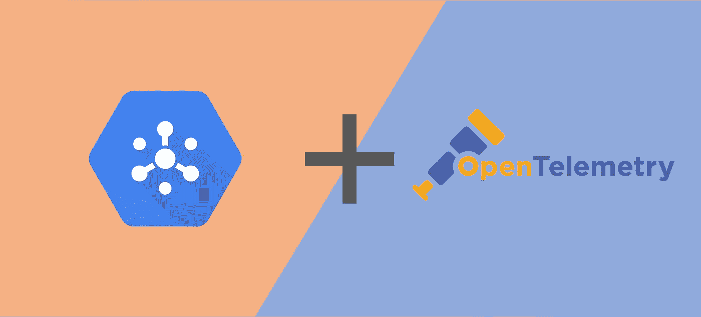

# 将 OpenTelemetry 集成到云发布/订阅中

> 原文：<https://medium.com/google-cloud/integrating-opentelemetry-into-cloud-pub-sub-19aacd83692a?source=collection_archive---------0----------------------->

## 从头到尾跟踪云发布/订阅消息

# 可观测性问题

云发布/订阅服务提供了一种便捷的方式来交流信息，作为典型的请求-响应模型的替代方案。这使得它成为一个理想的系统，用于由多个…