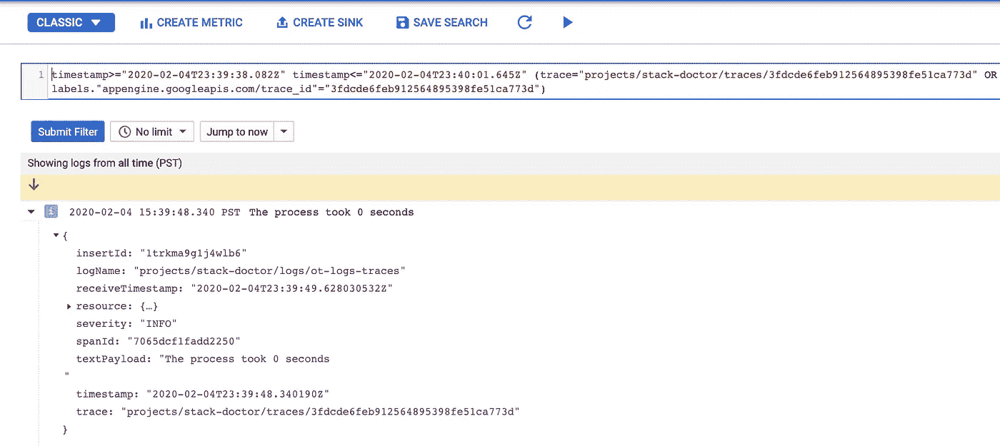

# 用 OpenTelemetry 和 Stackdriver 集成跟踪和日志记录

> 原文：<https://medium.com/google-cloud/integrating-tracing-and-logging-with-opentelemetry-and-stackdriver-a5396fbc3e78?source=collection_archive---------0----------------------->

使用像 Stackdriver 这样的一体化可观察性套件的主要好处之一是，它提供了您可能需要的所有功能。具体来说，您的指标、跟踪和日志都在一个地方，随着云控制台中监控的 GA [发布](https://cloud.google.com/monitoring/docs/monitoring_in_console)，这比以往任何时候都更加真实。然而，在很大程度上，这些数据元素中的每一个仍然是独立的，我想尝试将它们中的两个统一起来——跟踪和日志。

该项目的想法受到了 Alex Amies 在他的参考指南中所做的出色工作的启发。具体来说，他包括了一个 applog [包](https://github.com/GoogleCloudPlatform/opencensus-spanner-demo/tree/master/applog)，它集成了 OpenCensus 中的跟踪和日志:

我想继续我的[帖子](https://dev.to/yurigrinshteyn/distributed-tracing-with-opentelemetry-in-go-473h)中关于 OpenTelemetry 跟踪的内容，并尝试创建集成的跟踪和日志。让我们开始吧！

# 该应用程序

我使用 Mux 路由器创建了一个非常简单的 Go 应用程序:

1.  在`/`收到请求。
2.  睡眠时间在 0 到 9 秒之间。
3.  进行后端调用(给[https://www.google.com](https://www.google.com)

我的意图是创建一个有两个子节点的根 span 一个用于模拟内部流程的延迟，另一个用于后端调用。

# 代码

# 主要功能

main 函数简单地设置我的跟踪和日志记录，并使用`mainHandler`来响应`/`上的请求。

# 跟踪设置

跟踪设置非常简单——我只是使用了由 Yoshi Yamaguchi 编写的 exporter，他是一位出色的开发者倡导者。这是我在追踪帖子中使用的同一个导出器，没有任何变化。

# 日志记录设置

这就是事情开始变得有趣的地方。

我很大程度上是从亚历克斯的作品[中剽窃来的。init 函数只是设置日志客户端。](https://github.com/GoogleCloudPlatform/opencensus-spanner-demo/blob/master/applog/applog.go)

# 写日志

这是跟踪/日志记录集成真正发生的地方。

在 Stackdriver 中，可以通过在日志消息的有效负载中写入 span ID 和 trace ID 来连接跟踪和日志。这里，我使用上下文提取 span 和 trace，然后提取它们的 id。然后，我将它们写入日志有效负载。下面是生成的日志消息的样子:

请注意，`spanId`和`trace`字段已被适当填充。

# 查看痕迹

我可以在本地运行该应用程序(在使用`gcloud auth application-default login`编写默认凭据后)，并将流量发送到 [http://localhost:8080](http://localhost:8080) 。以下是结果跟踪:

> *注意，该跟踪包含事件(使用* `*span.AddEvent()*` *方法添加)和日志，如上所述。*

# 查看日志

我可以单击其中一个日志条目来查看日志消息的完整详细信息:

然后，我可以在日志查看器中单击打开，并在那里看到以下日志条目:

# 总之…

我非常高兴地看到，OpenCensus 的这一不太被重视的功能在 OpenTelemetry 中仍然有效，只做了一些小的改动。具体来说，我必须找到在`printf()`中使用的新 API 来从上下文中提取 span，然后获得它的 span ID 和 trace ID，这似乎没有很好地记录。也就是说，我希望这篇简短的教程对那些希望用 Stackdriver 构建一个更加集成的可观测性方法的人有用，尤其是在分布式系统中。非常感谢亚历克斯在这方面所做的原创工作，也感谢你的阅读！

*原载于*[*http://github.com*](https://gist.github.com/295b0056b9ed4a4c39cd7fd616887bd4)*。*