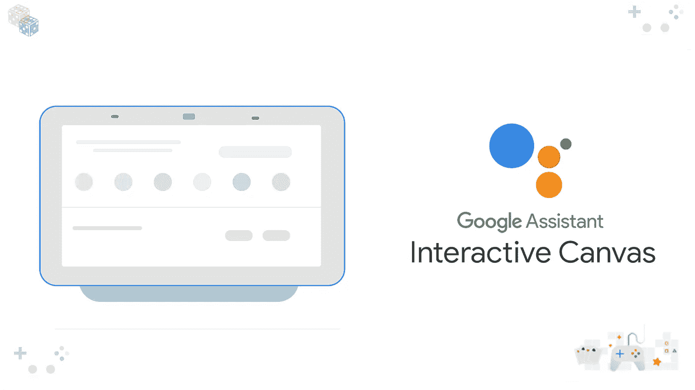

# 交互式画布——为 Google Assistant 构建可视化的沉浸式游戏——第 1 部分

> 原文：<https://medium.com/google-cloud/interactive-canvas-build-immersive-games-for-google-assistant-part-1-351156a5f7d3?source=collection_archive---------0----------------------->

在本教程中，我们将学习如何使用交互式画布为 Google Assistant 构建一个示例动作/应用程序，以获得身临其境的交互式游戏体验。此外，这将为您理解和构建自己的谷歌助手沉浸式互动游戏体验奠定基础。

# 介绍…