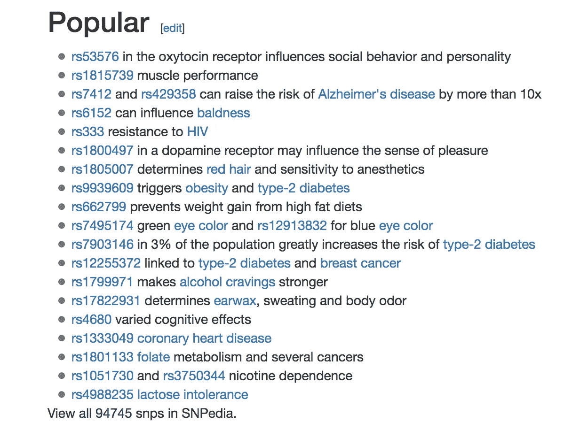
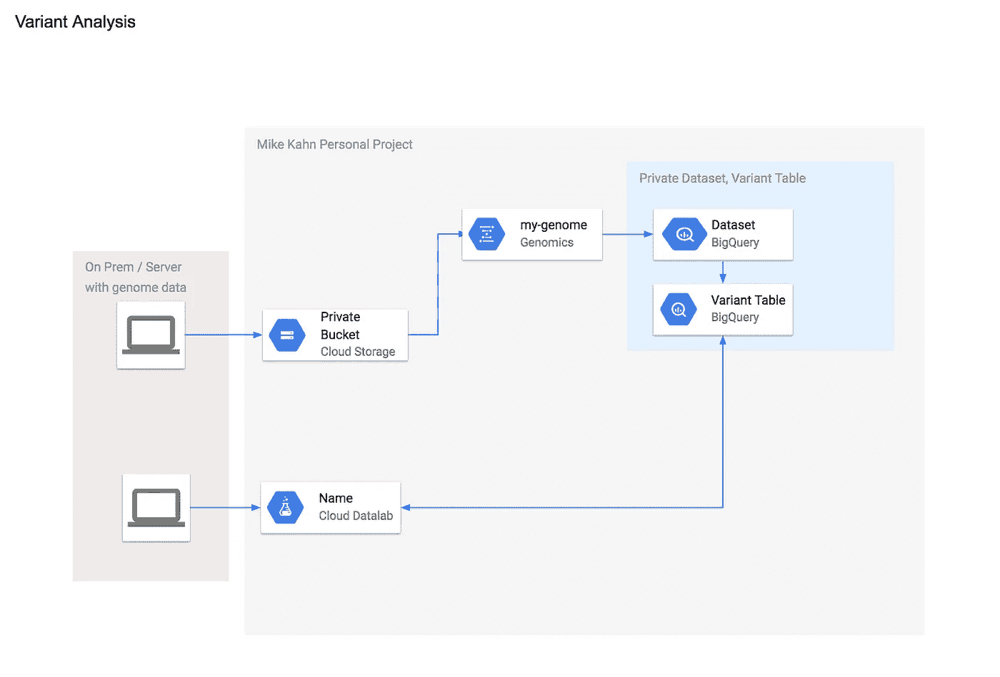
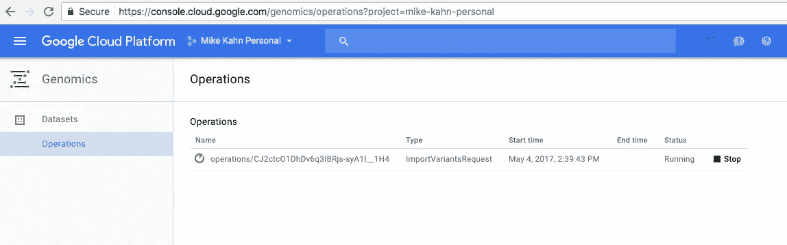
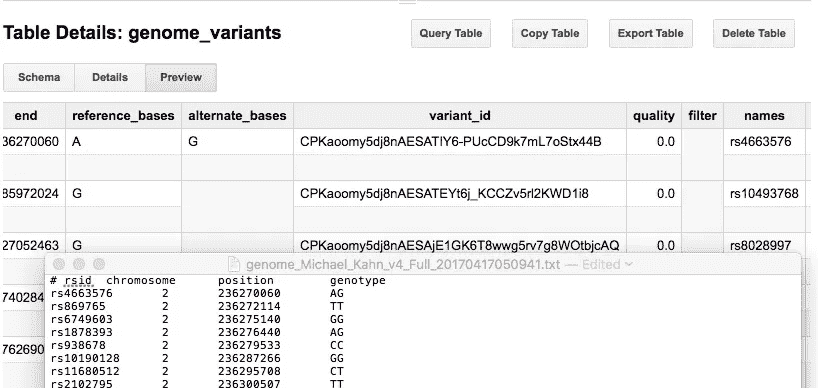
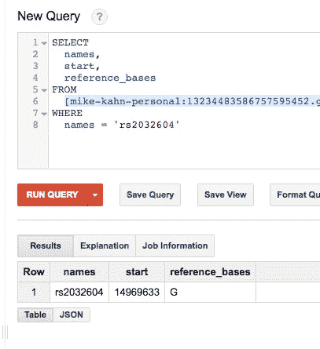
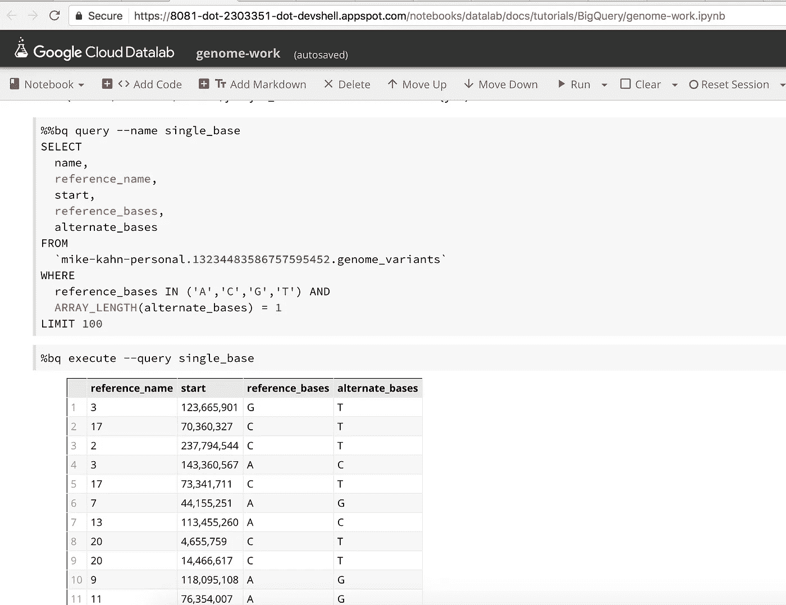

# 用 Google Genomics 和 BigQuery 解释 23andme 原始基因组数据

> 原文：<https://medium.com/google-cloud/interpreting-23andme-raw-genome-data-with-google-genomics-bigquery-and-cloud-datalab-f8540b6b7ef9?source=collection_archive---------0----------------------->

本文假设您已经使用了 23andme 这样的服务来获取原始基因组数据，或者您有兴趣了解 Google Genomics 和 BigQuery 如何帮助处理您的基因组并从中获得见解。如果你还没有使用过 [23andme](https://www.23andme.com/) ，我强烈推荐你使用它，如果你想了解更多关于你的家族史、易患病体质以及你对你的基因构成有任何程度的好奇心的话。如果你想消息灵通，今天就要有重要的个人信息。你也可以联系你以前从未见过的基因亲属，他们也在使用这项服务。我的一些三代表亲最近联系了我，这很酷。

23andme 允许您[浏览和下载](https://you.23andme.com/tools/data/)您的原始基因组数据，其中包含您的原始基因型数据，除了主要 23andme 服务中使用的数据之外，这些数据还可以让您进一步了解您的 DNA。23andme 浏览工具很好，它可以读取你的原始数据并链接到 dbSNP 页面([示例](http://www.ncbi.nlm.nih.gov/SNP/snp_ref.cgi?rs=rs2032604))，这可以给你基因组中每个 dna 标记的大量技术细节。在这篇文章中，我们将看到 Google Genomics 和 BigQuery 如何作为一个类似的引擎和工具来消化和查询大型数据集，即您的基因组。BigQuery 的奇妙之处在于，它可以使查询您的基因组更上一层楼，使在应用程序中查询这个大型数据集变得非常容易，并与现有的 dna 数据提供商(如 dbSNP)集成。有一些服务已经在为你做这些工作了，比如 Promethease 和 dna.land，它们做得非常好，但是也许你想自己做这些工作。请继续阅读。

要开始在 Google 云平台上了解更多关于您的基因组的信息，您可以将原始数据(将其转换为可接受的格式后)加载到 Google Genomics，这是一个基于常见基因组数据类型(vcd、fastq 或 BAM)创建数据集的管道。然后可以作为数据集导出到 BigQuery，开始使用原生 SQL 语句进行查询。在这篇文章中，我将解释这样做的一些工作部分，主要是浏览 Google Genomics load variants how-to-guide 并更进一步。

如果你刚刚开始，并且对这个感兴趣，我建议你在一天中有几个小时到半天的时间的时候做这件事。基因组探索仍然有些新，但这项工作有大量的资源和大量的深度。我们可以从基因组中获得什么样的见解，这真的很酷也很有趣。看看 SNPedia 上的流行标记:



SNPedia 流行的 SNPs

下面是整个过程的样子:



谷歌云平台上的变体分析

## **将 23andme 基因组原始数据转换为。vcf**

在您的 23andme 帐户中获取原始数据 zip

https://you.23andme.com/tools/data/

获取 [plink](https://www.cog-genomics.org/plink/1.9/) 将您的 23andme txt 文件转换为。vcf，Google Genomics 可接受的格式

## **将 23andme 文本转换为。通过 cli 的 vcf**

[https://www.biostars.org/p/102109/](https://www.biostars.org/p/102109/)

```
./plink — 23file genome_Michael_Kahn_v4_Full_20170417050941.txt — snps-only no-DI — recode vcf
```

## **遵循加载谷歌基因组变体指南**

[https://cloud.google.com/genomics/v1/load-variants](https://cloud.google.com/genomics/v1/load-variants)

将 vcf 上传到存储桶。确保安装[Cloud SDK](https://cloud.google.com/sdk/)并进行配置，这样就可以使用 gsutil 了。如果您愿意，也可以通过网络用户界面上传。

```
$ gsutil cp plink.vcf gs://kahn-personal/
```

创建基因组数据集

```
$ gcloud alpha genomics datasets create --name my-genomeCreated dataset [my-genome, id: 13234483586757595452].
```

查找您的数据集 id

```
$ gcloud alpha genomics datasets listID NAME13234483586757595452 my-genome
```

创建一个变量集，记下 id

```
$ gcloud alpha genomics variantsets create --dataset-id 13234483586757595452 --name my-variantsetCreated variant set [my-variantset, id: 11311180976008760690] belonging to dataset [id: 13234483586757595452].$
```

导入您的。vcf 从 plink 从您的 google 云存储桶

```
$ gcloud alpha genomics variants import --variantset-id 11311180976008760690 --source-uris gs://kahn-personal/plink.vcfdone: falsename: operations/CJ2ctcO1DhDv6q3IBRjs-syA1I__1H4
```

检查导入以确保一切正常:

```
$ gcloud alpha genomics operations describe operations/CJ2ctcO1DhDv6q3IBRjs-syA1I__1H4done: falsemetadata:‘@type’: type.googleapis.com/google.genomics.v1.OperationMetadataclientId: ‘’createTime: ‘2017–05–04T18:39:43Z’events: []labels: {}projectId: mike-kahn-personalrequest:‘@type’: type.googleapis.com/google.genomics.v1.ImportVariantsRequestformat: FORMAT_VCFinfoMergeConfig: {}normalizeReferenceNames: falsesourceUris:- gs://kahn-personal/plink.vcfvariantSetId: ‘11311180976008760690’name: operations/CJ2ctcO1DhDv6q3IBRjs-syA1I__1H4$$ gcloud --format=’default(error,done)’ alpha genomics operations describe operations/CJ2ctcO1DhDv6q3IBRjs-syA1I__1H4done: false
```

这需要一点时间，所以请耐心等待。您可以在 GCP 门户网站中查看导入状态。



大约 10 分钟后，我的导入完成了..真的！

```
$ gcloud --format=’default(error,done)’ alpha genomics operations describe operations/CJ2ctcO1DhDv6q3IBRjs-syA1I__1H4done: trueMichaels-iMac:plink_mac mkahnimac$
```

## **导出变量到大查询**

在 BigQuery web UI 中，使用您之前使用的数据集 ID 创建新的数据集

```
$ gcloud alpha genomics variantsets export 11311180976008760690 genome_variants --bigquery-dataset 13234483586757595452done: falsename: operations/CJ2ctcO1DhDs863IBRja_uecj7b9xgsMichaels-iMac:plink_mac mkahnimac$
```

检查导出操作的状态

```
$ gcloud --format=’default(error,done)’ alpha genomics operations describe operations/CJ2ctcO1DhDs863IBRja_uecj7b9xgsdone: falseMichaels-iMac:plink_mac mkahnimac$
```

这花了我大约 10-15 分钟

```
$ gcloud --format=’default(error,done)’ alpha genomics operations describe operations/CJ2ctcO1DhDs863IBRja_uecj7b9xgsdone: true
```

在这之后，exporting 花了一些时间来理解 BigQuery variants 模式，这样您就可以理解如何读取您的基因组。要开始解释你的基因组，你至少要看名字和参考碱基，替代碱基(基因型)。

[https://cloud . Google . com/genomics/v1/big query-variants-schema](https://cloud.google.com/genomics/v1/bigquery-variants-schema)

将表格详情预览与 23andme 文本文件进行比较，让自己适应一下。现在你的基因组被加载到 BigQuery 中，并准备好被解释。



## 做一些基本的探索！

当我第一次开始探索我的基因组时，我对我的祖先感兴趣。我想知道我和高部落，尤其是摩西的兄弟亚伦的基因有多接近。我发现今天人们共享的与这个祖先相关的[单倍群](https://en.wikipedia.org/wiki/Y-chromosomal_Aaron)是 J1c3 和 J2a (J-M410 ),它们与我 23 岁时报道的 [J-M172](https://en.wikipedia.org/wiki/Haplogroup_J-M172) 的父母单倍群相关。

根据维基百科的文章，J-M172 进一步分为 J-M410 和 J-M12 的几个当代分支。所以我的基因构成比这两个更接近科汉姆。

所以我进一步寻找，找到了一个由 23andme 给我的专门研究 J2-M172 单体群的[研究小组。](https://j2-m172.info/info/y-dna-tests/23andme-j2-haplogroups-snps/)

这个小组方便地列出了在这个单倍体组的基因组原始数据中发现的 SNP(标记)。

J2-M172:**RS 2032 604**(M172)T G

*   J2a-M410:不适用
*   J2a1-L26:不适用
*   j2a1a-M47:**I 3000069**(M47)G A，rs13447376 (M322) C A
*   J2a1b-M67: rs2032628 (M67) A T，i3000079 (M67) A T

为了进一步验证基因组，我可以使用 BigQuery 查询我的基因组来搜索这些标记。



使用大查询查找浏览我的 23andme 原始数据

从这一点开始，天空就是极限。现在，我可以编写 sql 查询来查找与我的遗传祖先相关的所有已识别的 SNP 标记，从而轻松地让我了解我的祖先与 Kohanim 部落有多接近。这太神奇了。这是基因组学研究中的一个小样本，目的是了解我们的祖先，解码我们的基因组。

## 下一步是什么？

现在你的 23andme 原始数据已经加载到 Google BigQuery 中，你可以用这些数据做很多事情。像 SNPedia 这样的资源允许你在数据库中查询基因型群体，比如帕金森病或老年痴呆症。

现在你可以快速查询你基因组的 SNPs(“SNPs”)，SNPs 是人与人之间常见的遗传变异。

SNP(单核苷酸多态性)是 DNA 中的生物标记，可以帮助定位与疾病和生活方式相关的基因。它们是人与人之间最常见的基因变异。SNPs 可以帮助跟踪疾病基因的遗传，在未来的研究中，将识别与糖尿病和癌症等疾病相关的 SNPs。相当酷。

查看 SNP media[https://www.snpedia.com/index.php/SNPedia](https://www.snpedia.com/index.php/SNPedia)用 BigQuery 创建查询。

也可以看看谷歌基因组烹饪书[http://googlegenomics.readthedocs.io/en/latest/](http://googlegenomics.readthedocs.io/en/latest/)

此处的其他社区资源:

*   【https://groups.google.com/forum/#! 论坛/谷歌-基因组学-讨论
*   【https://github.com/googlegenomics/getting-started-bigquery 
*   [https://github.com/googlegenomics/codelabs](https://github.com/googlegenomics/codelabs)
*   [dbSNP](https://www.ncbi.nlm.nih.gov/projects/SNP/)
*   [媒体](https://www.snpedia.com/index.php/SNPedia)

## 更进一步

使用 [Google Datalab](https://cloud.google.com/datalab/) 笔记本进行 BigQuery 工作，并根据您的基因组数据进行可视化。

与第三方服务(如 SNPedia)集成，并在 Google App Engine 上启动应用程序，以便轻松探索基因组数据。



带 BigQuery 的谷歌云数据实验室笔记本

## 定价

基因组学:存储-每月 0.022 美元/GB

BigQuery:存储—每月 0.02 美元/每 GB/每月 0.01 美元/每 GB，长期而言，查询每 TB 5 美元，第一个 1TB 免费

数据实验室:免费

我在 BigQuery 中的基因组变异表大约是 80MB。所以，对 GCP 做变异分析便宜得可笑！太棒了。愉快的探索。

查看[我的博客](http://www.mkahn.com/)了解更多更新。