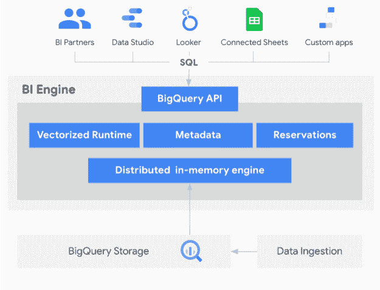
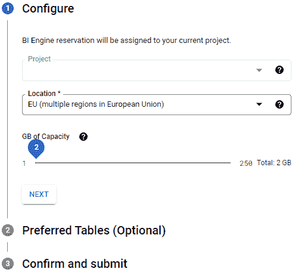
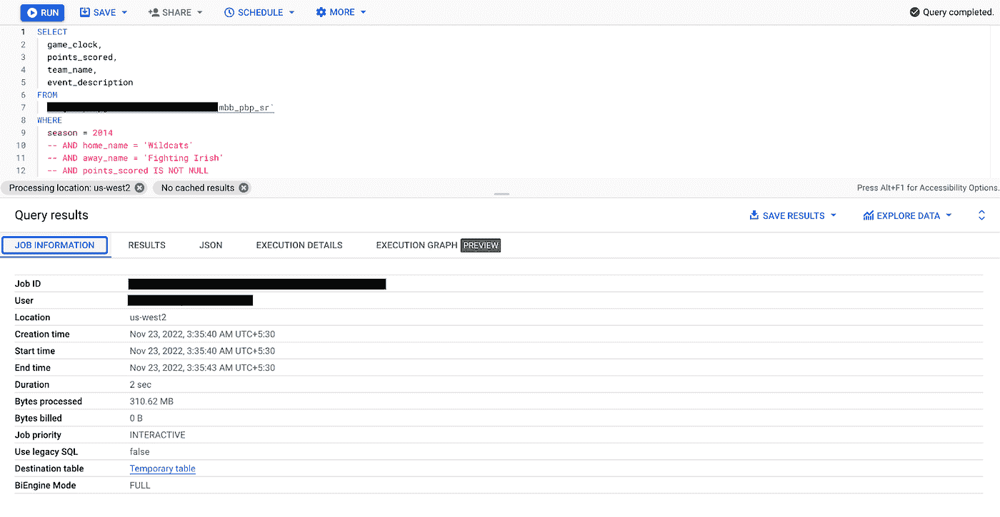
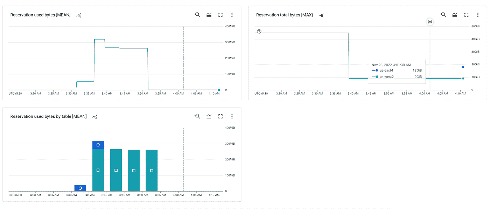
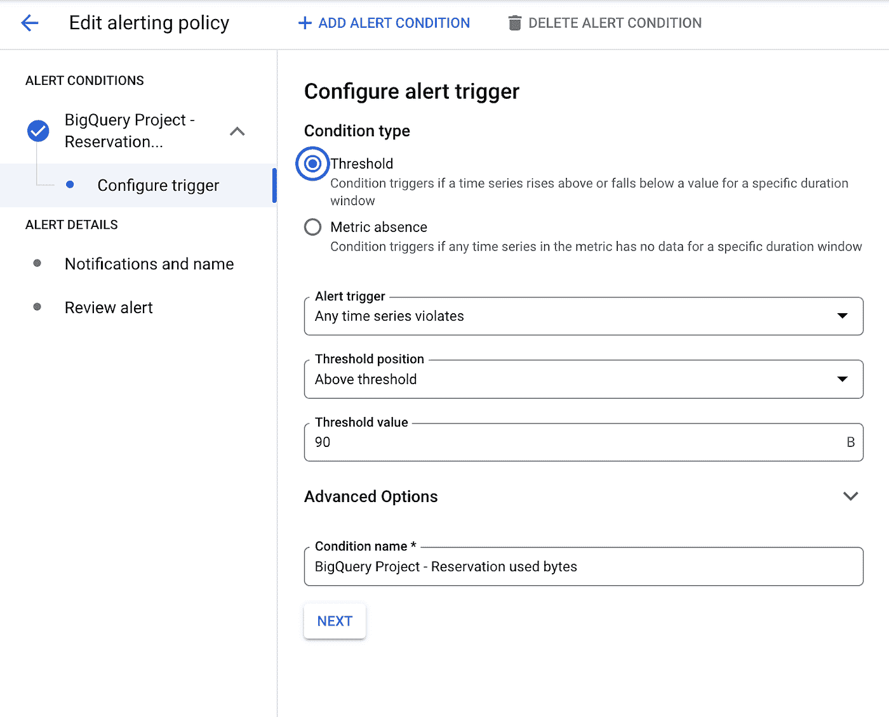
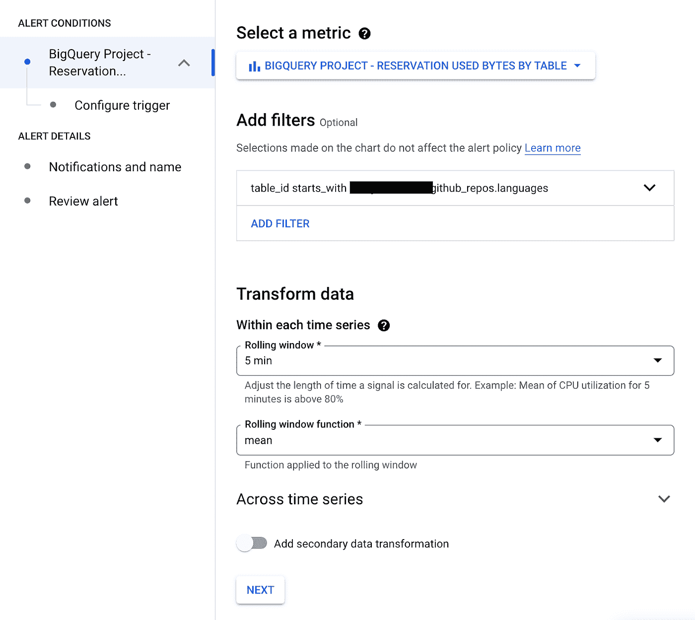
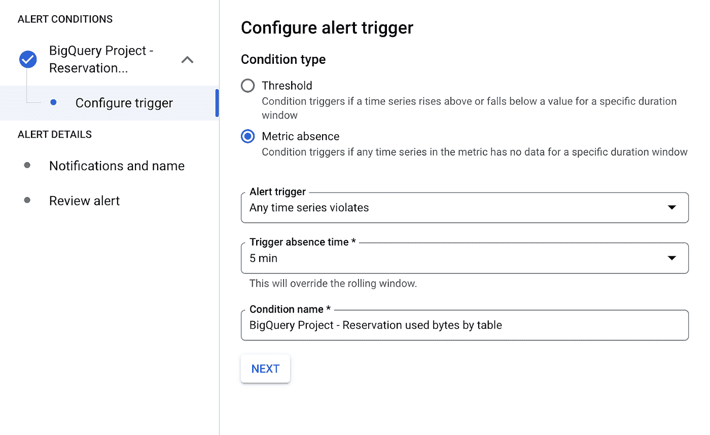
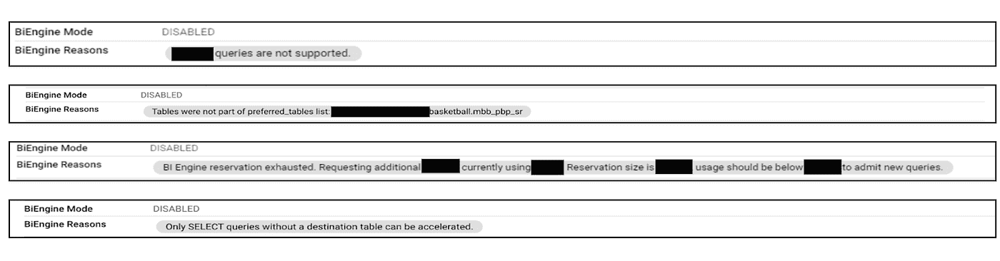

# 解释 BigQuery BI 引擎指标

> 原文：<https://medium.com/google-cloud/interpreting-bigquery-bi-engine-metrics-1f6b3d34560e?source=collection_archive---------1----------------------->

# BI 引擎是什么？

BigQuery BI Engine 是一种快速的内存分析服务，通过智能缓存最常用的数据来加速 BigQuery 中的许多 SQL 查询。BI Engine 可以加速来自任何来源的 SQL 查询，包括由数据可视化工具编写的查询，并且可以管理缓存表以进行持续优化。

了解更多:[什么是 BI 引擎？| BigQuery |谷歌云](https://cloud.google.com/bigquery/docs/bi-engine-intro)



BigQuery BI 引擎

BI 引擎提供了以下优势

1.  内存智能缓存可加速分析查询
2.  为优化良好的查询提供更高的吞吐量
3.  根据使用情形的需要，轻松手动扩展容量

# 保留双引擎容量

只需点击一个按钮，就可以非常简单地保留或编辑 BI 引擎容量。

保留附加到创建保留时确定的项目。



保留双引擎容量

欲了解更多信息:[保留 BI 引擎容量| BigQuery |谷歌云](https://cloud.google.com/bigquery/docs/bi-engine-reserve-capacity#create_a_reservation)

一旦我们保留了 BI 引擎的能力，项目中的查询就开始通过 BI 引擎加速。



通过 BI 引擎加速查询

运行 SQL 查询后，我们发现 BI 引擎能够根据查询作业信息加速查询。

但是如何才能更深层次的理解 BI 引擎的影响呢？

# 解释 BI 引擎利用率

我们可以使用以下方法来分析和解释 BI 发动机的使用和性能。

## 1.监控仪表板

我们可以使用监控仪表板来更好地了解 BI 引擎的利用率。

例如:我们可以在云监控中创建一个图表，绘制:

```
bigquerybiengine.googleapis.com/reservation/used_bytes over the 
bigquerybiengine.googleapis.com/reservation/total_bytes.
```

更多信息请参考- [用云监控| BigQuery | Google Cloud](https://cloud.google.com/bigquery/docs/bi-engine-monitor#acceleration_statistics) 监控 BI 引擎

有关可用谷歌云指标的完整列表，请参见[谷歌云指标](https://cloud.google.com/monitoring/api/metrics_gcp#gcp-bigquerybiengine)。



BI 引擎仪表板示例

由此得出的见解有助于:

*   检查一个 Google 云项目中使用的 BI 引擎缓存总容量
*   根据利用模式分析所需的容量，并相应地进行扩展
*   了解每个表的缓存使用情况。此指标显示每个区域报告使用情况的前 N 名表。更多信息详情[请点击](https://cloud.google.com/bigquery/docs/bi-engine-monitor#:~:text=BI%20Engine%20Top%20Tables%20Cached%20Bytes)
*   分析在首选表中添加任何表的需求

## 发信号

我们为从 BQ 和其他 BI 应用程序运行 SQL 查询的项目和位置预留了 BI 引擎容量。虽然 BI 引擎利用率预计会有波动，但我们可能希望主动监控由于以下原因在相当长的时间内观察到高利用率的峰值:

*   BI 引擎利用率超过 90%时进行监控并发出警报。
*   特定表的预订利用率大大低于或高于预期值。

为了确保团队在 BI 引擎利用率持续超过如此高的阈值时得到通知，我们可以创建以下警报策略:

1.  我们可以针对特定项目或位置创建警报，以监控超出或低于特定值的利用率阈值。

在下面的示例中，我们为度量添加了警报: *BigQuery 项目—预留已用字节> 90%*



如果 BI 引擎预留超过 90%，则设置警报

2.如果我们希望监控利用率阈值高于/低于某个特定值或不在前 N 个值中，我们可以在特定的表上创建警报，以指示和分析利用率阈值没有按预期加速的原因。

在下面的示例中，我们为度量的特定表添加了预警: *BigQuery 项目—按表列出的预留使用字节数—度量缺失*



特定表上的警报集



如果表使用的预留在特定持续时间内没有数据，则在特定表上设置预警

## 2.信息模式

我们还可以从 INFORMATION_SCHEMA 中查看[加速统计数据](https://cloud.google.com/bigquery/docs/bi-engine-monitor#acceleration_statistics)。为了更好地理解 BI 引擎加速的原因，请利用 INFORMATION_SCHEMA 中的统计数据。

更多详情请参考:[用云监控| BigQuery | Google Cloud](https://cloud.google.com/bigquery/docs/bi-engine-monitor#acceleration_statistics_in_information_schema) 监控 BI 引擎

以下是一些原因代码的示例-



# 有用的链接

以下是一些有用的资源，您可以使用这些资源了解更多有关 BI Engine 的信息。

**定价:** [定价| BigQuery:云数据仓库](https://cloud.google.com/bigquery/pricing#bi_engine_pricing)

**谷歌公共文档:**

[优化的 SQL 函数和运算符| BigQuery | Google Cloud](https://cloud.google.com/bigquery/docs/bi-engine-optimized-sql#unsupported-features)

[方法:projects . locations . updatebireservation | big query | Google Cloud](https://cloud.google.com/bigquery/docs/reference/reservations/rest/v1/projects.locations/updateBiReservation)

**谷歌云博客:**

[使用 BigQuery BI 引擎加速你的外观仪表盘|谷歌云博客](https://cloud.google.com/blog/products/data-analytics/faster-queries-with-bigquery-bi-engine)

**媒体博客:**

[通过 BI 引擎容量编排减少您的 BigQuery 账单|作者:莫顿·科多克| GDE |谷歌云](/google-cloud/ensure-the-right-bigquery-bi-engine-capacity-with-cloud-workflows-orchestration-lowering-your-9e2634c84a82)

[Google BI 引擎统计仪表板| Philipp Heinrich | Google Cloud-Community | Medium](/google-cloud/google-bi-engine-statistics-dashboard-d210de6c5295)