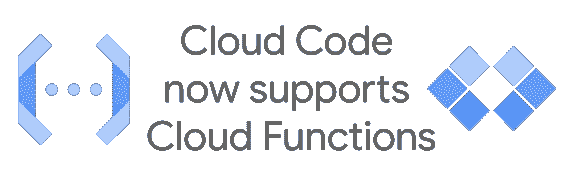
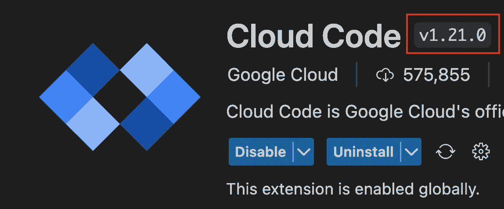
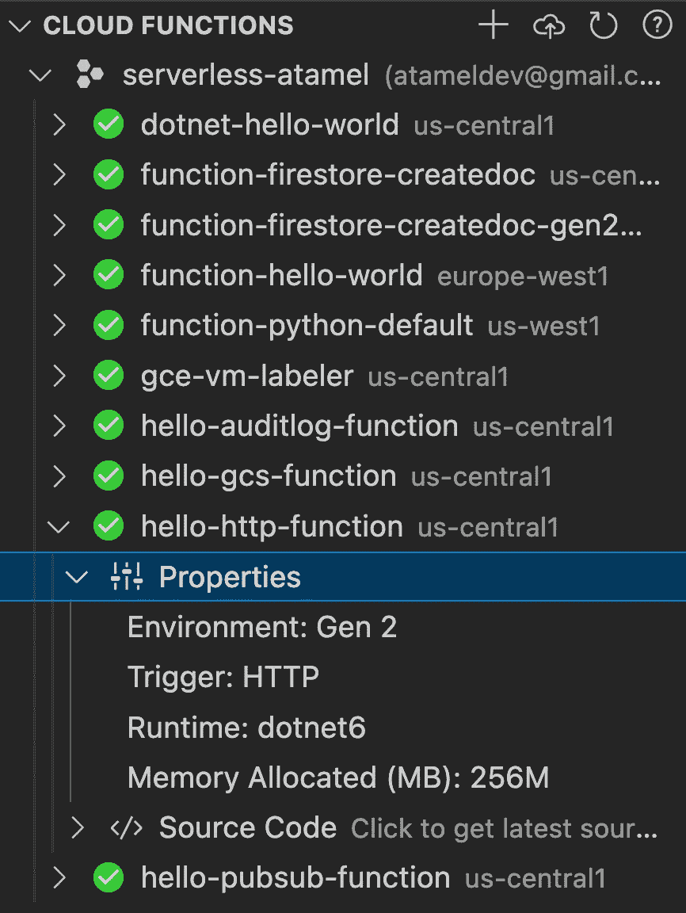
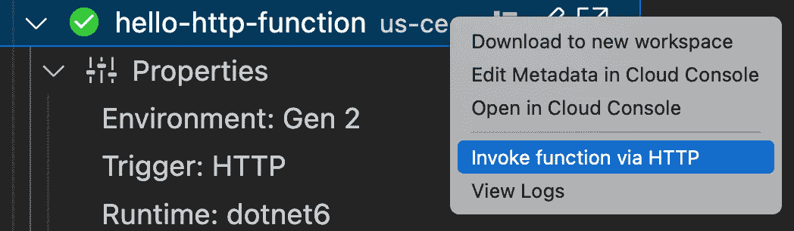
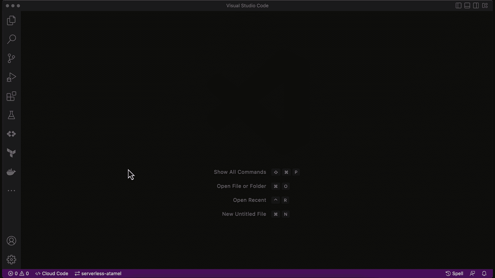
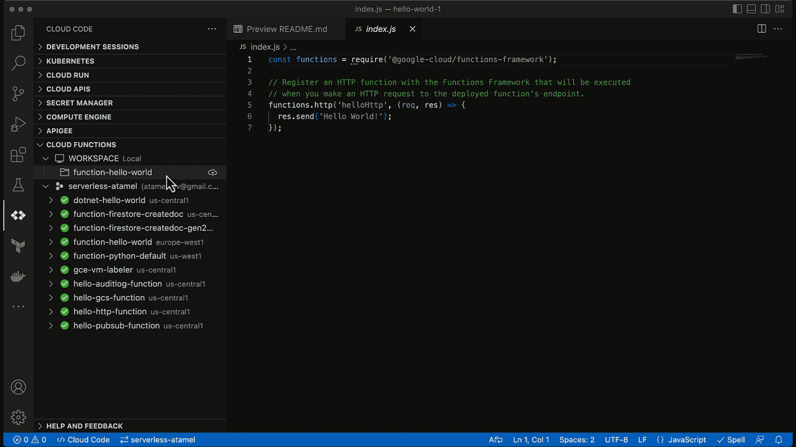
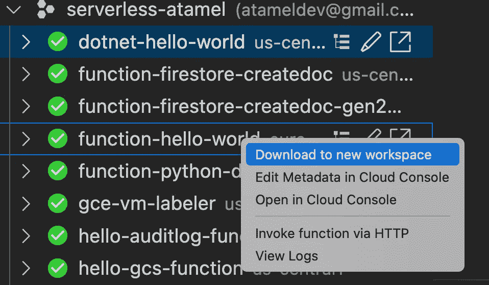
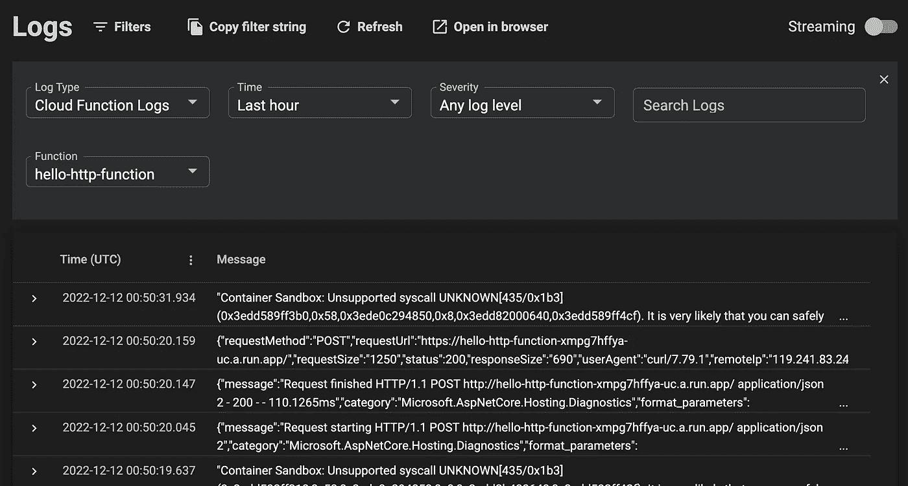

# 在云代码中引入云函数支持

> 原文：<https://medium.com/google-cloud/introducing-cloud-functions-support-in-cloud-code-8d14e48d18d5?source=collection_archive---------1----------------------->

[云代码](https://cloud.google.com/code)已经为 Kubernetes 和云运行应用的开发周期提供 IDE 支持有一段时间了。**很高兴** [**报告**](https://github.com/GoogleCloudPlatform/cloud-code-vscode/blob/master/CHANGELOG.md#version-1210-dec-2022) **云代码 2022 年 12 月版(1.21.0)现已支持云功能！**

在云功能支持的第一个版本中，您可以:

*   使用云函数浏览器查看项目的云函数属性和源代码。
*   下载您的云函数以在本地编辑您的代码，然后配置您的本地工作区以直接从云代码部署这些更改。
*   从 VS 代码中调用 HTTP 触发的函数。
*   使用云代码日志查看器查看来自云功能的日志。

让我们仔细看看。

# 装置

如果您一直在使用云代码，那么您可能已经在 VS 代码中安装了它。你只需要通过在扩展下检查来确保你有 2022 年 12 月版本(1.21.0)的云代码:

如果没有，您可以遵循此处的安装说明[。](https://cloud.google.com/code/docs/vscode/install)

# 浏览和调用部署的功能

你会注意到左边有一个新的云功能浏览器。在这里，您可以看到已部署函数的列表以及函数的详细信息，如触发器类型(HTTP 触发的、事件触发的)和运行时(Node.js、Java、。网等。)的函数。

您可以通过右击并选择`Invoke function via HTTP`来快速测试 HTTP 触发的功能。这会向部署的函数发送一个带有正确身份验证头的 HTTP 请求。

这对于快速测试 HTTP 触发的函数来说非常方便，但是它目前不能用于事件触发的函数，因为这些函数需要 CloudEvent 而不是普通的 HTTP 调用。它也只适用于已部署的函数，不适用于本地运行的函数。

# 创建和部署新功能

您还可以通过云代码创建和部署新功能。

要创建新功能，请执行以下操作:

*   单击 VS 代码底部的云代码工具栏或云函数浏览器右侧的加号(+)图标。
*   选择`New Application`
*   选择`Cloud Functions`
*   为支持的语言之一选择模板:Node.js、Python、Go、Java

这将创建一个新的工作区，使用 HTTP 触发的 Hello World Cloud 函数和您选择的语言。

要部署该功能，请单击工作区文件夹旁边的 deploy 图标，并按照提示选择您的项目、区域和运行时。

# 编辑已部署的功能

您还可以通过将已部署的功能下载到新的工作空间来编辑它:

这会将函数的代码下载到本地的一个新工作区。一旦进行了编辑，就可以部署它，类似于部署新功能。

# 查看已部署功能的日志

一旦您部署并运行了该功能，您可以通过右键单击该功能并选择`View logs`来查看日志。这将在云代码中打开日志查看器:

# 限制

云代码中新的云函数支持使得直接从 VS 代码中创建和部署云函数变得更加容易，但是请记住以下限制:

*   模板只适用于 HTTP 触发的函数。事件触发函数还没有模板。
*   测试只对已部署的 HTTP 触发的函数有效。对事件触发函数的本地运行函数没有测试支持。
*   模板和部署只支持四种语言(Node.js、Python、Go 和 Java)。我特别怀念。净支持。

关于最后一点，云代码提供了一个优秀的扩展机制，您可以在其中为示例应用程序添加模板。在以后的博文中，我将向您展示如何为这些缺失的特性创建和使用自己的模板，例如。NET 函数和事件触发函数。

查看[为官方文档创建并部署一个使用云代码的功能，而不是使用](https://cloud.google.com/code/docs/vscode/create-deploy-function)的代码，如果您有任何问题或反馈，请在 Twitter [@meteatamel](https://twitter.com/meteatamel) 上联系我。

*原发布于*[*https://atamel . dev*](https://atamel.dev/posts/2022/12-12_introduce_functions_in_cloud_code/)*。*