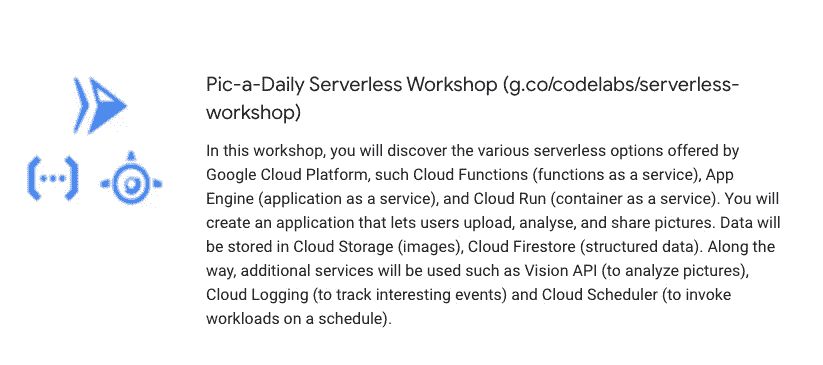
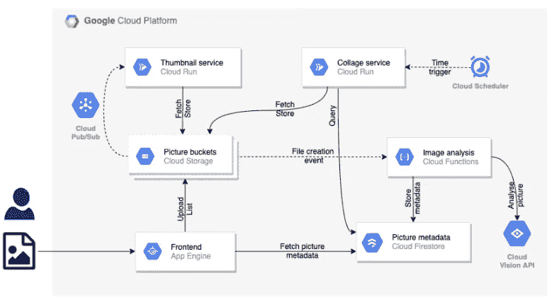
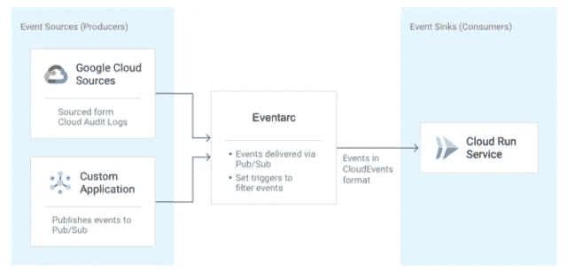
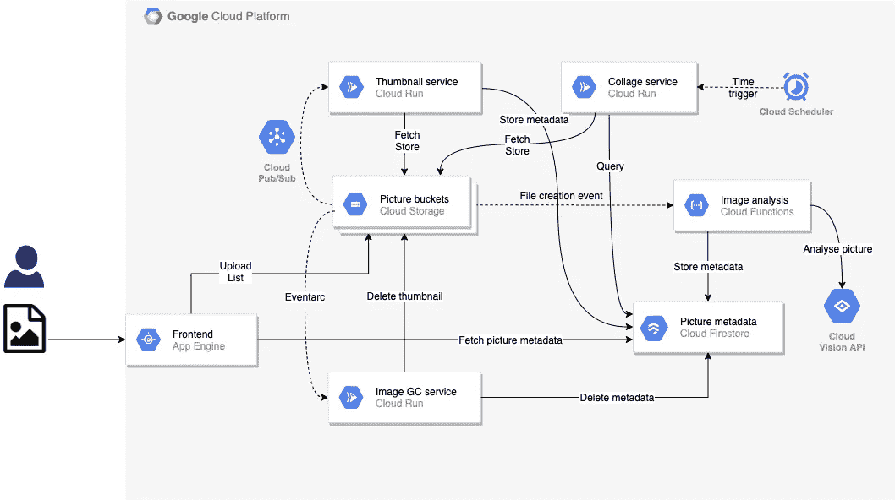

# 在 Pic-a-Daily 无服务器研讨会中介绍 Eventarc

> 原文：<https://medium.com/google-cloud/introducing-eventarc-in-pic-a-daily-serverless-workshop-963e29785b75?source=collection_archive---------2----------------------->

# pic-a-每日无服务器研讨会

你可能知道， [Guillaume Larforge](https://twitter.com/glaforge) 和我有一个[的无服务器日常摄影工作室](https://codelabs.developers.google.com/serverless-workshop/)。在本次研讨会中，我们使用 Google Cloud 无服务器技术(如云功能、应用程序引擎、云运行等)构建了一个图片共享应用程序。



我们最近在车间增加了一项新服务。在这篇博文中，我想谈谈这项新服务。我还想谈谈 [Eventarc](https://cloud.google.com/blog/products/serverless/build-event-driven-applications-in-cloud-run) 以及它如何帮助我们将事件添加到新服务中。

# 以前的建筑

这是之前 Pic-a-Daily 的架构:



概括一下:

1.  用户通过前端上传图片到图片桶。
2.  图像分析云功能接收上传事件，提取图像的元数据并保存到 Firestore。
3.  缩略图服务通过发布/订阅接收上传事件，调整图像大小并保存到缩略图桶。
4.  拼贴服务创建缩略图拼贴。

# 图像垃圾收集器服务

以前架构的一个问题是图像删除。当图像从图片桶中删除时，缩略图桶中图像的缩略图和 Firestore 中图像的元数据仍然存在。

为了解决这个问题，我们创建了一个新的云运行服务，图像垃圾收集器，在图像被删除后进行清理。

为了将云存储事件发送到图像垃圾收集器，我们可以使用 Pub/Sub 推送消息，就像我们在缩略图服务中所做的那样。然而，我们决定使用 Eventarc 来代替。

# Eventarc 是什么？

我们[早在 10 月份就宣布](https://cloud.google.com/blog/products/serverless/build-event-driven-applications-in-cloud-run) Eventarc 是一个新的事件功能，允许你从 60 多个谷歌云资源发送事件到云运行。这是通过从各种来源读取审计日志并将它们作为 CloudEvents 发送到云运行服务来实现的。还可以选择从自定义应用程序的发布/订阅主题中读取事件。



我们决定尝试 Eventarc 作为获取事件的新方法。我们还想避免我们必须在缩略图服务中进行的所有设置，以便通过发布/订阅将云存储事件发送到云上。参见[详情](https://codelabs.developers.google.com/codelabs/cloud-picadaily-lab2?hl=en&continue=https%3A%2F%2Fcodelabs.developers.google.com%2Fserverless-workshop%2F#9)。

# 当前架构

当前的架构现在看起来是这样的，带有 Eventarc 和图像垃圾收集器:



# 图像垃圾收集器代码

你可以在这里查看图像垃圾收集器[的完整代码。我将强调代码的一些部分。](https://github.com/GoogleCloudPlatform/serverless-photosharing-workshop/tree/master/services/garbage-collector)

映像垃圾收集器从 Eventarc 接收封装到 CloudEvents 中的审计日志。它首先使用 [CloudEvents SDK](https://www.npmjs.com/package/cloudevents) 读取 CloudEvent:

```
const { HTTP } = require("cloudevents");
...
const cloudEvent = HTTP.toEvent({ headers: req.headers, body: req.body });
```

CloudEvent 的`data`字段有实际的审计日志。有 [Google Events](https://www.npmjs.com/package/@google/events) 库将数据解析成审计日志:

```
const {toLogEntryData} = require('@google/events/cloud/audit/v1/LogEntryData');...const logEntryData = toLogEntryData(cloudEvent.data);
```

剩下的代码是从事件中提取 bucket 和 object name，然后从 thumbnails bucket 和 Firestore 集合中删除它:

```
const tokens = logEntryData.protoPayload.resourceName.split('/');
const bucket = tokens[3];
const objectName = tokens[5];// Delete from thumbnails
try {
    await storage.bucket(bucketThumbnails).file(objectName).delete();
    console.log(`Deleted '${objectName}' from bucket '${bucketThumbnails}'.`);
}
catch(err) {
    console.log(`Failed to delete '${objectName}' from bucket '${bucketThumbnails}': ${err}.`);
}// Delete from Firestore
try {
    const pictureStore = new Firestore().collection('pictures');
    const docRef = pictureStore.doc(objectName);
    await docRef.delete();console.log(`Deleted '${objectName}' from Firestore collection 'pictures'`);
}
catch(err) {
    console.log(`Failed to delete '${objectName}' from Firestore: ${err}.`);
}
```

# 创建触发器

最后，我们需要通过 Eventarc 将云存储中的事件连接到新服务。这是通过一个触发器实现的:

```
gcloud beta eventarc triggers create trigger-${SERVICE_NAME} \
  --destination-run-service=${SERVICE_NAME} \
  --destination-run-region=europe-west1 \
  --matching-criteria="type=google.cloud.audit.log.v1.written" \
  --matching-criteria="serviceName=storage.googleapis.com" \
  --matching-criteria="methodName=storage.objects.delete" \
  --[service-account=${PROJECT_NUMBER}-compute@developer.gserviceaccount.com](mailto:service-account=${PROJECT_NUMBER}-compute@developer.gserviceaccount.com)
```

请注意，我们正在匹配云存储的审计日志，并专门寻找`storage.objects.delete`事件。

如果你想试试我们的工作室和新实验室，这里有一些链接:

*   [Pic-a-Daily 无服务器车间](https://codelabs.developers.google.com/serverless-workshop/)(g.co/codelabs/serverless-workshop)
*   [Pic-a-daily: Lab 5 —图像垃圾收集器](https://codelabs.developers.google.com/codelabs/cloud-picadaily-lab5)
*   [车间代码](https://github.com/GoogleCloudPlatform/serverless-photosharing-workshop)

一如既往，如有任何问题/反馈，请随时在 Twitter [@meteatamel](https://twitter.com/meteatamel) 上联系我。

*最初发布于*[*https://atamel . dev*](https://atamel.dev/posts/2020/11-30_eventarc-serverless-workshop/)*。*