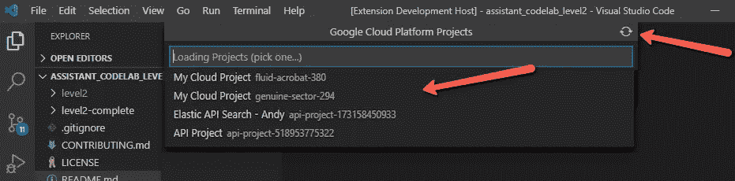

# 介绍 VS 代码的“GCP 项目切换器”扩展——我的周末项目

> 原文：<https://medium.com/google-cloud/introducing-gcp-project-switcher-extension-for-vs-code-my-weekend-project-cb03976f47c1?source=collection_archive---------3----------------------->

从 **Visual Studio 代码**为**谷歌云平台**编写、调试和部署工作非常顺利，因为您有多种选择来与**谷歌云**产品交互:

*   终端窗格，使用 [**gcloud**](https://cloud.google.com/sdk/docs/quickstart) 命令行工具
*   通过使用 [VSCode **任务**](https://code.visualstudio.com/docs/editor/tasks) 来自动化命令[【我的设置】](https://gist.github.com/pentium10/b5c260f060dcdbe8a9882189bf59f9e7)
*   [**云码**](https://cloud.google.com/code) 工具箱

所有这些工作都基于您的环境设置的**项目**。

> 然而，VS 代码屏幕缺少关键信息:**显示当前项目**。没有简单的方法可以从 IDE 中切换项目。直到现在！

介绍 VS 代码的“ [GCP 项目切换器](https://marketplace.visualstudio.com/items?itemName=pentium10.vscode-gcp-project-switcher)”扩展。

VS 代码的“GCP 项目切换器”扩展

# 带打字稿的周末项目

所以，在 11 月初的这个周末，我有一些空闲时间，因为没有任何我通常做的会议发言机会。周末证明是富有成效的，因为我能够在两天的小工作之后发布扩展。还有，我分享一个秘密，这是我第一个用 Typescript 写的项目进入“生产”。这是学习 Typescript 如何工作、编译和运行的好方法。

> 开发者喜欢看到哪个 Git **分支**在上面。我总是着迷于如何将这些巧妙的应用到 Linux 系统上的**外壳**、**屏幕**和 **tmux** 实例中。

原来在 **VS 代码**上，你可以创建自己的扩展，将功能添加到 IDE 的几乎任何部分，但我的兴趣是状态栏。

[**GCP 项目切换器**](https://marketplace.visualstudio.com/items?itemName=pentium10.vscode-gcp-project-switcher) 扩展创建一个状态栏项。它使用 **gcloud** 工具获取当前项目，并在后台刷新，以便处理外部更改。

安装了 GCP 项目切换器扩展的 VSCode 状态栏。

当点击状态栏项目时，一个*快速选择窗格*打开，你可以通过项目名称或 ID*搜索*。为了让窗格更快——因为拉取项目列表有延迟——所有的轮询都在后台完成并被缓存。

假设有一个新项目不在列表中，有一个 ***刷新*** 图标来强制轮询项目列表。这有助于快速开始新创建的项目。

Google 云平台项目切换器窗格

> **限制:****g cloud**实用程序必须在您的路径中可用，因为扩展使用它来在您的环境中轮询和切换项目。我计划添加一个配置选项，为那些没有在路径中全局可用的人定制 gcloud 工具的路径。

未来的工作已经计划好了，我想维护一个“最近”用过的项目的列表，并在顶部填充最近的项目。

从 VS 代码扩展面板或者从[市场](https://marketplace.visualstudio.com/items?itemName=pentium10.vscode-gcp-project-switcher)获取扩展。你也可以在市场上发布评论和评级。

该扩展是开源的，你可以通过 Github 贡献。

**加成:**一个样本 [***。vs code/tasks . JSON***](https://gist.github.com/pentium10/b5c260f060dcdbe8a9882189bf59f9e7)定义部署云工作流，这里的快速运行窗格扩展是。

