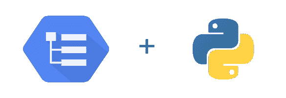
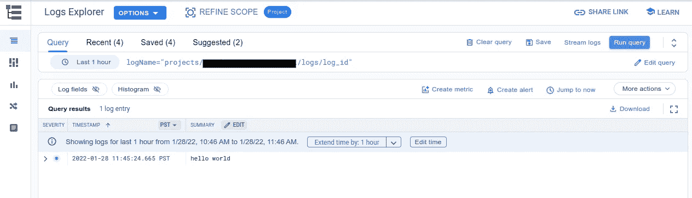
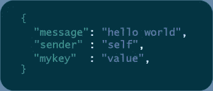

# 介绍 Google 云日志 Python 3 . 0 . 0 版

> 原文：<https://medium.com/google-cloud/introducing-google-cloud-logging-python-v3-0-0-4c548663bab4?source=collection_archive---------0----------------------->

## 使用 Google Cloud 管理应用程序的 Python 日志和相关元数据



我们很高兴地宣布发布了 Google Cloud Python 日志库的重大更新！

3.0.0 版让 Python 开发人员更容易从 Google Cloud 发送和读取日志，提供对应用程序中正在发生的事情的实时洞察。如果您是使用 Google Cloud 的 Python 开发人员，现在是尝试云日志记录的绝佳时机！

如果你对`[google-cloud-logging](https://pypi.org/project/google-cloud-logging/)`库不熟悉，入门很简单。首先，使用 [pip](https://www.google.com/search?q=pip&oq=pip&aqs=chrome..69i57j35i39j0i67l3j69i60j69i65j69i60.1209j0j1&sourceid=chrome&ie=UTF-8) 下载库:

```
$ pip install "google-cloud-logging>=3.0.0"
```

现在，您可以设置客户端库来使用 [Python 的内置“日志”库](https://docs.python.org/3/howto/logging.html)。这样做将使所有标准 Python 日志语句开始向 Google Cloud 发送数据:

```
# set up the Google Cloud Logging python client library
import google.cloud.logging
client = google.cloud.logging.Client()
client.setup_logging()# use Python’s standard logging library to send logs to GCP
import logging
logging.warning(“Hello World”)
```

我们建议[使用标准的 Python 日志接口](https://googleapis.dev/python/logging/latest/std-lib-integration.html)来创建日志，如上所示。但是，如果您需要访问其他 [Google Cloud Logging 特性](https://cloud.google.com/logging)(读取日志、管理[日志接收器](https://cloud.google.com/logging/docs/export/configure_export_v2)等)，您可以[直接使用 Google . Cloud . Logging](https://googleapis.dev/python/logging/latest/direct-lib-usage.html):

```
import google.cloud.logging
client = google.cloud.logging.Client()
logger = client.logger(name="log_id")# read logs from GCP
client.list_entries(max_size=5)# write log to GCP
logger.log("hello world", resource={"type":"global", "labels":{}})
```



以下是[新版本](https://github.com/googleapis/python-logging/blob/eac5e2db83f83b24962524fd9e0d7afa09e2785b/UPGRADING.md)的一些主要特性:

**支持更多云环境**


以前版本的`google-cloud-logging`只支持 [App 引擎](https://cloud.google.com/appengine)和 [Kubernetes 引擎](https://cloud.google.com/kubernetes-engine)。用户反映，该库偶尔会在云运行和云功能等无服务器环境中丢弃日志。这是因为库会通过网络批量发送日志。当无服务器环境停止运行时，未发送的批处理可能会丢失。

3.0.0 版通过利用 GCP 内置的[结构化 JSON 日志功能](https://cloud.google.com/logging/docs/structured-logging) (GKE、云运行或云函数)修复了这个问题。如果该库检测到它运行在支持结构化日志记录的环境中，它将自动使用新的`[StructuredLogHandler](https://googleapis.dev/python/logging/latest/handlers-structured-log.html),`来将日志作为 JSON 字符串输出到标准输出。然后，Google Cloud 的内置代理将解析日志，并将其提交给云日志记录，即使生成日志的代码已经停止运行。

结构化日志记录在无服务器环境中更加可靠，它允许我们在 3.0.0 版中支持所有主要的 GCP 计算环境。但是，如果您喜欢像以前一样通过网络发送日志，您可以使用`[CloudLoggingHandler](https://googleapis.dev/python/logging/latest/handlers-cloud-logging.html)`实例手动设置该库:

```
from google.cloud.logging.handlers import CloudLoggingHandler
from google.cloud.logging_v2.handlers import setup_logging# explicitly set up a CloudLoggingHandler to send logs over the networkhandler = CloudLoggingHandler(client)
setup_logging(handler)import logging
logging.warning(“Hello World”)
```

**元数据自动检测**


在对应用程序进行故障排除时，在应用程序日志中获取尽可能多的环境信息会很有用。`google-cloud-logging`试图通过检测和附加关于您的环境的元数据到每个日志消息来帮助这个过程。目前支持以下字段:

*   `[resource](https://cloud.google.com/logging/docs/reference/v2/rest/v2/MonitoredResource)`:日志来源于
    的 Google 云资源——例如，函数、GKE 或云运行
*   `[httpRequest](https://cloud.google.com/logging/docs/reference/v2/rest/v2/LogEntry#HttpRequest)`:关于日志上下文中 HTTP 请求的信息
    ——目前支持 Flask 和 Django
*   `[sourceLocation](https://cloud.google.com/logging/docs/reference/v2/rest/v2/LogEntry#LogEntrySourceLocation)`:文件、行和函数名
*   `[trace](https://cloud.google.com/logging/docs/reference/v2/rest/v2/LogEntry)`、`[spanId](https://cloud.google.com/logging/docs/reference/v2/rest/v2/LogEntry)`、`[traceSampled](https://cloud.google.com/logging/docs/reference/v2/rest/v2/LogEntry)` : [云跟踪](https://cloud.google.com/trace)元数据
    –支持 [X-Cloud-Trace-Context](https://cloud.google.com/trace/docs/setup#force-trace) 和 [w3c 透明](https://www.w3.org/TR/trace-context/#traceparent-header)跟踪格式

该库将尽可能尝试填充这些数据，但开发人员也可以使用该库显式设置这些字段:

```
logging.info("hello", extra={
    "labels": {"foo": "bar"},
    "http_request": {"requestUrl": "localhost"},
    "trace": "01234"
})
```

## **标准库集成中的 JSON 支持**



Google Cloud Logging 支持 LogEntries 的[字符串和 JSON 有效负载](https://cloud.google.com/logging/docs/structured-logging)，但是到目前为止， [Python 标准库集成](https://googleapis.dev/python/logging/latest/std-lib-integration.html)只能发送带有字符串有效负载的日志。

在“Google-cloud-logging”3 . 0 . 0 版中，可以用两种方式记录 JSON 数据:

1.  记录一个 JSON 可解析的字符串:

```
import logging
import jsondata_dict = {"hello": "world"}
logging.info(json.dumps(data_dict))
```

1.  使用 Python 日志记录的“extra”参数传递“json_fields”字典:

```
import loggingdata_dict = {"hello": "world"}
logging.info("message field", extra={"json_fields": data_dict})
```

## 后续步骤

*   有关最新版本的更多信息，请查看完整的 [v3.0.0 迁移指南](https://googleapis.dev/python/logging/latest/UPGRADING.html)
*   有关开发者文档，请参见`[google-cloud-logging](https://googleapis.dev/python/logging/latest/index.html)` [用户指南](https://googleapis.dev/python/logging/latest/index.html)
*   如果您对最新版本有任何反馈，或者想做出任何贡献，请随时在[我们的 GitHub repo](https://github.com/googleapis/python-logging) 上提出问题
*   如果您想了解在 GCP 上检测代码的可观测性和可靠运行工作负载的最佳实践，请尝试[云操作沙箱](https://cloud-ops-sandbox.dev/)