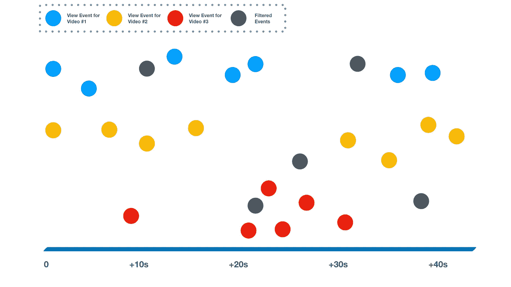

# 带流处理的事件驱动系统简介

> 原文：<https://medium.com/google-cloud/introduction-to-event-driven-systems-with-stream-processing-8b169a9fae12?source=collection_archive---------4----------------------->

本文档讨论流处理事件驱动系统的基础。这是[构建事件驱动的云应用和服务](/@ratrosy/building-event-driven-cloud-applications-and-services-ad0b5b970036)教程系列的一部分。

# 介绍

流处理器是流处理事件驱动系统的核心，它将这种模式与反应式模式区分开来:处理器将输入、数据处理和输出捆绑在一起，同时单独管理自己的执行。开发人员不再自己从头开始编写代码；相反，它们在所选流处理器的上下文中操作数据。

这种模式在事件方面提供了更高层次的抽象。大多数流处理系统不是对每个事件都做出反应，而是用流的语言说话，将动作作为一个整体应用于流。流处理器帮助从流中提取状态，并将其传递回开发人员以进行进一步的操作或分析。许多流处理解决方案也是在考虑分布式处理的情况下构建的；如果您有一个足够强大的集群来支持工作流，它们可以轻松处理大量的流数据，几乎不需要人工干预。

以 Youtube 中的视图计数为例，可能更容易理解流处理事件驱动系统的独特性质:每次打开 Youtube 视频，Google 都会显示其当前的视图计数，并将数字加 1。该用例看起来很简单，但考虑到 Youtube 的规模(每天超过 50 亿次观看)，它在工程上可能相当具有挑战性，因为该功能是读写密集型的:

*   如果您使用 SQL/NoSQL 数据库来保存计数，由群集写入(视图计数递增 1)请求导致的持续锁定和释放将严重影响性能。对于热门视频来说尤其如此，这些视频每分钟的访问量可能高达 30，000 次。
*   如果您使用事件源持久化数据，那么持续的写入将不是问题；然而，使用这些解决方案，获取视图计数在计算上变得低效，因为每次读取都需要扫描和计算所有相关数据。您可能必须缓存结果，并冒着向查看者提供陈旧数据的风险。

另一方面，流处理事件驱动系统通过关注大图来支持这种用例:每个视图成为流中的一个事件，流处理器在内存中动态计算视图计数**。换句话说，它从单个视图计数事件流中提取出**状态**(聚合视图计数)，以便下游可以得到他们真正想要的(视图计数)，而不必担心不太重要的单个部分(视图)。通过一点分布式处理的魔力，这种模式可以在任何规模上轻松处理(几乎)实时视图计数(以及大量其他类似的用例)，许多企业和组织已经在生产中采用了它。**

**在本教程中，您将使用 [Apache Flink](https://flink.apache.org/) 构建一个类似(但基本)的视图计数流处理系统，Apache Flink 是该领域中普遍采用的流处理器之一，其中一个应用程序通过 [Cloud Pub/Sub](https://cloud.google.com/pubsub/) 发送视图事件，Apache Flink 使用事件流帮助计数视图。演示项目使用 Java(对于 Apache Flink)和 Python(对于示例应用程序)。**

# **架构概述**

****

**工作流程如下:**

1.  **该应用程序通过云发布/订阅发布大量视图事件。**
2.  **Apache Flink 集群从云发布/订阅中获取事件，并开始处理流。更具体地说，**

*   **(`keyBy`)根据视频的 id，集群将流划分为并行、分布式处理**
*   **(`filter`)集群过滤所有过时或重复的事件**
*   **(`flatMap`)集群将事件转换成更容易处理的格式，从每个事件中删除事件 ID 属性**
*   **(`keyBy`)集群根据视频的 id 再次分割流**
*   **(`timeWindow`)群集对最近 10 秒内到达的所有事件进行分组**
*   **(`reduce`)群集计算窗口中每个视频的总观看次数**

# **设置**

1.  **在你的机器上安装 [Java 8](https://cloud.google.com/java/docs/setup) (使用 Gradle 作为构建自动化工具)和 [Python 3](https://cloud.google.com/python/setup) 。**
2.  **安装[谷歌云 SDK](https://cloud.google.com/sdk/) 。**
3.  **下载阿帕奇弗林克。**
4.  **[在你的谷歌云平台项目](https://cloud.google.com/pubsub/docs/quickstart-console)中创建一个云发布/订阅主题和该主题的云发布/订阅订阅。使用`Pull`类型进行订阅。**
5.  **从 GitHub 克隆源代码。**

```
git clone [https://github.com/michaelawyu/stream-processing-demo](https://github.com/michaelawyu/stream-processing-demo)
```

# **理解代码**

**Apache Flink 作为该项目的流处理器，管理工作流的输入、数据转换和输出，其细节可在`[StreamingJob.java](https://github.com/michaelawyu/stream-processing-demo/blob/master/src/main/java/org/example/demo/StreamingJob.java)`获得。**

## **投入**

**Apache Flink 提供了对连接到云发布/订阅主题的内置支持，这将自动提取消息(事件)。配置如下:**

**设置输入后，Flink 返回一个`DataStream`，你可以在上面操作。此时，由于没有指定数据转换，流看起来如下(假设已经发布了许多事件或视图):**

****

## **步骤#1:分区(keyBy)**

**您将应用的第一个操作是使用视频 id 对流进行分区:**

**在这一步之后，流看起来如下:**

****

## **第二步:过滤**

**接下来，过滤流并删除所有重复的事件(如果有的话)。Cloud Pub/Sub 只保证至少一次传递，偶尔可能会返回两次或更多次相同的消息；因此，要使用云发布/订阅作为视图计数的可靠来源，您必须在流中消除重复事件。**

**在此步骤中，您将使用自定义过滤器进行重复数据删除。过滤器内部驻留了一个 [LoadingCache](https://guava.dev/releases/19.0/api/docs/com/google/common/cache/LoadingCache.html) ，由[Google Core Libraries for Java](https://github.com/google/guava)提供；每次事件到达时，自定义过滤器检查事件的 ID 是否在缓存中；如果缓存命中，Flink 将从流中移除事件。缓存的内容会在 10 分钟后自动过期，因此您不必担心内存溢出。**

**在这一步之后，流看起来如下:**

****

> *****注*****
> 
> ***实际上，云发布/订阅很少重复事件。这通常发生在订户未能及时确认事件时。该图仅用于演示目的，图中过滤事件的百分比绝对不准确。***

## **第 3 步和第 4 步:映射(平面映射)和分区(keyBy)**

**在这两个步骤中，您将把来自定制 Java 类`PubSubEvent`的事件映射到一个包含两个条目的元组，并使用 videos 的 ID(元组的第一个条目)再次对流进行分区:**

**这两个步骤有助于使最后的计算步骤稍微容易一些。在这一步之后，流看起来如下:**

****

## **第 5 步:开窗(时间窗)**

**此时此刻，事件流无限流动，如果新的观看次数不断增加，我们不可能输出每个视频的总观看次数。在这一步中，您将要求 Flink 对流进行窗口处理，对最近 10 秒内到达的所有元组进行分组:**

**在这一步之后，流看起来如下:**

****

## **第六步:减少**

**现在，您可以使用`reduce`功能计算出最近 10 秒内每个视频的总观看次数。 [Reduce](https://en.wikipedia.org/wiki/Fold_(higher-order_function)) 是函数式编程领域的一个概念，系统通过组合递归数据结构各层的返回值来构建最终的返回值。**

**下图展示了`reduce`的工作原理:**

****

**在这一步中，Flink 以同样的方式计算最终输出，即视频的观看次数:**

****

## **输出**

**出于简单的原因，这个演示项目中的工作流将视频的观看次数输出到终端(`stdout`)。但是，在生产中，您可能希望将输出保存在数据库中以供查询。本质上，此工作流有助于定期(每 10 秒)输出每个视频的聚合视图计数，有效地消除了每次出现新视图时更新视图计数数据库的需要，从而大大提高了应用程序的性能。**

## **可量测性**

**Apache Flink 能够在多个节点上并行执行这个演示项目中的工作流，您可以设置这些节点来增加系统的吞吐量。Flink 保证具有相同键的**事件将总是命中相同的分区，而不管可能有多少个分区**，从而使开发人员更容易设计可扩展的流处理系统。**

**例如，工作流的第二步使用内存缓存进行重复数据删除。缓存本身绑定到一个 Flink 分区，而不是整个集群；启用并行化后，每个分区都将拥有自己的缓存。如果没有 Flink 分区保证，重复事件可能会被发送到不同的分区，从而有效地绕过重复数据删除机制，并最终影响最终的视图计数。**

**其他流处理解决方案可能内置了重复数据删除功能:例如，[云数据流](https://cloud.google.com/dataflow/)，智能地使用[布隆过滤器](https://en.wikipedia.org/wiki/Bloom_filter)进行快速准确的重复检测。您可能希望实现它，而不是应用程序中使用的基本缓存。**

## **检查站**

**每个应用程序都会崩溃，事件驱动的流处理系统也不例外。通常开发人员必须编写他们自己的错误处理逻辑；然而，由于流处理器管理自己的执行，它们中的许多都有能力自己从错误中恢复。Apache Flink 使用基于检查点的机制进行灾难恢复:系统在执行过程中以指定的时间间隔自动备份状态作为检查点；如果出现异常，Apache Flink 将从异常中恢复状态。**

**如果您只是在 Flink 工作流中操作数据，例如将 Flink 传递的两个值相加并在步骤 6 中返回总和，则不需要额外的设置来使用检查点。另一方面，如果开发人员试图在工作流中引入一个自定义变量作为状态，他们必须告诉 Flink 如何备份和恢复状态。例如，步骤 2 中使用的缓存就是这样一个自定义变量:**

# **看看它的实际效果**

**现在，您可以在本地集群中运行此工作流了:**

*   **[通过环境变量为您的项目](https://cloud.google.com/docs/authentication/production#obtaining_and_providing_service_account_credentials_manually) ( `GOOGLE_APPLICATION_CREDENTIALS`)设置服务帐户凭证。**
*   **设置以下环境变量:**

```
export GCP_PROJECT=YOUR-PROJECT
export PUBSUB_TOPIC=YOUR-PUBSUB-TOPIC
export PUBSUB_SUBSCRIPTION=YOUR-PUBSUB-SUBSCRIPTION
```

**用自己的值替换`YOUR-PROJECT`、`YOUR-PUBSUB-TOPIC`和`YOUR-PUBSUB-SUBSCRIPTION`。**

*   **转到克隆项目的目录，用下面的命令运行示例应用程序。建议你使用 Python `[virtualenv](https://virtualenv.pypa.io/)`。**

```
cd helper
pip install -r requirements.txt
python main.py
```

**助手应用程序向您的云发布/订阅主题发布 60 个事件，包括视频 1 的 20 个视图、视频 2 的 30 个视图和视频 3 的 10 个视图。您可以在`main.py`中自行编辑数值。**

**[点击此处查看事件规范](https://github.com/michaelawyu/stream-processing-demo/blob/master/helper/events.yaml)。该应用程序还使用 CloudEvents Generator 准备的事件库来发布事件。**

**您应该会看到以下输出:**

```
Waiting for Cloud Pub/Sub to complete publishing events (20s)…
```

*   **接下来，用 gradle 构建 Apache Flink 工作流 it:**

```
cd ..
gradle build
```

**编译后的 JAR 文件驻留在`build/libs`中。**

*   **切换到 Apache Flink 的安装目录。如果你用 [brew](https://brew.sh/) 在 macOS 上安装了 Flink，你可能会找到带`brew info apache-flink`的路径。**
*   **启动本地 Flink 集群:**

```
./bin/start-cluster.sh # Linux
./libexec/bin/start-cluster.sh # macOS (via brew)
./bin/start-cluster.bat # Windows
```

*   **运行编译后的工作流:**

```
./bin/flink PATH-TO-PROJECT/build/libs/stream-processing-demo-0.1.0-all.jar # Linuxflink PATH-TO-PROJECT/build/libs/stream-processing-demo-0.1.0-all.jar # macOS./bin/flink.exe PATH-TO-PROJECT/build/libs/stream-processing-demo-0.1.0-all.jar #Windows
```

*   **现在，您可以检查 Flink 计算的视图计数是否与之前的值匹配:**

```
tail log/flink-*-standalonesession-*.log
```

**你应该看看**

```
(1, 20)
(2, 30)
(3, 10)
```

**或其输出中的等价物，它与`main.py`中指定的视图数量相匹配。**