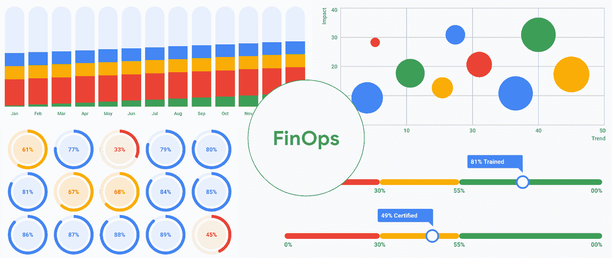
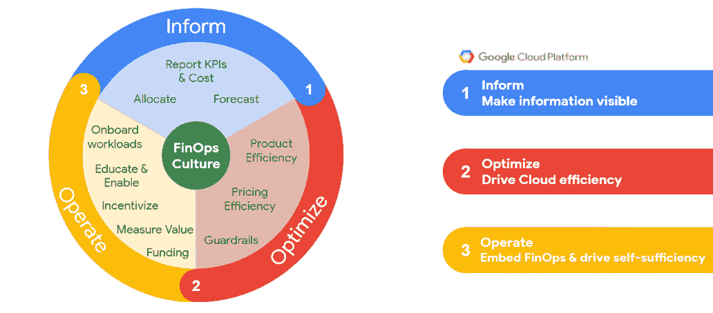
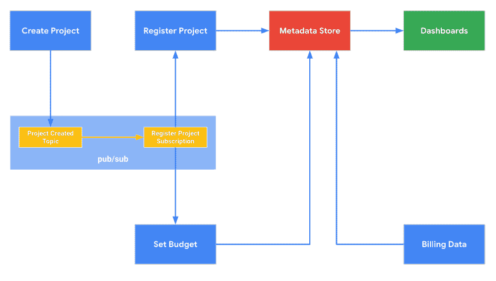

# Google Cloud 上的 FinOps 简介

> 原文：<https://medium.com/google-cloud/introduction-to-finops-on-google-cloud-3e031a026375?source=collection_archive---------0----------------------->

在本文中，我们评估了云计算日益增长的重要性，以及为什么它需要一种新的思维方式。我们证明了 FinOps

*   不仅仅是价格优化
*   不是一次性的活动，而是持续的实践
*   不仅仅是一个人、一个团队或一个部门的责任；尽管如此，它的目标是促进组织内不同利益相关者之间的协作

我们不会深入研究优化工作负载或资源的技术。所使用的示例仅用于说明目的，我们列出了一些参考资料供您查找更多信息。

*免责声明:我在谷歌的云团队工作。观点是我自己的，而不是我现在雇主的观点。*

当组织开始使用云时，财务运营通常会关注对迁移工作负载的估计。迁移活动开始了，但是实施必要的财务流程和最佳实践却没有得到足够的重视。只有当账单变得很大(甚至太高)时，这才会引起注意。

会发生什么？人们倾向于专注于解决预算问题，并优先考虑战术措施。任务组的建立有助于降低成本和优化工作负载。通常，会引入外部帮助，速赢会获得更高的优先级。就在那时，简单的价格优化受到青睐:不需要进行大量的努力，并立即可用。

当这个机会没有被用来实施长期战略时，同样的情况再次发生只是时间问题。这就是云 FinOps 的用处。

[Cloud FinOps](https://cloud.google.com/learn/what-is-finops) 是一个框架，它将人员、流程和技术聚集在一起，促进和推动组织中的财务意识和责任。它关注商业价值最大化，而不仅仅是成本优化。

GCP 金融行动框架

白皮书[GCP FinOps 入门](https://cloud.google.com/resources/cloud-finops-getting-started-whitepaper)概述了谷歌云平台(GCP)的框架，涵盖了所需的团队、要采用的流程和行为、预期的结果以及实现方法。

# 云的多变本质

云带来可变的成本结构。不再需要预先购买基础架构，您可以按需使用，按需付费。在过去，这意味着成本被限制在避免意外的投资上。现在，当你使用更多的资源，你将支付更多。这带来了机会，但需要关注和理解。

*   **注意**:为自己不需要的资源付费是浪费。例子包括让开发服务器在周末运行，或者不清理临时数据存储。
*   **理解**:没有意识到决策和行动如何影响成本会造成浪费。示例包括跨区域连续执行网络流量，或者查询不需要的多余数据。

还有很多例子。重要的是要确保组织中的不同利益相关者能够理解孤立做出的决策，并根据这些决策采取行动。在这种合作的基础上，可以与他人分享经验和教训。

FinOps 有助于在没有和严格控制云支出之间建立平衡。过多的控制限制了团队，增加了批准，降低了灵活性，导致创新和增长机会有限。然而，没有控制会造成浪费，并且难以跟踪商业价值的实现。平衡的情况旨在创造敏捷性和创新，同时以商业价值为中心管理成本。

# 数据的重要性

为了让团队了解他们的行动如何影响云支出，他们首先需要了解相关数据。我遇到过一些工作负载团队，他们不知道自己每月的支出是多少，也不知道支出是如何变化的。在大多数情况下，在实施开始时已经进行了评估，但通常解决方案不再一致。偶尔会定义一个预算警报，但从不更新，并且在大多数情况下，预算警报设置得太高，以至于无法启动一个事件，因此当成本增加一倍、三倍时，团队将不会意识到。

向团队提供准确的数据有助于加深理解，并有助于进入下一阶段:让他们对管理和改善云支出负责。在 Google Cloud 中，有几个选项可以用来执行工作负载和价格优化。如前所述，我们不会深入细节，但更多信息可以从谷歌云上面向开发者和运营商的[成本优化](https://cloud.google.com/architecture/cost-efficiency-on-google-cloud)页面或[成本管理](https://cloud.google.com/blog/topics/cost-management)博客中找到。

可视化和优化云支出

在这个阶段，只关注降低成本可能很诱人，但这可能会限制价值创造和创新。要考虑的一个重要方面是解决方案向用户提供的价值，以及这如何映射到所需的成本。不要考虑如何最大限度地减少资源使用，而是问问自己如何利用云差异化来缩短上市时间、提高速度、减少系统限制(如停机时间或性能不佳)以及引入新功能(如 AI/ML)。

这意味着需要正确看待云支出。伴随着商业价值增加的支出增加将是积极的；而增加没有商业价值的支出会引发担忧。然而，即使在积极的情况下，找到最佳解决方案和产生商业价值的相关成本仍然很重要。云提供了许多设计和实施解决方案的选项，那么您使用的是最合适的选项吗？你优化默认设置了吗？你是否没有利用好但不必要的选择？这是从您的云投资中释放价值的一个重要考虑因素，需要技术和业务团队密切合作。

白皮书[借助云计算运维实现商业价值最大化](https://cloud.google.com/resources/cloud-finops-whitepaper)构建在云计算运维的核心构建模块之上，并定义了商业价值实现的关键成功指标。

# 开始行动的重要性

我经常被问到“那么，我们应该什么时候开始/发展 FinOps？”有些人刚刚开始使用云，有些人已经实施到位。答案是一样的:现在！无论你在 FinOps 之旅的哪个阶段，你都可以开始或增加新的实践来释放(额外的)价值。重要的是以进步而不是完美为目标:从小处着手，不断提高，但重要的是尽早建立必要的基础。

引入成本可见性仪表板是一个很好的起点。我们之前解释过，向团队提供准确的数据可以提高他们的理解，并帮助他们承担责任。这些仪表板可以使用电子表格和手动更新/分发以战术方式设置。虽然这提供了良好的第一视角，但是它可能是不可持续的:仪表板的创建需要维护，并且团队没有最新的信息来阻止采用。这就是自动化和元数据基础的用武之地。

在我之前的博客文章[用数据发展你的谷歌云登陆区](/google-cloud/growing-your-google-cloud-landing-zone-with-data-f59950d33389)中，我评估了数据如何丰富登陆区，并为你建立一个现代化、可扩展、经得起未来考验和以用户为中心的解决方案。这归结为通过集中编排自动化服务并将必要的数据存储在着陆区元数据平台中来组织自动化服务。每个服务(包括计费信息)将存储其输出，以便其他服务可以将其用作输入。通过这种方式，这些数据将始终可用，为需要它的服务、用户和利益相关者做好准备——透明、准确和最新。

使计费数据在着陆区元数据平台中可用

集中提供相关的云计算财务和治理数据有助于实现从小处着手、分阶段发展的理念。通过[使计费数据在元数据存储中可用](https://cloud.google.com/billing/docs/how-to/export-data-bigquery)，它可以与预算警报配置相结合。请记住，这将通过将预算与实际成本进行比较来防止出现不相称的预算警报。我们可以通过利用着陆区治理的额外数据来实施更多的治理控制。我们可以开始寻找其他机会来实施更多的 FinOps 实践:验证资源使用水平、执行趋势分析、与预测流程集成……一旦开始，每个组织都可以定义自己的 FinOps 路径，并按照自己的节奏实施。

# 协作的重要性

拥有有效的 FinOps 流程需要组织中不同利益相关者的有效协作。一个中心团队坐在中间，促进和倡导财务责任。他们协调带来专业知识和技能的其他利益相关方，并指导他们完成变革:

*   **平台团队**确保 FinOps 策略自动化(可见性仪表盘、护栏等)。)
*   **工作负载团队**负责优化工作负载，并与他人分享经验和教训
*   **业务**确保在成本讨论中考虑业务价值部分
*   **财务**在其流程中认可并包含云的新变量模型

然而，请注意常见的反模式，即中央团队自己负责识别和实现成本优化。虽然这个团队看起来是推动成本优化的最佳人选，但他们将努力获得必要的信息和技能，抵制团队变革，难以扩大规模。

因此，花时间在组织中嵌入 FinOps 并使其可操作是很重要的。这不是一个一次性的或线性的概念，而是需要一个不断改进的迭代方法。一个关键因素是支持团队之间的协作。许多方法和时间表都是可行的，但始终围绕着建立社区、创造意识和提升团队技能。例子包括创建时事通讯、促进知识共享会议、将持续优化游戏化以及特别认可有价值的贡献。

要做到这一点，重要的是创造一个心理安全的环境。团队需要行动自如。错误可能会发生，并且可以对这些错误进行分析，以便它们不会再次发生。或者，可以在不需要为组织中的其他(甚至所有)团队负责的情况下提出建议。通过在 FinOps 框架的每个部分促进和支持协作、开放和无过失，它允许为变化创建持久的基础，并推动新的行为和结果。