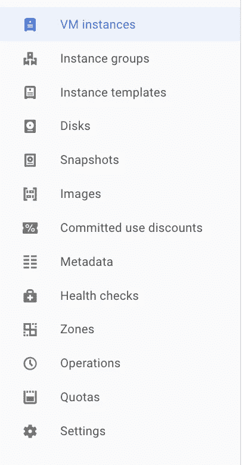
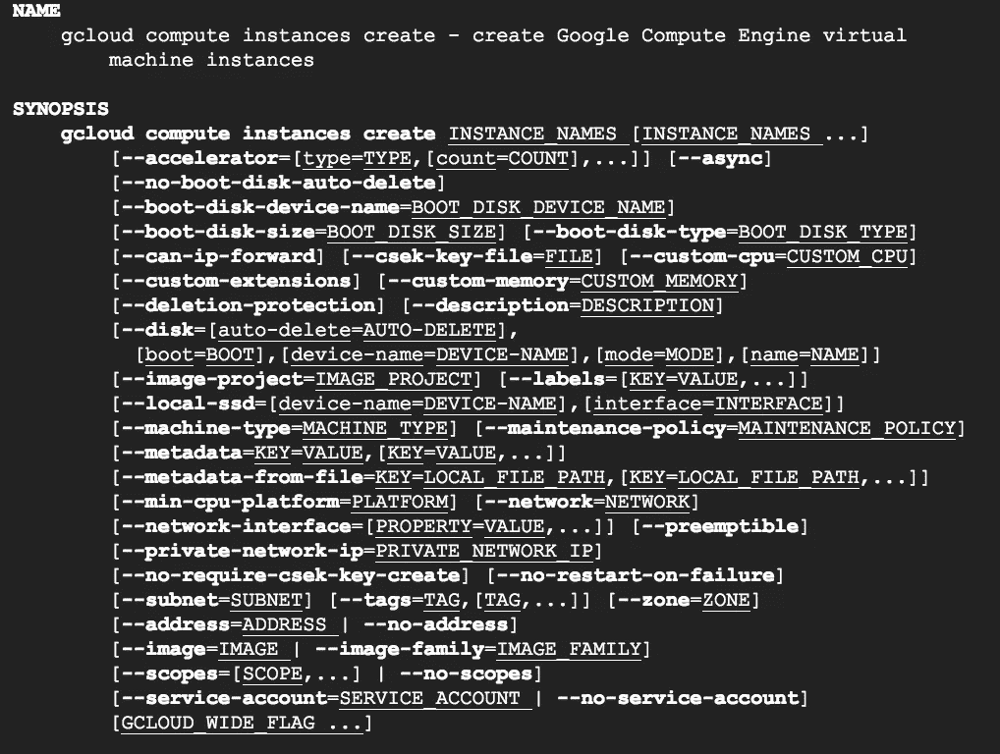
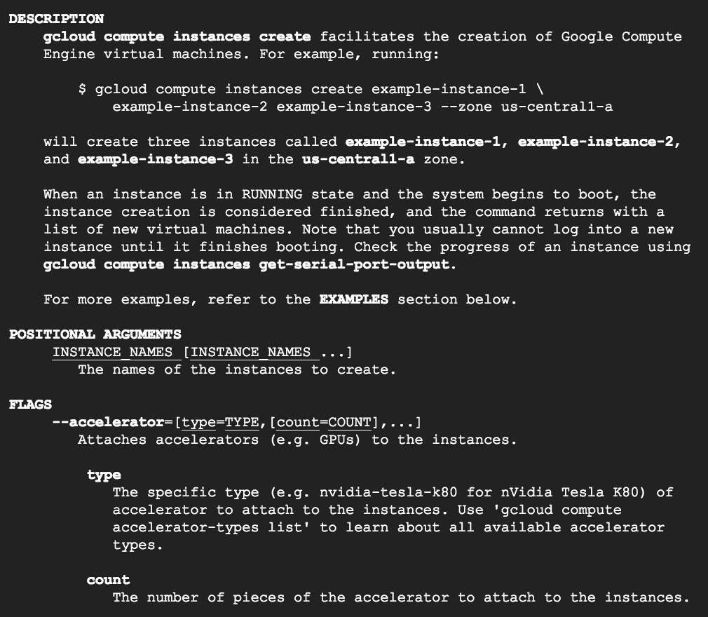
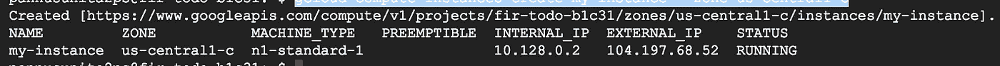
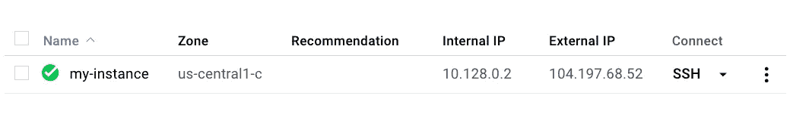

# G-Cloud 命令行工具介绍

> 原文：<https://medium.com/google-cloud/introduction-to-g-cloud-command-line-tool-f10834789b73?source=collection_archive---------0----------------------->

> 在这篇文章中，我将简单介绍一下可以用来访问谷歌云资源的“gcloud”命令行工具。

如果这是你第一次听说`gcloud`，你应该看看这篇文章“[在谷歌云平台上创建简单的虚拟机](/@hitenpannu/creating-a-virtual-machine-in-google-cloud-platform-ec2d74dbbab0)”，你也可能想登录你的谷歌云帐户，因为我将从基础开始，但我们将更深入地探索它，所以，如果你想实时看到所有的东西，并记住它一辈子，你应该运行我将在这里向你展示的命令。

在谷歌云平台中，你可以通过三种方式访问几乎所有的服务:

1.  谷歌云控制台(您的仪表板)
2.  g cloud(Google 提供的命令行工具)
3.  RestApi(您也可以创建应用程序来控制您的资源)

本文的重点是`gcloud`让我们开始吧

**什么是 gcloud？**

> GCloud 是 google 提供的命令行工具，我们可以使用脚本或命令行来访问 google 云服务，并运行其他自动化操作。

是的，您可以根据您的需求编写脚本来启动实例，您甚至可以设置触发器来运行这些脚本，但是我们将保存这些细节以备将来使用。

**如何访问 gcloud？**

> GCloud 是 Google Cloud SDK 的一部分。你必须[在你的系统上下载并安装 SDK](https://cloud.google.com/sdk/downloads) 并[初始化它](https://cloud.google.com/sdk/docs/initializing)才能使用 gcloud。

默认情况下，GCloud 将为您提供对常用命令的访问。现在，你可能会想什么是普遍可用的命令。这是`gcloud`命令的发布级别，是的，不止一个级别。

**g cloud 命令的级别**

1.  一般利用率
2.  贝塔
3.  希腊字母的第一个字母
4.  试映

> 一般可用性级别的命令被认为是完全稳定和生产就绪的。
> 
> 测试级别的命令功能齐全，但可能仍有一些问题，因此它们不包含在任何 SLA(服务级别协议)中
> 
> Alpha 级别的命令是早期版本，可能会随时更改，恕不另行通知
> 
> 预览级别的命令可能不稳定，可能会在没有通知的情况下更改

继续讨论如何访问`gcloud`工具如果你现在不想安装 SDK，你可以使用 Google 命令行。它为您提供了对谷歌云平台上托管的计算资源的`gcloud`命令行访问，并可通过谷歌云平台控制台获得。云壳是一个基于 Debian 的虚拟机，有一个持久的 5GB 主目录，让你轻松管理你的云平台项目和资源。有了云壳，你需要的云 SDK `gcloud`和其他实用工具都是预装的，随时可以用。

# 开始探索

首先打开你的云控制台，点击工具栏右上角的图标启动谷歌命令行


然后点击“启动云壳”。这将需要一些时间来调配和连接到环境。当你启动 Cloud Shell 时，它提供了一个运行基于 Debian 的 Linux 操作系统的[G1-小型谷歌计算引擎](https://cloud.google.com/compute/docs/machine-types)虚拟机。云外壳实例是基于每个用户、每个会话进行调配的。当您的云 Shell 会话处于活动状态时，该实例会持续存在，并在一小时不活动后终止。我将在未来向你展示谷歌云壳的更多特性，但现在让我们把重点放在`gcloud`上。

激活云外壳后，您可以使用命令行来调用云 SDK `gcloud`命令或虚拟机实例上可用的其他工具。

## 命令入门

先说我最喜欢的命令。

```
gcloud -h
```

其输出将是

```
Usage: gcloud [optional flags] <group | command>
  group may be           alpha | app | auth | beta | components | compute |
                         config | container | dataflow | dataproc | datastore |
                         debug | deployment-manager | dns | domains |
                         endpoints | firebase | iam | kms | logging | ml |
                         ml-engine | organizations | projects | pubsub |
                         service-management | services | source | spanner |
                         sql | topic
  command may be         docker | feedback | help | info | init | version

For detailed information on this command and its flags, run:
  gcloud --help
```

从这里可以清楚的看到，所有的 gcloud 命令都是分组的。项目、计算、容器所有这些都是不同的组，每个组都包含与该组相关的命令。Alpha 组用于访问 alpha 级命令，beta 组用于访问 beta 级命令。

## 深入挖掘

我们将探索计算组，因为我们已经从这篇[文章](/@hitenpannu/creating-a-virtual-machine-in-google-cloud-platform-ec2d74dbbab0)中了解了实例。你会发现运行这些命令比从控制台控制要酷得多，因为这些命令非常简单，我们可以随时查看命令的帮助手册。从跑步开始

```
gcloud compute -h
```

输出将类似于

```
Usage: gcloud compute [optional flags] <group | command>
  group may be           accelerator-types | addresses | backend-buckets |
                         backend-services | commitments | disk-types | disks |
                         firewall-rules | forwarding-rules | health-checks |
                         http-health-checks | https-health-checks | images |
                         instance-groups | instance-templates | instances |
                         interconnects | machine-types | networks | operations |
                         project-info | regions | routers | routes |
                         shared-vpc | snapshots | ssl-certificates |
                         target-http-proxies | target-https-proxies |
                         target-instances | target-pools | target-ssl-proxies |
                         target-tcp-proxies | target-vpn-gateways | url-maps |
                         vpn-tunnels | xpn | zones
  command may be         config-ssh | connect-to-serial-port | copy-files |
                         reset-windows-password | scp | ssh
```

您可以看到 compute 命令也被分成了更多的组。让我们从谷歌云控制台的计算部分比较这些组。



您会注意到，命令输出中的大多数可用组与控制台中的相同。

我将向您展示，即使您不知道使用 gcloud 的任何命令，创建虚拟机也是多么容易。我将只使用 help 命令，并遵循该命令的帮助手册中的文档。

我知道实例是计算权的一部分这一基本部分。所以，我会跑

```
gcloud compute --help
```

这将为我提供更多有关命令的详细信息，在这些信息中，我可以看到有一个名为 instances 的组，可用于读取和操作计算引擎虚拟机实例。

```
groups:.......
instance-groups 
        Read and manipulate Google Compute Engine instance groups.     
instance-templatesRead and manipulate Google Compute Engine   instances             templates.     
**instances
        Read and manipulate Google Compute Engine virtual machine instances.** 
interconnectsRead and manipulate Google Compute Engine interconnects.........
```

现在，我将进入该组，再次运行 help 命令

```
gcloud compute instances --help
```

现在，我将看到一堆可以在该组上执行的命令，如启动、停止、连接磁盘、删除、创建等。我还可以看到每个命令的描述，以避免任何混淆。因此，我注意到有一个名为“创建”的命令

```
COMMANDS
.........attach-disk 
       Attach a disk to an instance. 
**create** 
 **Create Google Compute Engine virtual machine instances.** delete 
       Delete Google Compute Engine virtual machine instances. delete-access-config 
       Delete an access configuration from a virtual machine network interface...........
```

所以，我现在要跑了

```
gcloud compute instances create --help
```

上述命令的输出将类似于



我可以看到 gcloud 对我期望的确切格式，以及我可以传递给它的所有可能的参数。我甚至可以查看下面提供的关于所有可用标志和可能值的信息的描述



所以，我会跑

```
gcloud compute instances create my-instance --zone us-central1-c
```

其中 my-instance 是命令描述中指定的实例名称，我将看到类似这样的内容



我还可以从控制台验证实例的创建。



现在仔细看看我们使用的命令，看看我们是如何清楚地告诉 google cloud 我想使用其计算服务在区域 us-central1-c 内创建名为 my-instance 的实例。

相信我，几乎所有的命令都是这样的，你不需要学习任何新的语言，也不需要记住任何东西，你所要做的就是运用常识，如果需要的话，寻求帮助。