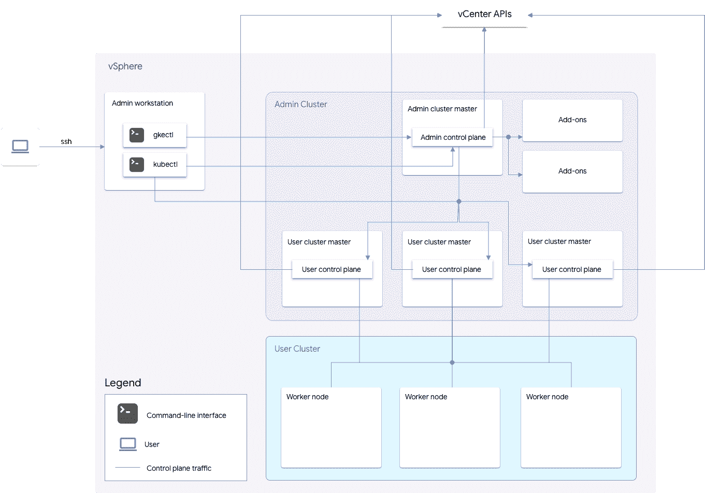

# GKE 本地简介

> 原文：<https://medium.com/google-cloud/introduction-to-gke-on-prem-78a42d630eb9?source=collection_archive---------1----------------------->

嘿大家，我希望你们都做得很好。在这篇文章中，我想向您概述一下 VMware 上的 GKE 本地 Anthos。

> 订阅我的频道，[云领航](https://www.youtube.com/c/TheCloudPilot)

**Anthos clusters on VMware，也称为 GKE on-prem，**是一款将谷歌 Kubernetes 引擎(GKE)引入本地数据中心的软件。借助 VMware 上的 Anthos 集群， ***，您可以在自己的内部环境中创建、管理和升级 Kubernetes 集群*** 。

它还将为用户提供:

1.  能够管理和维护运行在 Google Cloud 或他们自己的数据中心的 Kubernetes 集群。
2.  使用云操作监控其集群的能力。
3.  能够在本地运行的 Kubernetes 集群上部署市场应用程序。

**【了解 Kubernetes？阅读** [**为什么零售商选择在 Kubernetes**](http://bit.ly/KubernetesRetail) **上** [**谷歌云博客**](http://bit.ly/GoogleCloudBlogHome) **。]**

# GKE 本地建筑

来源: [GKE 本地架构](https://cloud.google.com/static/anthos/clusters/docs/on-prem/1.11/images/architecture_ha_09302019.png)

GKE 本地部署在您的数据中心正常运行需要三样东西。

*   **运行 vSphere 6.5 的 VMware vSphere 集群**(这是 GKE 本地版本 1.0 唯一支持的版本)
*   **F5 BIG-IP LTM** 为 K8s 集群中定义的应用服务提供负载平衡器类型支持。
*   **管理工作站**:管理工作站是部署 GKE 本地集群所需的所有不同实用程序的捆绑包，这些集群可以部署在运行 VirtualBox 或不同管理集群的笔记本电脑上。

> VMware vSphere 提供了两个主要组件来为用户提供更好的本地体验。

Kubernetes 的 **vSphere Cluster API** 和 **vSphere Cloud Provider** 插件使用户能够无缝部署虚拟机，使其成为管理和用户 Kubernetes 集群的一部分，并能够分别为运行在 Kubernetes 集群之上的应用程序单元或容器提供持久存储。

vSphere Cluster API 添加了以下构造，以简化底层虚拟机的部署:

## 机器

> 机器是在 vSphere 基础架构上运行的虚拟机。

它们相当于 Kubernetes 豆荚。所有虚拟机级别的详细信息，如 CPU、内存、存储和基本操作系统要求，都可以使用机器定义来定义。

## 机组

**与副本集**类似，您可以定义支持 K8s 集群所需的机器数量，机器集控制器将运行一个协调循环，以确保所需状态与当前状态相匹配。

## 机器部署

**与部署**类似，您可以使用机器部署的概念对您的机器(VM)的底层基础操作系统执行滚动更新。

## 机器类别

**类似于存储类定义**，这使您能够在一个地方指定所有特定于环境的配置参数，而不是必须在每个机器定义中定义它。

使用 vSphere Cluster API，您可以部署、管理和扩展您的虚拟基础架构，就像 Kubernetes 部署、管理和扩展您的容器化应用程序一样。

## vSphere 云提供商

***VSP here Cloud Provider******插件*** 内置于上游 K8s 中，因此您将不必担心部署任何额外的 CSI 插件来为容器提供持久存储。***VSP here Cloud Provider plugin***支持用户使用装载在 ***vSphere (NFS、VMFS 或 vSAN)*** 上的任何数据存储中的存储。当您使用 ***vSAN 数据存储*** 时，您可以将所有 ***基于存储策略的管理(SPBM)*** 功能扩展到 Kubernetes 内的存储类定义。K8s 定义的 ***持久卷*** 在***vsanDatastore***中创建为 VMDK 文件，然后挂载到运行您的 pod 的虚拟机上。

## 在本地部署 GKE

当您使用管理工作站部署初始 GKE 本地集群时，您将部署一个管理集群和一个单用户集群。

1.  **管理集群**负责运行 GKE 本地的所有控制平面组件。
2.  当您想要部署额外的用户集群时，您可以使用 *gkectl* 与管理集群对话，然后管理集群将与***vCenter API***对话，为新的用户集群部署额外的虚拟机。
3.  **用户集群**是你部署应用的地方。
4.  用户集群的主节点也参与管理集群。

> 购买 Anthos 许可证时，您只需为用户群集中虚拟机使用的 vCPUs 付费。**这种架构被称为 Kubeception。**

## 从 Google 云控制台管理您所有的本地集群

> Google Cloud 提供了一项名为 Connect 的服务，可以帮助您将本地集群连接回 Google Cloud。

> 它允许您**管理您的集群、部署应用程序、工作负载**以及**将自动扩展策略应用于本地运行的 pod**。

**连接代理** ***需要一个服务帐户密钥*** 来拥有连接到 Google Cloud 的正确权限，并且它在您的集群中作为 K8s 部署运行。一旦连接，它将与运行在 Google Cloud 中的控制平面共享有关集群、工作负载和任何元数据的信息。

> 除非您想要访问任何其他 GCP 服务，否则您不需要额外的 VPN 或云互连连接用于 GKE 本地。

**这是对 GKE 本地部署(基于 VMware 的 Anthos)的高级概述**。希望这对你有帮助。感谢您的阅读。回头见！