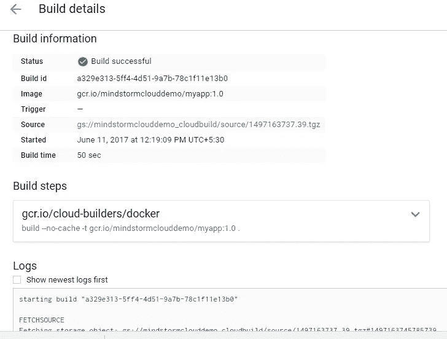
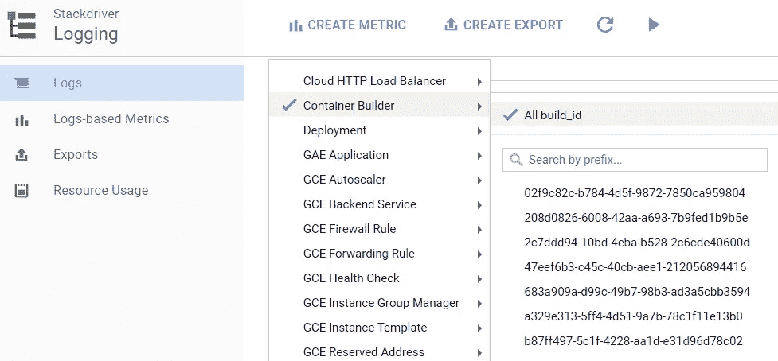

# Google 容器构建器简介

> 原文：<https://medium.com/google-cloud/introduction-to-google-container-builder-dbe6645f9421?source=collection_archive---------0----------------------->

[Google Container Builder](https://cloud.google.com/container-builder/) 是一个有趣的工具，它允许您使用 Google 云平台的力量来快速可靠地构建您的容器映像。

就它能做的事情而言，这个名字有点令人困惑，但我将谈论一个我一直在使用的流程场景，我相信它适用于我们大多数人，并看看 Google Container Builder 如何使它更高效。


图片参考:[https://cloud.google.com/container-builder/](https://cloud.google.com/container-builder/)

# 我们的使用案例

如果您一直在使用 Docker，那么最重要的事情之一就是构建一个 Docker 映像，并让其他人可以获取该映像以在他们的本地环境中使用。这个过程大概是这样的:

*   您应该有一个包含所有工具的本地 Docker 环境。
*   写一个 Docker 文件来构建你的 Docker 镜像。
*   执行`docker build`命令创建图像，并用图像名称和版本对其进行标记
*   使用`docker push`命令将生成的图像推送到 Docker Hub

这个过程无疑是简单的，但是如果你已经使用了一段时间，你会观察到一些事情。这些要点是基于我的经验，既做本地开发，又向广大开发人员讲授 Docker:

*   `docker build`要求你有一个良好的网络来降低依赖性。理想情况下，您最终会考虑将这一步转移到整个构建系统中。
*   执行`docker push`命令需要很长时间，该命令将图像移动到 Docker Hub。当你的 Docker 图像文件很大时，这个问题变得更加复杂。
*   集成其他容器注册中心如 [Google 容器注册中心](https://cloud.google.com/container-registry/)并不简单。它需要一些设置才能与标准的 Docker 工具一起工作。
*   在许多情况下，网络是一个限制因素，因此我经常建议，在学习 Docker 或使用 Docker 时，云是您最好的朋友。我建议人们在云中拥有一个虚拟机，然后惊讶于`docker build/push`命令的运行速度。它极大地提高了你使用 Docker 工具集的效率。

接下来我们将看到 Google Container Builder 如何通过在云中为您提供一个环境来解决上述问题，该环境将加速您的容器构建，自动将图像推送到 Google Container Registry。我们只是触及了 Google Container Builder 的皮毛，它具有与构建过程集成、触发事件以通知外部用户、定制构建脚本等功能。

# 使用 Google 容器构建器构建 Docker 图像

这里我们假设您已经有了自己的应用程序和相关的 Docker 文件来帮助构建 Docker 映像。如果没有，你可以从[这里](https://github.com/rominirani/Google-Container-Builder-Demo)拉一个简单的项目(在这篇文章的后面会给出操作说明):

我们将使用 Google Cloud SDK，它为我们提供了命令行工具(命令)来处理容器图像。它包含构建、列出和执行其他容器图像操作的命令。

## 设置

我假设你对谷歌云平台(GCP)很熟悉，你有一个付费账户，可以浏览 [GCP 控制台](http://console.cloud.google.com)，有一个谷歌云平台项目，最重要的是已经下载并初始化了[谷歌云 SDK](https://cloud.google.com/sdk/) 。

如果上述情况属实，我们需要确保以下几点:

1.  转到项目的 GCP 控制台，确保启用了 Google 容器构建器 API。从控制台中，访问 API 管理器→库，如下所示:


键入 Container builder，它应该会显示 Google Container Builder API。单击它，并确保启用它。


2.从控制台或终端，我们将假设您已经验证了您的 Google Cloud SDK，并使用如下所示的一组命令设置默认项目:
`$ gcloud auth login`和
`$ gcloud config set project [YOUR_PROJECT_ID]`

## 命令

我们要做的第一件事是创建一个简单的应用程序及其相关的 Dockerfile。我已经提供了一个项目，足以看到这个过程在行动中。

从这里简单地引入项目:

[](https://github.com/rominirani/Google-Container-Builder-Demo) [## rominirani/Google-容器生成器-演示

### Google-Container-Builder-Demo -构建 Docker 图像的示例项目

github.com](https://github.com/rominirani/Google-Container-Builder-Demo) 

假设您已经在本地机器上安装了`git`，在您选择的特定目录中执行以下操作:

```
$ git clone [https://github.com/rominirani/Google-Container-Builder-Demo](https://github.com/rominirani/Google-Container-Builder-Demo)
```

太好了！接下来我们需要做的就是将我们的图像构建提交给 Google 容器构建器。就是这样。

向 Google Cloud 中的容器构建器环境提交构建的`gcloud`工具命令如下:

```
$ gcloud container builds submit --tag gcr.io/[PROJECT-ID]/[IMAGENAME]:[VERSION] .
```

这个命令很容易理解:

*   它向 Google 容器构建器提交一个构建。
*   `tag`选项是你从 Docker 那里了解到的。在这种情况下，最终构建的映像将被推送到 [Google Container Registry](https://cloud.google.com/container-registry/) ，这是一个快速可靠的容器映像托管服务。前缀是 gcr.io，接下来的两部分是你在 Google 云平台中的项目名，然后是 Docker 镜像和版本。
*   最后一个参数是`.`，它是`Dockerfile`所在的目录。

在我的例子中，我的 GCP 项目被命名为 mindstormclouddemo，我希望将我的 Docker 图像命名为 myapp，版本为 1.0。该命令如下所示:

```
$ gcloud container builds submit --tag gcr.io/mindstormclouddemo/myapp:1.0 .
```

这将触发如下所示的过程，并产生一系列有趣的步骤来查看正在发生的事情**(我已经用我的注释对其中的一些部分进行了注释和格式化)**:

```
$ gcloud container builds submit --tag gcr.io/mindstormclouddemo/myapp:1.0 .**Creating temporary tarball** archive of 37 file(s) totalling 34.1 KiB before compression. **<-- This zips the folder and moves to Google Cloud Storage**
Uploading tarball of [.] to [gs://mindstormclouddemo_cloudbuild/source/1497163737.39.tgz]
Created [[https://cloudbuild.googleapis.com/v1/projects/mindstormclouddemo/builds/a329e313-5ff4-4d51-9a7b-78c1f11e13b0](https://cloudbuild.googleapis.com/v1/projects/mindstormclouddemo/builds/a329e313-5ff4-4d51-9a7b-78c1f11e13b0)].
Logs are available at [[https://console.cloud.google.com/gcr/builds/a329e313-5ff4-4d51-9a7b-78c1f11e13b0?project=mindstormclouddemo](https://console.cloud.google.com/gcr/builds/a329e313-5ff4-4d51-9a7b-78c1f11e13b0?project=mindstormclouddemo)].
------------------------------------------------- REMOTE BUILD OUTPUT --------------------------------------------------
starting build "a329e313-5ff4-4d51-9a7b-78c1f11e13b0"**--> NOW START THE BUILD. PICK UP THE ZIP FILE THAT WAS PUT IN CLOUD STORAGE**
FETCHSOURCE
Fetching storage object: gs://mindstormclouddemo_cloudbuild/source/1497163737.39.tgz#1497163745785739
Copying gs://mindstormclouddemo_cloudbuild/source/1497163737.39.tgz#1497163745785739...
/ [1 files][ 18.1 KiB/ 18.1 KiB]
Operation completed over 1 objects/18.1 KiB.
BUILD
Already have image (with digest): gcr.io/cloud-builders/docker
Sending build context to Docker daemon  79.36kB**--> THE STEPS BELOW SHOULD BE FAMILIAR TO EVERYONE WHO HAS DONE A DOCKER BUILD. IT IS EXECUTING THE COMMANDS THAT IT HAS FOUND IN DOCKERFILE**
Step 1/8 : FROM python:2.7
2.7: Pulling from library/python
ef0380f84d05: Already exists
24c170465c65: Pulling fs layer
4f38f9d5c3c0: Pulling fs layer
4125326b53d8: Pulling fs layer
35de80d77198: Pulling fs layer
ed5d9d659d3d: Pulling fs layer
cdb5322408aa: Pulling fs layer
9c9c3d6f5264: Pulling fs layer
35de80d77198: Waiting
ed5d9d659d3d: Waiting
cdb5322408aa: Waiting
9c9c3d6f5264: Waiting
24c170465c65: Verifying Checksum
24c170465c65: Download complete
24c170465c65: Pull complete
4f38f9d5c3c0: Verifying Checksum
4f38f9d5c3c0: Download complete
35de80d77198: Verifying Checksum
35de80d77198: Download complete
4f38f9d5c3c0: Pull complete
cdb5322408aa: Verifying Checksum
cdb5322408aa: Download complete
ed5d9d659d3d: Verifying Checksum
ed5d9d659d3d: Download complete
4125326b53d8: Verifying Checksum
4125326b53d8: Download complete
9c9c3d6f5264: Verifying Checksum
9c9c3d6f5264: Download complete
4125326b53d8: Pull complete
35de80d77198: Pull complete
ed5d9d659d3d: Pull complete
cdb5322408aa: Pull complete
9c9c3d6f5264: Pull complete
Digest: sha256:e9508797d99ab5b2e1311febbdbb22c92595fe82719ab3ccb61a0c458d9bac5d
Status: Downloaded newer image for python:2.7
 ---> c061fb1b6aa4
Step 2/8 : MAINTAINER Romin Irani "[romin.k.irani@gmail.com](mailto:romin.k.irani@gmail.com)"
 ---> Running in 10673c027bb1
 ---> a2f2a0ecc9fe
Removing intermediate container 10673c027bb1
Step 3/8 : COPY . /app
 ---> a8bbd17c74e3
Removing intermediate container 2b7ef1e2af6d
Step 4/8 : WORKDIR /app
 ---> 290884694d72
Removing intermediate container bafd9afe6536
Step 5/8 : RUN pip install -r requirements.txt
 ---> Running in 73260323b338
Collecting flask (from -r requirements.txt (line 1))
  Downloading Flask-0.12.2-py2.py3-none-any.whl (83kB)
Collecting itsdangerous>=0.21 (from flask->-r requirements.txt (line 1))
  Downloading itsdangerous-0.24.tar.gz (46kB)
Collecting Jinja2>=2.4 (from flask->-r requirements.txt (line 1))
  Downloading Jinja2-2.9.6-py2.py3-none-any.whl (340kB)
Collecting Werkzeug>=0.7 (from flask->-r requirements.txt (line 1))
  Downloading Werkzeug-0.12.2-py2.py3-none-any.whl (312kB)
Collecting click>=2.0 (from flask->-r requirements.txt (line 1))
  Downloading click-6.7-py2.py3-none-any.whl (71kB)
Collecting MarkupSafe>=0.23 (from Jinja2>=2.4->flask->-r requirements.txt (line 1))
  Downloading MarkupSafe-1.0.tar.gz
Building wheels for collected packages: itsdangerous, MarkupSafe
  Running setup.py bdist_wheel for itsdangerous: started
  Running setup.py bdist_wheel for itsdangerous: finished with status 'done'
  Stored in directory: /root/.cache/pip/wheels/fc/a8/66/24d655233c757e178d45dea2de22a04c6d92766abfb741129a
  Running setup.py bdist_wheel for MarkupSafe: started
  Running setup.py bdist_wheel for MarkupSafe: finished with status 'done'
  Stored in directory: /root/.cache/pip/wheels/88/a7/30/e39a54a87bcbe25308fa3ca64e8ddc75d9b3e5afa21ee32d57
Successfully built itsdangerous MarkupSafe
Installing collected packages: itsdangerous, MarkupSafe, Jinja2, Werkzeug, click, flask
Successfully installed Jinja2-2.9.6 MarkupSafe-1.0 Werkzeug-0.12.2 click-6.7 flask-0.12.2 itsdangerous-0.24
 ---> 4ef93aa93c12
Removing intermediate container 73260323b338
Step 6/8 : ENTRYPOINT python
 ---> Running in 9b562217e6f0
 ---> fa730d15fbb7
Removing intermediate container 9b562217e6f0
Step 7/8 : CMD app.py
 ---> Running in c6406b0f22b4
 ---> fe3b17b083e7
Removing intermediate container c6406b0f22b4
Step 8/8 : EXPOSE 8080
 ---> Running in 2600ada9fd32
 ---> c75fbbe837f9
Removing intermediate container 2600ada9fd32**--> THE IMAGE IS BUILD SUCCESSFULLY NOW**
Successfully built c75fbbe837f9
Successfully tagged gcr.io/mindstormclouddemo/myapp:1.0**--> PUSH IT TO GOOGLE CONTAINER REGISTRY NOW WITH THE TAGGED NAME and VERSION**
PUSH
Pushing gcr.io/mindstormclouddemo/myapp:1.0
The push refers to a repository [gcr.io/mindstormclouddemo/myapp]
ab6ff790b987: Preparing
b8e904668fbc: Preparing
de93d2f820b8: Preparing
95449babbdd8: Preparing
f3d633859721: Preparing
201187968504: Preparing
ecf5c2e2468e: Preparing
bb07d0c1008d: Preparing
4902b007e6a7: Preparing
007ab444b234: Preparing
201187968504: Waiting
ecf5c2e2468e: Waiting
bb07d0c1008d: Waiting
4902b007e6a7: Waiting
007ab444b234: Waiting
b8e904668fbc: Pushed
ab6ff790b987: Pushed
ecf5c2e2468e: Layer already exists
201187968504: Layer already exists
bb07d0c1008d: Layer already exists
4902b007e6a7: Layer already exists
007ab444b234: Layer already exists
95449babbdd8: Pushed
de93d2f820b8: Pushed
f3d633859721: Pushed
1.0: digest: sha256:3bc4dacb99b2e4234bfda8d8e617dbf96320d7d79b1a81f9d80ce1b7ef7888fe size: 2431
DONE
------------------------------------------------------------------------------------------------------------------------ID                                    CREATE_TIME                DURATION  SOURCE                                                       IMAGES                               STATUS
a329e313-5ff4-4d51-9a7b-78c1f11e13b0  2017-06-11T06:49:09+00:00  49S       gs://mindstormclouddemo_cloudbuild/source/1497163737.39.tgz  gcr.io/mindstormclouddemo/myapp:1.0  SUCCESS
```

从上面的构建过程可以看出，它的每一步都是从 Google Container Builder 在云中启动的过程中提供给你的。我用一些注释对上面的输出进行了注释，以帮助您理解正在发生的事情，如果您以前处理过 Docker 构建，这个过程应该很熟悉。

请注意，从`gloud container build`命令触发的每个构建过程都是独一无二的。您也可以通过`list`或`log`子命令，通过`gcloud container builds`命令获得构建的状态/日志。

这里需要注意的一件重要事情是**完成构建**所花费的时间。在我的例子中，正如在构建输出中打印的最终语句中看到的那样，是 49 秒。这很重要，因为 Google Container Builder 提供了一个免费层，即每个计费帐户每天的前 120 分钟是免费的。

## 查看容器图像列表

您可以通过 gcloud 命令查看容器图像列表，如下所示:

```
$ gcloud container images listA sample output (from my system) is shown below:NAME
gcr.io/mindstormclouddemo/myapp
gcr.io/mindstormclouddemo/pingpong
gcr.io/mindstormclouddemo/simpleserver
```

一定要研究一下`gcloud container`命令，它可以对容器图像进行多种操作，比如标记、取消标记、删除等等。

# Google 云控制台中的容器注册表

如果你使用谷歌云控制台多于命令行(我也是)——你可以看看控制台中的谷歌容器注册表选项。


这将打开 Container Registry 的主屏幕，在这里您可以看到刚刚构建的映像:


有趣的是，您还可以查看您提交的构建的**构建历史**。您可以在这里查看详细的构建过程输出:


单击任何构建实例，您应该会看到构建过程输出。



您还可以使用 Stackdriver 日志来检查您的构建日志。集装箱制造商也是 StackDriver 的一等公民:



您也可以在这里查看构建输出日志:


# 定价

你可能想知道作为一个用户，这整个过程是否是免费的。这听起来好得令人难以置信，因为有一个为您提供的计算环境来执行构建，您的文件被压缩并存储在 Google 云存储中，并且您的容器映像可能有网络出口。

我建议你应该看看[定价页面](https://cloud.google.com/container-builder/pricing)了解全部细节，但这里有一些要点一目了然。

*   Google Container Builder 附带了一个免费层。你每天可以免费使用 120 分钟。之后，你被收取 0.0034 美元/建造分钟。同样，免费等级分钟是一种促销活动，可能会有所变化。
*   现在让我们来看看容器注册中心，我们的容器图像存储在这里。查看[的价格](https://cloud.google.com/container-registry/pricing)也是如此。引用官方文件的定价，“容器注册只对你的 Docker 镜像使用的云存储[存储](https://cloud.google.com/storage/pricing#storage-pricing)和[网络出口](https://cloud.google.com/storage/pricing#network-pricing)收费。”

希望你喜欢这个教程。我们所看到的是 Container Builder 可以为您简化的一个方面。它有更多的功能，如自定义构建、触发器、在某些构建事件发生时在 Slack 等外部应用程序中通知用户、绑定到 Google 源代码库以在代码被推送时启动构建等。一定要检查那些细节。