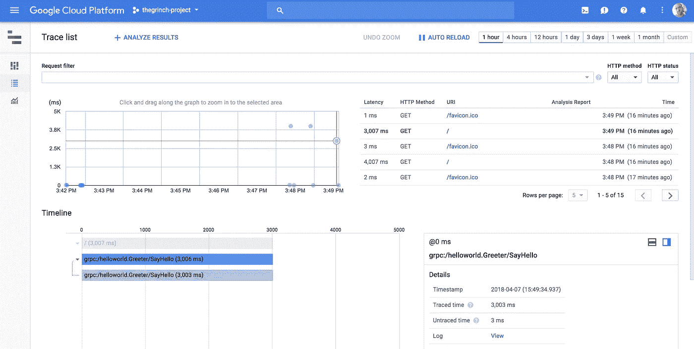
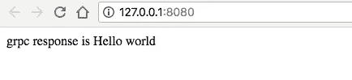
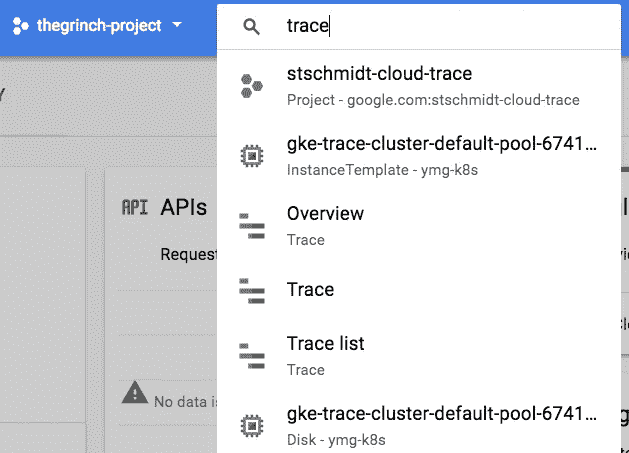
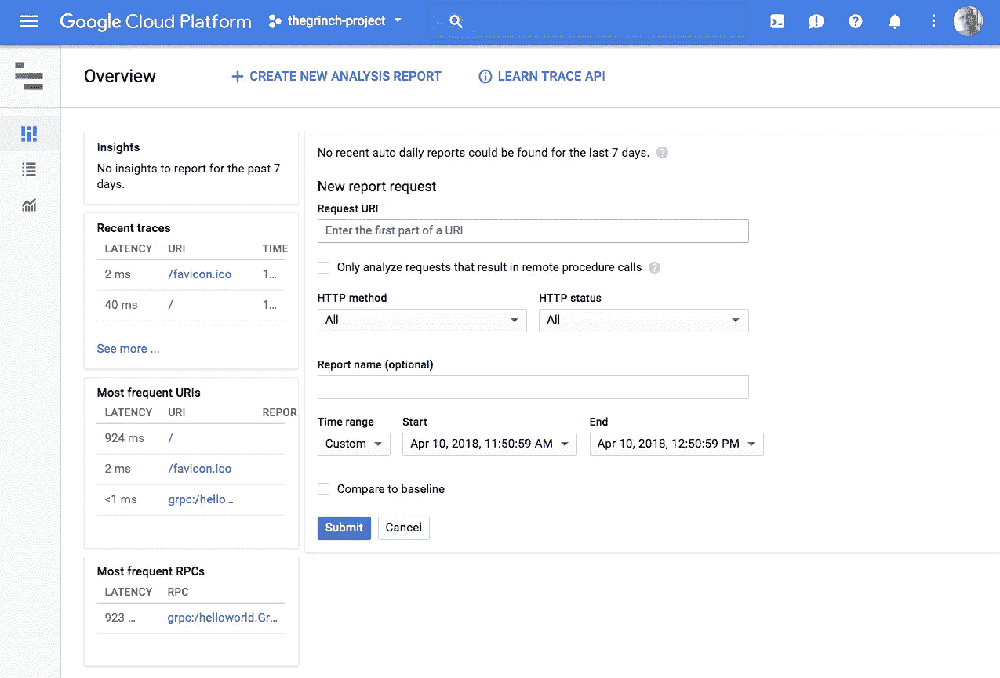
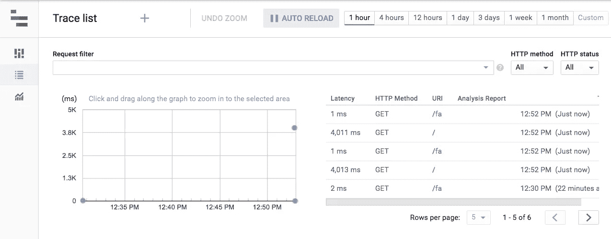
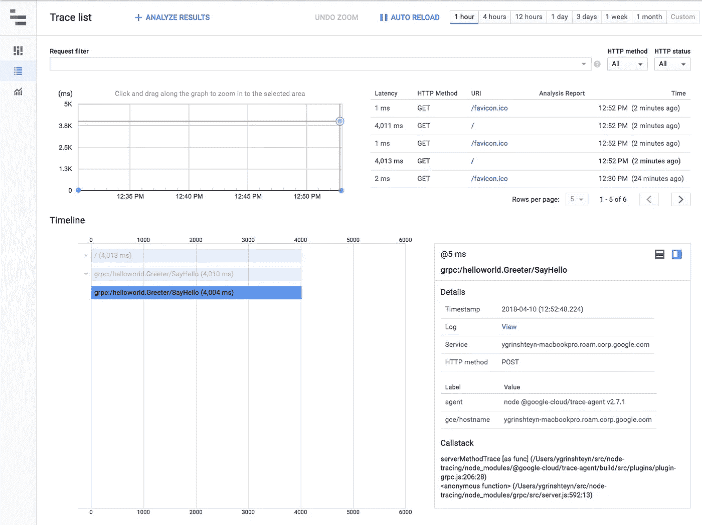
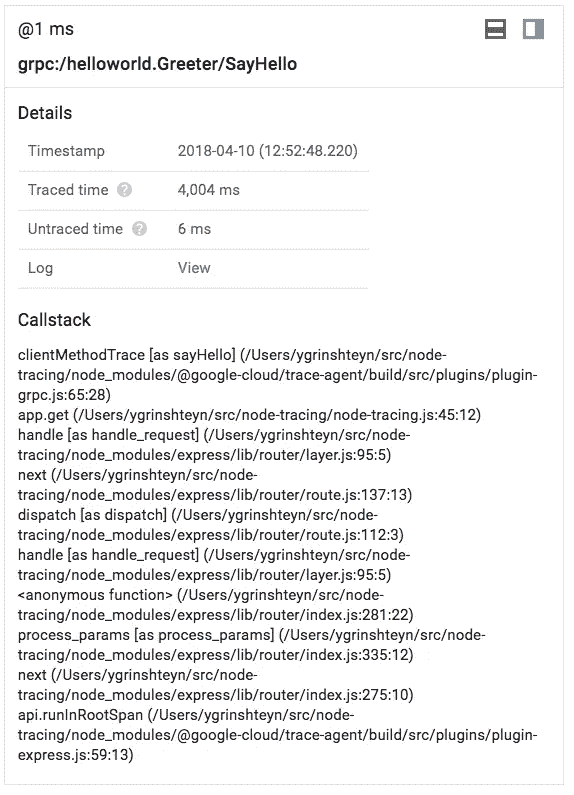

# Stackdriver 分布式跟踪简介(第 1 部分)

> 原文：<https://medium.com/google-cloud/introduction-to-stackdriver-distributed-tracing-part-1-91ce73abb298?source=collection_archive---------0----------------------->

根据我的经验，在 GCP 上开发应用和服务的人都非常清楚 Stackdriver 在[监控](https://cloud.google.com/monitoring/docs/)(也就是说，收集时间序列指标用于仪表板和警报)和[日志](https://cloud.google.com/logging/docs/)方面的能力。然而，我也注意到 Stackdriver 更多的以开发人员为中心的特性，如跟踪、错误报告和追踪，并不广为人知！这些都是非常强大的工具！我想感受一下使用它们的真实感受，我想我会从 [Trace](https://cloud.google.com/trace/) 开始。

使用 gRPC 跟踪

我以前使用过 Trace，但是我想在这个特定的练习中添加一些东西，并实现对 gRPC 调用的跟踪。为了做到这一点…我需要学习如何使用 gRPC(这是很好的 cromulent 用法)。

安比根斯！

因为我要同时处理两个新的主题，所以我决定呆在自己的舒适区(至少对于第 1 部分来说)并在 Node.js 中完成这个练习。我在 Go 中做这个的尝试并不顺利，因为我很快就失去了$GOPATH 和$GOHOME 的踪迹，到处都安装了包，并且无法得到任何可以实际编译的东西。这是一个我以后可能会尝试重新审视的项目…

无论如何，回到我们的话题。为了让分布式跟踪跨 gRPC 调用工作，我需要做三件事:

1.  创建能够响应 gRPC 调用的东西(服务器)
2.  创建一些能够进行 gRPC 调用并响应用户请求的东西(客户端)
3.  向这两者添加跟踪工具。
4.  利润…？

谢天谢地，gRPC 背后的好人在他们的网站上维护了非常有用的 [Quickstart](https://grpc.io/docs/quickstart/node.html) 文档，这是我完成#1 和#2 的依据。可以看到完成的(？)导致这个 GitHub [repo](https://github.com/yuriatgoogle/node-tracing) ，但是让我们走一遍练习。

**1 — gRPC 服务器**

服务器在单个中实现。js [文件](https://github.com/yuriatgoogle/node-tracing/blob/master/greeter_server.js)，它只是 Hello World 的 gRPC 等价物。它的主要功能有两部分:

a.充当服务器的主要功能:

b.sayHello()函数创建从服务器返回给客户机的消息。**注意**我添加了一个睡眠调用，所以 gRPC 调用会有一些真正的延迟，但这对我们的目的来说是完全不必要的。在一个真正的微服务架构中，这将是实际服务逻辑驻留的地方(或者至少是我放它的地方…).

你可以在这里看到整个文件[。我们现在可以用`node greeter_server.js`启动 gRPC 服务器，它将准备好让我们对它进行 gRPC 调用！让我们现在做那件事。](https://github.com/yuriatgoogle/node-tracing/blob/master/greeter_server.js)

**2 — gRPC 客户端**

[这里的](https://github.com/yuriatgoogle/node-tracing/blob/master/node-tracing.js)是整个文件——客户端和 web 服务器也被实现为一个单独的文件。js 文件使用 Express(因为我就知道这些)。这种方法非常简单:

a.定义基本路由/请求处理(使用 Express):

b.设置 gRPC 客户端和用户属性，我们将使用它们来发出请求:

如您所见，我们只是进行了一个本地主机调用——如果 gRPC 要访问位于我们部署中其他位置的服务，我们将在这里提供该服务的地址。这部分练习的一个可能的后续工作是分别部署服务器和“客户机”,也许是作为 GKE 集群中的单独部署。

c.发出 gRPC 请求并处理响应:

我在这里添加了一个非常基本的错误处理程序。如果 gRPC 请求成功，我们只需使用`res.send`将消息发送到 web 接口，然后继续。

就是这样！然后我们可以使用`node node-tracing.js`(当然是在`npm install --save`之后)运行这部分练习，我们开始运行。

它既简单又美丽

**3 —跟踪仪器**

现在我们的应用程序已经运行了，让我们实际添加我们需要的跟踪工具来观察延迟。再次—有几个(简单！)所需的步骤。

a.将**代理代码**添加到“[服务器](https://github.com/yuriatgoogle/node-tracing/blob/master/greeter_server.js)和“[客户端](https://github.com/yuriatgoogle/node-tracing/blob/master/node-tracing.js)文件中

这方面的说明非常简单。只需遵循跟踪文档中的[步骤](https://cloud.google.com/trace/docs/setup/nodejs)。我们将简单地将代理代码添加到两个文件中——在每个文件的最开始。

注意，您将需要指定 GCP 项目 ID(如果您的代码不在 GCP 运行),以告诉代理将跟踪信息发送到哪里。

b.安装必要的**包**。

在代码中添加代理后，您还需要使用`npm install --save @google-cloud/trace-agent.`安装代理。如果您从 GitHub repo 运行代码，使用`npm install --save`安装其余的[包](https://github.com/yuriatgoogle/node-tracing/blob/master/package.json)。

c.**开始**一切！

对于这个练习，我在本地运行所有的东西，所以我需要在命令行使用`gcloud auth application-default login`指定项目 ID 并获取应用程序默认凭证，然后在单独的终端窗口/选项卡中使用`node greeter-server.js`和`node node-tracing.js`启动服务器和客户端。

**4 —看痕迹！**

一旦一切都启动并运行，您应该能够多次重新加载您的页面以创建一些跟踪。然后，转到 Stackdriver 跟踪屏幕。

只需搜索痕迹！

如果一切都做得正确，您应该看到初始屏幕开始填充一些痕迹！

起作用了！

单击左侧菜单中的第二个选项，转到跟踪列表。

跟踪列表！

您可以按照[文档](https://cloud.google.com/trace/docs/trace-overview)中的说明来全面学习如何使用 Trace，但是我在这里只强调要点。单击时间线中的一个条目来选择一个轨迹。

跟踪详细信息。

您可以看到，您获得了整个端到端流程的延迟，以及 gRPC 调用所导致的延迟的组成部分。因为我们的调用存在人为延迟，所以整个时间都花在等待 gRPC 响应上。如果您点击调用本身，您实际上可以看到完整的调用堆栈！

等待 SayHello 函数运行！

如果您还记得的话，就是我们的“服务器”文件中的 SayHello 函数添加了延迟。

多酷啊。我们可以使用 Trace 来找出代码中慢的部分在哪里！当试图确定应用程序中性能问题的根本原因时，这非常有帮助。

我们在 Node.js 中将 Stackdriver Trace 与 gRPC 结合使用的练习到此结束。我将回到这个主题，并尝试不使用代理#sobrave 来完成它—敬请关注。

**资源**

这个的灵感:[https://cloud platform . Google blog . com/2017/04/distributed-tracing-for-go . html？m=1](https://cloudplatform.googleblog.com/2017/04/distributed-tracing-for-Go.html?m=1)

堆栈驱动跟踪文档:【https://cloud.google.com/trace/docs/ 

Node.js 中的 gRPC 基础:【https://grpc.io/docs/quickstart/node.html 

该项目的 GitHub 回购:[https://github.com/yuriatgoogle/node-tracing](https://github.com/yuriatgoogle/node-tracing)