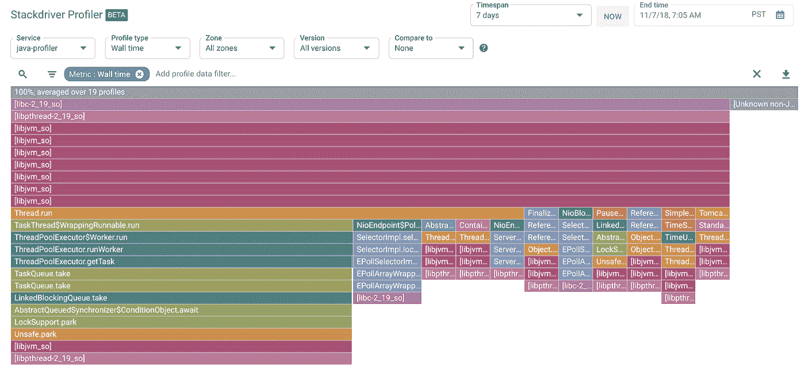

# Stackdriver 探查器简介

> 原文：<https://medium.com/google-cloud/introduction-to-stackdriver-profiler-614b580b978a?source=collection_archive---------0----------------------->

**【更新日期:2019 年 2 月 28 日**——参见本博客[关于我没有提到的新分析器特性的帖子](https://cloud.google.com/blog/products/management-tools/stackdriver-profiler-adds-more-languages-and-new-analysis-features)

在谷歌这样的地方工作的(许多)好处之一是，周围都是工作让你相形见绌的人。其中一个人是[戴斯·威尔金](/@DazWilkin)，他可能已经忘记了比我还多的关于 Stackdriver 的知识。他在 Stackdriver Profiler 上的[帖子](/google-cloud/stackdriver-profiler-671fb481236d)特别启发了我，它提醒我这是一个我还没有以任何有意义的方式探索的工具。我非常欣赏他提供的关于安装和运行 Profiler 的指导，我也想自己使用它们——特别是比较 Profiler 在不同语言之间的作用。

当然，产品团队已经清楚地记录了每种语言的可用功能。截至发稿时(2018 年 11 月)，看起来是这样的:


我决定尝试在 3 种受支持的语言中实现一些东西，以亲眼看看所捕获的不同指标是什么样的，以及让 Profiler 收集数据有多困难。我决定做一些非常基本的事情——在返回之前，创建一段在随机生成的短时间内使用大量 CPU 的代码，并且我希望尽可能地跨语言复制我的方法。让我们开始吧！

# **节点。JS**

# **设置**

我从我的舒适区——node . js 开始。首先，下面是我为实现我想要的功能而达到的目标:

如您所见，这是一个非常基本的 Express 应用程序，它简单地生成一个随机整数，并将该整数传递给 blockCpuFor()函数。该函数本身执行以下操作:

这是一个基本的循环，在函数调用中指定的时间内生成随机数。

最后，是时候向代码中添加分析器工具了。在 app.js 文件中，我添加了:

相当简单！如果你愿意，你可以在 GitHub [库](https://github.com/yuriatgoogle/profilerdemo)中看到整个[文件](https://github.com/yuriatgoogle/profilerdemo/blob/master/node/app.js)。然后，只需运行 npm install，使用 gcloud auth login 向 Google Cloud 进行身份验证，并使用 node app.js 运行应用程序。我使用 Apache Bench 生成了一点负载，然后登录到 GCP 控制台，查看 Profiler 报告了什么(注意，与 Daz 不同，他经历了打包所有内容并部署到 GKE 的麻烦，我在 MacOS 上本地运行所有内容)。

# **个人资料**

**墙壁时间**

如文档中所述，Profiler for Node.js 收集关于墙时间和堆使用的信息。在我的例子中，因为我使用了大量的 CPU，但是没有太多的内存，所以前者可能更有意思。让我们来看看:


果然——我们看到了完整的调用堆栈，几乎所有的时间都消耗在我的 blockCpuFor 函数中。这真的很酷——这正是我所期望看到的，并且很明显这在例如试图找出特定服务运行缓慢的原因或在受基础架构资源限制的环境中发生了什么时会很有用。

**堆**

如上所述，我的代码在使用内存方面做得不多——我没有创建或操作大型对象。然而，让我们看看在 Profiler 中查看堆视图时会得到什么:


我能够快速轻松地找到有问题的函数，如果您是调试特定代码的开发人员，这可能会很有用，Profiler 甚至会告诉我该函数在哪个文件中(就像在 Wall Time 视图中一样)。得心应手！

# **开始**

# **设置**

有了 Node.js，是时候继续在 Go 中尝试同样的事情了。在这里，我有点力不从心，但是让我们看看会发生什么。

首先，让我们创建基本的 Web 服务器:

再一次，我不得不称赞 Daz——这段代码几乎完全是直接从他的文章中抄袭来的。现在，让我们添加 blockCPU 函数:

我不知道这是否是上述相同想法的最优雅的实现，但它对我很有效。我再次简单地将随机数乘以函数调用的秒数。我花了一些时间来弄清楚在 Go 中操纵时间的各种细节——在当前时间上增加几秒钟比我想象的要深奥得多——但我想一个更有经验的开发人员应该不会遇到这么多麻烦。

最后，让我们向 main()函数添加分析器工具:

再说一次，我是从 Daz 那里偷的检测代码，但是这很简单。我通过硬编码来指定 projectID，因为我不想麻烦地把它变成一个配置或环境变量，这对于生产部署来说是不可能的，但是它对我的目的是有用的。和以前一样，如果你愿意，你可以在[回购](https://github.com/yuriatgoogle/profilerdemo/tree/master/go)中看到整个[文件](https://github.com/yuriatgoogle/profilerdemo/blob/master/go/main.go)。

在运行代码之前，我需要去获取“cloud.google.com/go/profiler”，然后我准备用 go run main.go 运行应用程序。我再次用 Apache Bench 生成一些请求——让我们看看 profiler 在 go 中做了什么。

# 剖面数据

**CPU**

正如您所猜测的，这应该是最有趣的数据所在，因为我的“应用程序”的整个目的是让 CPU 旋转一点。


不出所料，我的函数被清楚地标识出来，并且提供了源文件。我有点惊讶这个数字如此之低——显然，只有 57%的 CPU 利用率来自我的 blockCPU 方法。我不太确定如何理解这个结论——是不是围棋生成随机数的效率更高？或者，实际运行和服务基本 HTTP 响应所需要的其他东西的效率要低得多？一位更有经验的同事指出，这可能是因为我正在创建一个 rand。循环中的 New()，这可能非常昂贵。这实际上是剖析代码价值的一个很好的例子！

**堆**

这个视图可能是这个用例中最不有趣的。


果然——我甚至在努力寻找我在这个视图中关心的函数。幸运的是，Profiler 提供了一种便捷的方法来找到您想要的代码——只需使用度量过滤器旁边的突出显示功能，如下所示:


就在那里！正如人们可能预料的那样，它肯定没有使用太多的堆。

**螺纹**

如果我正在做一些多线程的事情，或者，例如，在我的服务上看到很多负载，这个视图可能会更有趣，但是我没有。我甚至没有在 Apache Bench 中并行化我的负载。然而，让我们看看我们得到了什么:


我找到了我的方法，但从这个角度来看，它很小，这不足为奇。尽管如此，这仍然是一个非常有用的视图——只是不适合我的特定测试用例。

# Java 语言（一种计算机语言，尤用于创建网站）

# 设置

我以谈论谦卑开始这篇文章，这部分确实是谦卑的。我突然想起，自从上了大学的操作系统课之后，我就再也没有做过 Java 编程了。这也很好地说明了在我看来更现代的语言如 Node.js 和 Go 中快速入门是多么容易。不过，让我们开始吧。

请注意，在撰写本文时(2018 年 11 月)，Profiler for Java 只在 Linux 上运行。因此，我需要使用 Debian Linux VM 来完成这一部分，而不是在 MacOS 上本地完成所有工作。下一个挑战是弄清楚用什么作为 Java 的基本 Web 框架(因为，我的知识已经过时十多年了)。读了一些资料后，我选择了 Spring Boot，并向一位更有见识的同事确认了这一选择。谢天谢地，在 [spring.io](http://spring.io) 上有一个很棒的[入门](https://spring.io/guides/gs/spring-boot/)，没有它，我仍然会努力弄清楚如何让 HTTPserver 工作以及如何让 Maven 编译任何东西。我必须承认——即使遵循了教程，我仍然不能完全理解 Spring Boot 是如何以与 Node.js 中的 grok express 相同的方式工作的，但是我能够做足够的事情来实现我的目的。

我使用了他们提供的完整示例，并简单地修改了源文件。事实上，我根本不需要修改 Application.java 文件，只需要删除代码来遍历提供的 Beans。所以，我的非常简单的文件现在看起来像这样:

我认为这是这个文件可能达到的最小限度。我的实际逻辑进入了 HelloController.java。首先，我添加了另一个@RequestMapping:

非常简单——我生成一个随机数并将其传递给 BlockCPU()。该函数看起来像这样:

和围棋一样，我花了相当多的时间来弄清楚如何操纵时间。我最终找到了堆栈溢出的答案——我使用了 System.currentTimeMillis()，但随后遇到了类型不匹配的问题，并最终使用了 long 而不是 int。这可能不是最优雅的实现，但它似乎是可行的。

一旦编写并编译了所有代码，就该添加分析器工具了。这是 Java 体验明显不同的另一个地方。这个过程清楚地记录在[这里](https://cloud.google.com/profiler/docs/profiling-java)，但是重要的部分是我需要下载 Profiler 代理库并把它传递给我的 Java 运行时，而不是简单地把它包含在我的代码中。具体来说:

```
java \
-agentpath:/opt/cprof/profiler_java_agent.so=\
-cprof_service=java-profiler,\
-cprof_service_version=0.0.1,\
-logtostderr,\
-cprof_project_id=<project ID> \
-jar target/gs-spring-boot-0.1.0.jar
```

这里需要注意的一点是，当我使用“javaProfiler”作为服务名，不得不改为“java-profiler”时，我实际上遇到了一些 Profiler 抱怨无效参数的问题。基本上，分析器希望服务名全部小写，用破折号分隔。如果代理能打印一份更好的诊断信息就好了，我被告知，在向工程部门提出这个问题后，这个问题将很快得到解决。

征服了这一切之后，是时候看看收集的数据了！

# 探查器数据

**墙壁时间**

我在这里的期望是，我的阻塞 CPU 的功能将是最重要的——毕竟，它是花费大部分时间的地方！



然而，这可能是这个实验中最令人惊讶的部分，它根本不存在！我甚至尝试了高亮显示功能，但这丝毫没有改变视图。这在过去和现在都很令人困惑，我真的不知道该如何解释。

**CPU 时间**

我在这里的期望和以前一样——大部分 CPU 时间应该在我的函数中。找到它当然不容易，因为调用堆栈实在是太大了！


然而，我能够放大视图并很容易地找到我的功能:


正如所料，这是 CPU 时间花费最多的地方。我发现一件有趣的事情，这可能是由于我对 Java 的相对无知，当按 CPU 时间排序时，堆栈是非常垂直的…..但是当按墙时间分析时要复杂得多。

# 结论

总而言之，这是一个非常有趣的项目，我觉得推荐 Profiler 比以前舒服多了。当这种支持可用时，我很高兴将 Python 加入其中。我也很想看看语言中的功能是如何随着时间的推移而演变的——例如，我希望 CPU 使用率/时间最终能够进入 Profiler for Go。感谢您一直读到最后——如果您还没有将 Profiler 添加到您的仪器中，我希望您这样做。