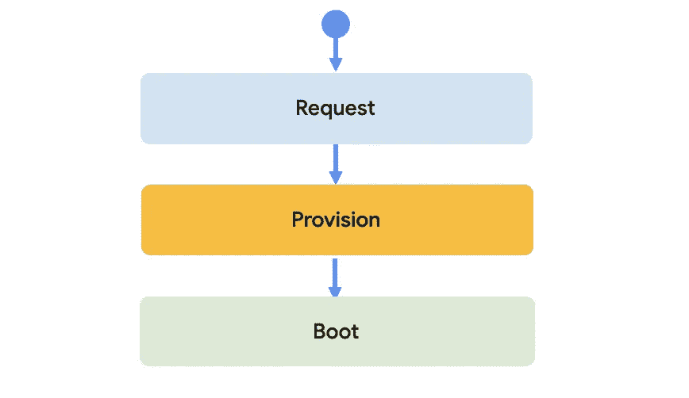
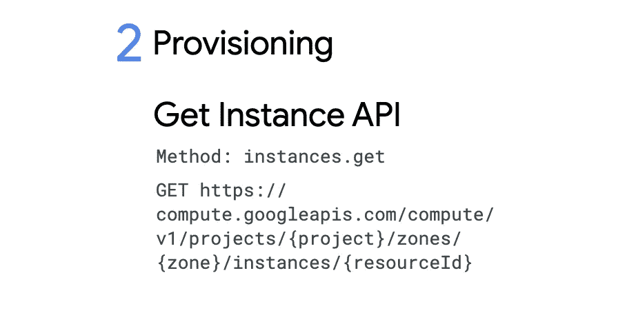

# 像 detective🕵一样调查和解决计算引擎冷启动🏽‍♀️

> 原文：<https://medium.com/google-cloud/investigate-and-solve-compute-engine-cold-starts-like-a-detective-%EF%B8%8F-66a03736cb03?source=collection_archive---------0----------------------->

## 规模季节


# 规模季节

“规模季节”是一个博客和视频系列，旨在帮助企业和开发人员在设计模式中构建规模和弹性。在这一系列文章中，我们计划向您介绍一些创建具有弹性和可伸缩性的应用程序的模式和实践，这是许多现代架构实践的两个基本目标。

在第二季中，我们将介绍如何优化您的应用程序以缩短实例启动时间！如果你还没看过第一季，在这里看看吧[。](/google-cloud/scale-and-resilience-arent-just-buzzwords-ce748360e80)

1.  如何缩短计算引擎启动时间(本文)
2.  如何缩短应用引擎启动时间
3.  如何缩短云运行启动时间

将计算机启动时间缩短几秒钟可能需要做一些调查工作。您如何知道问题是出在请求、供应还是引导阶段？在本文中，我们专注于分析计算实例。我将解释如何查明供应、脚本或映像是否会导致实例启动时间变慢。

# 看看这个视频

# 回顾


到目前为止，我们已经了解了一款多人在线游戏《生物交界》( Critter Junction)是如何模拟生物的。他们已经在 Compute Engine 上成功推出并在全球推广了他们的游戏应用。随着他们的日活跃用户不断增加，我们帮助他们设置了自动扩展、全局负载平衡和自动修复功能，以处理全球分布且不断增长的流量。

# 冷启动时间问题

但是，Critter Junction 发现他们的计算引擎实例的启动时间比预期的要长，尽管他们根据我们的自动缩放建议设置了一切。他们知道他们在计算引擎上的游戏服务器上运行一些逻辑，比如接受用户输入，将它们繁殖到一个新的生物岛。在分析了他们的启动时间后，他们发现冷启动时间超过了 **380** 秒，而请求的响应延迟在 **300** 毫秒范围内。


他们还做了一个性能测试，看看计算引擎创建实例需要多长时间，代码运行需要多长时间，

右边从[云壳](https://cloud.google.com/shell)，显示:



# 请求、供应、引导


**Request** 是从请求一个 VM 到从 Create Instance API 得到一个确认您已经请求它的响应之间的时间。您可以通过计时 Google Cloud 响应 [Insert Instance REST 命令](https://cloud.google.com/compute/docs/reference/latest/instances/insert)的时间来分析这一点。



**供应**是计算引擎在其架构上为虚拟机寻找空间所花费的时间。定期使用 [Get 实例 API](https://cloud.google.com/compute/docs/reference/latest/instances/get) ，并等待状态标志从供应变为运行。


**引导时间**是指启动脚本和其他定制代码执行到实例可用时的时间。只需重复轮询与您的应用程序相同的运行时提供的运行状况检查。然后记录收到 500、400 和 200 个状态代码之间的变化。


完成这些之后，Critter Junction 注意到大多数实例启动时间通常发生在启动阶段，此时实例执行启动脚本。这种情况并不少见，所以您应该分析您的引导脚本，看看哪些阶段正在产生性能瓶颈。

## 引入秒变量

为了了解脚本的哪些阶段占用了最多的引导时间，一个技巧是用一个利用了[秒变量](https://stackoverflow.com/questions/8903239/how-to-calculate-time-elapsed-in-bash-script)的命令来包装启动脚本的每个部分，然后将每个阶段所用的时间附加到一个文件中，并设置一个新的端点在需要时为该文件提供服务。

```
SECONDS=0
# do some work
duration=$SECONDS
echo "$(($duration / 60)) minutes and $(($duration % 60)) seconds elapsed."
```

这使得 Critter Junction 可以更深入地轮询端点并获取数据，而无需对其服务进行太多的修改。

## 就在那里！


通过计时实例的启动阶段生成的示例图。注意右边的图表是亚秒级的。

性能瓶颈似乎是[公共映像](https://cloud.google.com/compute/docs/images#os-compute-support)——操作系统和引导程序的预配置组合。当您想要启动并运行时，这些映像非常有用，但是当您开始构建生产级系统时，大部分启动时间不再是启动操作系统，而是用户执行的启动序列，它获取包和二进制文件，并对它们进行初始化。

# 使用自定义图像

Critter Junction 能够通过为它们的实例创建[自定义图像](https://cloud.google.com/compute/docs/images/create-delete-deprecate-private-images)来解决这个问题。您可以从源磁盘、映像、快照或云存储中存储的映像执行此操作，然后使用这些映像创建虚拟机实例。


自定义图像列表

当目标实例启动时，映像信息会直接复制到硬盘上。当您已经创建了一个根持久性磁盘并将其修改为某个状态，并且想要保存该状态以便在新的实例中重用它时，以及当您的设置包括安装(和编译)大型库或软件时，这非常有用。

# 全副武装准备好了

当您试图扩展到每秒数百万个请求，由数千个实例提供服务时，启动时间的微小变化可能会在成本、响应时间以及最重要的用户对性能的感知方面产生巨大差异。请继续关注《生物交汇处》的下一部。

记住，永远要做架构设计。

# 后续步骤和参考:

*   在[谷歌云平台媒体](https://medium.com/google-cloud)上关注这个博客系列。
*   参考:[形象管理最佳实践](https://goo.gle/2CIQNtj)。
*   关注《T4》系列视频，订阅谷歌云平台 YouTube 频道。
*   想要更多的故事？给我在[中](/@swongful)，和[推特](http://twitter.com/swongful)上喊一声。
*   与我们一起享受这个迷你系列的旅程，并了解更多关于谷歌云解决方案的信息。