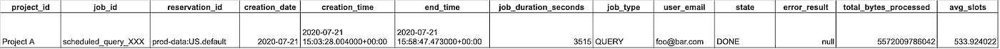
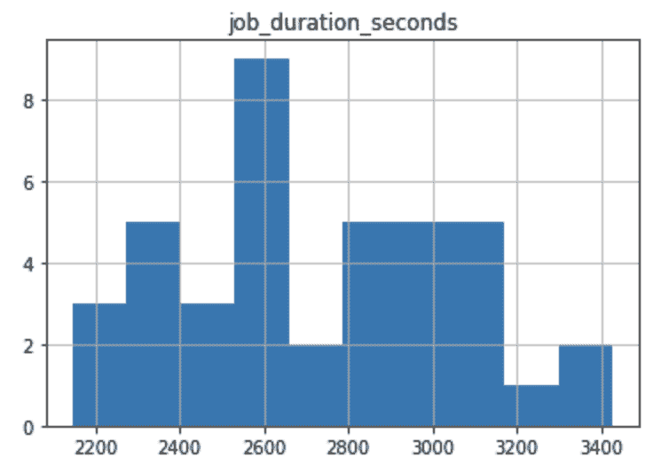
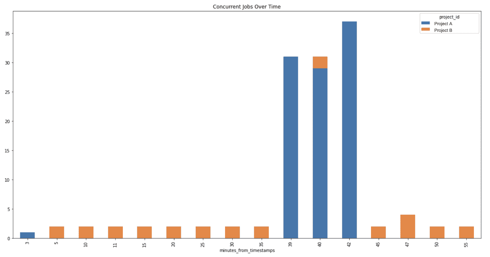

# 用 Python 和 INFORMATION_SCHEMA 研究 BigQuery 速度慢的问题

> 原文：<https://medium.com/google-cloud/investigate-bigquery-slowness-with-python-and-information-schema-a5e7088c9235?source=collection_archive---------1----------------------->

Google BigQuery 是您企业数据仓库工作负载的重要合作伙伴——无服务器、高度可扩展且经济高效。从插槽使用的角度理解 BigQuery 的性能对于更明智的业务决策至关重要。您可能已经看到了关于如何通过系统表、Stackdriver 和审计日志执行[插槽使用分析的指南。](https://cloud.google.com/blog/products/data-analytics/monitoring-resource-usage-in-a-cloud-data-warehouse)

在这篇文章中，您将学习如何将系统表(通过 [INFORMATION_SCHEMA](https://cloud.google.com/bigquery/docs/information-schema-intro) 视图提供)的洞察力与 Python 的能力相结合，以便您可以深入研究作业执行并控制性能。具体来说，我将带您研究插槽资源争用，这是导致 BigQuery 作业变慢的一个常见原因。

**步骤 1:收集基本慢度信息**

现在是星期一早上，我注意到一个重复的查询作业似乎比平时花费了更多的时间。作为我的组织中的 BigQuery 管理员之一，我能够定位并记录有问题的作业的 id 和[管理项目](https://cloud.google.com/bigquery/docs/reservations-workload-management#admin-project) id。首先，我想收集基本的慢度信息。我将查询、保存和搜索 [JOBS_BY_ORGANIZATION](https://cloud.google.com/bigquery/docs/information-schema-jobs) 系统表作为 [Pandas 数据框架](https://pandas.pydata.org/pandas-docs/stable/reference/api/pandas.DataFrame.html)。

> 注意:为了简洁起见，下面的代码片段中省略了身份验证和导入语句，它们包含在补充的 [syzz-1](https://github.com/sjsyz/medium-assets/blob/main/syzz_1.ipynb) Colab 笔记本中。

*图一。工作信息概要示例*

在生成的表中，我可以查看有问题的作业的最重要的指标。特别是，我会记下项目 id、预订 id、作业持续时间和插槽利用率。

**步骤 2:验证作业是否超出正常范围**

有了作业的摘要信息，我想验证作业的执行速度是否比平时慢。由于我正在调查一个重复性作业，我想通过匹配查询文本来识别过去的作业。我将使用带有新的 BigQuery 客户机的 [JOBS_BY_PROJECT](https://cloud.google.com/bigquery/docs/information-schema-jobs) 系统表，以便从有问题的作业的项目中检索数据，该项目不同于我用于组织视图的管理项目。然后，我可以用直方图来可视化作业持续时间。

*图二。直方图示例*

图 2(上图)显示了与有问题的作业相似的作业的持续时间分布，不包括有问题的作业本身。Y 轴是作业计数，X 轴是以秒为单位的作业持续时间。例如，我看到只有一个类似的作业运行时间为 3200 秒。请记住，我们将相似作业定义为与有问题作业的查询具有相似查询的作业。

**步骤 3:检查时隙资源竞争**

我记得上面有问题的作业摘要中的 job_duration_seconds 是 3515 秒。将该值与直方图进行比较，我清楚地看到，有问题的作业运行得比预期的慢，因此我将返回并深入研究 [JOBS_BY_ORGANIZATION](https://cloud.google.com/bigquery/docs/information-schema-jobs) 系统表。我可以直接操作数据框，并在有问题的作业执行期间创建并发查询的条形图。在该图中，Y 轴是作业计数，X 轴是时间戳的分钟值。

*图三。条形图示例*

查看该图，我看到在有问题的作业执行的同一时间段内，有许多来自不同项目的并发查询在运行。我还从控制台了解到，这些项目被分配到同一个保留区。我的结论是，作业在争槽，导致运行时间变慢。

我有几个选项来缓解这种争用:减少并发查询的数量，增加插槽容量，或者在不同的预留之间平衡查询负载。在实施其中一个解决方法后，我将在下周监控工作表现，以确保事件得到解决。

**结论&下一步**

通过 INFORMATION_SCHEMA 公开的系统表包含关于 BigQuery 性能的有价值的信息。在上面的案例中，他们帮助确定了与其他项目的插槽资源争用是作业变慢的根本原因。其他常见的根本原因包括项目中的插槽争用、空闲插槽上的插槽争用、SQL 反模式和等待配额。

您刚刚开始使用系统表和 Python 调试 BigQuery 性能。这篇文章中使用的所有代码都记录在我的公共 [syzz-1](https://github.com/sjsyz/medium-assets/blob/main/syzz_1.ipynb) Colab 笔记本中。随心所欲地为您的环境复制、定制和扩展功能。

有关类似项目的更多信息，请浏览以下内容:

* [BigQuery 系统表报告](https://github.com/GoogleCloudPlatform/bigquery-utils/tree/master/dashboards/system_tables)

* [BigQuery 审计日志仪表板](https://github.com/GoogleCloudPlatform/professional-services/tree/master/examples/bigquery-audit-log)

* [谷歌云媒体频道](https://medium.com/google-cloud)

调试愉快！