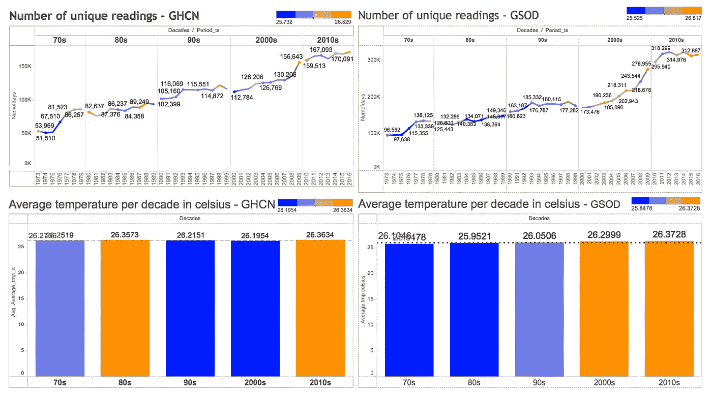

# 使用 BigQuery 和 Tableau 调查全球温度趋势

> 原文：<https://medium.com/google-cloud/investigating-global-temperature-trends-with-bigquery-and-tableau-46c6ddd036ba?source=collection_archive---------0----------------------->


## 使用 NOAA GHCN 和 GSOD 数据集

> @savio_lawrence 使用 [BigQuery](https://cloud.google.com/bigquery/docs/) 、 [Tableau](https://www.tableau.com/) 和 [NOAA GHCN 和 GSOD](https://cloud.google.com/bigquery/public-data/#noaa-ghcn) 数据集对今天的*进行了分析，以了解我们可以对世界各地气象观测站记录的平均温度变化进行哪些观察。*

在我们深入研究之前，请注意，虽然这种分析很有趣，但它本身不足以对气候变化或全球变暖这样复杂的问题得出结论。

科学组织和研究人员努力解释我们将在整个分析中强调的挑战，并将这些数据集与遥感观测相结合，以获得全球和一致的地球覆盖范围。

访问如此庞大的数据集的好处之一是有机会探索一些支持科学研究的数据，以找到未来潜在的探索和分析领域。

## **使用 BigQuery 和 Tableau 分析气候数据**

我们使用 BigQuery 处理和总结了来自 [GHCN](https://cloud.google.com/bigquery/public-data/noaa-ghcn) 和 [GSOD](https://cloud.google.com/bigquery/public-data/noaa-gsod) 公共数据集的 196 个表(74GB+超过 25 亿条记录)。

NOAA 的全球历史气候学网络(GHCN)是一个综合的气候观测数据库，接受一套通用的质量保证审查。

NOAA 全球地表日摘要(GSOD)数据集包括来自更大一组站点(超过 9000 个)的天气观测数据，但这些数据没有经过任何审核。因此，它们往往不如 GHCN 观测结果可靠。

我们使用下面的 SQL 语句来执行以下功能，并将其应用于两个数据集。

*   使用`aggregate` 功能找到每个站点的年平均温度。
*   将站点分组到纬度带。
*   使用条件语句和`like`运算符将年份分成几十年。
*   使用`count`功能，查找每个站点每年的读数数量。

```
SELECT
  ID AS STN,
  PERIOD_TS,
  NUMOFDAYS,
  AVERAGE_TMP_C,
  LATITUDE,
  LONGITUDE,
  NAME,
  STATE,
  CASE
    WHEN LATITUDE >= 66  AND LATITUDE <=90  THEN 
      "ARCTIC CIRCLE"
    WHEN LATITUDE >= 23  AND LATITUDE < 66  THEN 
      "NORTHERN TEMPERATE ZONE - BETWEEN TROPIC OF CANCER & ARCTIC CIRCLE"
    WHEN LATITUDE >= 0   AND LATITUDE < 23  THEN 
      "NORTHERN TROPICS - BETWEEN TROPIC OF CANCER & EQUATOR"
    WHEN LATITUDE >= -23 AND LATITUDE < 0   THEN 
      "SOUTHERN TROPICS - BETWEEN TROPIC OF CAPRICORN & EQUATOR"
    WHEN LATITUDE >= -66 AND LATITUDE < -23 THEN 
      "SOUTHERN TEMPERATE ZONE - BETWEEN TROPIC OF CAPRICORN & ANTARCTIC CIRCLE"
    WHEN LATITUDE >= -90 AND LATITUDE < -66 THEN 
        "ANTARCTIC CIRCLE"
  END AS STN_ZN,
  IF (NUMOFDAYS >= 300, "GREATER THAN 300", "LESS THAN 300") AS NUMOFDAYS_IND,
  CASE 
    WHEN YEAR LIKE "192%" THEN "20S"
    WHEN YEAR LIKE "193%" THEN "30S"
    WHEN YEAR LIKE "194%" THEN "40S"
    WHEN YEAR LIKE "195%" THEN "50S"
    WHEN YEAR LIKE "196%" THEN "60S"
    WHEN YEAR LIKE "197%" THEN "70S"
    WHEN YEAR LIKE "198%" THEN "80S"
    WHEN YEAR LIKE "199%" THEN "90S"
    WHEN YEAR LIKE "200%" THEN "2000S"
    WHEN YEAR LIKE "201%" THEN "2010S"
  END AS DECADES
FROM (
  SELECT
    A.ID,
    A.PERIOD_TS,
    COUNT(*) AS NUMOFDAYS,
    ROUND(AVG(A.VALUE/10),1) AS AVERAGE_TMP_C,
    B.LATITUDE,
    B.LONGITUDE,
    B.NAME,
    B.STATE,
    A.YEAR
  FROM (
    SELECT 
      *,
      TIMESTAMP_TRUNC(TIMESTAMP(date), YEAR) AS PERIOD_TS,
      CAST((EXTRACT(YEAR from DATE)) as String) AS YEAR
    FROM
      `bigquery-public-data.ghcn_d.ghcnd_*` ) A
  INNER JOIN
   `bigquery-public-data.ghcn_d.ghcnd_stations` B
  ON
    A.ID = B.ID
  WHERE
    A.ELEMENT = 'TAVG'
  GROUP BY
    B.LATITUDE, B.LONGITUDE, 
    B.NAME, B.STATE, A.ID, A.PERIOD_TS, A.YEAR)
```

一旦我们总结了数据——以及派生的属性，包括纬度带、十年和站观测计数——我们使用 [Tableau](https://www.tableau.com/) 来可视化结果。

Tableau 允许我们提供一条 SQL 语句作为仪表板的输入，并提供多种可视化技术，包括:

*   带有彩色标签的地图视图，有助于按站点位置显示温度趋势。
*   一个带有参考线的条形图，用于绘制几十年的平均温度。
*   按年绘制平均气温的折线图。

使用这种方法，我们创建了简单的仪表板，使我们能够轻松了解结果，并执行更详细的分析。

> [GHCN Tableau 仪表盘](https://public.tableau.com/views/WeatherV4GHCN_3_10/OneDash?:embed=y&:display_count=yes) | [GSOD Tableau 仪表盘](https://public.tableau.com/views/WeatherGSOD_Blog/OneDash?:embed=y&:display_count=yes)

**两组数据都显示了自 20 世纪 70 年代以来全球气温上升的趋势**

下图显示了使用 GSOD 和 GHCN 站数据的每十年全球平均净温度的逐渐增加。


使用 GSOD 和 GHCN 站数据的每十年净平均全球温度观测

为了生成这些图表，我们使用了从 1973 年开始的一年中至少有 300 次测量的站点(如下所述)。)

当然，这并不能说明全部情况——全球温度并不一致，所以一些地方可能变得更暖和，而另一些地方变得更冷。在本文的后面，我们将从不同的角度来看趋势，以便更好地理解数据。

**我们想考虑完整的数据，所以我们将尽可能少地进行过滤**

气象站数量和位置的显著变化可能会对平均气温产生重大影响，人口和报告地点相对密度的巨大变化也是如此。


1972 年和 1973 年 GSOD 和 GHCN 报告站

为了使我们的分析有意义，我们希望在一年后开始，报告站的数量没有大的跳跃，并且有一个合理的全球覆盖站。

我们的数据表明，1973 年是 GSOD 和 GHCN 数据库都符合这些标准的第一年，如比较 1972 年和 1973 年的图表所示。

例如，请注意，在 1972 年，南美洲几乎没有站。在 1973 年，还有很多。还需要注意的是，GSOD 数据库包括许多每年只记录少量观测数据的站点，例如，一些站点的观测数据仅在夏季进行。

为了避免我们的数据中潜在的季节性偏差，我们将过滤掉任何在给定年份中少于 300 次观测的站。

**比较自 1973 年以来 300 多个观测站的 GSOD 与 GHCN 趋势**

下图将每个数据集的十年平均值分解为一个逐年图。


GHCN 和 GSOD 报告站的逐年平均温度

这些数据看起来似乎变暖了很多，但我们不要急于下任何结论。平均值会受到多方面的影响，我们的数据可能会有偏差。请注意，在同一时期，报告站的数量显著增加。


GHCN 和 GSOD 数据集中每年报告平均温度的报告站数量

如果这些新的气象站不成比例地位于温暖的地区，这可能会使平均值偏向变暖。


报告站全球位置

查看两个数据集的站点总体分布，地图显示，在人口最稠密的纬度地区(气温较高)站点较多，而在更偏远的地区(通常更冷)站点较少。

因此，拥有最多气象站的地区将对整体气候趋势产生不成比例的影响。

为了开始考虑这些潜在问题，我们可以使用一种常见的数据科学技术，将我们的分析分成更小的数据片段，在这种情况下，是基于纬度带的区域。

**北极:北极(90 N)到北极圈(66° N)**

这两个数据集都表明，北极圈的平均温度每十年都有显著的逐渐上升。


使用 GHCN 和 GSOD 数据在北极圈内每十年的平均每日温度

从 70 年代到现在的十年间，全球服务水平上升了 1.08 摄氏度，全球服务水平上升了 0.67525 摄氏度。


观察这两个结果表明，北极圈一直在变暖。

如果我们看一下每年使用的气象站数量，就会发现报告的气象站数量和记录的温度之间没有关联。

**北温带:北极圈(66 N)至北回归线(22.5° N)**

北温带地区拥有最多的气象站，也是人口最稠密的地区。

在下面的图表中，请注意当我们从北极圈向热带移动时，平均温度逐渐升高，这由代表每个测量站平均温度的每个点的颜色表示。


北温带气象站的位置和平均温度

与北极圈的情况一样，GSOD 和 GHCN 数据集都显示，北温带地区报告的平均温度每十年逐渐升高，尽管速率较慢，导致 GSOD 和 GHCN 数据集分别升高 0.455°C 和 0.65275°C。


**北热带:北回归线(北纬 22.5 度)至赤道(0 度)**

当我们到达北热带地区时，下面的图表显示，虽然自 20 世纪 70 年代以来提供读数的站点数量显著增加，但随着时间的推移，两个数据集的温度都在逐渐升高——我们观察到 GSOD 和 GHCN 数据集的平均温度每十年分别升高 0.1312°C 和 0.0279°C。



这进一步证实了观测站数量的增加并不是全球平均气温上升的重要因素，也证明了并非在所有地方都观察到了总体变暖趋势。

**南回归线:赤道(0°)至南回归线(23°)**

南部热带地区也是如此，平均气温仅略有上升，报告站显著增加。


GSOD 和 GHCN 的平均温度每十年分别上升 0.186 摄氏度和 0.283 摄氏度。

**南温带:北回归线(南纬 22.5 度)至南极圈(南纬 66 度)**

在南温带，这两个数据集都见证了从 20 世纪 70 年代到 2000 年代大约 0.5 摄氏度的微小但逐渐的*下降*


有趣的是，2010 年到目前为止几乎完全抵消了这一下降，记录了自 20 世纪 70 年代以来的最高平均水平，这主要归功于非常炎热的 2015 年和 2016 年。

这两年是异常值还是南温带新变暖趋势的开始？仅凭两个数据点就下结论还为时过早，但这是一个值得追踪的观察结果。

**南极:南极圈(南纬 66 度)至南极点(南纬 90 度)**

与其他纬度带相比，南极站的数量非常少——直到 1980 年，GHCN 的记录才包括南极圈内读数超过 300 的任何站。


我们所掌握的测量数据表明，总的趋势是平均气温每十年下降 6°C，全球陆地观测站和全球陆地观测网络的数据分别下降 10°C。


注意，大部分气象站都在大陆边缘，很少有站在更深处的南极洲。


有一种模式是，南极北部的气象站比南极内部更深处的气象站温度更高。

较新的报告站偏向于那些更深、温度更低的位置，这些位置可能有助于观察到的温度下降。

这些挑战使得南极数据特别难以分析，并且需要额外的步骤来更好地了解那里的温度变化。

您将在以后的文章中找到该调查。

## **原始 GSOD 数据通常与质量控制 GHCN 结果一致**

从全球来看，这两个数据集都表明，自 20 世纪 70 年代以来，观测到的气温每十年分别上升 0.7125 摄氏度(GSOD)和 0.532 摄氏度(GHCN)。

然而，当我们在区域基础上挖掘细节时，情况会更加复杂，很难得出简单的结论。

北极圈似乎正以每十年大约 1.084 摄氏度(GSOD)和 0.675 摄氏度(GHCN)的最高速度变暖；北温带的平均气温也在以每十年 0.455 摄氏度(GSOD)和 0.653 摄氏度(GHCN)的速度上升。

与此同时，热带地区保持了相当稳定的每十年边缘温度上升——北部热带地区 0.13125 摄氏度(GSOD)和 0.0279 摄氏度(GHCN)，而南部热带地区的速率为 0.186 摄氏度(GSOD)和 0.283 摄氏度(GHCN)。

南温带地区每十年缓慢降温约 0.01905 摄氏度(GSOD)和 0.13 摄氏度(GHCN)。

## 气候科学是…复杂的

当测量像气候变化这样复杂的东西时，理解影响我们结果的许多变量是很重要的。例如，即使在我们相对简单的数据集中，也可以添加新的站，测量站可以移动，周围的景观可以改变，仪器可以变得更加精确/准确。

分析这些数据可以为形成假设提供有用的起点，并开始进一步调查它们可能代表的更广泛的趋势和原因。

如果你是 BigQuery 的新手，请遵循这些[入门指南](/til-with-bigquery/how-to-run-a-terabyte-of-bigquery-queries-each-month-without-a-credit-card-948773df8c0c#.9jex791fc)，记住每个人每个月都可以免费获得 1TB [来运行查询](https://cloud.google.com/bigquery/pricing)。

在[reddit.com/r/bigquery](http://www.reddit.com/r/bigquery)与我们分享你的调查，订阅 [*今天我用 BigQuery*](http://tilqbq.com) 了解了更多 BigQuery 公共数据集调查。