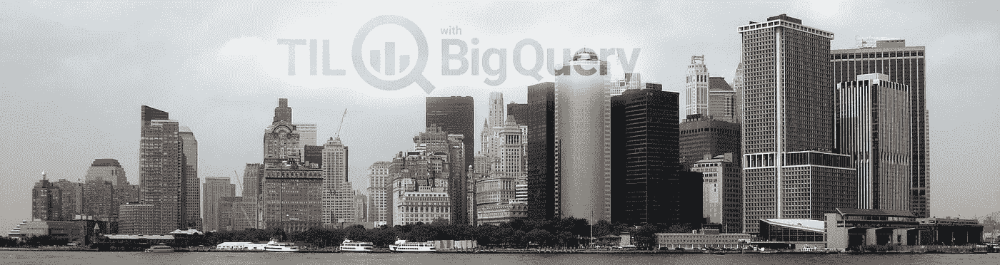

# 使用 BigQuery 调查纽约市公共数据集

> 原文：<https://medium.com/google-cloud/investigating-new-york-city-public-datasets-with-bigquery-4e91c29d62e3?source=collection_archive---------1----------------------->



> 最初发表在[谷歌云大数据和机器学习](https://cloud.google.com/blog/big-data/2017/01/new-york-city-public-datasets-now-available-on-google-bigquery)博客上

纽约市拥有 850 万居民，每年有超过 5000 万人参观这座充满活力的城市。有这么多的景象和声音，很容易迷失在细节中，看不到大局:纽约人实际上是如何在混凝土丛林中生存的？

感谢[纽约市开放数据](https://nycopendata.socrata.com/)，它使城市机构生成的公共数据可供公众使用，以及[花旗自行车](https://www.citibikenyc.com/)，我们已经将 5 个开放数据集中超过 150 GB 的数据整合到[谷歌 BigQuery 公共数据集](https://cloud.google.com/bigquery/public-data/)，包括:

*   自 2012 年以来，超过 800 万次 [311 服务请求](https://cloud.google.com/bigquery/public-data/nyc-311)(每天更新)
*   自 2012 年以来超过一百万起[机动车碰撞](https://cloud.google.com/bigquery/public-data/nypd-mv-collisions)(定期更新)
*   自 2013 年以来，花旗自行车站和 3000 万次[出行](https://cloud.google.com/bigquery/public-data/nyc-citi-bike)(定期更新)
*   自 2009 年以来，超过 10 亿次[黄色和绿色出租车出行](https://cloud.google.com/bigquery/public-data/nyc-tlc-trips)(定期更新)
*   在 1995 年、2005 年和 2015 年，每十年调查 60 多万棵树

您每个月处理的第一个 1tb 的数据是免费的，因为 BigQuery 是无服务器的，所以您不需要管理或维护任何基础设施。这意味着我们可以专注于查询、连接和可视化这些数据，以更多地了解纽约市和组成这座繁华大都市的人们。

正如您将在下面看到的，所有这些新数据集都可以与现有数据一起使用，如 [NOAA GSOD](https://cloud.google.com/bigquery/public-data/noaa-gsod) 根据天气变化发现趋势。我们还将不断添加来自其他城市的新数据集，因此很快您将能够比较全球城市和国家之间的习惯和趋势，使用 BigQuery 更好地了解我们周围的世界。

**找到你最有可能找到的纽约市街道**[](https://bigquery.cloud.google.com:443/savedquery/174015642527:a4629f7bcd104f548cca7e07fc6cdff7)

**如果你家附近有什么奇怪的事情，正确的电话号码是 311；专为非紧急市政调查和非紧急社区问题创建。那包括什么？**

**下图显示了过去 4 年中纽约人拨打 311 的五大原因。**

****

```
SELECT
  Extract(YEAR from created_date) AS year,
  REPLACE(UPPER(complaint_type), "HEATING", "HEAT/HOT WATER")
    AS complaint, 
  COUNT(*) AS count
FROM
  `bigquery-public-data.new_york.311_service_requests`
GROUP BY complaint, year
ORDER BY count DESC
LIMIT 1000
```

**(要自己运行这个查询，您可以将上面的 SQL 复制/粘贴到 BigQuery 中，或者跟随[这个链接](https://bigquery.cloud.google.com:443/savedquery/174015642527:06fa5bdebe1042f581aff8913c2dc212)到我的共享查询。)**

**通话量告诉我们，纽约会变得很吵，也会变得很冷。通过将 311 电话加入到 NOAA GSOD 天气表中，我们确认了大多数关于暖气和热水故障的电话发生在气温下降的时候——而噪音仍然是一个持续的烦恼。**

****

**使用这个 [BigQuery 查询](https://bigquery.cloud.google.com:443/savedquery/174015642527:d3cdf9c3fb074f5a8ae13c21e355b8a6)来重新创建图形**

**还有 267，887 个电话是关于[死亡、受损或垂死的树木](https://bigquery.cloud.google.com:443/savedquery/174015642527:b00f8598375e418db59c46f01b6be902)，所以你可能会想纽约市是否还有健康的树木。**

****找到纽约市**的 [**弗吉尼亚松树**](https://bigquery.cloud.google.com:443/savedquery/174015642527:f798278218544a3faee05a67bad8085f)**

****1995 年、2005 年和 2015 年十年一次的纽约树木调查都可以在 BigQuery 上找到，2015 年的调查发现伦敦的梧桐树、蜜蝗和 Callery 梨几乎占公园外所有树木的三分之一。****

********

****使用这个 [BigQuery 查询](https://bigquery.cloud.google.com:443/savedquery/174015642527:a6afaef9b7924219864ce9edc36de13b)来重新创建这个热图****

******找到唯一由动物** **引起的碰撞** [**那次撞伤了一个骑自行车的人**](https://bigquery.cloud.google.com:443/savedquery/174015642527:a0b7e7cf147746e680efd18b1164c457)****

****纽约的交通很繁忙，虽然事故数量每年都在增加，但受伤的数量却一直保持稳定。****

****幸运的是，死亡人数平均每年下降 9%。****

********

****正如你在下面看到的，“司机注意力不集中/分心”是最可能导致事故和伤害的原因，但无视交通管制(如闯红灯)是最常见的死亡原因。****

********

****下图显示，大多数交通事故发生在布鲁克林，但曼哈顿中城和市中心的碰撞密度最高，而斯塔滕岛的每起事故死亡比例最高。****

********

****使用这个 [BigQuery 查询](https://bigquery.cloud.google.com:443/savedquery/174015642527:23611cdd3d5e4824869309f772353696)来重新创建图形****

****由于机动车事故导致 [6 名驾车者死亡，每名骑自行车者死亡](https://bigquery.cloud.google.com:443/savedquery/174015642527:e0cab5e105a145deb8e00669bc66376c)(没有[名骑花旗自行车者死亡](http://www.businessinsider.com/why-citi-bike-has-zero-fatalities-2016-6/))，您可能更安全地乘坐花旗自行车。****

******找到花旗自行车在** [**最短时间最长距离**](https://bigquery.cloud.google.com:443/savedquery/174015642527:4fcca4009b714974bfb6ca036314dff0) **(在至少有 100 次骑行的路线上)******

****比较 5 条最受欢迎的花旗自行车路线的平均持续时间，以及在相应花旗自行车站大约 50 米半径范围内开始和结束的出租车旅程，我们发现，对于不到 10 分钟的行程，打车和骑自行车之间没有太大区别。****

********

****使用这个 [BigQuery 查询](https://bigquery.cloud.google.com:443/savedquery/174015642527:bba7d7e5a0e745a68e9d0c66016e6295)来重新创建图形****

## ****有无数种方法可以分割、切割、连接和可视化这些数据****

****使用标签 [#TILwBQ](https://twitter.com/hashtag/TILwBQ?src=hash) 和[分享您自己的见解和可视化，每周在这里加入我们](https://medium.com/til-with-bigquery)参加*今天，我从 BigQuery* 了解到，我们深入研究这些表格，推出新的公共数据集，展示 BigQuery，分享 protips，并提供对大数据行业专家的采访。****

****如果您是 BigQuery 的新手，请记住每个人每个月都可以免费获得 1TB 的空间来运行查询；您可以按照这些[入门说明](https://cloud.google.com/blog/big-data/2017/01/how-to-run-a-terabyte-of-google-bigquery-queries-each-month-without-a-credit-card)开始。****

## ****对纽约公共数据的更多探索****

*   ****[探索天气对纽约的影响](/til-with-bigquery/four-seasons-and-5-boroughs-in-one-post-d8c90afc7071)****
*   ****[为纽约的老鼠之都加冕](/til-with-bigquery/crowning-the-rat-capital-of-new-york-a35dc82bf6cf)****