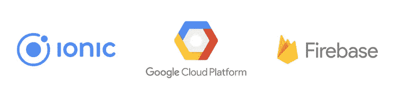

# Ionic 3 +谷歌云视觉+ Firebase

> 原文：<https://medium.com/google-cloud/ionic-3-google-cloud-vision-firebase-78ea68cfbea8?source=collection_archive---------0----------------------->



我一直在关注谷歌云视觉，并希望有一种快速的方法在现实世界中测试它，所以我拼凑了一个快速的 Ionic 3 应用程序。在我意识到它有多简单后，我决定一步一步地分享如何构建自己的。如果你只是想看代码，你可以在这里找到它[。](https://github.com/cbetz/my-stuff)

我们将构建一个 Ionic 3 移动应用程序，允许用户拍摄一些东西的照片，使用谷歌云视觉对其进行标记，并将图像和标签保存到 Firebase 实时数据库。这是完成的应用程序的简短演示:

我们开始吧！首先，我们将安装 Ionic CLI，获得我们的 Google Cloud 项目设置，并启用我们需要的功能:

1.  按照这里[的说明](http://ionicframework.com/docs/intro/installation/)安装 Ionic CLI。当您到达启动您的应用程序部分时停止，我们将在几分钟后到达该部分！
2.  创建一个新的谷歌云项目，并按照这里[的说明](https://cloud.google.com/vision/docs/before-you-begin)启用 Vision API。
3.  [创建一个 API 密钥](https://support.google.com/cloud/answer/6158862?hl=en)。请务必在此查看 API 关键最佳实践[。](https://support.google.com/cloud/answer/6310037)
4.  创建一个 Firebase 项目，方法是转到 [Firebase](https://firebase.google.com) ，点击 Get Started，然后点击 Import Google Project 按钮。选择您在步骤 1 中创建的项目。
5.  通过单击数据库，然后单击规则选项卡来设置数据库规则。使用下面的配置。**重要提示:**这会打开你的数据库，这样**任何人**都可以读写数据。在真实的应用程序中，您会想要限制这种访问。

```
{
  "rules": {
    ".read": true,
    ".write": true
  }
}
```

现在开始有趣的部分！让我们使用“空白”模板创建一个新的 Ionic 3 应用程序:

```
$ ionic start my-stuff blank
```

完成后，跳转到您新创建的文件夹，安装一些我们将需要这个项目的依赖项:

```
$ cd ./my-stuff$ npm install angularfire2 firebase --save$ ionic cordova plugin add cordova-plugin-camera$ npm install --save [@ionic](http://twitter.com/ionic)-native/camera
```

上面将添加 firebase 和 angularfire2(两者都是与我们的实时 Firebase 数据库通信所需要的)以及添加 Cordova 相机插件和 Ionic 本地库。

启动您最喜欢的代码编辑器并编辑 src/app/app.module.ts。导入摄像机并将其添加到提供程序阵列中:

```
import { Camera } from '@ionic-native/camera';...providers: [ StatusBar, SplashScreen, Camera, {provide: ErrorHandler, useClass: IonicErrorHandler},]
...
```

接下来，让我们创建一个文件来存储我们所有的 Firebase 配置设置:

```
$ touch ./src/environment.ts
```

下一步，您将需要 Firebase 配置设置。最快的方法是转到您的 Firebase 项目，并单击概述中的**将 Firebase 添加到您的 web 应用程序**按钮。使用这些字符串来完成新创建的 environment.ts 文件:

```
export const environment = { firebaseConfig: { apiKey: "", authDomain: "", databaseURL: "", projectId: "", storageBucket: "", messagingSenderId: "" }};
```

现在，回到 src/app/app.module.ts，添加以下导入并添加 Http 和 Firebase 模块:

```
import { HttpModule } from '@angular/http';
import { AngularFireModule } from 'angularfire2';
import { AngularFireDatabaseModule } from 'angularfire2/database';
import { AngularFireAuthModule } from 'angularfire2/auth';
import { environment } from '../environment';...imports: [ BrowserModule, HttpModule, IonicModule.forRoot(MyApp), AngularFireModule.initializeApp(environment.firebaseConfig), AngularFireDatabaseModule, AngularFireAuthModule],...
```

既然我们已经将应用程序连接到 Firebase，我们就可以继续使用 Google Cloud Vision 了。创建一个服务，使用 Ionic CLI 包装我们对 Vision API 的调用:

```
$ ionic g provider GoogleCloudVisionService
```

打开新创建的文件(/src/providers/Google-cloud-vision-service/Google-cloud-vision-service . ts)并添加以下内容:

```
import { Injectable } from '@angular/core';
import { Http } from '@angular/http';
import 'rxjs/add/operator/map';
import { environment } from '../../environment';@Injectable()export class GoogleCloudVisionServiceProvider {
  constructor(public http: Http) { } getLabels(base64Image) { const body = { "requests": [ { "image": { "content": base64Image }, "features": [ { "type": "LABEL_DETECTION" } ] } ] } return this.http.post('https://vision.googleapis.com/v1/images:annotate?key=' + environment.googleCloudVisionAPIKey, body);
    }
}
```

对于这个应用程序，我们将只使用标签检测功能，但还有许多其他可用的功能。请务必查看所有可用的[功能](https://cloud.google.com/vision/docs/reference/rest/v1/images/annotate#Feature)。

您的代码编辑器可能会抱怨我们的 googleCloudVisionAPIKey 引用。让我们将它添加到我们的 environment.ts 文件中，填入您在步骤 2 中生成的 API 键:

```
googleCloudVisionAPIKey: ""
```

信不信由你，我们现在有一个完全配置的应用程序，准备好了功能！我们需要一种方法来拍摄一张新照片，分析它，并显示结果。打开/src/pages/home.ts 并添加我们的导入:

```
import { Component } from '@angular/core';import { AlertController } from 'ionic-angular';import { Camera, CameraOptions } from '@ionic-native/camera';import { GoogleCloudVisionServiceProvider } from '../../providers/google-cloud-vision-service/google-cloud-vision-service';import { AngularFireDatabase, FirebaseListObservable } from 'angularfire2/database';
```

接下来，为我们的项目创建一个 FirebaseListObservable，并将其连接到我们的构造函数中:

```
items: FirebaseListObservable<any[]>;constructor( private camera: Camera, private vision: GoogleCloudVisionServiceProvider, private db: AngularFireDatabase, private alert: AlertController) { this.items = db.list('items');}
```

FirebaseListObservable 将实时数据库中的数据同步为我们的应用程序可以使用的列表。您将看到我们拍摄的新项目几乎立即添加到列表中，无需刷新！

说到这里，我们需要一种向实时数据库添加项目的方法:

```
saveResults(imageData, results) { this.items.push({ imageData: imageData, results: results}) .then(_ => { }) .catch(err => { this.showAlert(err) });}
```

saveResults 获取 base64 图像数据和结果，并将它们推送到我们的 FirebaseListObservable，后者处理数据同步。

我们有一个效用函数来显示任何可能出现的错误:

```
showAlert(message) { let alert = this.alert.create({ title: 'Error', subTitle: message, buttons: ['OK'] }); alert.present();}
```

当然，我们需要一个函数来拍摄照片并调用我们的服务包装器:

```
takePhoto() { const options: CameraOptions = { quality: 100, targetHeight: 500, targetWidth: 500, destinationType: this.camera.DestinationType.DATA_URL, encodingType: this.camera.EncodingType.PNG, mediaType: this.camera.MediaType.PICTURE } this.camera.getPicture(options).then((imageData) => { this.vision.getLabels(imageData).subscribe((result) => { this.saveResults(imageData, result.json().responses); }, err => { this.showAlert(err); }); }, err => { this.showAlert(err); });}
```

这里发生了很多事情:

1.  相机选项:重要的是，我们想要一张照片(不是视频)，我们希望通过 DATA_URL 获得图像数据，这将为我们提供 base64 图像数据。包括质量、大小和格式在内的其他选项由您决定，但是 Vision API 确实有限制，这里列出了。在测试时，我没有缩减文件大小，很快就达到了内容限制。
2.  当调用 camera API 的 getPicture 方法时，我们使用我们的 Camera 选项，该方法为我们提供 base64 图像数据。
3.  我们获取 base64 图像数据，并将其传递给 Google Cloud Vision 服务包装器的 getLabels 方法。
4.  最后，我们将 base64 图像数据和 API 调用的原始结果保存到实时数据库中。

现在我们需要切换到/src/pages/home.html 中的 HTML:

```
<ion-header> <ion-navbar> <ion-title>My Stuff</ion-title> </ion-navbar></ion-header> <ion-content padding> <ion-card *ngFor="let item of items | async">  <ion-card-content> <ion-list no-lines> <ion-list-header>Labels</ion-list-header> <ion-item *ngFor="let label of item.results[0].labelAnnotations">{{label.description}}</ion-item> </ion-list> </ion-card-content> </ion-card> <ion-fab bottom right> <button ion-fab (click)="takePhoto()">
      <ion-icon name="camera"></ion-icon>
    </button> </ion-fab></ion-content>
```

这将为我们的数据库中的每个项目创建一个卡片，其中包含从 Google Cloud Vision 返回的图像和标签列表。它还增加了一个 FAB，点击后就会启动相机。

是时候测试一下了！您需要连接一个真实的设备并运行

```
$ ionic cordova run android --device
```

或者

```
$ ionic cordova run ios --device
```

如果您遇到这样的错误:

```
Error: ./node_modules/firebase/app/shared_promise.js
Module not found: Error: Can't resolve 'promise-polyfill' in ...
```

试着运行下面的代码，从[到这里](https://github.com/ionic-team/ionic-app-scripts/issues/1001)

```
$ npm install promise-polyfill --save-exact
```

我们只是触及了[谷歌云视觉](https://cloud.google.com/vision/)的皮毛。记住代码可在[这里](https://github.com/cbetz/my-stuff)获得。问题和公关是受欢迎的！

感谢阅读！