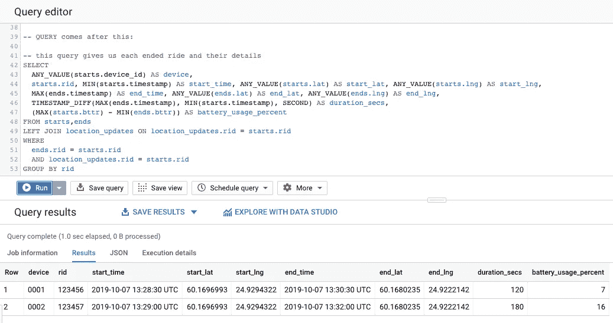
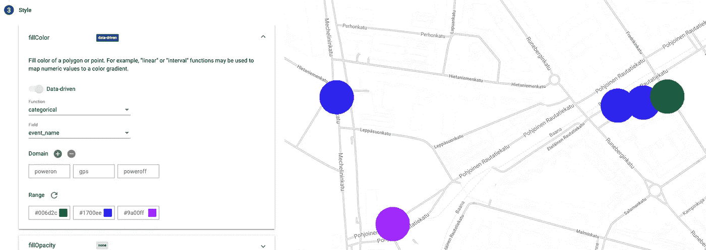

# GCP 的物联网数据管道，多种方式—第 1 部分

> 原文：<https://medium.com/google-cloud/iot-data-pipelines-in-gcp-multiple-ways-part-1-9eade945d218?source=collection_archive---------1----------------------->

欢迎来到谷歌云平台中物联网数据管道的介绍系列。

我的目标是向您展示一些从您的设备获取数据并进行分析的不同方法。

在本系列中，我假设到目前为止，您已经对 Google 云平台及其工具有了基本的了解。我还会假设你已经有一个谷歌云项目计费帐户创建，或有信用。

例如，我们将使用一种简化版的电动滑板车，其中装有物联网设备。

但是在现实生活中构建这些数据管道时，需要考虑多种因素，

比如:

*   物联网设备限制/功能
*   设备数量
*   传感器数量和输出量、输出间隔
*   其他成本因素

基本上，你必须考虑你在处理什么样的设备和数据，从长远来看，你想完成什么，它的成本是多少。

当你有数十或数百个设备定期向你发送数据，并且这些设备不太嘈杂(每分钟的数据量较低)时，与你有数千或数十万个设备每秒向你发送大量信息时相比，选择可能会有所不同。

在本示例系列中，我们将重点关注一个使用案例，我们的物联网设备向我们发送少量触发信号以及周期性位置和电池数据。你需要的最简单的东西就是能够跟随设备之旅。

我们在这个系列中不会涉及的东西(至少目前不会)是 Cloud IoT、Dataprep 和 Bigtable。

事不宜迟，让我们开始准备我们的项目，并设置一些我们将在所有不同的变体中使用的公共服务。

我们将使用 GCPs 命令行工具[](https://cloud.google.com/sdk/)*从命令行准备大部分内容。我们还会用到一些环境变量。*

> *我们在这些系列中运行的所有示例都可以在支持资源库中找到:[https://github.com/jerryjj/iot-pipelines-series](https://github.com/jerryjj/iot-pipelines-series)*

*让我们首先定义一些我们将依赖的常见环境变量*

```
*export GCP_PROJECT_ID=[use-your-own-project-id-here]
export GCP_REGION=europe-west1 # Select a region suitable to you*
```

*现在让我们启用一些我们将需要的 API*

```
*ENABLE_APIS=(
"pubsub.googleapis.com" \
"bigquery-json.googleapis.com"
)gcloud services enable --project=$GCP_PROJECT_ID ${ENABLE_APIS[@]}*
```

*在这里，我们告诉 GCP 项目，我们希望在我们的项目中使用某些 API 和产品。*

*让我们看看它们是什么:*

*[**云发布/订阅**](https://cloud.google.com/pubsub/)*

> *无论您是构建流、批处理还是统一管道，数据摄取都是分析和机器学习的基础。云发布/订阅为您的事件数据在处理、存储和分析过程中提供了一个简单可靠的暂存位置。*

*[**BigQuery**](https://cloud.google.com/bigquery/)*

> *BigQuery 是一个无服务器、高度可扩展、经济高效的云数据仓库，内置了内存 BI 引擎和[机器学习](https://cloud.google.com/bigquery/#bigqueryml)。*

*所以我们接下来要做的就是准备我们的云发布/订阅主题。我们将利用该主题发布来自物联网设备的数据。*

```
*export PS_TOPIC_ID=device-signals

gcloud pubsub topics create $PS_TOPIC_ID \
--project $GCP_PROJECT_ID*
```

*现在，在这些例子中，我们正在简化事情，在现实生活中，你可能有多个不同的事件的不同主题和不同的事件处理程序。我们现在只关注一个更简单的用例。*

*所以现在我们已经准备好开始接收数据，但是我们仍然缺少一些核心的东西来让我们继续前进。*

*   *我们会收到什么样的数据*
*   *我们应该如何处理这些数据*
*   *我们应该将数据存储在哪里*

*所以让我们开始回答其中的一些问题。*

*首先，我们定义我们的物联网设备将发送到我们的发布/订阅主题的数据。*

*同样为了简化，我们将在我们的设备上使用 JSON 来描述我们的主题。*

*有效负载将具有以下属性:*

*   *" **d** ":唯一的设备 ID*
*   *" **t** ":事件发生时的纪元时间戳*
*   *" **i** ":唯一游乐设备 ID*
*   *" **e** ":特定有效载荷的事件/信号名称*
*   *" **b** ":设备电池电量百分比*
*   *" **l** ":设备 GPS 坐标*
*   *" **p** ":告诉我们设备是否通电的标志*

*以下是我们将收到的不同信号的示例:*

```
*{ "d": "0001", "t": "1566465608", "i": "abcd123", "e": "poweron", "b": 100, "l": "61.123456,24.123456", "p": 1 }{ "d": "0001", "t": "1566465638", "i": "abcd123", "e": "gps", "b": 90, "l": "61.323456,24.323456", "p": 1 }{ "d": "0001", "t": "1566465668", "i": "abcd123", "e": "poweroff", "b": 80, "l": "61.423456,24.423456", "p": 0 }{ "d": "0001", "t": "1566465698", "i": null, "e": "gps", "b": 79, "l": "61.423456,24.423456", "p": 0 }{ "d": "0002", "t": "1566465728", "i": null, "e": "alarm", "b": 50, "l": "61.423456,24.423456", "p": 0 }*
```

*从这里我们可以看到，我们需要处理 4 种不同的信号，*

*   *每次踏板车游乐设备启动时，都会触发通电信号。*
*   *每次滑板车骑行结束时，都会触发断电信号。*
*   *当设备通电时，GPS 更新信号被频繁触发，而当设备空闲时，触发的频率较低。*
*   *当设备关闭，但其加速度计被激活时(设备被移动或掉落)，警报事件被触发*

*在这种情况下，为简单起见，设备当前电池电量和最新位置信息包含在每个消息中。还有为每个通电信号生成的唯一 id，它与每个信号一起发送，直到断电事件发生。*

*让我们试着发送一些虚拟数据并订阅主题。首先，通过运行以下命令来订阅主题:*

```
*gcloud pubsub subscriptions create test_sub \
--topic $PS_TOPIC_ID \
--project $GCP_PROJECT_ID*
```

*然后运行以下命令将虚拟事件发送到主题:*

```
*gcloud pubsub topics publish $PS_TOPIC_ID \
--project $GCP_PROJECT_ID \
--message 'hello, pub/sub'*
```

*然后，让我们从订阅中提取数据:*

```
*gcloud pubsub subscriptions pull test_sub \
--project $GCP_PROJECT_ID \
--auto-ack*
```

*最后，让我们删除我们的测试订阅:*

```
*gcloud pubsub subscriptions delete test_sub \
--project $GCP_PROJECT_ID*
```

*因此，现在我们知道了我们期望从设备到发布/订阅主题的数据类型，我们仍然需要弄清楚我们将如何处理和存储这些数据。在开始处理零件之前，让我们配置一下我们的存储。*

# *将 BigQuery 设置为我们的数据仓库*

*对于我们的 BigQuery，我们需要定义数据集、表和该表的模式。*

*让我们从再次定义一些环境变量开始:*

```
*export BQ_DATASET_ID=devices
export BQ_TABLE_ID=signals*
```

*然后，让我们通过创建下面的文件`table-schema.json`来定义表的模式*

*表-模式. JSON-文件*

*现在我们可以创建数据集和表*

```
*# Create Dataset in EU region
bq --project_id=$GCP_PROJECT_ID mk --data_location EU $BQ_DATASET_ID# Create our table using the defined schema
bq --project=$GCP_PROJECT_ID mk \
--display_name="devices signal data" \
--time_partitioning_type=DAY \
--time_partitioning_field=timestamp \
--table $BQ_DATASET_ID.$BQ_TABLE_ID table-schema.json*
```

*这里需要注意的是，我们以 JSON 格式定义了表模式，并以更具描述性的方式命名了我们的字段。如您所见，我们还包括了一些不在输入数据“纬度”和“经度”中的字段。我们将在本系列的下一部分讨论它们。*

*我们还定义了按天分区的表，从长远来看，这将给我们带来好处。*

> ***注意:**在本系列文章中，我们预先定义了我们的表模式，因为我们知道我们的输入。
> 有一种方法可以在不控制输入数据结构的情况下实现这些功能，但那属于它自己的文章。*

*现在，在我们继续处理我们的数据并将其存储到我们的 BigQuery 之前，让我们测试一下我们是否能够回答稍后我们想从数据中提出的一些问题。*

*为此，我们初始化一些符合表模式的虚拟数据，并对其运行一些测试查询。*

*以下 BigQuery 代码片段的通用 SQL*

*因此，我们希望在任何时间点至少得到以下问题的答案:*

*   *我们的设备已经完成了多少次骑行*
*   *设备经历了什么样的旅程(带位置跟踪)*
*   *有多少设备电池电量低*
*   *有多少独特的设备*
*   *等等。*

*接下来，我们将进行一些查询来回答这些问题，在这一点上，我不会深入解释 BigQuery 查询语言，但正如您将看到的，它只是标准的 SQL。*

*我们正在从我们的项目 [BigQuery Dashboard](https://console.cloud.google.com/bigquery) 运行查询，以便能够检查结果。*

*为了能够自己运行这些查询，您需要复制粘贴上面的查询，并在它后面附加下面的查询，然后从仪表板运行它。*

***问题 1:** *我们有多少个完整的游乐设施**

```
*SELECT
  ANY_VALUE(starts.device_id) AS device,
  starts.rid, MIN(starts.timestamp) AS start_time, ANY_VALUE(starts.lat) AS start_lat, ANY_VALUE(starts.lng) AS start_lng,
  MAX(ends.timestamp) AS end_time, ANY_VALUE(ends.lat) AS end_lat, ANY_VALUE(ends.lng) AS end_lng,
  TIMESTAMP_DIFF(MAX(ends.timestamp), MIN(starts.timestamp), SECOND) AS duration_secs,
  (MAX(starts.bttr) - MIN(ends.bttr)) AS battery_usage_percent
FROM starts, ends
LEFT JOIN location_updates ON location_updates.rid = starts.rid
WHERE
  ends.rid = starts.rid
  AND location_updates.rid = starts.rid
GROUP BY rid*
```

**

*以下是上述查询的结果*

***问题 2:** *某个设备的电池电量是多少，最后一次看到是什么时候**

```
*SELECT
  device_id, timestamp AS last_seen, battery_percentage
FROM dummy_data
WHERE
  device_id = '0001'
ORDER BY timestamp DESC
LIMIT 1*
```

***问题 3:** *某月(10 月)*我们从多少台不同的设备收到了信号*

```
*,params AS (
  SELECT
    '2019-10' AS search_month
)SELECT
  COUNT(DISTINCT(device_id)) AS devices
FROM params, dummy_data
WHERE
  FORMAT_TIMESTAMP('%Y-%m', timestamp) = params.search_month*
```

*为了测试一个简单的可视化，让我们使用一个名为 BigQuery Geo Viz 的工具。打开新的浏览器标签到[https://bigquerygeoviz.appspot.com/](https://bigquerygeoviz.appspot.com/)并粘贴以下查询*

```
*WITH dummy_data AS (
  SELECT * FROM unnest(
    array<struct<device_id string, ride_id string, timestamp TIMESTAMP, event_name string, latitude float64, longitude float64, battery_percentage int64, power_on_status bool>>[
      ("0001", "123456", TIMESTAMP("2019-10-07 13:28:30.000 UTC"), "poweron", 60.1696993, 24.9294322, 88, true),
      ("0001", "123456", TIMESTAMP("2019-10-07 13:29:00.000 UTC"), "gps", 60.16962, 24.9288, 86, true),
      ("0001", "123456", TIMESTAMP("2019-10-07 13:29:30.000 UTC"), "gps", 60.16958, 24.92813, 84, true),
      ("0001", "123456", TIMESTAMP("2019-10-07 13:30:00.000 UTC"), "gps", 60.16969, 24.92074, 82, true),
      ("0001", "123456", TIMESTAMP("2019-10-07 13:30:30.000 UTC"), "poweroff", 60.1680235, 24.9222142, 81, false),
      ("0002", "123457", TIMESTAMP("2019-10-07 13:29:00.000 UTC"), "poweron", 60.1796993, 24.9394322, 20, true),
      ("0002", "123457", TIMESTAMP("2019-10-07 13:29:30.000 UTC"), "gps", 60.17962, 24.9388, 18, true),
      ("0002", "123457", TIMESTAMP("2019-10-07 13:30:00.000 UTC"), "gps", 60.17958, 24.93813, 14, true),
      ("0002", "123457", TIMESTAMP("2019-10-07 13:30:30.000 UTC"), "gps", 60.17969, 24.93074, 10, true),
      ("0002", "123457", TIMESTAMP("2019-10-07 13:32:00.000 UTC"), "poweroff", 60.1780235, 24.9322142, 4, false)
    ]
  )
)SELECT
  FORMAT_TIMESTAMP("%Y-%m-%dT%X%Ez", timestamp) as ts, event_name, device_id, ST_GeogPoint(longitude, latitude) AS wkt
FROM dummy_data
WHERE
  ride_id = "123456"
ORDER BY timestamp DESC*
```

*然后单击“*运行*”和“*查看结果*”按钮，您将被重定向到查看结果，默认应该是好的(*几何列*应该有“ *wkt* ”作为值)，继续并单击添加样式。这里我们想用不同的颜色来区分我们的路点，这样我们就知道地图上的点是什么意思了。为此，更改“ *fillColor* ”设置，使其与以下内容相匹配:*

**

*单次乘坐的彩色可视化*

*现在我们有了一个单一乘坐的可视化。多酷啊。*

*这就结束了我们这个系列的第一部分。接下来，我们开始实际接收数据，并将其转换和存储到 BigQuery 表中。*

*感谢您的阅读，这里是第二部分的链接。*