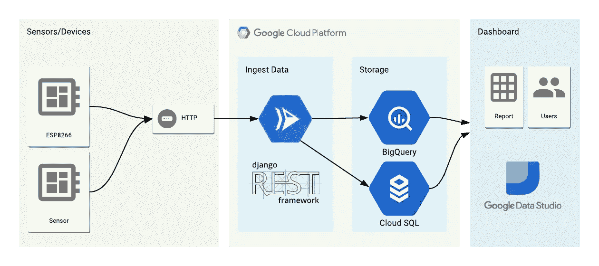
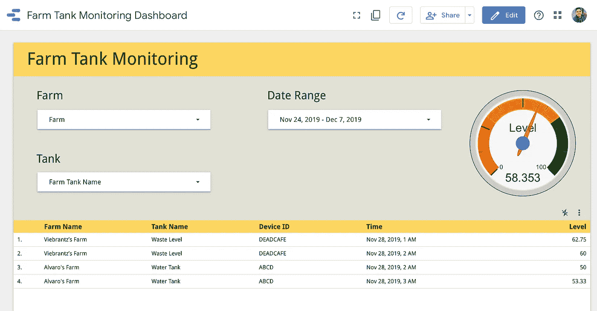
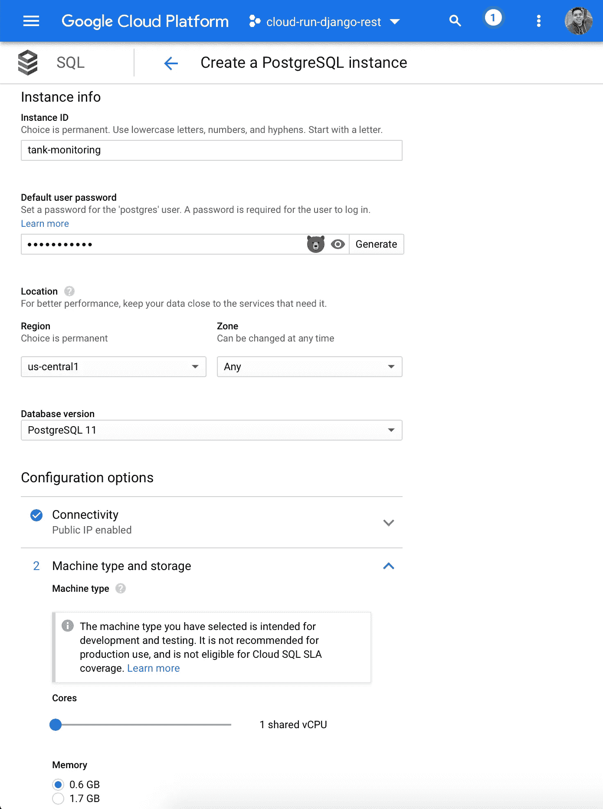

# 物联网储罐监控解决方案第 1 部分—使用 Cloud Run 和 Django Rest 框架构建 Rest API

> 原文：<https://medium.com/google-cloud/iot-tank-monitoring-solution-part-1-build-a-rest-api-using-cloud-run-and-django-rest-framework-a8b9770eaa87?source=collection_archive---------0----------------------->

**使用云计算跟踪储罐液位的端到端解决方案，无需过多担心基础设施管理。**

这是一个关于如何在谷歌云上创建一个农场储罐监控解决方案的 3 部分教程。

*   第 1 部分—使用 Cloud Run 和 Django Rest 框架构建 Rest API
*   第二部分— [收集坦克数据的 MicroPython 装置](/@alvaroviebrantz/iot-tank-monitoring-solution-part-2-micropython-device-with-esp8266-to-collect-tank-level-data-d74a1b947f60)
*   第 3 部分— [使用 BigQuery 联邦查询和 Data Studio 可视化数据](/@alvaroviebrantz/iot-tank-monitoring-solution-part-3-visualizing-data-using-cloudsql-federated-queries-bigquery-1a92d1a565a3)

在本教程中，我们将使用 Django Rest 框架作为项目的基础。Django 非常容易上手，可以很好地使用 SQL 数据库来保存我们的模型数据，还提供了一个很好的管理界面来管理这些模型，而不必花太多时间来构建这些模型。Django Rest Framework 是 Django 之上的一个层，使得从我们的模型构建 REST API 变得容易。

在这个特定的场景中，我们将保存我们的农场信息，每个农场中的坦克以及与坦克相关的设备。这些数据将被存储在 Google Cloud SQL 上，而设备遥测将被保存为 save BigQuery，以处理物联网设备不时发送的大量数据。



项目架构

为了监控我们的数据，我们将在 Data Studio 上构建一个仪表板，使用联邦查询特性混合来自云 SQL 和 BigQuery 的数据。



Data Studio 仪表板

**创建并设置 Django Rest 框架项目**

对于本文，我将使用 Python 3.7 和 Django 2.2。为了引导项目，我只是按照 Django Rest 框架上的文档来安装依赖项并创建基础项目。您可以跳过这一步并克隆项目，但这只是作为项目如何构建的参考。总之，我使用了以下命令:

```
mkdir myproject
cd myproject# Create a virtual environment to isolate our package dependencies locally
python3 -m venv env
source env/bin/activate# Install Django and Django REST framework into the virtual environment
pip install django djangorestframework# Install database specific libraries for the project, in this case PostgresSQL and Bigquery
pip install google-cloud-bigquery psycopg2# Additional libraries to run the project and serve static files
pip install gunicorn whitenoise# Set up a new project with a single application
django-admin startproject myproject .  
django-admin startapp tank_monitoring# Freeze dependencies to be used on the Docker container
pip freeze > requirements.txt
```

[](https://www.django-rest-framework.org/tutorial/quickstart/) [## 快速入门

### 我们将创建一个简单的 API，允许管理员用户查看和编辑系统中的用户和组。创建一个…

www.django-rest-framework.org](https://www.django-rest-framework.org/tutorial/quickstart/) 

该应用程序包含农场的 3 个模型、农场中将要监控的储罐以及将要与储罐关联的设备。这些模型将存储在云 SQL 上，并且将有一个 Rest APIs 可用于 CRUD 操作(创建、读取、更新、删除)。

 [## alvarowolfx/cloud-run-django-rest-IOT

### 让我们使用 Django Rest 框架作为项目的基础，创建一个农场储罐监控解决方案。拯救农场…

github.com](https://github.com/alvarowolfx/cloud-run-django-rest-iot/blob/master/tank_monitoring/models.py) 

另一个重要的端点是设备发送数据。它是一个端点，接受设备 ID，检查设备是否存在，如果不存在，则在 CloudSQL 上创建设备，然后在 BigQuery 上保存遥测数据。将 BigQuery 用于物联网设备遥测是有意义的，因为随着项目的增长和更多设备开始频繁报告数据，我们不必担心可扩展性。

 [## alvarowolfx/cloud-run-django-rest-IOT

### 让我们使用 Django Rest 框架作为项目的基础，创建一个农场储罐监控解决方案。拯救农场…

github.com](https://github.com/alvarowolfx/cloud-run-django-rest-iot/blob/master/tank_monitoring/services.py) [](https://github.com/alvarowolfx/cloud-run-django-rest-iot/blob/master/tank_monitoring/views.py) [## alvarowolfx/cloud-run-django-rest-IOT

### 让我们使用 Django Rest 框架作为项目的基础，创建一个农场储罐监控解决方案。拯救农场…

github.com](https://github.com/alvarowolfx/cloud-run-django-rest-iot/blob/master/tank_monitoring/views.py) 

**创建 GCP 项目、云 SQL 数据库和 BigQuery**

要开始使用 Google Cloud，您可以在云控制台 web 界面上完成所有操作，但命令行工具是一个更强大的工具，我们稍后需要部署我们的应用程序。要使用 gcloud 命令行工具，[按照这里的说明下载并安装它](https://cloud.google.com/sdk/downloads)。

[](https://console.cloud.google.com/projectcreate) [## 谷歌云平台

### Google 云平台让您可以在同一基础设施上构建、部署和扩展应用程序、网站和服务…

console.cloud.google.com](https://console.cloud.google.com/projectcreate) 

此外，在此之后，您应该验证并创建一个在本教程中使用的项目，用您想要的名称替换`[YOUR_PROJECT_NAME]`:

```
# To install some cloud build tools
gcloud components install beta
# Authenticate with Google Cloud:
gcloud auth login
gcloud auth application-default login
# Create cloud project — choose your unique project name:
gcloud projects create [YOUR_PROJECT_NAME]
# Set current project
gcloud config set project [YOUR_PROJECT_NAME]
# Enable SQL admin on gcloud
gcloud services enable sqladmin
```

现在我们需要创建云 SQL 实例。这个项目应用程序被设置为使用 PostgresSQL，但 MySQL 也可以通过一些小的更改来使用。我建议按照本页中的步骤创建数据库实例，并安装 SQL 代理工具，以便连接到本地机器上的远程数据库，这对运行数据库迁移很重要。

不幸的是，云 SQL 没有免费层，但新帐户有 300 澳元的信用，这对于测试来说绰绰有余，而且我建议如果你刚刚开始学习，创建一个较小的实例。

 [## 使用代理进行本地测试的快速入门|云 SQL for PostgreSQL | Google Cloud

### 该页面向您展示了如何使用云 SQL 代理从本地测试环境连接到云 SQL。正在连接…

cloud.google.com](https://cloud.google.com/sql/docs/postgres/quickstart-proxy-test) 

创建云 SQL 实例后，通过使用云 SQL 实例的 GCP 控制台创建一个[新数据库。比如可以用名字`tank_monitoring`。还可以使用云 SQL 实例的 GCP 控制台](https://cloud.google.com/sql/docs/mysql/create-manage-databases#create)创建一个[新用户。](https://cloud.google.com/sql/docs/mysql/create-manage-users#creating)


我们需要下载并设置云 SQL 代理工具来连接到远程数据库，这样我们就可以运行 Django 迁移，为管理界面创建数据库和用户。

```
# Download the Cloud SQL Proxy and give permission locally - this is for macOS
curl -o cloud_sql_proxy [https://dl.google.com/cloudsql/cloud_sql_proxy.darwin.amd64](https://dl.google.com/cloudsql/cloud_sql_proxy.darwin.amd64)
chmod +x cloud_sql_proxy
# After creating the database instance, get the instance connection string
gcloud sql instances describe [YOUR_INSTANCE_NAME]
# Run in another tab the proxy
./cloud_sql_proxy -instances=<INSTANCE_CONNECTION_NAME>=tcp:5432
```

运行它将使远程数据库可用，因为它是在本地运行的，这非常棒。现在，让我们运行迁移并创建用户。您需要在创建云 SQL 数据库时使用您的设置填充环境变量:

```
export DJANGO_DEVELOPMENT=True
export DB_USER=[DB_USER]
export DB_PASS=[DB_PASS]
export DB_NAME=[DB_PASS]
python manage.py migrate  
python manage.py createsuperuser  
#  You can run the application locally pointing to the remote database to test things if you want
python manage.py runserver
```

既然已经创建了 Cloud SQL 上的所有结构，让我们在 Cloud Run 上部署我们的后端。为此，我们需要创建 Docker 映像，然后将它部署到 Cloud Run 上。遵循以下步骤:

```
gcloud builds submit — -tag gcr.io/[YOUR_PROJECT_NAME]/tank-monitoring .
```

您可以检查您的 docker 映像是否已在 Google Cloud Container 注册表中成功创建:


部署容器映像后，运行以下命令将该映像部署到云运行。选择选项 1 部署为完全托管的服务，我建议选择`us-central1`区域，因为它是最便宜的区域之一，对于最后一个问题，您可以选择“是”以允许未经身份验证的调用。

```
export DB_USER=[DB_USER]
export DB_PASS=[DB_PASS]
export DB_NAME=[DB_PASS]
export DB_CONNECTION_NAME=[DB_CONNECTION_NAME]
export GCLOUD_PROJECT=[YOUR_PROJECT_NAME]
gcloud beta run deploy --image gcr.io/[YOUR_PROJECT_NAME]/tank-monitoring \
 —add-cloudsql-instances $DB_CONNECTION_NAME \
 —set-env-vars GCLOUD_PROJECT=$GCLOUD_PROJECT \
 —set-env-vars DB_CONNECTION_NAME=$DB_CONNECTION_NAME \ 
 —set-env-vars DB_USER=$DB_USER \
 —set-env-vars DB_PASS=$DB_PASS \
 —set-env-vars DB_NAME=$DB_PASS
```

还要注意，这些环境变量只需要传递一次，稍后您可以更新版本而不需要提供所有的环境变量，但是如果您需要添加/删除一个新的环境变量，您需要部署并指定所有的环境变量。您可以在云运行页面上检查已部署的服务。


要更新服务，只需再次运行 gcloud build 命令来构建一个新的 docker 映像，然后运行`gcloud beta run tank-monitoring deploy — image gcr.io/[YOUR_PROJECT_NAME]/tank-monitoring`来创建一个新的修订版并维护相同的环境变量。

基本上就是这样了！！！您可以访问 Django 管理界面来管理我们的项目模型。


此外，REST API 可用于构建一个应用程序，例如访问我们的农场、坦克和设备数据。


与 BigQuery 相关的有两个独立的端点，一个将被设备用来发送数据，另一个用于查询可以在图表或历史表上使用的历史数据。


**结论**

在第一部分中，我们考虑了为我们的农场储罐监控项目部署无服务后端的所有步骤。老实说，这种架构可以通过类似的方法应用于其他物联网项目。总有改进的空间，我添加了一些未来的想法来改进当前的项目，如果您有更多相关的想法，请告诉我:

*   添加用户认证:API 现在是公共的，但是我们可以添加一个 Json Web Token (JWT)认证，并且只允许通过认证的用户访问基本的 REST APIs。
*   添加设备身份验证:我们可以限制只有已知的设备才能发送数据，甚至可以增加更多的安全性，要求设备生成 JWT 令牌，该令牌使用设备和服务器之间的共享密钥。云物联网核心已经做到了这一点，我在其他文章中探讨了这一点，但我想保持这一点非常简单，但重要的是要考虑安全方法，以限制哪些设备可以访问您的后端。
*   用 Firebase 添加一个实时层:不用在 BigQuery 上运行查询就可以知道每个坦克的当前状态，这样我们就可以把它保存在 Firebase 上，并在我们的应用程序中使用最新的数据。但我不会涉及这一点，因为我已经在我写的关于物联网架构的其他文章中探讨了这一点。
*   根据规则触发和发送警报:我们可以为每个储罐添加一个低阈值，并在检测到警报条件时发送电子邮件。
*   将遥测数据发送到 PubSub 并异步处理:当我们谈论可伸缩系统时，这是一个非常重要的概念。这样，我们可以将数据接收从其他逻辑中分离出来，以将数据保存到数据库(或多个数据库)中，还可以添加其他功能，如我之前提到的警报。

请务必查看本教程的其他部分，以了解完整的解决方案。

**参考文献**

*   https://www.django-rest-framework.org/tutorial/quickstart/
*   [https://cloud . Google . com/SQL/docs/postgres/quick start-proxy-test](https://cloud.google.com/sql/docs/postgres/quickstart-proxy-test)
*   [https://github.com/GoogleCloudPlatform/python-docs-samples](https://github.com/GoogleCloudPlatform/python-docs-samples)
*   [https://cloud.google.com/python/django/kubernetes-engine](https://cloud.google.com/python/django/kubernetes-engine)
*   [https://medium . com/swlh/say-hello-to-server less-containers-with-cloud-run-4c 32d 90330 fc](/swlh/say-hello-to-serverless-containers-with-cloud-run-4c32d90330fc)
*   [https://cloud.google.com/run/](https://cloud.google.com/run/)