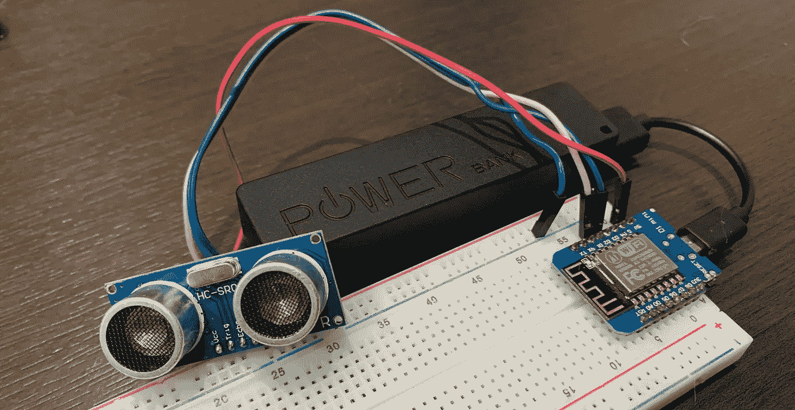

# 物联网储罐监控解决方案第 2 部分——采用 ESP8266 的 MicroPython 设备收集储罐液位数据

> 原文：<https://medium.com/google-cloud/iot-tank-monitoring-solution-part-2-micropython-device-with-esp8266-to-collect-tank-level-data-d74a1b947f60?source=collection_archive---------2----------------------->

**使用云计算跟踪储罐液位的端到端解决方案，无需过多担心基础设施管理。**

这是一个关于如何在谷歌云上创建一个农场储罐监控解决方案的 3 部分教程。

*   第 1 部分— [使用 Cloud Run 和 Django Rest 框架构建 Rest API](/@alvaroviebrantz/iot-tank-monitoring-solution-part-1-build-a-rest-api-using-cloud-run-and-django-rest-framework-a8b9770eaa87)
*   第 2 部分—收集储罐数据的 MicroPython 设备
*   第 3 部分— [使用 BigQuery 联邦查询和 Data Studio 可视化数据](/@alvaroviebrantz/iot-tank-monitoring-solution-part-3-visualizing-data-using-cloudsql-federated-queries-bigquery-1a92d1a565a3)

在本系列教程的这一部分中，我将介绍使用相当便宜的 WiFi 设备和使用 MicroPython 的超声波传感器构建一个物联网设备来收集液位数据的步骤。


**原理图和零件**



*   ESP8266 WiFi 微控制器
*   HC-SR04 超声波传感器
*   针织套衫


**在设备上安装 MicroPython**

首先，我们需要在设备上安装 MicroPython 环境。为此，我们需要访问 MicroPython 网站，下载与您将要使用的设备相关的二进制文件。

[](http://micropython.org/download#esp8266) [## MicroPython —用于微控制器的 Python

### MicroPython 是使用 git 开发的，用于源代码管理，主存储库可以在 GitHub 上找到，网址是…

micropython.org](http://micropython.org/download#esp8266) 

然后，我们需要安装 esptool，以便能够在我们的计算机上刷新设备，我们将使用 Adafruit 的 ampy 工具与 MicroPython 设备对话，并将代码复制到其中。您可以运行以下命令来安装这两者:

pip 安装 esptool ampy

现在确定您计算机上的主板端口。在 Unix 系统上，您可以运行`ls /dev/tty.*`来列出串行设备。我的一些董事会例如是`/dev/tty.SLAB_USBtoUART`和`/dev/tty.usbserial-1410*`。现在，使用以下命令清理设备并刷新 MicroPython 固件:

```
export SERIAL_PORT=/dev/tty.SLAB_USBtoUART
esptool.py — -port $SERIAL_PORT erase_flash
# for ESP8266
esptool.py — port $SERIAL_PORT — baud 460800 write_flash — flash_size=detect 0 esp8266–20170108-v1.8.7.bin
```

现在，随着 MicroPython 在设备上运行，是时候复制项目文件并设置一些配置来开始发送数据了。

**设备和配置上的设置代码**

[](https://github.com/alvarowolfx/cloud-run-django-rest-iot/tree/master/firmware) [## alvarowolfx/cloud-run-django-rest-IOT

### 让我们使用 Django Rest 框架作为项目的基础，创建一个农场储罐监控解决方案。拯救农场…

github.com](https://github.com/alvarowolfx/cloud-run-django-rest-iot/tree/master/firmware) 

在计算机上克隆项目文件。设备相关文件位于固件文件夹中。使用您的 WiFi 凭据和后端运行的 URL 更改 config.py 文件，以便设备可以向其发送数据。

为了从超声波传感器读取数据，我在这里使用了这个库[GitHub—RSC 1975/micropython-hcsr 04:超声波传感器 HC-SR04 的 Micropython 驱动程序](https://github.com/rsc1975/micropython-hcsr04)之后，将文件复制到设备。

```
export SERIAL_PORT=/dev/tty.SLAB_USBtoUART
ampy — p $SERIAL_PORT -d 0.5 -b 115200 put firmware/config.py
ampy — p $SERIAL_PORT -d 0.5 -b 115200 put firmware/hcsr04.py
ampy — p $SERIAL_PORT -d 0.5 -b 115200 put firmware/sensor.py
ampy — p $SERIAL_PORT -d 0.5 -b 115200 put firmware/main.py
```

就这样，代码将使用设备 Mac 地址的一部分作为设备 ID，并开始默认每 10 分钟向我们的后端发送一次距离数据。您可以调试从串行端口读取的设备:

```
**$** screen -L $SERIAL_PORT 115200 -L
```

下面是一个输出示例:

```
connecting to network...
network config: ('192.168.0.120', '255.255.255.0', '192.168.0.1', '192.168.0.1')
Distance = 13.1838cm
sending:  {'distance': 13.1838, 'device_id': '487ada00'}
data sent!
```

**结论**

这一部分相对较短，但只是为了展示使用 MicroPython 和一些廉价设备构建解决方案原型是多么简单。一如既往，正如第一部分所提到的，这里还有改进的空间，但是有一个是针对设备的。

我们可以添加设备认证，有一篇非常好的文章展示了如何将物联网核心与 MicroPython 结合使用，并使与云的连接更加安全。物联网核心依靠 JWT 令牌来进行身份认证，因此我们也可以以此为基础，通过我们的后端运行我们自己的身份认证。

**参考文献**

*   [https://cloud.google.com/iot-core/](https://cloud.google.com/iot-core/)
*   [https://github.com/GoogleCloudPlatform/iot-core-micropython](https://github.com/GoogleCloudPlatform/iot-core-micropython)
*   [https://medium . com/Google-cloud/connecting-micropython-devices-to-Google-cloud-IOT-core-3680 e 632681 e](/google-cloud/connecting-micropython-devices-to-google-cloud-iot-core-3680e632681e)
*   [http://micropython.org/](http://micropython.org/)
*   [https://gist . github . com/miguelgrinberg/80973081596 f 1069057 EC 6668142 be 15](https://gist.github.com/miguelgrinberg/80973081596f1069057ec6668142be15)