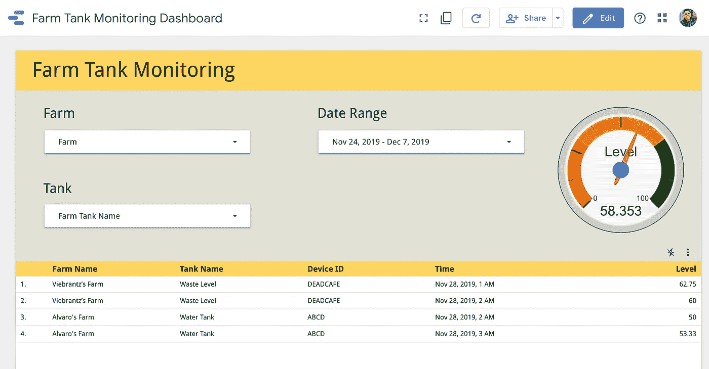
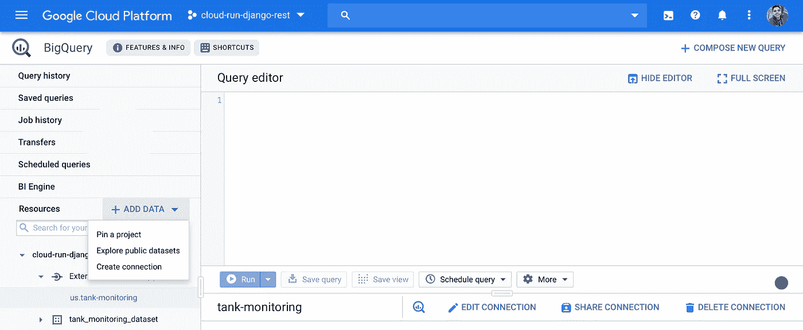
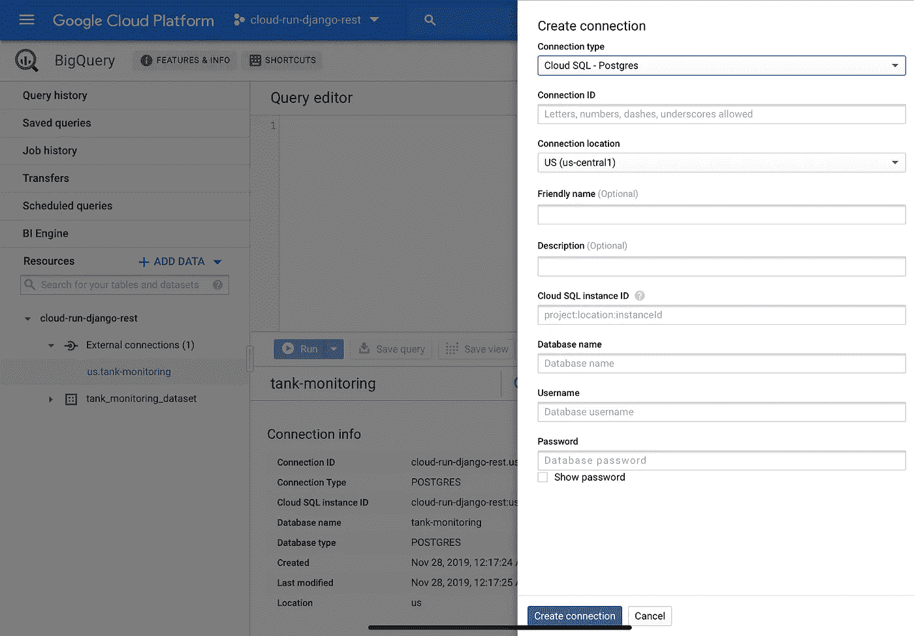
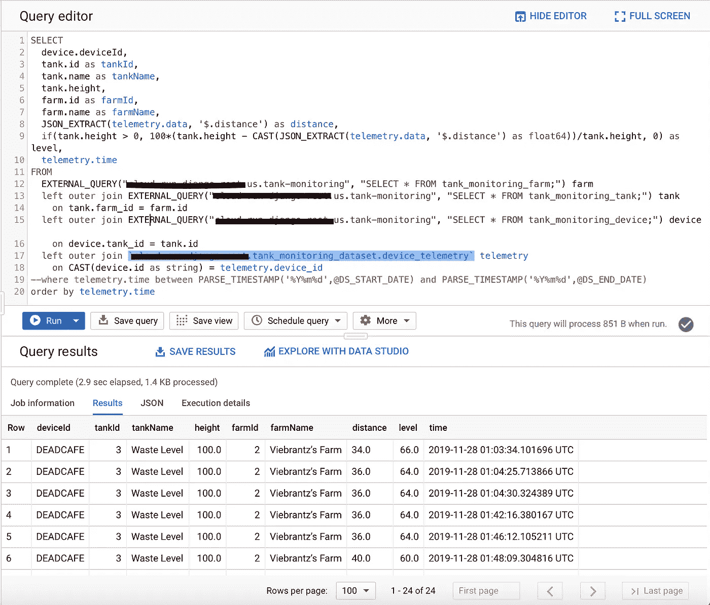
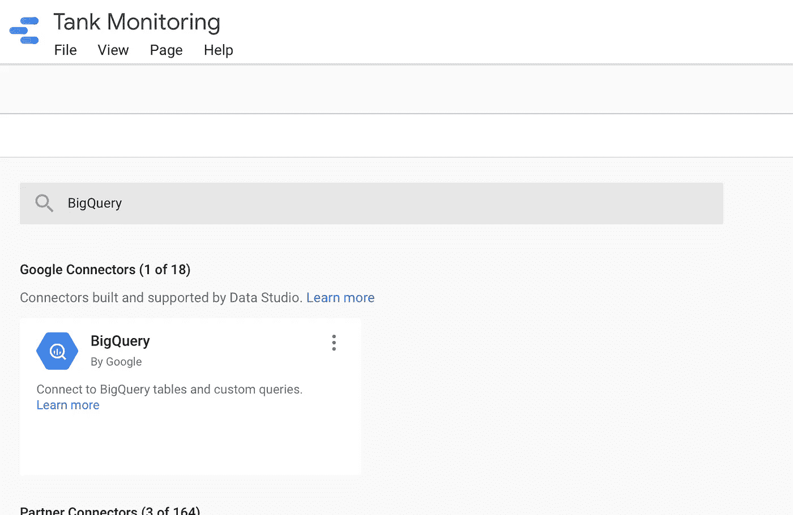
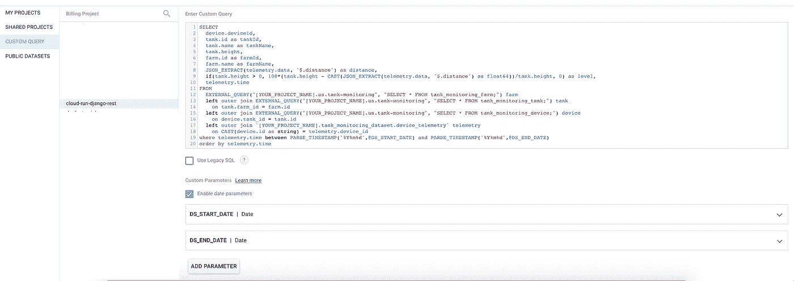

# 物联网储罐监控解决方案第 3 部分—使用 BigQuery 联邦查询、CloudSQL 和 Data Studio 可视化数据

> 原文：<https://medium.com/google-cloud/iot-tank-monitoring-solution-part-3-visualizing-data-using-cloudsql-federated-queries-bigquery-1a92d1a565a3?source=collection_archive---------3----------------------->

## 使用云计算跟踪储罐液位的端到端解决方案，无需过多担心基础设施管理。

这是一个关于如何在谷歌云上创建一个农场储罐监控解决方案的 3 部分教程。

*   第 1 部分— [使用 Cloud Run 和 Django Rest 框架构建 Rest API](/@alvaroviebrantz/iot-tank-monitoring-solution-part-1-build-a-rest-api-using-cloud-run-and-django-rest-framework-a8b9770eaa87)
*   第二部分— [收集坦克数据的 MicroPython 装置](/@alvaroviebrantz/iot-tank-monitoring-solution-part-2-micropython-device-with-esp8266-to-collect-tank-level-data-d74a1b947f60)
*   第 3 部分—使用 BigQuery 联邦查询和 Data Studio 可视化数据

在这最后一部分，我们将把模型数据和设备发送的遥测数据可视化。我们将在 BigQuery 上使用一个名为联邦查询的特性，它基本上允许我们在 BigQuery 内部查询外部数据，混合不同的数据源并更容易地构建我们的数据湖。



> BigQuery Federated Queries 目前处于测试阶段，接受连接到 Google 云存储和 Google Cloud Big Table 中的云 SQL、CSV 文件。

## 设置对我们的云 SQL 数据库的联合访问

这里的所有步骤都将在 Google Cloud UI 上进行，因为这样做似乎更容易。首先，我们转到 BigQuery UI 并添加一个外部源:



然后，我们选择 Cloud SQL 数据源并添加我们数据库实例信息，我们使用相同的配置(实例连接、用户名、密码和数据库名称)在 Cloud Run 上部署我们的 Django Rest 后端。这里的一个附加配置是连接名，将在 BigQuery 上使用它来查询我们的外部数据。我把我的叫做“坦克监控”。



基本上就是这样，现在我们可以使用“EXTERNAL_QUERY”命令从 BigQuery 查询云 SQL 数据。下面是一个使用 BigQuery 从我们的云 SQL 数据库获取农场列表的例子(您可以在 [BigQuery UI](https://console.cloud.google.com/bigquery) 中测试它:

```
 select farms.*
from EXTERNAL_QUERY(“[YOUR_PROJECT_NAME].us.tank-monitoring.farms”) farms
```

现在让我们使用这两个数据源来构建我们的仪表板。

## 在 Data Studio 上构建仪表板

我们希望将遥测数据可视化，并能够按农场和坦克进行筛选。因此，我们将创建一个查询，使用日期范围过滤器返回报告的所有数据，以避免返回过多的遥测数据。为此，我编写了一个查询，并根据配置的高度计算每个水箱的液位。“DS_START_DATE”和“DS_END_DATE”是将由 Data Studio 填充的参数。您可以注释日期过滤器，并在 BigQuery 上运行这个查询来查看一些数据。

```
SELECT 
 device.deviceId,
 tank.id as tankId,
 tank.name as tankName,
 tank.height,
 farm.id as farmId,
 farm.name as farmName,
 JSON_EXTRACT(telemetry.data, ‘$.distance’) as distance,
 if(tank.height > 0, 100*(tank.height — CAST(JSON_EXTRACT(telemetry.data, ‘$.distance’) as float64))/tank.height, 0) as level,
 telemetry.time
FROM 
 EXTERNAL_QUERY(“[YOUR_PROJECT_NAME].us.tank-monitoring”, “SELECT * FROM tank_monitoring_farm;”) farm
 left outer join EXTERNAL_QUERY(“[YOUR_PROJECT_NAME].us.tank-monitoring”, “SELECT * FROM tank_monitoring_tank;”) tank
 on tank.farm_id = farm.id
 left outer join EXTERNAL_QUERY(“[YOUR_PROJECT_NAME].us.tank-monitoring”, “SELECT * FROM tank_monitoring_device;”) device 
 on device.tank_id = tank.id
 left outer join `[YOUR_PROJECT_NAME].tank_monitoring_dataset.device_telemetry` telemetry
 on CAST(device.id as string) = telemetry.device_id 
where telemetry.time between PARSE_TIMESTAMP(‘%Y%m%d’,[@DS_START_DATE](http://twitter.com/DS_START_DATE)) and PARSE_TIMESTAMP(‘%Y%m%d’,[@DS_END_DATE](http://twitter.com/DS_END_DATE))
order by telemetry.time
```



转到 Data Studio 开始创建仪表板，然后单击 create Blank Report。

[](https://datastudio.google.com) [## Data Studio 产品概述

### 轻松访问各种数据。Data Studio 的内置连接器和合作伙伴连接器可以连接到…

datastudio.google.com](https://datastudio.google.com) 

然后，创建一个新的数据源，搜索 BigQuery 连接器并选择它。



在下一个屏幕上，选择自定义查询>[您的项目名称]>输入自定义查询。在这里复制我们的 SQL 查询加入云 SQL 数据库和 BigQuery。启用日期参数以填充“DS_START_DATE”和“DS_END_DATE”参数。然后点击连接。



其余的主要是拖放一些组件来构建您的仪表板。我不会仔细考虑每一步，但是在 Data Studio 上获得数据后，构建相同的东西应该非常简单。


## 结论

这最后一部分也有点短，但只是为了展示我们合并来自云 SQL 和 BigQuery 的数据是多么简单，并展示在一个仪表板上，用户可以访问并看到系统上的数据流。我希望通过这篇教程，你能更好地理解如何使用谷歌云构建端到端的解决方案。