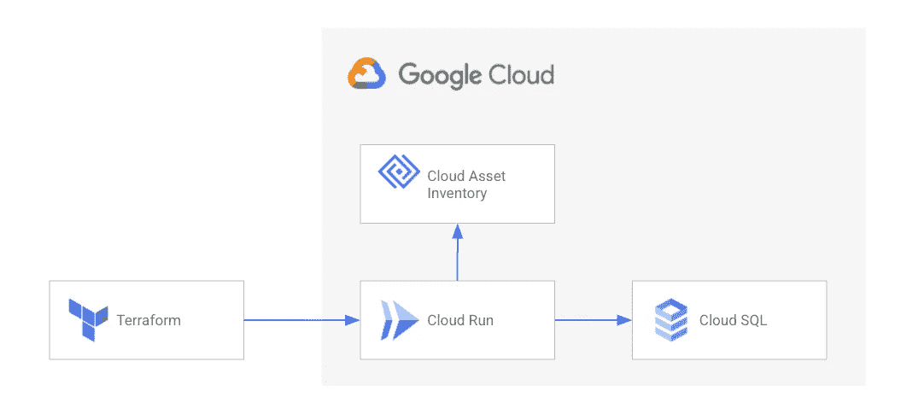
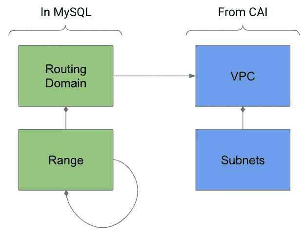

# GCP VPCs 的 IPAM 自动驾驶仪

> 原文：<https://medium.com/google-cloud/ipam-autopilot-for-gcp-vpcs-8af97adf33c4?source=collection_archive---------2----------------------->

**更新 01–01–2023:**因为信息仍然正确，所以我不发表这篇文章。但是你可能想检查一下 https://github.com/openx/gcp-ipam-autopilot[号](https://github.com/openx/gcp-ipam-autopilot)，它是原始 IPAM 自动驾驶仪的一个分支，带有二进制分布，这使得整个设置更加简单。

在 GCP，跨多个 VPC 和本地网络的 IP 地址管理可能是一项繁琐的任务。跟踪哪些 IP 范围在哪里被使用以及哪些仍然可用是一项麻烦的任务。我在这个领域看到的很多方法，比如把所有东西都放在一个 Terraform 评论或者 Google 表单中，都很容易出错。在具有下一代防火墙、VPN 或互连的复杂网络环境中，这就像在玩硬模式游戏。

为了提供一个简单的解决方案，我和几个同事开发了一个名为 IPAM 自动驾驶仪的小工具，现在发布到 GitHub 上的谷歌云专业服务回购。

 [## 专业-服务/工具/ipam-主 Google cloud 平台的自动驾驶仪/专业-服务

### IPAM 自动驾驶仪是一个简单的 Docker 容器和 Terraform 提供者，允许你自动管理 IP…

github.com](https://github.com/GoogleCloudPlatform/professional-services/tree/main/tools/ipam-autopilot) 

这是一个非常简单的工具，由一个 CloudRun 服务和一个 Terraform 提供者组成。它提供:

*   在 IaC 代码中集成 IPAM 的简单 API facade
*   CIDR 山脉创建、重叠检查等。
*   云资产清单(CAI)被集成以“学习”在 GCP 使用的子网
*   所有使用的服务都支持 VPC 服务控制
*   独立的 Terraform 提供商托管

IPAM 自动驾驶仪的结构

数据模型非常简单，保存在 MySQL 数据库中。

IPAM 自动驾驶数据模型

您可以定义多个路由域。路由选择域保存范围，例如 10.0.0.0/8，对于这些范围可以租用子范围。

一个路由域可以引用多个 VPC。当请求一个新的范围时，IPAM 自动驾驶仪根据需要从云资产清单加载这些 VPC 的子网。

当要求一个新的航程时，IPAM 自动驾驶仪试图找到一个满足尺寸要求的航程，并且不与数据库和参考的 VPCs 的航程重叠。

这里有一个简单的例子，如何使用 IPAM 自动驾驶仪从 Terraform:

如果您需要更多信息，请随时联系我们。或者最好去 GitHub 试试看。